# 報表 {#reports}

了解學習管理器應用程式中與管理員角色相關的報告。

Adobe Learning Manager 讓您能建立多樣化的報告，以追蹤、監控及控制學習者的活動。 學習者的活動會被追蹤並自動記錄到資料庫中。 經理與管理員報告則由資料庫產生。

## 概觀 {#overview}

管理員與經理的報告產生流程相似。 經理可查看與下屬相關的報告，而管理員則可查看所有全組織的報告。

報告會被整合在儀表板中。 報告必須存在於儀表板中。 A **[!UICONTROL Default Dashboard]** 預設存在於報告頁面。 你新增的任何報告都會進入這個預設儀表板。 要將報告加入個別儀表板，請使用下拉選單箭頭選擇 **[!UICONTROL Add Report]**。 欲了解更多關於建立儀表板的資訊，請參閱本頁的儀表板章節。

## 報告類型 {#typesofreports}

Adobe Learning Manager 支援四種主要類型的報告，如完成度、時間、技能與效能。 您可以使用以下報告類型來產生 300+ 變體的報告：

* 學習者課程授課統計
* 課程成效報告
* 學習者技能報告
* 學習計畫註冊統計資料
* 學習者花費的學習時間
* 學習者計數
* 認證完成

## 使用者活動儀表板 {#useractivitydashboards}

查看平台上所有用戶活動的摘要。 設定使用者群組並套用篩選器。

使用者活動儀表板會顯示該帳戶中使用者的活動。 列出的三份報告如下：

* **註冊用戶數：** 本報告提供每週註冊用戶數的資訊。 對於有每月活躍單位授權的帳戶，報告會顯示 MAU 單位。

* **用戶訪問報告：** 本報告提供每日使用平台用戶數量的資訊。 同時也提供每月報告。

* **學習時間報告：** 本報告提供平台每日學習時間的資訊。 同時也提供每月報告。

### 註冊用戶 {#registeredusers}

學習管理員每週記錄系統中註冊的使用者數量。 管理員可查看此報告，了解該週某天的註冊用戶數。 註冊的計數一旦儲存一週，就不會改變。 因此，歷史登記人數與系統中目前的學習者集合無關。

本報告提供每週註冊用戶數量的資訊。

對於有每月活躍單位授權的帳戶，報告會顯示 MAU 單位。

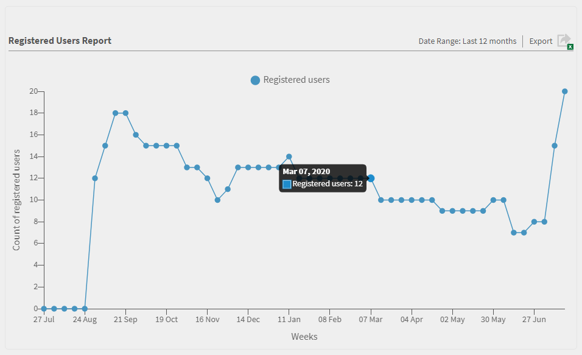
*註冊用戶報告*

***針對每月存取單位帳戶：***

**每月活躍用戶報告**

本報告顯示每月在學習平台活躍的學習者數量。 如果使用者執行了此處提及的任何學習動作，該月即被視為活躍。 這和每月活躍單位的計算方式相同。

每月活躍數量一旦統計並儲存一個月，則不會改變。 因此，顯示的歷史計數與系統中目前的學習者集合無關。

### 使用者訪問 {#uservisits}

本報告顯示一天或一個月內總共存取系統的學習人數。 瀏覽學習平台而不使用任何學習內容，也被視為「存取」學習平台。 這有助於管理員了解所有存取系統的使用者。 每月一號，Learning Manager 會建立上個月總用戶存取平台的紀錄。 它也會擷取這些使用者的群組資訊。

只有管理員設定的使用者群組會被記錄。 這讓管理員也能對使用者群組套用篩選功能，以取得歷史的月度資料。 請注意，若使用者群組設定被修改，且學習管理員在先前幾個月未記錄該使用者群組的資料，則學習管理員無法顯示該新設定使用者群組過去幾個月的資料。

本報告包含用戶使用各種平台平台，如網頁、行動應用程式、無頭自訂解決方案等。 裝置應用程式使用圖表明確提到的是使用 Learning Manager 裝置應用程式存取平台的用戶。 這有助於管理員辨識帳戶中行動應用程式的使用情況。

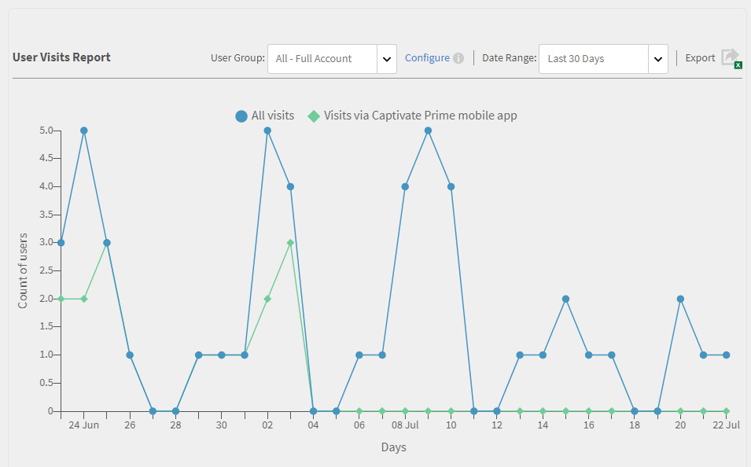
*使用者訪問報告*

### 學習時間報告 {#learningtimespentreport}

這裡，你可以看到雙軸線圖，顯示所有學習者在12個月期間內所花費的總學習時間。 第二條軸代表個人學習時間的中位數。

不同學習對象（如學習計畫與認證）所花費的時間計算如下：

* 自學進度課程，內容靜態且互動式
* 活動課程附網址。
* 週末遊戲時段啟用週末旗幟。
* VC Connect 會議，出席會自動標記。
* 用於不同學習對象的時間，例如學習計畫與認證
* xAPI 活動課程中的 xAPI 語句。

你還可以進一步匯出圖表成 Excel 試算表。

提供篩選器以選擇使用者群組設定，有助於查看不同使用者群組的資料。

選取的日期與使用者群組篩選器會套用到儀表板中所有相關的圖表。

>[!NOTE]
>
>對於 **[!UICONTROL User Visits]** 和 **[!UICONTROL Learning Time Spent]** 報告，預設資料（當沒有設定使用者群組時）會顯示整個帳號的資料。

## 訓練內容儀表板 {#trainingcontentdashboard}

培訓內容儀表板提供平台上可提供的培訓資訊。 您可以查看熱門訓練或追蹤所有可用的培訓。

### 訓練報告 {#trainingsreport}

本報告提供平台（已公布狀態）每月可提供總訓練的資訊。 它能反映隨時間提供的培訓數量。

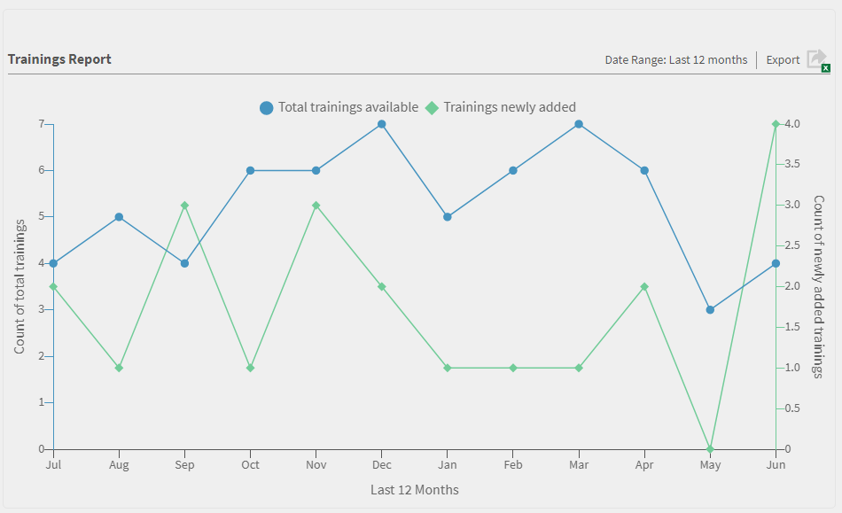
*訓練報告*

### 活躍訓練報告 {#activetrainingsreport}

本報告提供選定期間內持續進行的培訓資訊。 主動訓練是指在指定時間內註冊、觀看或完成的訓練。

對於主動訓練，當未進行使用者群組設定時，所有根使用者（擁有經理角色）內部群組的資料將可供選擇。 除了根使用者群組外，如果需要，你還可以設定另外 10 個使用者群組。

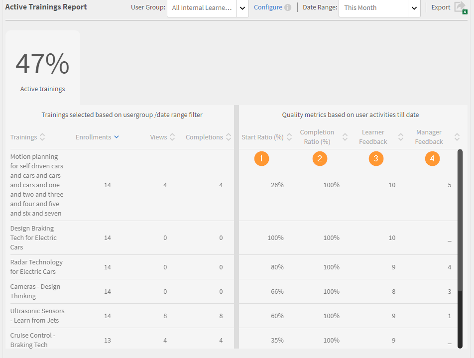
*活躍訓練報告*

>[!NOTE]
>
>當選擇 和 **[!UICONTROL 12 months]** 篩選條件時&#x200B;**[!UICONTROL All Users]**，資料不會如預期顯示，但當你選擇 **[!UICONTROL All internal user group]時，資料會顯示。**

<table>
 <tbody>
  <tr>
   <td>
    
<b>參考資料</b>
</td>
   <td>
    
<b>公制</b>
</td>
   <td>
    
<b>說明</b>
</td>
  </tr>
  <tr>
   <td>
    
1
</td>
   <td>
    
起始比率（%）
</td>
   <td>
    
已開始課程的學習人數與註冊人數的比例。
</td>
  </tr>
  <tr>
   <td>
    
2
</td>
   <td>
    
完成率（%）
</td>
   <td>
    
完成課程的總用戶數與開始課程的總用戶數的比例。 
</td>
  </tr>
  <tr>
   <td>
    
3
</td>
   <td>
    
學習者回饋
</td>
   <td>
    
所有L1回饋回應的平均值，從1到10四捨五入至最接近的整數。 
</td>
  </tr>
  <tr>
   <td>
    
4
</td>
   <td>
    
經理回饋
</td>
   <td>
    
所有L3反饋回應的平均值，以1到5為度，四捨五入至最接近的整數 
</td>
  </tr>
 </tbody>
</table>

訓練報告還有兩個額外欄位：

1. 課程的平均星級評分。
1. 評分課程的學習者數量。
1. 嵌入路徑
1. 嵌入路徑識別碼
1. 嵌入式課程識別碼

>[!NOTE]
>
>起始率、完成率、學習者回饋及經理回饋不受所套用篩選器影響。 這些篩選器只影響註冊、檢視和完成次數。

>[!NOTE]
>
>對於這兩個報表（訓練內容、使用者活動），你最多可以設定 10 個使用者群組。 處理完成並啟用新設定的過濾器可能需要長達 24 小時。

## 學習摘要儀表板 {#dashboards}

### 產生儀表板報告

>[!INFO]
>
>在本次訓練中，您將學習如何從資料庫產生儀表板報告。    

如果你無法啟動訓練，請寫信至 <almacademy@adobe.com>。

請參閱平台上所有學習活動的摘要報告。 在此頁面上，您可以看到所選根使用者團隊及外部設定檔的以下摘要資訊。 時間範圍亦可選擇：

* 學習摘要，以報名、瀏覽及完成度的形式呈現
* 頂尖技能
* 合規摘要

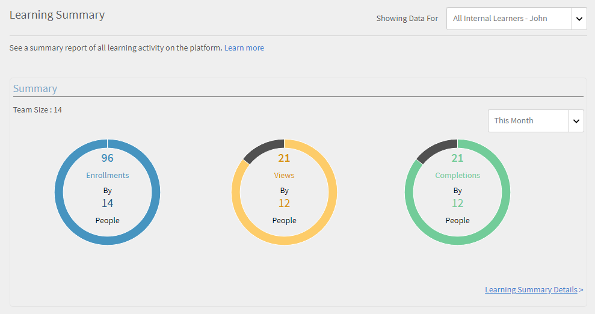
*總結排行榜*

如果有內部根級管理器，它們會依序顯示。

所有外部設定檔都會在內部設定檔（內部根級使用者）之後列出。

若外部設定檔有管理器，則管理器階層會顯示在 **[!UICONTROL Showing Data For]** 下拉選單中。 使用者會在所有細節頁面（學習摘要、合規及技能狀態）中列出於經理階層中

如果沒有，則所有個別使用者資料都會顯示在清單中。

欲查看各內部團隊更細緻的報名細節，請點擊 **[!UICONTROL Learning Summary Details]**。

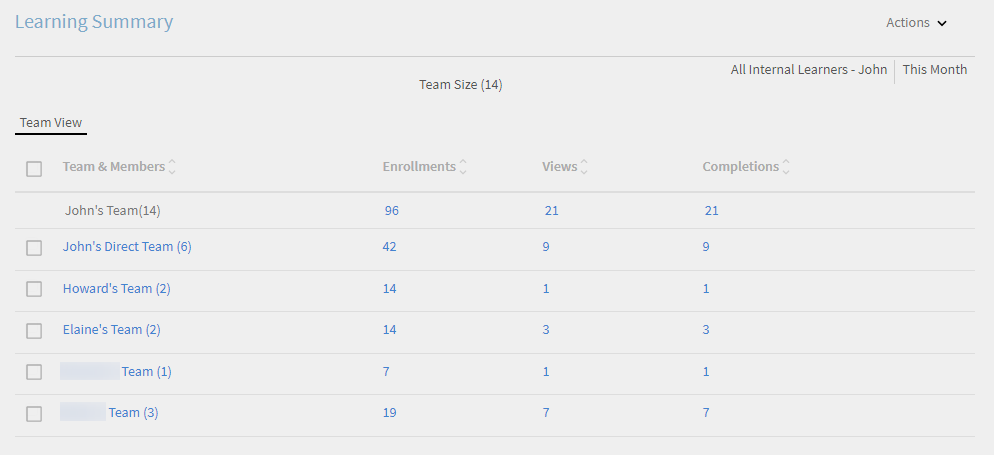
*學習摘要詳情*

點擊任何註冊時，可以看到每個經理的學習者，以及學習對象的註冊。 你也可以查看每位學習者的進度與完成細節。

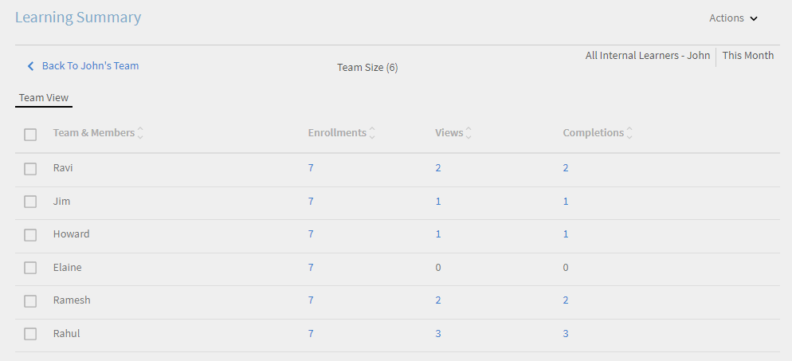
*分配給經理的學習者*

點選任意團隊，將其報告匯出為 csv。 管理員可選擇使用者群組或個別使用者，然後從下拉選單匯出詳細資料 **[!UICONTROL Action]** ，匯出該使用者群組或個別使用者的報告。

此外，你可以看到正在進行中且已達成的技能的條狀圖。 你可以新增或移除你想在圖表中呈現的技能。

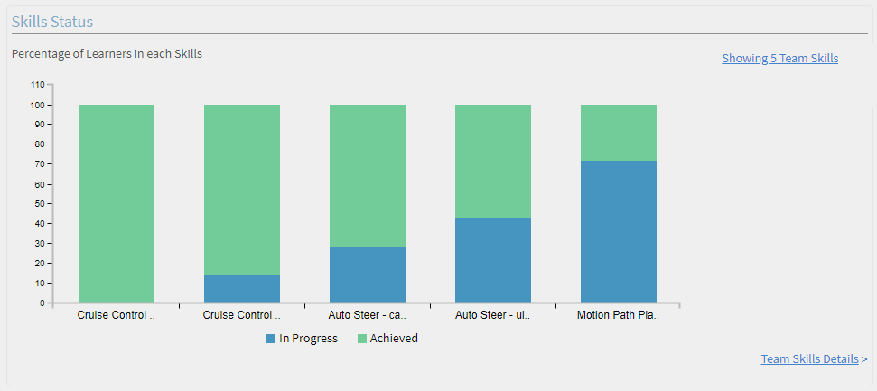
*技能狀態堆疊條狀圖*

### 合規儀表板

**Adobe Learning Manager** 為所有管理員和管理者提供合規儀表板。 管理員可以建立合規儀表板並與經理分享。 經理人將能在應用程式中查看新分享的儀表板，並輕鬆追蹤團隊成員在特定培訓中的合規狀況。 合規儀表板允許管理員將自訂合規課程分類為特定類別（例如銷售、行銷與法律）。 自訂合規類別由 **[!UICONTROL Catalog Labels]**&#x200B;驅動。

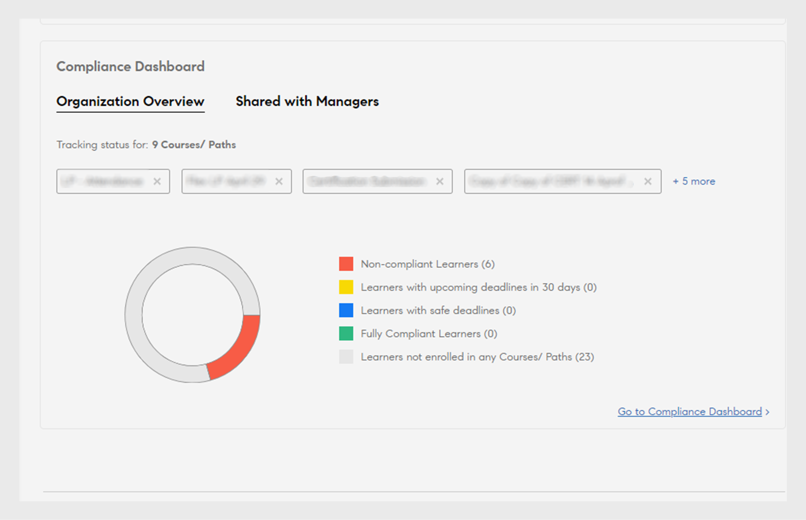

_合規儀表板-管理員檢視_

管理員也可透過選擇 **[!UICONTROL Go to Compliance dashboard]**&#x200B;來檢查每位經理團隊的合規狀態。 管理者可以與經理個人或團體分享一組培訓課程。 這幫助管理者輕鬆追蹤隊友對指定訓練的遵守情況。

#### 管理工作流程

##### 建立客製化合規標籤

合規標籤是一種目錄標籤，將課程/學習路徑/認證分類為合規類型。
要建立客製化合規標籤，請依照以下步驟操作：

1. 在管理員應用程式中，前往 **[!UICONTROL Settings]** > **[!UICONTROL General]**。
1. 選擇 **[!UICONTROL Custom Compliance type]** 啟用自訂合規標籤的選項。

   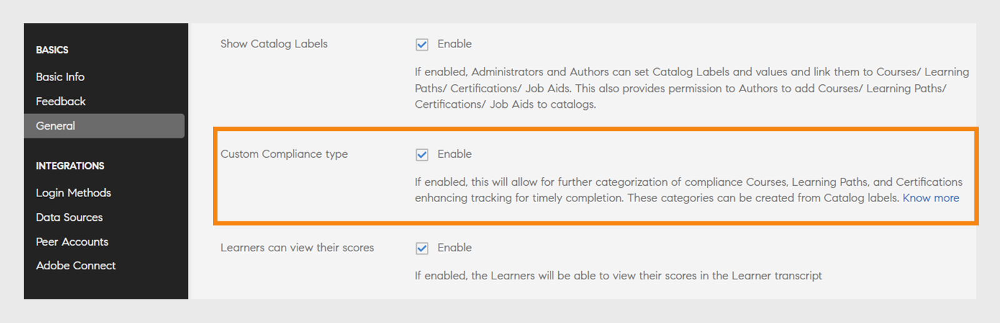
   _啟用自訂合規_

   >[!NOTE]
   >
   >此新目錄標籤的引入，旨在將課程、學習路徑及認證分類為合規類型。 要啟用該 **[!UICONTROL Custom Compliance type]** 選項，您必須先在同一頁面啟用該 **[!UICONTROL Show Catalog Label]** 選項。

1. 前往 **[!UICONTROL Settings]** > **[!UICONTROL Catalog Label]** 並選擇 **[!UICONTROL Compliance type]**。
1. 在文字框輸入數值（例如，法務、銷售）， **[!UICONTROL Value]** 並選擇 **[!UICONTROL Add Value]**。

   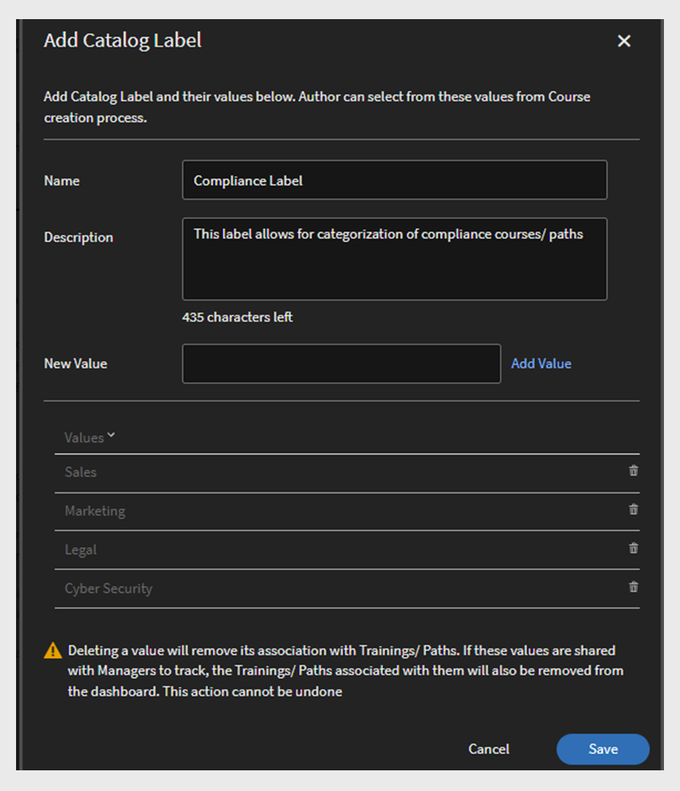
   _新增自訂合規值_

1. 選擇 **[!UICONTROL Save]**。

>[!NOTE]
>
>作者在創建或編輯課程時，必須加上這些合規標籤。 請參見 [「為課程/學習路徑/認證](/help/migrated/authors/feature-summary/courses.md#add-compliance-labels-to-courselearning-pathcertification)添加合規標籤」。

##### 建立並分享合規儀表板

要建立並分享合規儀表板，請遵循以下步驟：

1. 去 **[!UICONTROL Reports]** > **[!UICONTROL Learning Summary]**。
1. 在該 **[!UICONTROL Compliance Dashboard]** 區塊中，選擇 **[!UICONTROL Shared with Managers]**。
1. 從&#x200B;**[!UICONTROL Select Compliance Label]**&#x200B;下拉選單中選擇&#x200B;**[!UICONTROL Share dashboard]**&#x200B;並選擇已建立的標籤。

   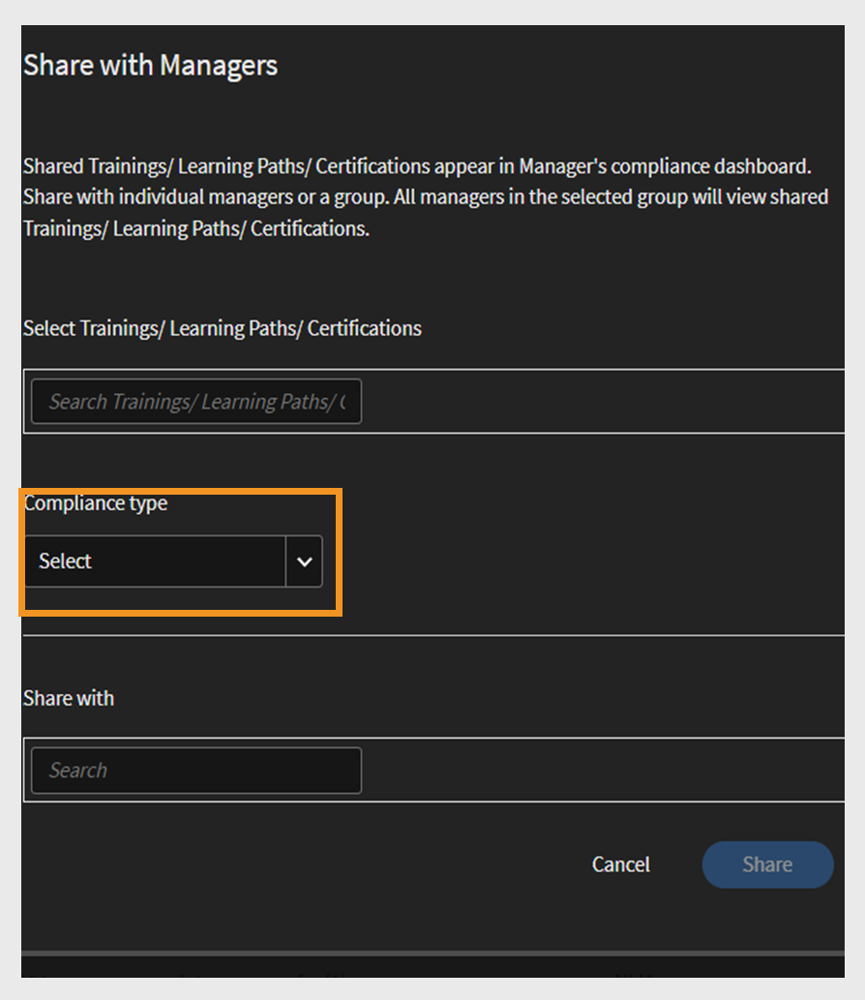
   _選擇合規類型_

1. 在文字框中輸入並選擇經理的名字 **[!UICONTROL Share with]** 。
1. 選擇 **[!UICONTROL Share]** 將儀表板傳送給所選的經理。

>[!NOTE]
>
>分享新儀表板會覆蓋所選經理應用程式中的現有儀表板。 管理者將能查看管理員新分享的儀表板。

#### 與管理員及自訂管理員共享合規儀表板

管理員可以與其他管理員及自訂管理員共享儀表板，讓他們能即時存取所有合規儀表板。

請依照以下步驟與管理員及自訂管理員分享儀表板：

1. 以 . 登入。**[!UICONTROL Admin]**
2. 導航到 **[!UICONTROL Reports]** > **[!UICONTROL Learning Summary]**。
3. 選擇 **[!UICONTROL Admin View]** 該 **[!UICONTROL Compliance Dashboard]** 區段。
4. 選擇按鈕 **[!UICONTROL Share Dashboard]** 。

   
   _Share dashboard - 管理員_

5. 從 **[!UICONTROL Select Custom Compliance]** 下拉選單選擇合規標籤。 此選項將選擇所有具有所選合規標籤的課程。
6. 選擇你想與管理員分享的額外課程、學習路徑或證照。

   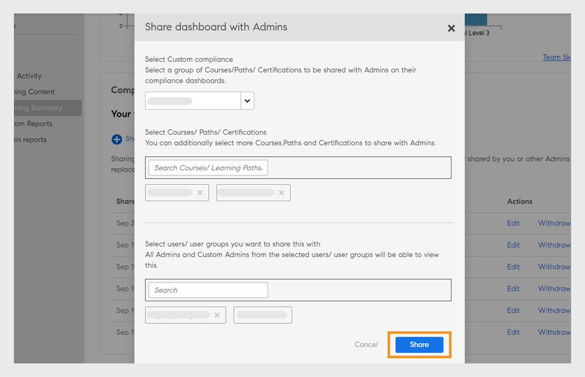
   _分享合規儀表板_

7. 選擇你想分享儀表板的使用者或使用者群組，然後選擇 **[!UICONTROL Share]**。

##### 查看合規儀表板 – 自訂管理員及其他管理員

所有自訂管理員及所選使用者群組的其他管理員都能在他們的應用程式上看到合規儀表板。

請依照以下步驟查看合規儀表板：

1. 前往 **[!UICONTROL Reports]** > **[!UICONTROL Learning Summary]** > **[!UICONTROL Compliance Dashboard]**。
2. 選擇 **[!UICONTROL Your View]** 該 **[!UICONTROL Compliance Dashboard]** 區段。
3. 選擇該 **[!UICONTROL Go to Compliance Dashboard]** 選項後，你可以看到管理員分享的新合規儀表板。

   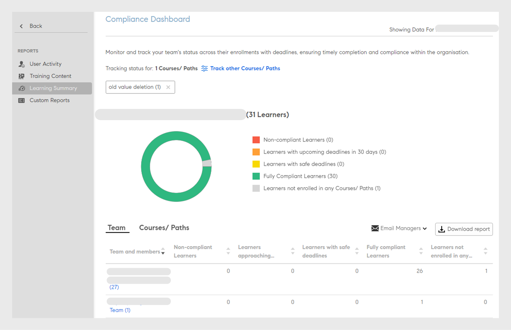
   _查看合規儀表板 - 自訂管理員_

#### 與店經理分享

管理員可以將合規儀表板分享給店經理，讓他們能監控學習者的合規進度。

請依照以下步驟與店經理分享儀表板：

1. 以 . 登入。**[!UICONTROL Admin]**
2. 前往 **[!UICONTROL Reports]** > **[!UICONTROL Learning Summary]** > **[!UICONTROL Compliance Dashboard]**。
3. 選擇 **[!UICONTROL Manager View]** 該 **[!UICONTROL Compliance Dashboard]** 區段。
4. 選擇按鈕 **[!UICONTROL Share Dashboard]** 。

   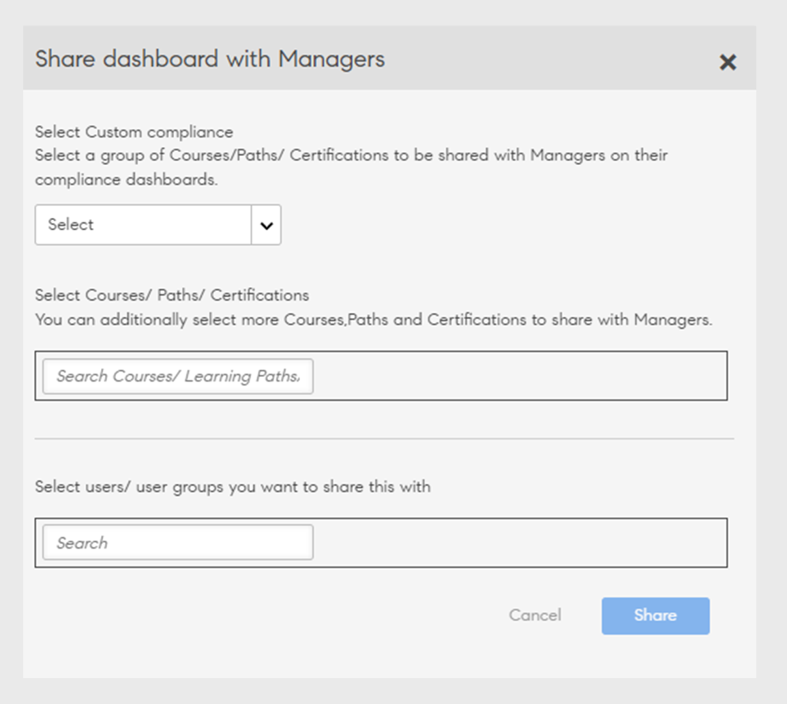
   _與經理分享合規儀表板_

5. 從 **[!UICONTROL Select Custom Compliance]** 下拉選單選擇合規標籤。
此選項將選擇所有具有所選合規標籤的課程。
6. 選擇你想與管理員分享的額外課程、學習路徑或證照。
7. 選擇你想分享儀表板的使用者或使用者群組，然後選擇 **[!UICONTROL Share]**。

##### 查看合規儀表板 – 經理

請參閱本文 [，請參閱合規 dahsboard](/help/migrated/managers/feature-summary/manager-dashboard.md#view-the-dashboard) 以獲取更多資訊。

#### 編輯儀表板

請依照以下步驟編輯合規儀表板：

1. 以 . 登入。**[!UICONTROL Admin]**
2. 前往 **[!UICONTROL Reports]** > **[!UICONTROL Learning Summary]** > **[!UICONTROL Compliance Dashboard]**。
3. 選擇 **[!UICONTROL Admin View]** 或 **[!UICONTROL Manager View]** 選擇該 **[!UICONTROL Compliance Dashboard]** 區塊。 您可以在此區塊中看到合規儀表板。
4. 在你想編輯的合規儀表板中選擇 **[!UICONTROL Edit]** 。

   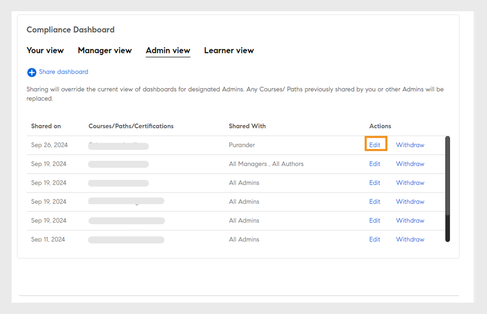
   _編輯合規儀表板_

5. 更改所需資料並選擇 **[!UICONTROL Share]**。
6. 合規儀表板將與被選中的經理共享。

#### 撤回儀表板 - 管理員

請依照以下步驟移除合規儀表板：

1. 以 . 登入。**[!UICONTROL Admin]**
2. 前往 **[!UICONTROL Reports]** > **[!UICONTROL Learning Summary]** > **[!UICONTROL Compliance Dashboard]**。
3. 選擇 **[!UICONTROL Admin View]** 或 **[!UICONTROL Manager View]** 選擇該 **[!UICONTROL Compliance Dashboard]** 區塊。 您可以在此區塊中看到合規儀表板。
4. 在你想移除&#x200B;**[!UICONTROL Proceed]**&#x200B;的合規儀表板上選擇 **[!UICONTROL Withdraw]** 。
5. 此舉將移除主管應用程式中的共享合規儀表板。

   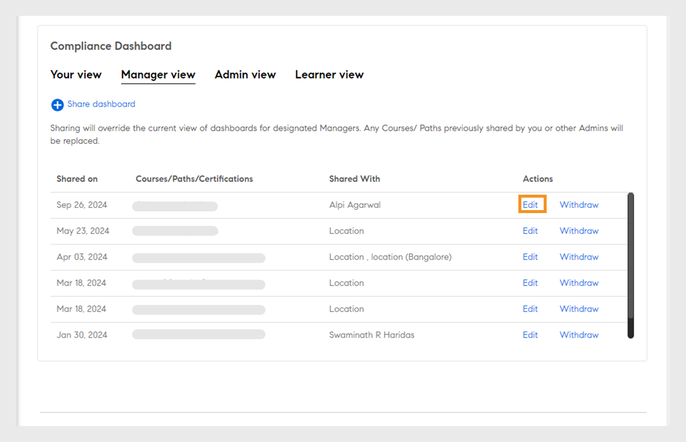
   _撤掉合規儀表板_

#### 設定學習者的預設合規小工具

請依照以下步驟設定學習者的預設合規小工具：

1. 以 . 登入。**[!UICONTROL Admin]**
2. 前往 **[!UICONTROL Reports]** > **[!UICONTROL Learning Summary]** > **[!UICONTROL Compliance Dashboard]**。
3. 選擇 **[!UICONTROL Learner View]** 該 **[!UICONTROL Compliance Dashboard]** 區段。
4. 在該&#x200B;**[!UICONTROL Learner View]**&#x200B;區段選擇&#x200B;**[!UICONTROL Change]**。

   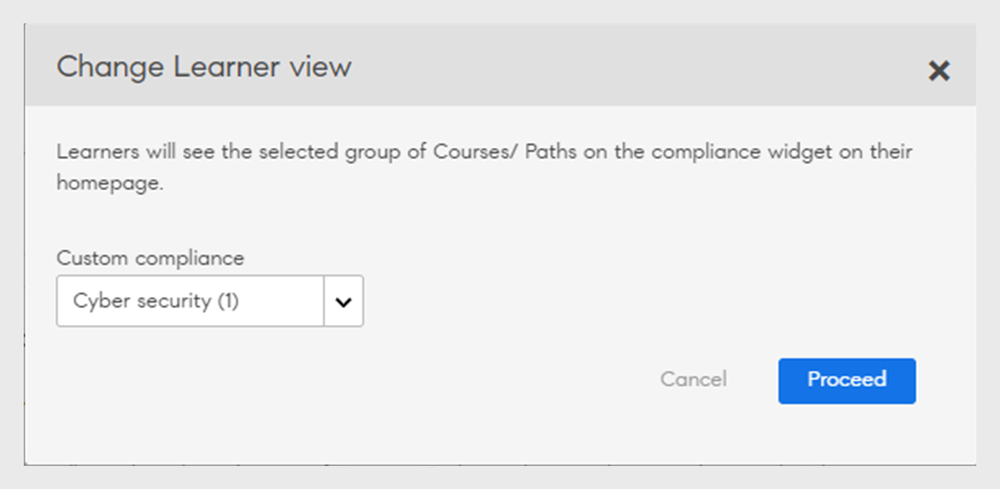
   _設定學習者的預設合規小工具_
5. 從 **[!UICONTROL Custom Compliance]** 下拉選單選擇合規標籤。 此選項將選擇所有具有所選合規標籤的課程。
6. 選擇 **[!UICONTROL Proceed]** 設定預設合規小工具。

學習者可以在首頁的合規小工具中查看所選課程或學習路徑。 詳情請參閱 [合規儀表板小工具](/help/migrated/learners/feature-summary/learner-home-page.md#compliance-dashboard-widget) 。

## 自訂報告

管理員可利用該 **[!UICONTROL Reports]** 區塊中的自訂範本產生特定報告。

### 範例報告 {#samplereports}

這個 **[!UICONTROL Sample Reports]** 分頁用來顯示一些基於樣本數據點的指示性報告。 探索這些報告，了解你可以利用帳戶資料產生不同類型的功能豐富報告。

### 儀表板報告 {#dashboardreports}

儀表板是一組報告的集合。 報告可以依照你的喜好分組到儀表板中。 要查看你所建立的所有板子，請點選此板頁籤。 從 **[!UICONTROL View Dashboard]** 下拉選單中，你可以選擇預設的板子或你建立的儀表板。

### Excel 報告 {#excelreports}

這個 **[!UICONTROL Excel Reports]** 分頁允許你匯出 XLS 檔案格式的報告。

以下是可下載的報告類型。

* 課程報告
* 學習者成績單
* 公告報告
* 工作輔助工具報告
* 內容稽核追蹤
* 使用者稽核追蹤
* 登入/存取報告
* 遊戲化文字稿
* 遊戲化稽核追蹤

### 課程報告 {#coursereports}

作為管理員，你可以下載課程報告。 請遵循以下步驟：

1. 打開 **[!UICONTROL Reports]** > **[!UICONTROL Custom Reports]** > **[!UICONTROL Excel Reports]** > **[!UICONTROL Course Reports]**。
1. **[!UICONTROL Course Report]**&#x200B;對話會出現。選擇你想取得報告的課程並點選 **[!UICONTROL Show]**。

   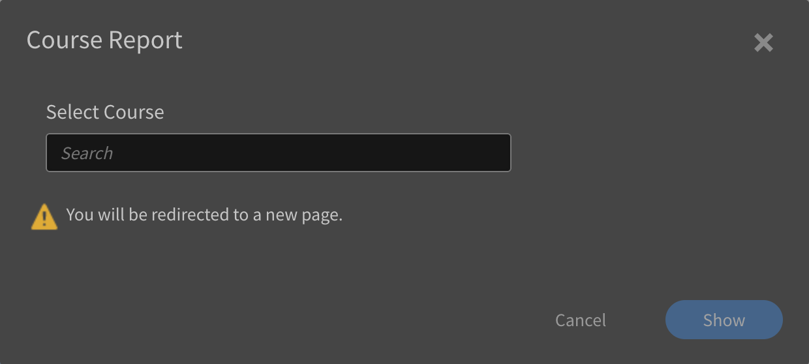
   *課程報告*

1. 你會被導向到課程頁面。 你可以依使用者及依題目匯出測驗分數，並依每個報名選擇特定報名類型。
1. 選擇 **[!UICONTROL Export Quiz Score]** 匯出報告。 **[!UICONTROL Generating Report Request]**&#x200B;螢幕上會出現一個對話框。點擊 **[!UICONTROL OK]** 確認。

   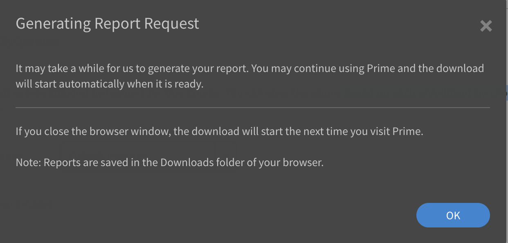
   *產生報告請求*

   >[!NOTE]
   >
   >匯出後的測驗分數報告會包含每次嘗試的分數細節，若模組設定了多次嘗試選項。

### 產生課程報告

>[!INFO]
>
>在本次培訓中，您將學習如何匯出課程報告並設定這些報告的電子郵件訂閱。    

如果你無法啟動訓練，請寫信至 <almacademy@adobe.com>。

### 學習者成績單 {#LearnerTranscripts-1}

Adobe Learning Manager 讓組織的管理員能夠產生與學習者相關的成績單。

更多資訊請參閱 [學習者成績單](/help/migrated/administrators/feature-summary/reports/learner-transcripts.md) 。

### 公告 報告 {#announcementsreports}

作為管理員，你可以產生一份報告，記錄你所發送的所有公告。 報告中包含以下細節：

* 公告類型
* 公告名稱
* 公告日期
* 公告狀態
* 學習者名稱

要下載報告，請遵循以下任一步驟：

1. 打開 **[!UICONTROL Reports]** > **[!UICONTROL Custom Reports]** > **[!UICONTROL Excel Reports]** > **[!UICONTROL Announcements Report]**。 **[!UICONTROL Generating Report Request]**&#x200B;對話框打開了。點擊確定。
1. [!UICONTROL **出口報告**]>[!UICONTROL **行動**]&#x200B;**公告>**&#x200B;報告。

   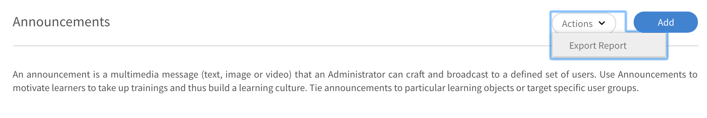
   *公告報告*

1. 你可以點擊 **[!UICONTROL Export Report]** 設定圖示下方，擷取特定公告的報告。

   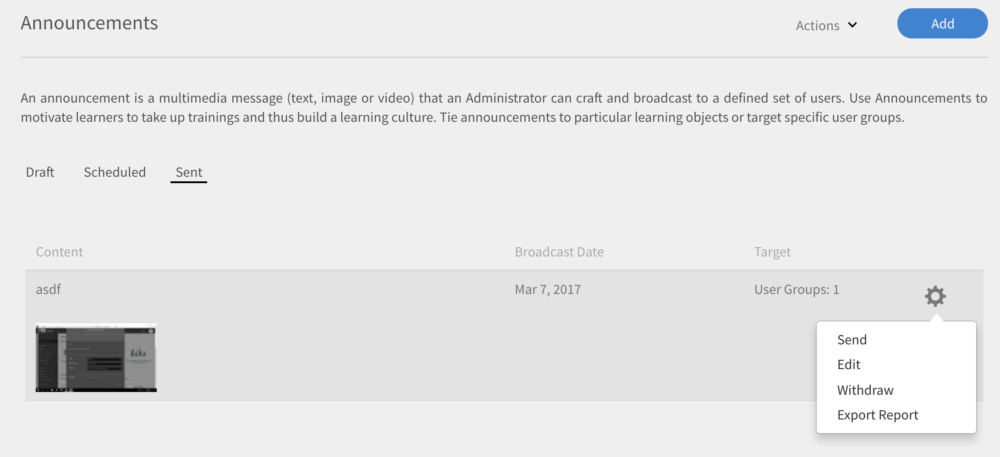
   *具體公告請報告*

### 工作輔助工具報告 {#jobaidsreport}

工作輔助工具是學習者無需註冊特定學習對象（如課程或學習計畫）即可取得的培訓內容。 管理員可以擷取並下載工作輔助報告。

摘錄報告包含以下資訊：

* 名稱
* 就業援助類型
* 就業援助現狀（已公布或撤回）
* 入學日期
* 完工日期
* 下載日期
* 學習者名稱
* 經理人名稱
* 製作人

要下載報告，請執行以下其中一項：

* 打開  **[!UICONTROL Reports]** > **[!UICONTROL Custom Reports]** > **[!UICONTROL Excel Reports]** > **[!UICONTROL Job Aid Reports]**。 **[!UICONTROL Generating Report Request]**&#x200B;對話框會出現。點擊 **[!UICONTROL Ok]**。
* 打開 **[!UICONTROL Job Aid]** > **[!UICONTROL Actions]** > **[!UICONTROL Export Report]**。

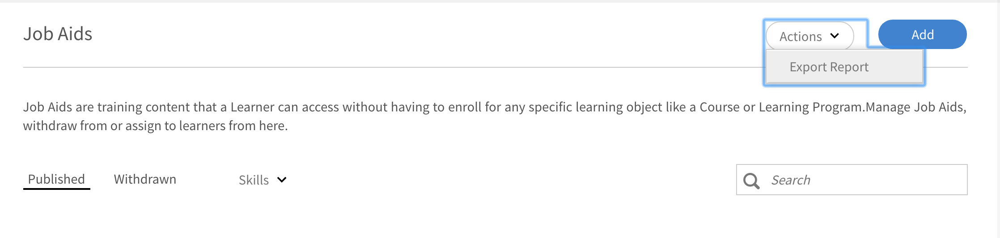
*工作輔助報告*

* 您也可以點擊 **[!UICONTROL Export Report]** 設定圖示下方，擷取特定工作輔助工具的報告。

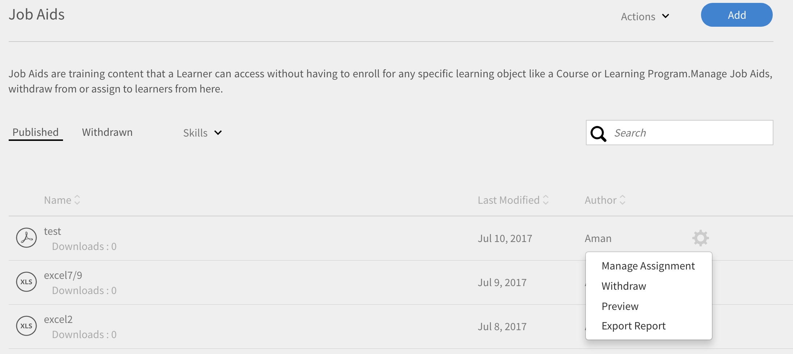
*針對特定工作協助報到。*

### 工作輔助工具報告

選擇 **[!UICONTROL Job Aids Report]** 後，你會看到兩個選項：

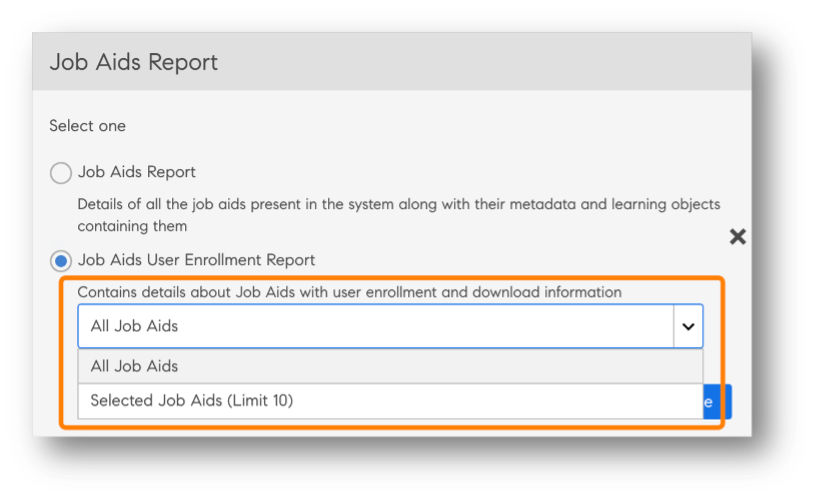
*下載就業輔助工具 USer 註冊報告*

**所有工作輔助**&#x200B;工具：若帳戶中的工作輔助工具數量少於1,000萬，產生的報告將包含所有工作輔助工具的註冊資訊。 這將成為預設的選擇。 若資料列數超過 1,000 萬，將顯示錯誤，您必須手動選擇所需的工作輔助工具。

**選擇工作輔助**&#x200B;工具：選擇此選項後，您可以輸入想要產生報告的工作輔助工具。 你最多只能選擇10種工作輔助工具。 Adobe Learning Manager 會檢查職缺輔助工具數量是否超過 1,000 萬筆。

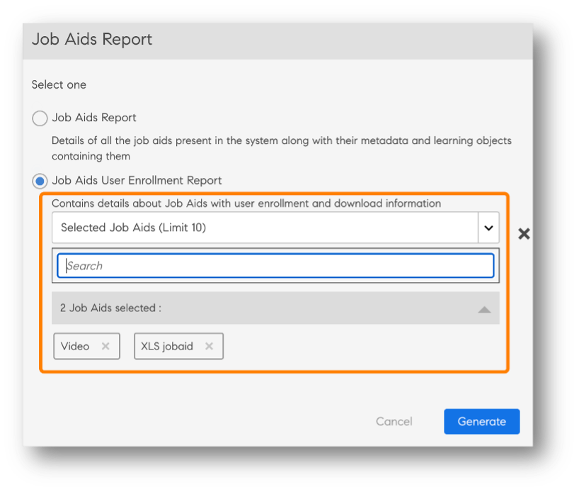
*選擇工作援助*

**工作輔助工具報告**

選擇此選項後，系統中所有工作輔助工具的詳細資訊及其元資料與培訓內容都會被下載。

下載的報告包含以下欄位：

* 就業援助名稱
* 語言
* 身分證
* 類型
* 持續時間（分鐘）
* 州
* 發布日期（UTC時區）
* 以名字創作
* 由電子郵件建立
* 由使用者唯一識別碼建立
* 目錄
* 學習路徑
* 課程
* 標籤
* 技能

**工作輔助工具使用者註冊報告**

註冊報告包含使用者註冊及其他資訊的詳細資訊。

下載的報告包含以下欄位：

* 就業援助名稱
* 類型
* 州
* 註冊日期（UTC時區）
* 完成日期（UTC時區）
* 下載日期（UTC時區）
* 學習者名稱
* 電子郵件
* 使用者唯一識別碼
* 經理人姓名
* 經理電子郵件
* 管理器使用者唯一識別碼
* 以姓名命名
* 由電子郵件指派
* 由使用者唯一識別碼指派
* 以名稱創建
* 由電子郵件建立
* 由使用者唯一識別碼建立
* 職務代碼
* 新田野
* 簡介

### 內容稽核追蹤報告 {#contentaudittrailreports}

使用 **[!UICONTROL Content Audit Trail]** 報告產生器生成課程在系統中所有變更與編輯的報告。 產生的報告中會取得以下資訊。

* 物件識別碼
* 物件名稱
* 物件類型
* 改裝類型
* 說明
* 參考物件識別碼
* 參考物件名稱
* 依使用者名稱修改
* 依使用者ID修改
* 修改日期（UTC時區）

在 **修改類型** 欄位，您將獲得以下詳細資訊：

| 改裝類型 | 說明 |
| --- | --- |
| 創作 | 賽道已建成 |
| 認證新增 | 認證新增於目錄 |
| 認證移除 | 認證已從目錄中移除 |
| 內容新增 | 模組新增內容 |
| 賽道新增 | 課程新增於學習路徑 |
| 路線移除 | 課程已從學習路徑中移除 |
| 自訂標籤新增 | 新增自訂標籤至目錄 |
| 自訂標籤移除 | 自訂標籤從目錄中移除 |
| 刪除 | 目錄已刪除 |
| 工作援助新增 | 職缺協助已新增至目錄 |
| 工作援助移除 | 職缺協助從目錄中移除 |
| 學習路徑新增 | 學習路徑新增於目錄 |
| 學習路徑移除 | 學習路徑從目錄中移除 |
| 模組內容新增 | 課程新增模組（內容部分） |
| 模組內容移除 | 模組已從課程（內容部分）移除 |
| 發表 | 課程或學習路徑已發布並加入預設目錄 |
| 再版 | 課程重新刊登 |
| 資源補充 | 課程新增資源 |
| 資源移除 | 課程中資源已移除 |
| 退休 | 賽道退役 |
| 共享目錄新增 | 目錄分享給目錄 |
| 共享目錄移除 | 目錄共享功能已從目錄中移除 |
| 共享目錄更新 | 目錄共享狀態：有效 |
| 更新 | 課程或學習路徑已更新 |
| 使用者群組新增 | 使用者群組新增至目錄 |
| 使用者群組移除 | 使用者群組已從目錄中移除 |

產生的報告中不會擷取有關元資料的資訊。

要產生課程追蹤稽核報告，請依照以下步驟操作。

1. 選擇 **[!UICONTROL Report]** > **[!UICONTROL Excel reports]** > **[!UICONTROL Course Audit Trail]**。 **[!UICONTROL Content Audit Trail]**&#x200B;對話框會出現。

   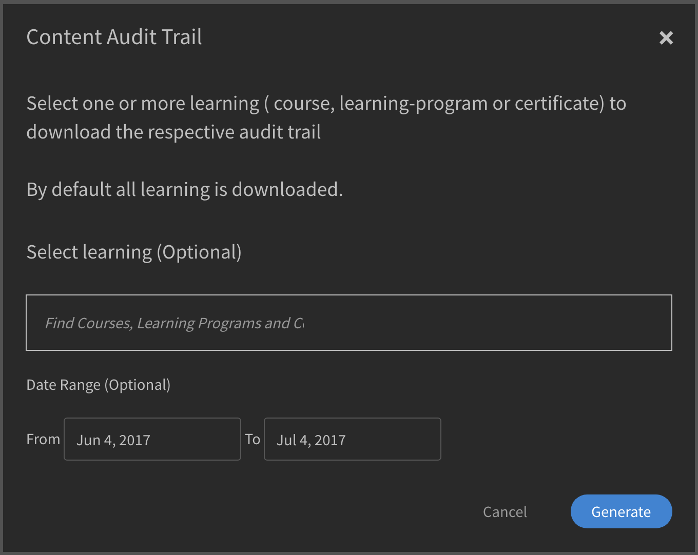
   *賽道稽核追蹤*

1. 選擇你想下載報告的課程、學習計畫和認證。 若未指定，所有報告預設都會被下載。
1. 選擇報告的日期範圍並點擊 **[!UICONTROL Generate]**。
1. 報告會產生，並通知您內容審核報告已完成。 你可以下載報告。

### 使用者稽核追蹤報告 {#useraudittrailreports}

使用者稽核追蹤捕捉使用者、使用者群組及自我註冊檔案的生命週期。 使用者新增、刪除、變更管理工具，都會被記錄下來。 自我註冊檔案的建立與刪除都會被記錄下來。 您也可以暫停並繼續自行註冊。

你可以新增、啟用、停用、暫停或繼續外部個人檔案，而新增、刪除、暫停或繼續則是自我註冊。 CSV 上傳也會被擷取。

1. 選擇  **[!UICONTROL Report > Excel report > User Trail]**。 使用者稽核軌跡對話框會出現。
1. 使用者稽核軌跡對話框會出現。 從彈出選單中選擇日期範圍。 你可以選擇產生過去一週、過去一個月的報表，或選擇自訂日期。

   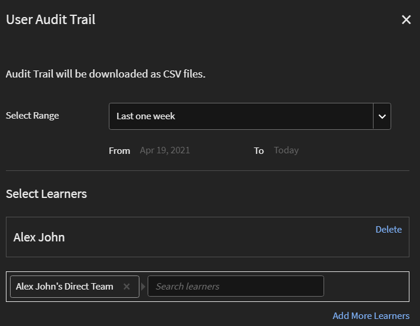
   *使用者稽核追蹤*

1. 點擊 **[!UICONTROL Generate]** 產生報告。

對話中有兩個篩選器 **[!UICONTROL User Audit Trail Report]** 。

**約會憤怒篩選器：** 選擇你想產生報告的日期範圍。 有三種選擇：

* 最後一週
* 最後一個月
* 自訂日期

選擇學習者篩選器：搜尋使用者或使用者群組。

匯出後的報告將包含符合上述搜尋條件的使用者資料。

*使用者稽核追蹤*

>[!NOTE]
>
>當技能被指派或移除時，該技能可以在使用者審核報告中追蹤，無論是被指派還是被移除。

### 擴充組設定報告

本報告提供所有新增原生擴充功能的設定細節，包括其啟用狀態。 了解如何下載延期報告，請參見 [下載延期報告](native-extensibility.md#download-extension-report)。

### xAPI 活動報告

此報告提供在 xAPI 活動模組中記錄與產生的所有 xAPI 語句資料。

要下載本報告，請遵循以下步驟：

1. 選擇  **[!UICONTROL Report > Excel report > xAPI Activity Report]**。 出現了 xAPI 活動報告對話框。
1. 從彈出選單中選擇日期範圍。 你可以選擇產生過去一週、過去一個月的報表，或選擇自訂日期。
1. 從下拉選單選擇學習者與活動。
1. 選擇 **[!UICONTROL Generate]** 以產生報告。

### 遊戲化報告 {#gamification}

管理員可下載CSV格式的遊戲化文字稿。 你可以下載個人使用者或使用者群組的報告。 使用者名稱、電子郵件、使用者的 UUID、總用戶得分、累積的積分分割、使用者所參與的群組名稱、管理者姓名及活動欄位數值，都會在報告中取得。 管理員可利用此報告評估並理解組織層級或特定群體的用戶排名。

1. 選擇報告>Excel報告>遊戲化報告。

   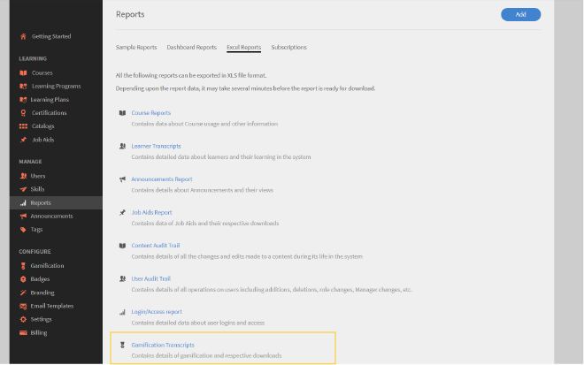
   *遊戲化報告*

1. 遊戲化文字記錄對話框會出現。 請使用學習者的姓名、個人資料、使用者群組、電子郵件 ID 或 UUID 來選擇學習者。

   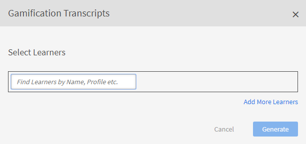
   *遊戲化逐字稿對話*

1. 點擊  **[!UICONTROL Generate]** 產生報告。

   在產生學習者報告後，必須能夠匯出帳戶中所有使用者（內部、外部或已刪除）的當前及已達成等級資訊。 您也可以查詢學習者所達成的等級日期：

   * 銅牌達成日期
   * 銀牌達成日期
   * 金牌達成日期
   * 白金達成日期

   這些欄位記錄了首次達成該層級的日期。 欄位 **[!UICONTROL Current Level]** 顯示學習者的當前等級。

   當管理員重置遊戲化時，學習者的所有點數都會相應重置。

### 遊戲化稽核追蹤報告 {#gamification-audit-trail}

本報告包含學習者在每條規則中獲得遊戲化點數的歷史與原因。

### 下載報告

1. 選擇遊戲化稽核追蹤網址。
1. 在 **遊戲化稽核追蹤** 彈窗中，選擇日期範圍。
1. 選擇 **產生**。

報告會以 CSV 檔案下載。 檔案包含以下欄位：

* 名稱
* 電子郵件/UUID，
* 現況
* 動作
* 分數，
* 平衡點數
* 規則/任務
* 規則/任務子任務，
* 規則/任務細節
* 類型，
* 姓名，
* 實例命名日期已達成（UTC 時區）
* 規則/任務開始時間
* 規則/任務結束時間

### 註冊與退學報告 {#enrollmentandunenrollmentreport}

管理者和管理者可以擷取已註冊與退學學習者的報告。 作為管理員，您可以查看任何已註冊或退選於課程、學習計畫或認證實例的學習者、管理員或經理，並匯出報告。 而作為經理，你只能取得團隊成員的報告。 作為經理，你無法在經理申請中看到被刪除的學習者或你自己的名字，無論是已註冊還是未註冊。

要下載報告，請依照以下步驟操作：開啟  **[!UICONTROL Course/ Learning program/ Certification]** > **[!UICONTROL Learners]** > **[!UICONTROL Action]** > **[!UICONTROL Export report]**。

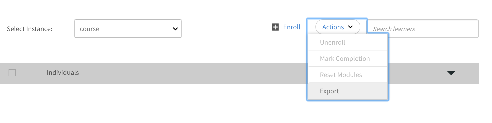
*退學報告*

### 回饋報告 {#feedback-report}

作為管理員，您現在可以在指定期間內，取得學員回饋（L1）與經理回饋（L3）。

更多資訊請參閱 [回饋報告](/help/migrated/administrators/feature-summary/reports/feedback-report.md) 。

### 訓練報告 {#training-report}

Learning Manager 支援培訓報告，允許管理員下載培訓細節及其相關元資料，如作者、發表日期、技能、目錄標籤等。

在管理應用程式中，點擊 **[!UICONTROL Reports]** > **[!UICONTROL Custom Reports]** > **[!UICONTROL Excel Reports]** > **[!UICONTROL Trainings Report]**。

您可以下載以下報告：

* 精選訓練（限制10項）-從任一目錄中選擇一項或多項訓練（最多10項）
* 所選目錄中的培訓（限制5個）-（最多可選五本目錄）
* 所有訓練 - （帳戶中所有訓練）

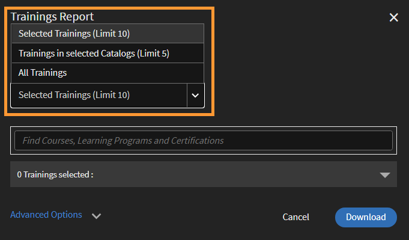
*下載訓練報告*

在進階選項區，有以下選項可供選擇：

* 附上課程對應及學習計畫/認證
* 包含模組層級資訊

選擇篩選條件並點擊下載後，您將收到通知，要求下載CSV 格式的報告。

報告將包含以下欄位：

*課程目錄名稱、訓練類型、訓練ID、訓練唯一ID、訓練名稱、子訓練、模組、訓練或模組長度、格式、訓練狀態、技能、作者、最後發表日期、最後完成日期、講師註冊人數、開始人數、完成人數、平均L1分數、平均L2分數、平均L3分數、收到L1回應數、收到L2回應數、收到L3回應數、目錄標籤與標籤。*

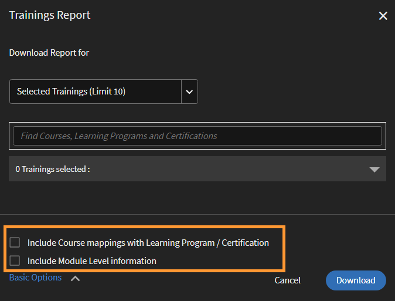
*其他選項*

### 會期總結報告 {#session-summary-report}

課程摘要報告包含在指定日期內為學習者安排的所有課程。

這讓管理員能夠匯出所有符合指定日期範圍的虛擬及教室課程細節。 管理員也能匯出特定訓練或講師的課程報告。

這也有助於管理員了解每月規劃的課程內容，並辨識講師的行程表及已完成的課程內容。

作為管理員，請點擊 **[!UICONTROL Custom Reports]** > **[!UICONTROL Session Summary Report]**。

在接下來的對話框中，選擇日期範圍，並選擇訓練或講師，以取得摘要。

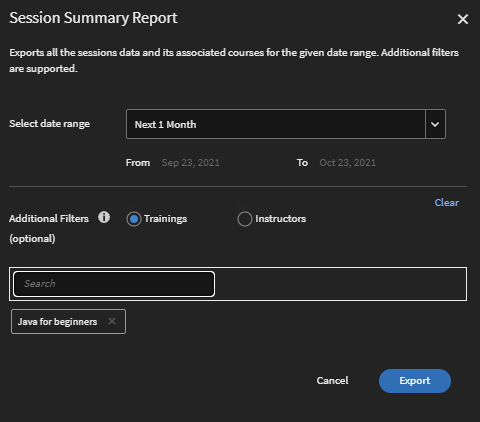
*會期總結報告*

下載的 csv 包含以下欄位：

* 開始日期與時間
* 結束日期與時間

* 模組名稱
* 會話長度（以分鐘計）
* 座位數
* 位置
* 實例名稱
* 課程名稱
* 課程編號
* 講師姓名
* 講師電子郵件
* 招生人數
* 會話類型
* 候補名單限制
* 候補名單數量
* 候補名單使用者電子郵件
* 地點資訊
* 地點區域

### 講師使用報告

本報告記錄了教師每日教授指定課程所花費的時間（以分鐘計）。 報告可於選定開始日期起三個月內下載。

要下載報告，請點擊 **[!UICONTROL Reports]** > **[!UICONTROL Custom Reports]** > **[!UICONTROL Instructor Utilization Report]**。

選擇一位或多位講師及日期範圍。

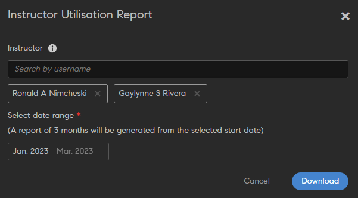
*下載教師使用報告*

下載的報告包含以下欄位：

* 教練名稱
* 講師編號
* 能力層級
* 日期作為欄位。 若教練在特定日期受聘，則會列出課程次數。 若該教官當天未被使用，該數值會顯示為零。

報告包含從選定月份起三個月的紀錄。

若要取得所有講師的紀錄，請將講師欄位留空。

此外，擁有產生報告權限的自訂管理員也能取得此報告。

### 使用者稽核追蹤報告

本報告記錄了學習者在「從實例」切換到「實例」的資訊，並依時間、日期等方式切換。

選擇學習者或使用者群組。

要下載報告，請點擊 **[!UICONTROL Reports]** > **[!UICONTROL Custom Reports]** > **[!UICONTROL User Audit Trail Report]**。

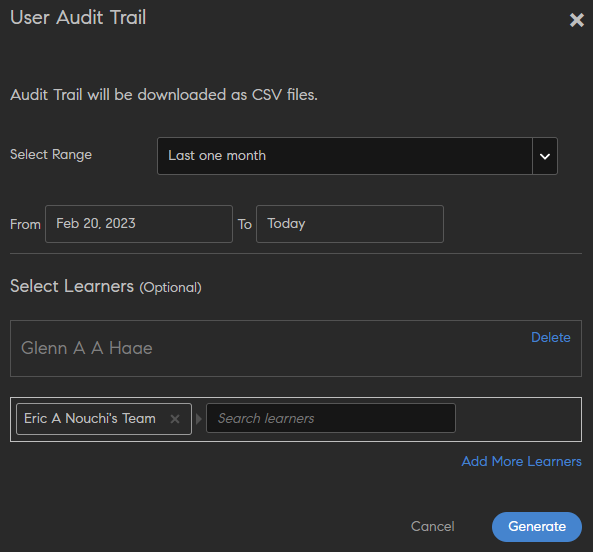

*下載使用者稽核追蹤報告*

### 學習計畫報告

此報告包含帳號中所有學習計畫的詳細資訊，例如相關使用者群組、狀態及觸發資訊。

報告內容如下：

* 學習計畫名稱
* 類型（發生時間）
* 訓練（已完成）
* 技能（已達成）
* 日期（約定日期）
* 動作
* 狀態，由
* 創建日期
* 最後修改日期
* 使用者群組（適用於）
* 使用者群組（新增）
* 註冊後
* 學習元素類型
* 學習元素
* 學習元素實例
* 學習元素
* 完工日期
* 學習元素提醒
* 範圍目錄
* 範圍-使用者群

### 自訂角色的稽核軌跡

管理員可以下載自訂角色稽核報告，追蹤自訂角色的所有變更，包括建立、修改及刪除自訂角色及其相關功能存取權。

要下載報告，請依照以下步驟操作：

1. 以管理員身份登入。
2. 選擇報告>自訂報告。
3. 選擇自訂角色稽核追蹤並選擇日期範圍
4. 選擇「產生」以下載報告。

自訂角色稽核追蹤報告包含以下欄位：

* 角色識別
* 角色名稱
* 活動類型
* 改裝類型
* 說明
* 參考物件類型
* 參考物件ID
* 參考物件名稱
* 參考物件電子郵件
* 依使用者名稱修改
* 由使用者 UUID 修改
* 由使用者電子郵件修改
* 修改日期（UTC時區）
* 資料來源

## 電子郵件訂閱 {#emailsubscriptions}

訂閱你喜歡的報告，可以透過電子郵件收到。

### 設定電子郵件訂閱

>[!INFO]
>
>在本次培訓中，您將學習如何設定儀表板報告的電子郵件訂閱。    

如果你無法啟動訓練，請寫信至 <almacademy@adobe.com>。

在頁面中 **[!UICONTROL Reports]** ，點擊分  **[!UICONTROL Subscription]** 頁。 報告訂閱頁面會出現。

要從下拉選單中選擇報告名稱，請在報告欄位輸入報告名稱。 從下拉選單選擇電子郵件頻率。 你可以新增電子郵件主旨，並提供替代電子郵件帳號。

你可以編輯和刪除訂閱。

## 歷史報告

Adobe Learning Manager（ALM）中的歷史報告指的是記錄學習平台內歷史資料與活動的報告。 這些報告提供過去學習活動、培訓內容、使用者群組表現及其他相關數據的洞見。 歷史報告讓管理者能夠追蹤、監控並分析學習計畫隨時間的進展與成效。

### 課程入學報告

課程進入報告提供每門課程重訪的資訊。

要下載本報告，請遵循以下步驟：

1. 去 **[!UICONTROL Reports]** > **[!UICONTROL Custom Reports]** > **[!UICONTROL Historic Reports]**。
1. 選擇 **[!UICONTROL Course Access Report]**。 產生報告請求的對話框會打開。
1. 從下拉選單選擇年份和季度。
1. 選擇 **[!UICONTROL Generate]**。

### 登入/存取報告

登入/存取報告提供使用者登入及存取資訊。 你可以一次產生包含三個月資料的報告。

要下載本報告，請遵循以下步驟：

1. 去 **[!UICONTROL Reports]** > **[!UICONTROL Custom Reports]** > **[!UICONTROL Historic Reports]**。
1. 選擇 **[!UICONTROL Login/Access report]**。 產生報告請求的對話框會打開。
1. 從下拉選單選擇年份和季度。
1. 選擇 **[!UICONTROL Generate]**。

## 建立儀表板 {#createadashboard}

1. 要開始建立自己的看板，請點擊頁面右側的新增儀表板。

   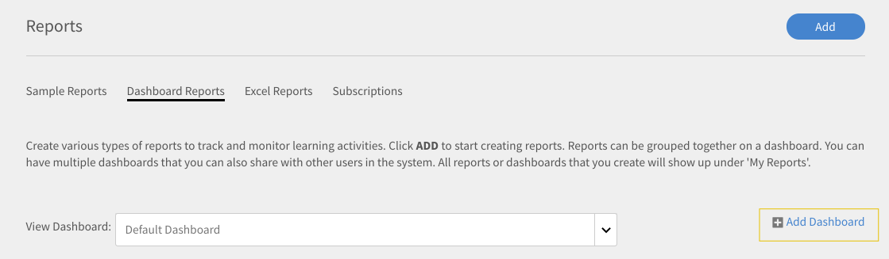
   *新增儀表板*

1. 請提供儀表板的名稱與描述。
1. 如果你想和任何經理共用儀表板，請在 **[!UICONTROL Share With]** 現場選擇他們。 你可以使用任何正常的篩選標準來進行這個操作。
1. 點擊 **[!UICONTROL Save]。**

你可以在 **[!UICONTROL Dashboard Reports]** 分頁查看最近建立的棋盤。

要將報告加入你的看板，請點擊看板視窗右上角的下拉選單並點選 **[!UICONTROL Add Report]**。 你用這種方式建立的報告會與你的儀表板綁定。

>[!NOTE]
>
>你在報告頁面右上角點擊新增所建立的報告，會被加入你的預設儀表板。

## 共享儀表板 {#shareddashboards}

共享看板是組織內其他使用者分享給你的報告集合。 你新增到共享看板的任何報告，都會自動分享給有權限存取該看板的其他使用者。

你可以透過以下兩種方式分享這個看板：

* 透過輸入共享儀表板的欄位 **[!UICONTROL Share With]** 使用者。
* 在下拉選單中選擇編輯看板，並輸入使用者資訊以分享儀表板。

>[!NOTE]
>
>經理只能從共享儀表板查看團隊成員的報告。

## 下載資料 {#downloads}

匯出後的儀表板報告表提供詳細資訊，取代報告摘要。 下載的報告採用學習者成績單的格式。

## 建立報告 {#report}

1. 點選左側窗格的「報告」。 報告摘要頁面會出現。

   >[!NOTE]
   >
   >預設情況下，樣本板標籤中至少會出現三個樣本報告。 你只能查看範例報告，以了解如何建立和客製化它們。

1. 在頁面右上角，點擊 **[!UICONTROL Add]**。
1. 在 **[!UICONTROL Add Report]** 對話框的類型下拉選單中，你可以選擇預設的報表之一，或選擇 **[!UICONTROL Custom]**。 如果你選擇預先定義的報告，你可以看到表單已經預先填入。 你還可以進一步修改部分欄位並點擊 **[!UICONTROL Save]**。 這會將報告加入你的預設儀表板。

   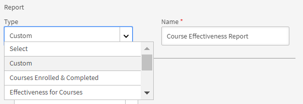
   *建立報告*

   在 **[!UICONTROL Report Type]**&#x200B;中，你可以選擇預先定義的報告集合或自訂值。 您可以將以下報告視為預先定義的報告集的一部分：

   * 分配與完成的技能
   * 已報名與完成的課程
   * 課程的成效
   * 已註冊及完成的學習課程
   * 每門課程所花費的學習時間
   * 每學季學習時間
   * 認證完成

1. 從下拉選單中選擇報告的 。**[!UICONTROL Y-axis]**&#x200B;對於部分選定條件，您可以從州選項中選擇一個或多個州。 例如，課程註冊統計的主要標準可以是州名完成、未完成和已註冊。 主要範圍資料以長條圖形式呈現於報告中。

   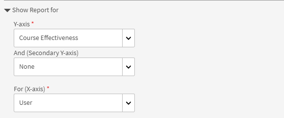
   *報告軸*

1. 從下拉選單中選擇報告的次要 **[!UICONTROL Y-axis]** 標準/範圍。 例如，在學習計畫註冊選項中，從州下拉選單中選擇一個或多個州。 次要範圍資料以折線圖形式表示。
1. 從下拉選單中選擇適合報告的 X 軸標準。 若選擇 x 軸作為日期，則可依日、月、季及年份將 x 軸標準分組。
1. 在時間跨度區塊中，從下拉選單中選擇相應選項。 可用的選項包括：

   * 過去一個月
   * 四分之一
   * 年份
   * QTD（過去90天）
   * 今年至今（過去365天）
   * 日期範圍。 在日期&#x200B;**[!UICONTROL From]**&#x200B;**[!UICONTROL To]**&#x200B;欄位中提供數值。

   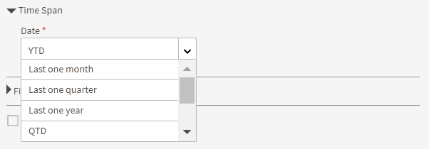

1. **濾鏡部分**

   篩選器會根據您選擇的報告類型，出現在底部的「新增報告」對話框中。 以下列出一些主要的過濾器。

   * **經理：** 你可以根據階級選擇任何一位經理。 有些經理可能會有下屬經理，且每位下屬經理下有多名員工。
   * **個人資料：** 選擇你員工的職稱。 這會幫助你根據員工的個人資料或職稱查看報告。 例如，電腦科學家、工程師。
   * **使用者群組：** 選擇你想篩選報告的使用者群組。 Learning Manager 會從使用者功能取得你帳號定義的使用者群組。
   * **內容：** 你可以根據任何課程從下拉選單選擇來篩選報告。

   展開此區塊並選擇所需的篩選條件。

   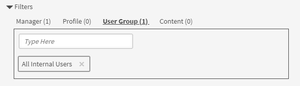
   *選擇濾鏡*

1. 點擊 **[!UICONTROL Save]** 完成建立報告。

   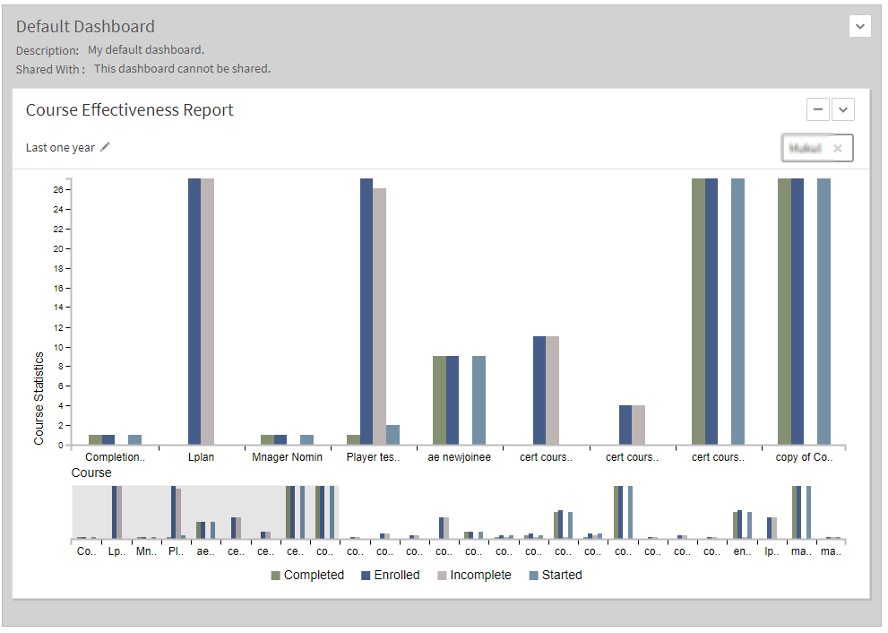
   *範例報告*

## 編輯報告 {#editareport}

在報告中，點擊下拉箭頭，選擇選項 **[!UICONTROL Edit Report]**。

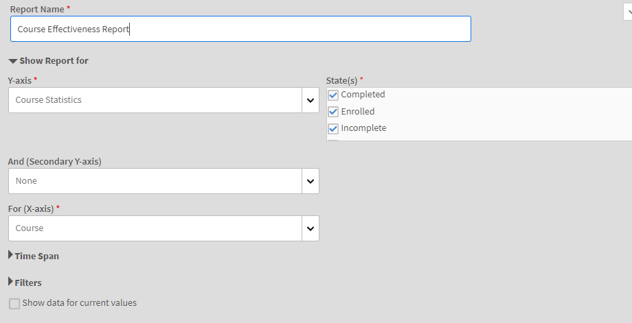
*編輯報告*

對報告做必要的修改。 要儲存變更，請點擊 **[!UICONTROL Save]**。

## 將報告移到儀表板 {#moveareporttoadashboard}

選擇此選項即可將目前報告移至現有儀表板。 要移動報告，請點擊選項 **[!UICONTROL Move to Dashboard]**。

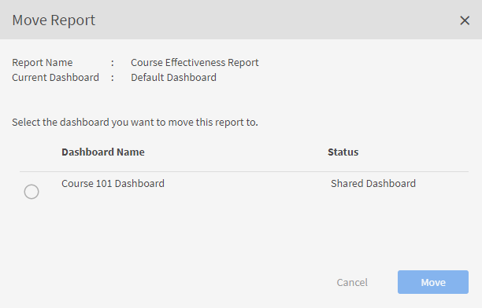
*將報告移到儀表板*

選擇你想讓報告移動到的儀表板，然後點選 **[!UICONTROL Move]**。

## 製作一份報告副本 {#createacopyofareport}

要建立報告副本，請選擇 **[!UICONTROL Create a Copy]**&#x200B;選項。

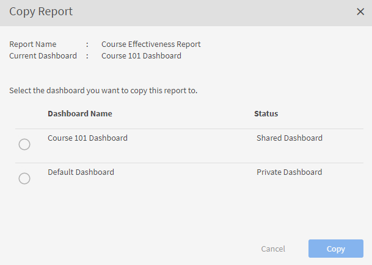
*製作一份報告副本*

選擇你想複製報告的儀表板。 要開始複製，請點擊 **[!UICONTROL Copy]**。

## 刪除檢舉 {#deleteareport}

若要刪除報告，請選擇選項 **[!UICONTROL Delete Report]**。 刪除報告後，你無法恢復報告。 這個過程是不可逆的。 刪除報告時請謹慎行事。

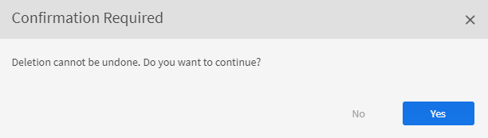
*刪除檢舉*

## 下載報告 {#downloadareport}

要下載報告，請選擇 **[!UICONTROL Download Report]**&#x200B;選項。

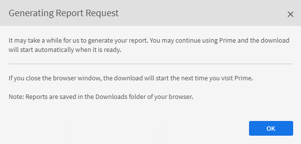
*下載報告*

## 調整報告大小 {#resizeareport}

你可以將報告調整為 1×1（中）和 1×2（大）大小。 這讓你有更好的空間來查看你的報告。 此外，你可以輕鬆平移和縮放這些報導。

## 濾鏡 {#filters}

篩選器會根據 **[!UICONTROL Add]** 你選擇的報告類型，出現在報表對話框底部。 以下列出一些主要的過濾器。

**經理** ：你可以根據階級選擇任何一位經理。 有些經理可能會有下屬經理，且每位下屬經理下有多名員工。

**個人資料** 選擇您員工的職稱。 這會幫助你根據員工的個人資料或職稱查看報告。 例如，電腦科學家、工程師。

**使用者群組** 選擇你想篩選報告的使用者群組。 Learning Manager 會從使用者功能取得你帳號定義的使用者群組。

**課程** 你可以從下拉選單中選擇任何課程來篩選報告。

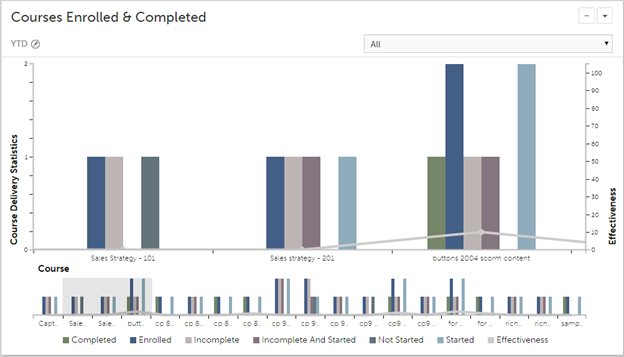
*過濾報告*

在圖例上方，可以看到一個縮放框。 將游標移到該圖上，點擊後將橫桿拖曳到縮放框圖形區域的任何部分，即可放大。

你可以以橫跨圖表條的線條來查看次要的 y 軸值。 例如，在上述範例中，你可以在圖表的灰線中看到效能值。

## 使用者群組報告 {#user-group-reporting}

追蹤使用者群組如部門、外部合作夥伴及角色的表現，與其他使用者群組或相對於其他學習目標的比較。

### 使用者群組 {#usergroups}

要根據使用者群組產生報告，請在下方截圖所示的下拉選單中選擇 **[!UICONTROL User Group]** x 軸。

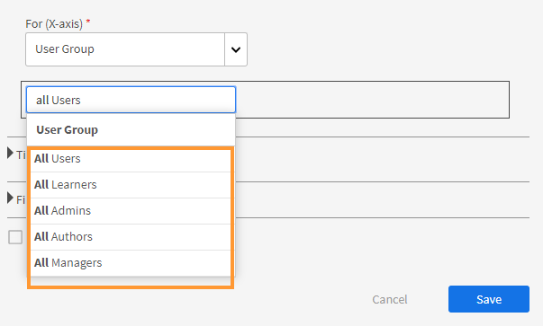
*使用者群組報告*

要選擇使用者群組，請輸入群組名稱。 你可以看到根據輸入的字串顯示的建議群組。 當你看到群組清單後，選擇所需的使用者群組。

你也可以利用預先打字搜尋來選擇多個使用者群組。

一旦你儲存並產生這個報告，如果你選擇了多個使用者群組，報告就會生成，所有使用者群組會以橫條圖並排在 x 軸上。

這份用戶群組報告讓你能比較一個部門/部門/角色的表現，以評估他們的學習成果。

### 自訂使用者群組/使用者屬性 {#customusergroupsuserattributes}

你也可以利用學習管理員中的新增使用者/使用者群組功能來建立自訂的使用者群組。 建立使用者群組後，你可以利用屬性清單（如位置、分支）為這些自訂使用者群組產生報告。

在 x 軸中，選擇使用者屬性選項，並從 **旁邊的下拉** 選單中選擇該屬性。 要根據這些屬性建立自訂的使用者群組報告，你也必須在篩選器中選擇適當的使用者群組。

## 收視報告 {#viewingreports}

在報告頁面，您可以查看所有報告。 你可以點擊每份報告右上角的減號（-）圖示來最小化每份報告。 點擊（+）圖示即可再次查看您的報告。

## 快速檢視與不同日期 {#quickviewwithdifferentdates}

你可以更改任何報告的日期範圍/值，並快速查看不同日期，無需修改或儲存報告。 點擊編輯圖示（如下方快照中箭頭所示）旁邊的日期範圍，例如QTD，過去一年。 要確認變更，請從彈出選單選擇新值並點擊勾選標記。 你可以點擊 X 標記來取消變更。

>[!NOTE]
>
>你用來查看報告的日期值是臨時的。 選擇下載選項時，此報告視圖不會被下載。 此視角僅為暫時視角。

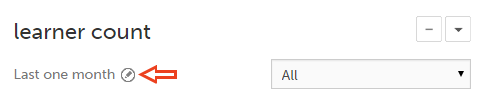
*查看學習者人數*

## 與不同經理的快速檢視 {#quickviewwithdifferentmanagers}

如果有多位經理同時向你報告，你可以快速查看每位經理的報告。 要為每位經理顯示唯一報告，請從下拉選單中選擇經理名稱。

>[!NOTE]
>
>你用來查看報告的經理值是暫時性的。 選擇下載選項時，此報告視圖不會被下載。 此視角僅為暫時視角。

## 查看課程報告 {#viewcoursereports}

您可以依照以下步驟查看各課程專屬的報告：

1. 點擊 **[!UICONTROL View course reports]** 報告頁面的「我的儀表板」標籤中的連結。\
   彈出視窗視窗。 會出現一個文字輸入欄位，輸入必修課程，建議的課程名稱會出現在下拉選單中。 從所示的課程列表中選擇。

   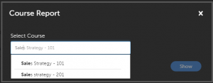

   *查看課程報告*

1. 從下拉選單選擇你想要的課程，然後點選「顯示」。
1. 您將被導至所選課程的測驗成績頁面，以查看該課程專屬報告。

**編輯/移到看板/建立複製報告/刪除/調整大小報告**

要查看下拉選單選項，如編輯/移動至儀表板/建立複製/刪除/調整大小，請點擊每份報告右上角的下拉箭頭。

*編輯/移到看板/建立副本/刪除/調整報告大小*

**[!UICONTROL Edit]** 若要在修改資料時回到初始值，請點擊重置。 修改數值後點選儲存。

**[!UICONTROL Move to Dashboard]** 你可以將目前的報告移到另一個儀表板，該儀表板是從儀表板清單中選擇的。

**[!UICONTROL Create a Copy]** 你可以將報告複製到相同或其他儀表板，該儀表板是從儀表板列表中選擇的。

**[!UICONTROL Delete]** 點擊刪除即可移除檢舉。 在刪除檢舉前，會先跳出警告/確認訊息。

**[!UICONTROL Resize]** 你可以將報告調整為 1×1（中）和 2×2（大）大小。

## 為同儕帳號產生並查看報告 {#generateandviewreportsforpeeraccount}

作為管理員，除了為你的帳號產生報告外，你也可以為你設定的同儕帳號產生並查看報告。

當你與另一位使用者建立同儕帳號後，你可以從 **[!UICONTROL Reports]** 頁面查看該同儕帳號的報告。 當你建立報告時，你會找到該 **[!UICONTROL Select Account]** 欄位。 從下拉選單中列出你所關聯的所有同儕帳號，選擇你想查看共享報告的帳號。

在建立同儕帳號時，如果沒有選擇「分享目錄」選項，你就無法在這個清單中查看該同儕帳號。

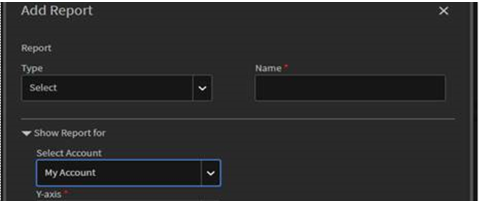
*管理同儕帳號的報告*

1. 選擇本報告的 x 軸與 y 軸，並選擇報告的日期。
1. 注意篩選欄位，共享目錄按鈕是自動啟用的。 這是強制的。 如果沒有啟用共享目錄，表示你無法為同儕帳號產生或查看報告。
1. 從「共享目錄」下方拉選單中，選擇您想查看報告的共享目錄。
1. 點擊 [!UICONTROL **儲存**]。

   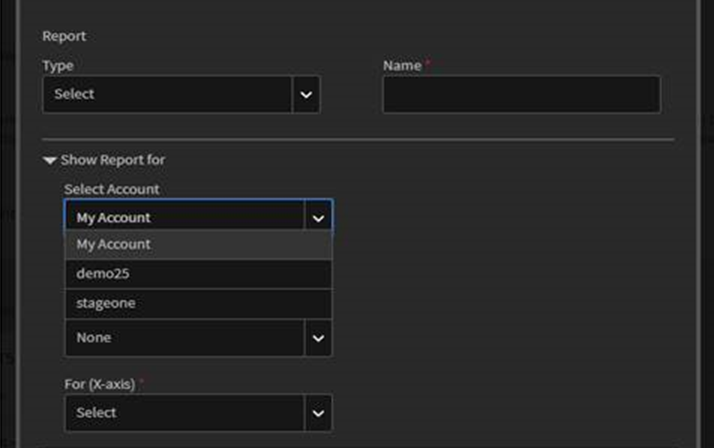
   *選擇「共享目錄」作為同儕帳號*

1. 點擊 **[!UICONTROL Save]**&#x200B;後，你可以在預設儀表板中查看報告的圖形表示。 從這個儀表板，你可以進一步篩選該同儕帳號的經理報告。
1. 如果你這邊的目錄有任何變更，這些變更會立即反映在同儕產生的報告和儀表板中。 然而，當對等端修改目錄時，變更不會自動顯示在你的儀表板中。
1. 如果你想讓儀表板自動更新，你的對等節點必須向你發送新的同儕請求。

   >[!NOTE]
   >
   >經理無法查看同儕報告。

## 常見問題 {#frequentlyaskedquestions}

+++如何與經理分享自訂儀表板？

建立儀表板時，請輸入名稱和描述。 要與經理分享，請在 **[!UICONTROL Share With]** 欄位輸入經理的名字。

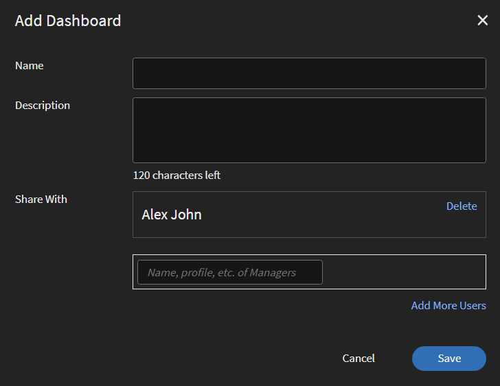
*分享儀表板*
+++
