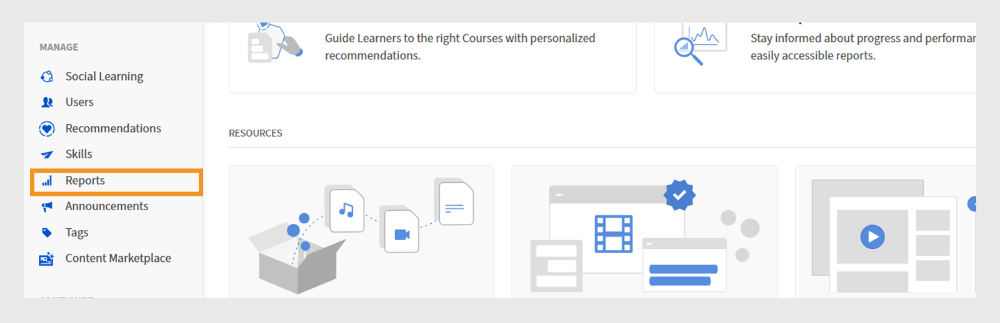
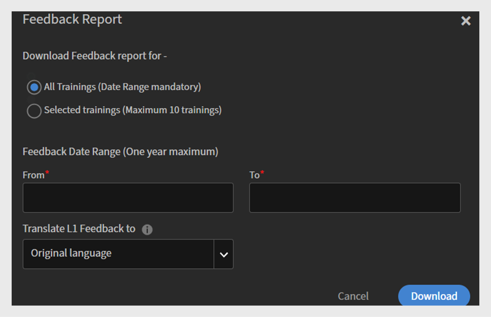

# 意見回饋報告

## 概觀

學習者完成學習物件後，Adobe Learning Manager中的意見報告會收集第1級（學習者意見回饋）和第3級（經理意見回饋）。 此報錶針對學習者及其經理的主觀與客觀回應，提供結構化的概覽。

此報表會追蹤學習者詳細資訊，例如，姓名、電子郵件、意見表單名稱、版本和語言，並擷取管理員定義問題的回應。 它也會記錄學習者對每個問題的選擇（例如，「強烈同意」、「同意」或「不同意」）。

## 用途與優點

* 提供可操作的深入分析，以改善課程品質和整體學習成效。
* 根據直接使用者的意見反應來調整導覽、步調和傳送方法。

## 使用案例

* **快速識別內容問題**：管理員可以發現低評等或重複的負面評論，並更新學習物件，而不需要等待支援票證或升級。
* **評估訓練成效**：團隊可以比較多個課程或版本的學習者意見回饋，以瞭解哪些學習物件表現良好，哪些可能需要重新作業。
* **透過意見回饋表單追蹤學習者參與情形**：管理員可檢視有多少學習者正在回答或略過問題，協助他們改善意見回饋表單以改善回應品質和完成率。

## 如何下載意見回饋報告

1. 以管理員身分登入Adobe Learning Manager。
2. 從左側導覽功能表中選取&#x200B;**[!UICONTROL Reports]**。
   
   _管理員首頁顯示下載報表時反白顯示的報表選項_

3. 在報表中選取&#x200B;**[!UICONTROL Custom Reports]**，然後選取&#x200B;**[!UICONTROL Excel Reports]**。
4. 選取&#x200B;**[!UICONTROL Feedback Report]**。
   
   _自訂報表區段會顯示選取「意見回饋報表」的選項，以存取學習者和管理者意見回饋資料_

5. 選取&#x200B;**[!UICONTROL All Trainings]**&#x200B;或&#x200B;**[!UICONTROL Selected Trainings]**以及日期範圍。 如果選取第二個選項，您最多可以新增10個課程或學習路徑並產生其意見反應報表。 此外，您最多可以產生一年的報表。
   
   _選取訓練範圍、設定日期範圍，並在下載前選擇翻譯選項，以設定意見回饋報告_

6. 選取翻譯L1意見回饋的語言。 當明確定義語言版本時，客觀問題及其回應會翻譯成選取的語言。 只有以選取的語言明確定義的主觀問題會出現在報表中。  主觀問題的回覆會以原始的回覆語言表示。
7. 選取&#x200B;**[!UICONTROL Download]**&#x200B;以下載報告。

## 意見報告包含什麼

下列是「帳戶」層次報表中的預設欄：

| 欄 | 說明 |
|----|----|
| 意見型別 | 指出意見是來自學習者(L1)還是經理(L3) |
| 使用者名稱 | 完成培訓的學習者姓名 |
| 使用者電子郵件 | 學習者的電子郵件地址 |
| 訓練ID | 指派給每個學習物件（課程、認證或學習路徑）的系統產生唯一識別碼 |
| 訓練名稱 | 已提交意見回饋的學習專案名稱 |
| 訓練例項 | 培訓的執行個體名稱（適用於多執行個體課程） |
| 訓練型別 | 培訓型別（課程、認證、學習路徑） |
| 意見回饋表單型別 | 使用的意見表單型別/類別（例如，混合式課程、自訂進度課程和教室課程） |
| 意見表單名稱 | 意見回饋表單的名稱 |
| 意見版本 | 意見回饋表單的版本號碼 |
| 目前經理 | 學習者的經理姓名 |
| 目前經理電子郵件 | 學習者經理的電子郵件地址 |
| 完成日期 | 學習者完成培訓的日期 |
| 意見反應日期 | 學習者提交意見回饋的日期 |
| L1意見原始語言 | 學習者最初提交L1意見反應所用的語言 |

根據意見表單中新增的四種型別問題，「帳戶」層級報表中會顯示下列欄：

| 欄 | 說明 |
|---|---|
| 課程效果 | 表單中顯示的預先定義課程效果問題 |
| 課程效果答案 | 學習者對課程成效問題的回應 |
| NPS問題1 | 第一個網路推廣者分數問題 |
| NPS範圍1 | 使用的評等比例（例如0至10） |
| NPS答案1 | NPS問題1的學習者評分 |
| 李克特問題1 | 第一個李克特量表問題 |
| 李克特答案1 | 對李克特問題1的回應 |
| 文字問題1 | 表單中的第一個開放式/文字問題 |
| 文字答案1 | 學習者對文字問題1的回應 |
| L3李克特量表問題1 | 使用評等表測量學習者的訓練後績效 |
| L3李克特量表回應1 | 經理對這個李克特規模問題的回應 |
| L3自由文字問題1 | 管理員可在L3意見回饋表單中新增任意文字問題；可設為選擇性或強制性 |
| L3任意文字回應1 | 經理對該自由文字問題的回應 |

>[!NOTE]
>
>帳戶層級報表也包含為學習者設定的任何作用中欄位。

「學習物件」層級報表中會顯示下列各欄：

| 欄 | 說明 |
|---|---|
| 學習者 | 學習者姓名 |
| 電子郵件 | 學習者的電子郵件地址 |
| 意見表單名稱 | 意見回饋表單的名稱 |
| 意見版本 | 意見回饋表單的版本號碼 |
| 學習者語言 | 學習者選取的語言 |

>[!NOTE]
>
>「學習物件」層級報表也包含新增至意見表單的問題。 每個問題都會顯示為欄標題，而學習者對這些問題的回應會顯示於底下的對應列中。
