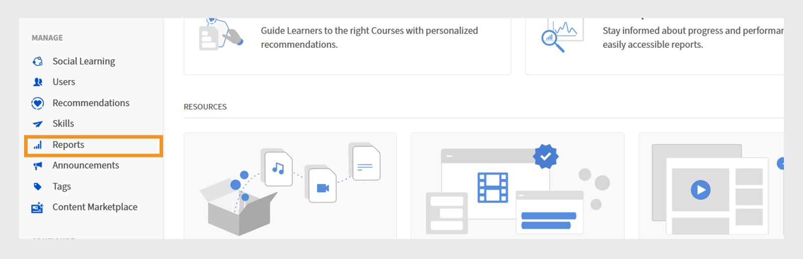
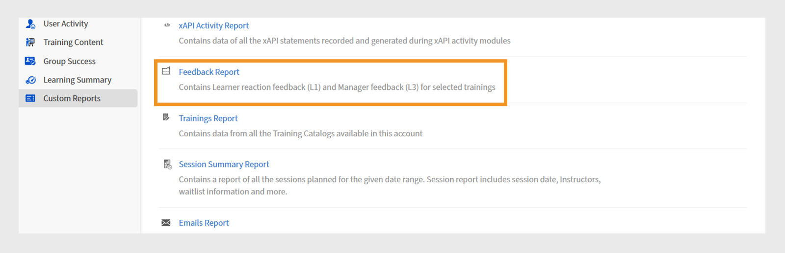
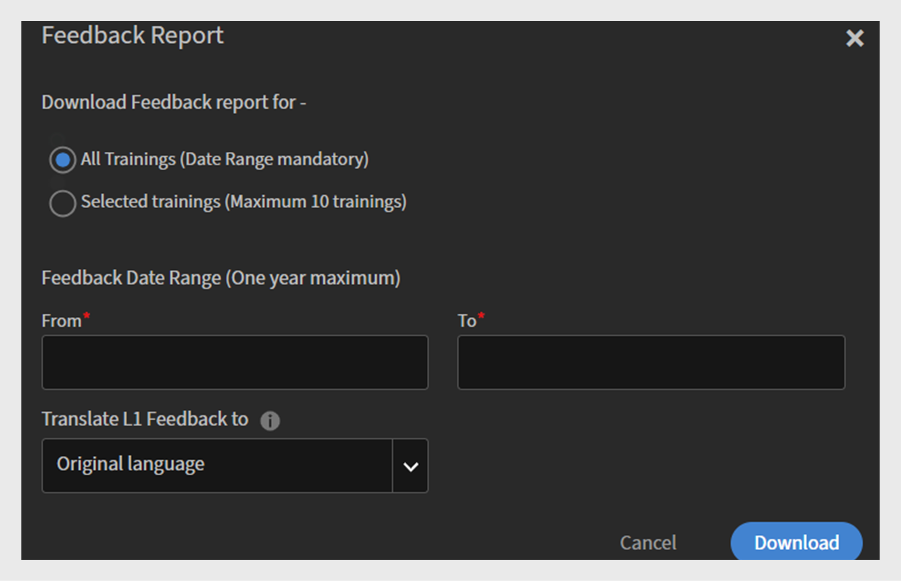

# 回饋報告

## 概觀

Adobe Learning Manager 中的回饋報告會在學習者完成學習物件後，收集第一級（學習者回饋）與第三級（主管回饋）。 本報告呈現了學習者及其管理者主觀與客觀回應的結構化概述。

報告追蹤學習者細節，如姓名、電子郵件、回饋表單名稱、版本及語言，並擷取管理員定義問題的回應。 它也會記錄學習者對每個問題的選擇（例如：強烈同意、同意或不同意）。

## 目的與效益

* 提供可行的見解，以提升課程品質及整體學習成效。
* 根據使用者的直接回饋，優化導航、節奏與傳遞方式。

## 使用案例

* **快速**&#x200B;識別內容問題：管理員能發現低評分或反覆的負面評論，無需等待支援單或升級通知即可更新學習物件。
* **衡量訓練成效**：團隊可以比較不同課程或版本的學習者回饋，了解哪些學習實體表現良好，哪些可能需要重新調整。
* **透過回饋表**&#x200B;單追蹤學習者參與度：管理員可以看到有多少學習者回答或跳過問題，幫助他們優化回饋表單，提升回應品質與完成率。

## 如何下載 回饋報告

1. 以管理員身份登入 Adobe Learning Manager。
2. 從左側導覽選單選擇 **[!UICONTROL Reports]** 。
   
   _管理員首頁會標示「報告」選項以下載報告_

3. 在報告中選擇 **[!UICONTROL Custom Reports]** ，然後選擇 **[!UICONTROL Excel Reports]**。
4. 選擇 **[!UICONTROL Feedback Report]**。
   
   _自訂報告區塊顯示選擇回饋報告以存取學習者與經理回饋資料的選項_

5. 選擇 **[!UICONTROL All Trainings]** 或 **[!UICONTROL Selected Trainings]**，並選擇日期範圍。 若選擇第二個選項，最多可累積10門課程或學習路徑並產生回饋報告。 此外，你可以產生長達一年的報告。
   
   _在下載前，請先選擇培訓範圍、設定日期範圍，並選擇翻譯選項來設定回饋報告_

6. 選擇要將 L1 回饋轉換成哪種語言。 當明確定義該語言版本時，客觀問題及其回應會被翻譯成所選語言。 報告中僅出現在所選語言中明確定義的主觀問題。  對主觀問題的回答會以原始的回應語言呈現。
7. 選擇 **[!UICONTROL Download]** 下載報告。

## 回饋報告包含哪些內容

以下是帳戶層級報告中的預設欄位：

| 柱狀 | 說明 |
|----|----|
| 回饋類型 | 表示回饋是來自學習者（第一語言）還是經理（第三語言） |
| 使用者名稱 | 完成訓練的學員姓名 |
| 使用者電子郵件 | 學習者的電子郵件地址 |
| 訓練識別 | 系統生成的唯一識別碼，指派給每個學習對象（課程、認證或學習路徑） |
| 訓練名稱 | 提交回饋的學習題目名稱 |
| 訓練實例 | 訓練實例名稱（多實例課程） |
| 訓練類型 | 訓練類型（課程、認證、學習路徑） |
| 回饋表單類型 | 所使用的回饋表單類型/類別（例如，混合課程、自學課程及課堂課程） |
| 回饋表單名稱 | 回饋表單的名稱 |
| 回饋版本 | 回饋表單的版本號 |
| 現任經理 | 學習者的經理姓名 |
| 現任經理電子郵件 | 學習者經理的電子郵件地址 |
| 完工日期 | 學習者完成訓練的日期 |
| 回饋日期 | 學習者提交回饋的日期 |
| L1 回饋原始語言 | 學習者最初提交母語回饋的語言 |
| L3李克特量表問題1 | 使用評分量表衡量學習者訓練後的表現 |
| L3李克特量表反應1 | 經理對這個李克特量表問題的回應 |
| L3 自由文本問題 1 | 免費問題新增於主管的 L3 回饋表單;可設定為可選或強制 |
| L3 自由文字回應 1 | 經理對那個自由文字問題的回應 |

根據回饋表單新增的四種問題類型，帳戶層級報告中出現以下欄位：

| 柱狀 | 說明 |
|---|---|
| 課程效能 | 預先定義的課程效能問題顯示在表格中 |
| 課程效能答案 | 學習者對課程成效問題的回應 |
| NPS 問題 1 | 第一個淨推薦值問題 |
| 國家公園管理局範圍1 | 所使用的評分量表（例如，0到10） |
| 國家公園管理局回答1 | NPS 第一題學習者的評分 |
| 李克特問題一 | 第一個李克特量表問題 |
| 李克特回答一 | 對李克特問題1的回應 |
| 文字問題一 | 表格中第一個開放式/文字問題 |
| 文字答案 1 | 學習者對文本問題1的回應 |

>[!NOTE]
>
>帳戶層級報告也包含為學習者設定的任何活躍欄位。

## 下載學習物件層級報告

下載學習物件層級報告：

1. 以管理員身份登入 Adobe Learning Manager。
2. 從左側導覽選單選擇 **[!UICONTROL Courses]** 。
3. 選擇任一課程，然後選擇 **[!UICONTROL View Course]**。
4. 選擇 **[!UICONTROL L1 Feedback]**。
5. 選擇 **[!UICONTROL Export Report]** ，然後選擇 **[!UICONTROL OK]**。

以下欄位出現在學習物件層級報告中：

| 柱狀 | 說明 |
|---|---|
| 學習者 | 學習者姓名 |
| 電子郵件 | 學習者的電子郵件地址 |
| 回饋表單名稱 | 回饋表單的名稱 |
| 回饋版本 | 回饋表單的版本號 |
| 學習者語言 | 學習者選擇的語言 |

>[!NOTE]
>
>學習物件層級報告也包含回饋表單中新增的問題。 每個問題以欄頭形式出現，學習者對這些問題的回答會顯示在下方對應的列中。
