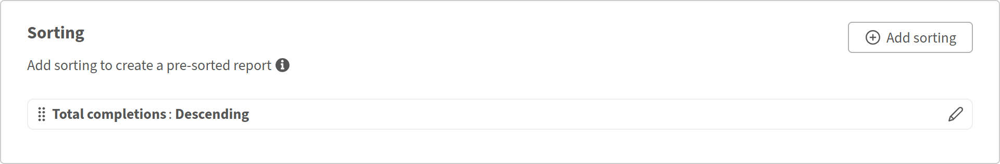

# 用報告建構器檢視講師表現

## 概觀

本報告協助培訓經理辨識哪些講師最活躍、接觸到多少學習者，以及有多少學習者完成了他們所提供的課程。

## 建立教師績效報告

1. 啟動報表建器並選擇 **建立報表**。
2. 輸入一個名稱，例如 **教練效率**。
3. 從模組資料集新增&#x200B;**講師姓名**&#x200B;**。**
4. 從模組資料集新增&#x200B;**模組 ID**&#x200B;**。**&#x200B;你會把這些數據彙總成計入會次。
5. 從模組逐字稿資料集新增&#x200B;**狀態**&#x200B;**。**&#x200B;你會用 count if 來計算完成次數。
6. 選擇&#x200B;**「教師名稱**&#x200B;分&#x200B;**&#x200B;**&#x200B;組」。
7. 套用 **計數** 到 **模組 ID**。 輸入別名 Total sessions。
8. 若為&#x200B;**狀態**，請計算&#x200B;**&#x200B;**，選擇已完成。輸入別名： **總完成數**。
9. 若要同時顯示總註冊人數，請再次新增 **狀態** 。 如果未開始，請應用 **計數** 。 輸入別名 總登記人數。

   

10. 篩選 **講師姓名** 不要清空。

    

11. 依總完成次數&#x200B;**排序**，先列出表現最佳的教練。

    

12. 選擇 **儲存報告** 並選擇 **動作** > **下載** 以下載報告。

下載的報告透過比較每位講師的總訓練課程、學習完成次數及未啟動報名次數，總結講師效率，協助評估參與度、完成度及潛在的訓練後續需求。

## 最佳實務

* 利用目錄標籤將講師報告範圍設定為特定事業單位、地點或課程。 這比單純用目錄名稱篩選更精確。
* 新增日期篩選器，例如 **過去90天的登記日期** ，將報告範圍限定為近期期間，而非所有時間。
* 請依有意義的指標排序，例如 **總完成次數** ，而非依教官名稱排序，這樣表現差異就能立即顯現。
