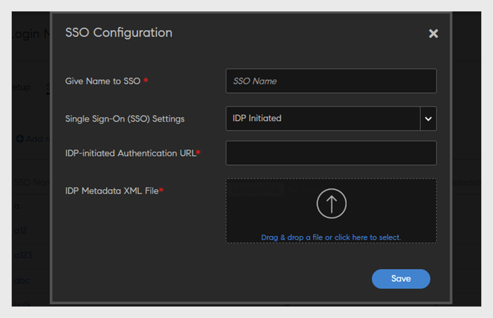

# 透過SAML設定介面語言

Adobe Learning Manager (ALM)現在接受語言的SAML屬性。 然後此屬性會對映至使用者的介面和內容語言設定，確保與LMS以他們偏好的語言順利互動。 這些語言設定的組態是透過Identity and Access Management (IAM)平台管理，並利用SAML進行單一登入(SSO)。 這同時支援服務提供者(SP)起始和身分提供者(IdP)起始的登入，讓使用者能夠檢視使用他們所選語言的介面和內容。 工作流程如下：

1. 在Okta中建立應用程式
2. 在Okta中新增使用者
3. 在ALM中設定SSO

## 在Okta中建立應用程式

若要在Okta中建立應用程式，請遵循下列步驟：

1. 使用貴公司的電子郵件在Okta中建立開發人員帳戶，並登入您的帳戶。
2. 選取&#x200B;**[!UICONTROL Applications]** > **[!UICONTROL Create App Integration]**。
3. 選取&#x200B;**[!UICONTROL SAML 2.0]**，然後選取&#x200B;**[!UICONTROL Next]**。
4. 輸入應用程式的名稱，然後選取下一步。
5. 設定下列欄位：

   * **[!UICONTROL Single Sign-On URL]**：輸入您要連結應用程式的特定網域URL (例如，[https://learningmanagerstage.adobe.com/saml/SSO](https://learningmanagerstage.adobe.com/saml/SSO))。 視需要變更環境URL。
   * **[!UICONTROL Audience URI (SP Entity ID)]**：使用與上述相同的環境URL。
   * **[!UICONTROL Name ID Format]**：選取電子郵件地址。
   * **[!UICONTROL Application Username]**：選取Okta使用者名稱。

6. 在「屬性陳述式」(Attribute Statements)下，新增下列（或視需要新增其他欄位）：
   * **名稱**：地區設定
   * **名稱格式**：未定義
   * **值**： user.locale

7. 選取「下一步」，然後選取「完成」。
8. 完成後，向下捲動至SAML簽署憑證：

   * 尋找狀態為&#x200B;**[!UICONTROL Active]**&#x200B;的列。
   * 選取&#x200B;**[!UICONTROL Actions]** > **[!UICONTROL View IdP Metadata]**。
   * 這會在新標籤中開啟XML檔案。 複製XML程式碼並將其儲存為本機.xml檔案。

## 在Okta中新增使用者

若要在Okta中建立使用者，請執行下列步驟：

1. 選取&#x200B;**[!UICONTROL Directory]** > **[!UICONTROL People]**，然後選取&#x200B;**[!UICONTROL Add Person]**。
2. 輸入使用者的必要詳細資料，並選取&#x200B;**[!UICONTROL Save]**。
3. 搜尋並選取新使用者的使用者名稱。
4. 選取&#x200B;**[!UICONTROL Assign Application]**。
5. 選取您先前建立的應用程式，然後選取&#x200B;**[!UICONTROL Save]**。
6. 瀏覽至使用者的設定檔，然後選取&#x200B;**[!UICONTROL Edit]**。
7. 在地區設定欄位中，輸入必要的值（例如fr_FR、en_US）並選取&#x200B;**[!UICONTROL Save]**。

## 在ALM中設定SSO

若要在ALM中設定SSO，請遵循下列步驟：

1. 以管理員身分登入。
2. 選取&#x200B;**[!UICONTROL Settings]** > **[!UICONTROL Login Methods]**。
3. 前往&#x200B;**[!UICONTROL Single Sign-On (SSO) Configuration]**&#x200B;標籤。
4. 選取&#x200B;**[!UICONTROL Add new SSO configuration]**。

   
   _在ALM_&#x200B;中新增sso

5. 設定下列詳細資料並選取「儲存」。
   * 輸入設定的名稱。
   * 從&#x200B;**[!UICONTROL Single Sign-On (SSO) Settings]**&#x200B;下拉式清單中選取&#x200B;**[!UICONTROL IDP Initiated]**。
   * 針對&#x200B;**[!UICONTROL IDP-Initiated Authentication URL]**：

      * 開啟您先前下載的中繼資料XML檔案。
      * 搜尋位置值並加以複製。
      * 將此值貼到IDP啟動的驗證URL欄位中。

   * 針對&#x200B;**[!UICONTROL Metadata XML File]**：上傳您先前下載的.xml檔案。

6. 返回&#x200B;**[!UICONTROL Setup]**&#x200B;標籤。
7. 從下拉式清單中選取&#x200B;**[!UICONTROL Single Sign-On Configuration]**。
8. 在&#x200B;**[!UICONTROL SSO Setup]**&#x200B;下拉式清單中，選取您先前建立的組態名稱。
9. 選取&#x200B;**[!UICONTROL Save]**。

## 使用者登入和語言設定

當使用者透過SSO使用憑證登入時，從IDP傳遞的語言屬性對應到使用者介面和ALM中的內容語言欄位。 語言設定會立即反映在使用者介面和內容中，不會有任何快取時間。

使用者可以在使用者設定檔區段中手動更新其語言設定。 這些手動更新的語言偏好設定將維持有效，且未來登入期間不會被IDP設定覆寫。

如果從ALM軟刪除使用者，則語言設定將保留在資料庫中。 再次新增相同使用者時，將還原先前設定的語言。

管理員可以檢查使用者活動、學習摘要和合規性儀表板報告，以取得特定語言的詳細資訊。

## 透過SAML登入時使用者語言偏好設定更新

Adobe Learning Manager是多語言平台，可透過介面、內容和課程模組，以多種方式支援學習者的語言偏好設定，所有功能都提供多種語言版本。

透過此增強功能，Adobe Learning Manager改善了原生平台使用者的即時使用者布建功能。 當新使用者首次建立帳戶並登入時，他們的語言偏好設定會被準確地擷取並自動套用。

### 主要優點

* 登入期間自動更新使用者的語言偏好設定。
* 以使用者偏好的語言顯示介面和內容，以提供個人化體驗。
* 與SAML驗證流程緊密整合。

使用者透過SAML登入時，會根據登入過程中提供的資訊檢查並更新其語言偏好設定（介面和內容語言）。

此功能與SAML登入程式整合，可順暢地擷取和更新使用者的語言偏好設定。
