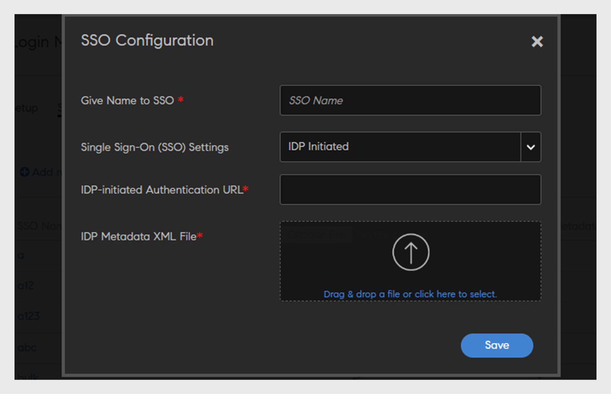

# 透過 SAML 建立介面語言

Adobe Learning Manager （ALM） 現在接受語言的 SAML 屬性。 此屬性隨後會映射到使用者的介面與內容語言設定，確保以偏好語言與 LMS 順暢互動。 這些語言設定的配置透過身份與存取管理（IAM）平台管理，採用 SAML 進行單點登入（SSO）。 這支援由服務提供者（SP）發起的登入，也支援身份提供者（IdP）發起的登入，讓使用者能以自己選擇的語言查看介面與內容。 工作流程如下：

1. 在 Okta 建立應用程式
2. 在 Okta 新增使用者
3. 在 ALM 中設定 SSO

## 在 Okta 建立應用程式

要在 Okta 中建立應用程式，請依照以下步驟操作：

1. 用公司電子郵件在 Okta 建立開發者帳號並登入。
2. 選擇 **[!UICONTROL Applications]** > **[!UICONTROL Create App Integration]**。
3. 選擇 **[!UICONTROL SAML 2.0]** ，然後選擇 **[!UICONTROL Next]**。
4. 輸入應用程式名稱並選擇「下一頁」。
5. 請配置以下欄位：

   * **[!UICONTROL Single Sign-On URL]**： 輸入你想連結應用程式的特定網域 URL（例如 [https://learningmanagerstage.adobe.com/saml/SSO](https://learningmanagerstage.adobe.com/saml/SSO)）。 必要時更改環境網址。
   * **[!UICONTROL Audience URI (SP Entity ID)]**： 請使用與上述相同的環境網址。
   * **[!UICONTROL Name ID Format]**： 選擇電子郵件地址。
   * **[!UICONTROL Application Username]**： 選擇 Okta 使用者名稱。

6. 在屬性陳述中，新增以下欄位（或視需要新增欄位）：
   * **名稱**：地點
   * **名稱格式**：未定義
   * **值**：user.locale

7. 選擇「下一步」，然後選擇「結束」。
8. 完成後，往下滑至SAML簽署憑證：

   * 找到狀態為 **[!UICONTROL Active]**&#x200B;的列。
   * 選擇 **[!UICONTROL Actions]** > **[!UICONTROL View IdP Metadata]**。
   * 這會開啟一個新的分頁中的 XML 檔案。 複製 XML 程式碼並存為本地的 .xml 檔案。

## 在 Okta 新增使用者

要在 Okta 中建立使用者，請依照以下步驟操作：

1. 選擇 **[!UICONTROL Directory]** > **[!UICONTROL People]** ，然後選擇 **[!UICONTROL Add Person]**。
2. 輸入使用者所需的資料並選擇 **[!UICONTROL Save]**。
3. 搜尋並選擇新使用者的使用者名稱。
4. 選擇 **[!UICONTROL Assign Application]**。
5. 選擇你之前建立的應用程式，然後選擇 **[!UICONTROL Save]**。
6. 前往使用者的個人檔案並選擇 **[!UICONTROL Edit]**。
7. 在區域欄位輸入所需值（例如 fr_FR、en_US），並選擇 **[!UICONTROL Save]**。

## 在 ALM 中設定 SSO

要在 ALM 中設定單點登入，請依照以下步驟操作：

1. 以管理員身份登入。
2. 選擇 **[!UICONTROL Settings]** > **[!UICONTROL Login Methods]**。
3. 點選 **[!UICONTROL Single Sign-On (SSO) Configuration]** 分頁。
4. 選擇 **[!UICONTROL Add new SSO configuration]**。

   
   _在 ALM 中加入 SSO_

5. 請設定以下細節並選擇儲存。
   * 輸入配置名稱。
   * 從下拉選單中&#x200B;**[!UICONTROL Single Sign-On (SSO) Settings]**&#x200B;選擇&#x200B;**[!UICONTROL IDP Initiated]**。
   * 對於 **[!UICONTROL IDP-Initiated Authentication URL]**：

     * 打開你之前下載的元資料 XML 檔案。
     * 搜尋位置值並複製它。
     * 將此值貼入 IDP 發起的認證網址欄位。

   * 例如 **[!UICONTROL Metadata XML File]**：上傳你之前下載的.xml檔案。

6. 回到 **[!UICONTROL Setup]** 分頁。
7. 從下拉選單中選擇 **[!UICONTROL Single Sign-On Configuration]**。
8. 在 **[!UICONTROL SSO Setup]** 下拉選單中，選擇你之前建立的設定名稱。
9. 選擇 **[!UICONTROL Save]**。

## 使用者登入與語言設定

當使用者透過 SSO 登入憑證時，從 IDP 傳遞的語言屬性會映射到使用者的介面及內容語言欄位。 語言設定會立即反映在使用者介面和內容中，無需快取時間。

使用者可以在使用者設定檔區段手動更新語言設定。 這些手動更新的語言偏好設定將持續生效，未來登入時不會被 IDP 設定覆蓋。

若使用者被軟刪除，語言設定將保留在資料庫中。 當同一使用者再次加入時，先前設定的語言會被恢復。

管理員可查詢使用者活動、學習摘要及合規儀表板報告，以取得語言專屬細節。

## 透過 SAML 登入時更新使用者語言偏好

Adobe Learning Manager 是一個多語言平台，透過介面、內容及課程模組，以多種方式支援學習者的語言偏好，且皆提供多種語言版本。

透過這項強化，Adobe Learning Manager 改善了原生平台使用者的即時用戶配置。 當新用戶首次建立帳號並登入時，他們的語言偏好會被準確捕捉並自動套用。

### 主要效益

* 登入時自動更新使用者的語言偏好。
* 透過以使用者偏好的語言顯示介面與內容，提供個人化的體驗。
* 無縫整合於 SAML 認證流程中。

使用者透過 SAML 登入時，會根據登入過程中提供的資訊檢查並更新其語言偏好（介面與內容語言）。

此功能整合於 SAML 登入流程，無縫捕捉並更新使用者的語言偏好。
