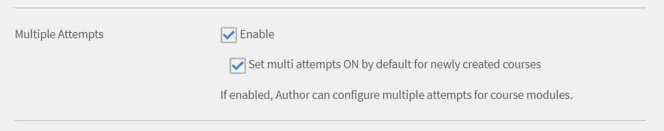
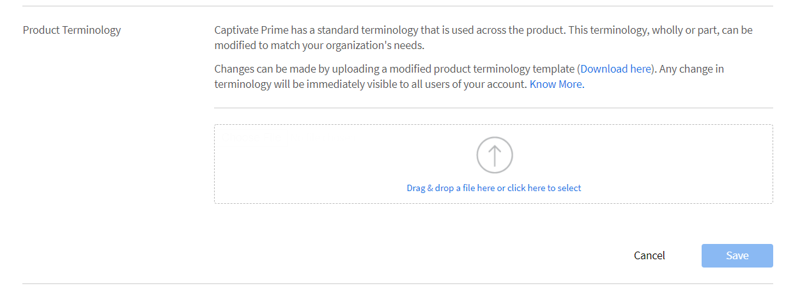
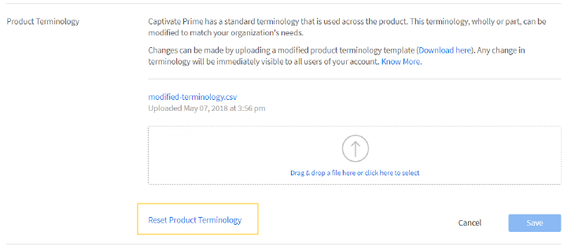
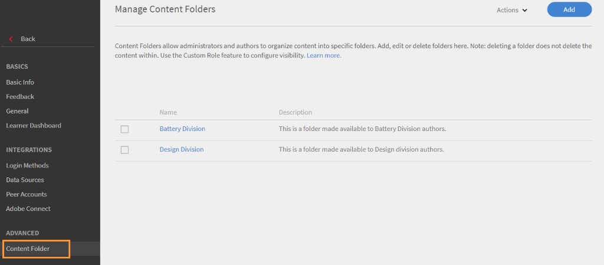
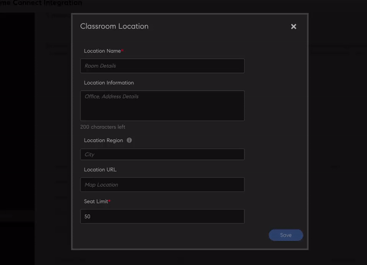
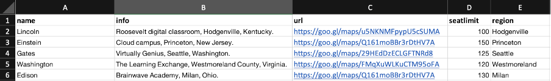

# 設定

瞭解您可以設定為管理員的Learning Manager帳戶設定。

您可以變更管理員設定檔設定，並更新帳戶設定。 檢視您的設定檔資訊、新增/變更設定檔像片，以及修改 **[!UICONTROL About me]** 內容。 更新您的公司資訊、設定使用者的登入方法，以及透過帳戶設定設定設定連線整合。

## 設定您的AdobeLearning Manager

此培訓會擷取帳戶層級設定的基本知識。

如果您無法啟動培訓，請寫信至 <almacademy@adobe.com>.

## 帳戶設定 {#accountsettings}

若要更新貴組織的帳戶設定，請按一下 **[!UICONTROL Settings]** 在左窗格中。

**基本資訊（公司資訊）**

按一下 **[!UICONTROL Change]** 在頁面上，並編輯國家/地區、時區、地區設定和財政年度設定。

**設定連絡管理員**

如果您想要新增或變更組織的支援管理員電子郵件地址，您可以按一下 **[!UICONTROL General]** 在左窗格中。 按一下 **[!UICONTROL Change]** 相鄰於 **[!UICONTROL Support Email ID]** 並新增電子郵件id。 當學習者點按時，系統會傳送電子郵件給這些管理員 **[!UICONTROL Contact Admin]** 位於頁面頁尾。

新增其他以分號作為分隔符號的電子郵件ID。

**登入方法**  — 管理員可選擇您的內部或外部使用者存取帳戶的模式。

* **內部使用者：** 對於內部使用者，您可以將Adobe ID或單一登入設定為登入模式。
* **外部使用者：** 對於外部使用者，您可以設定Adobe ID或單一登入或Learning Manager ID。

如果您選擇「Learning Manager ID」，外部使用者可在建立Learning Manager使用者名稱和密碼後登入此帳戶。

>[!NOTE]
>
>如果設定了多個外部設定檔，則所有設定檔都可以有任一型別的登入。 例如，如果登入型別為Adobe ID，則所有設定檔都必須僅使用Adobe ID登入。 每個設定檔不能有各自的登入型別。

您可以使用Adobe ID或使用單一登入存取Learning Manager應用程式。 單一登入是一種機制，可讓使用者驗證一次，並多次存取多個應用程式。 組織不強制進行此設定。 如果貴組織擁有以SAML 2.0為基礎的SSO提供者，則可用來設定Learning Manager應用程式。 您的組織層級和Learning Manager應用程式需要此設定。 如果您選擇使用SSO，請聯絡Adobe支援以接收設定指示

**意見反應**

按一下 **[!UICONTROL Feedback]** ，設定問卷以取得學習者完成課程後的意見反應。 請參閱 [課程功能說明內容](courses.md) 建立L1和L3意見反應時。

**多次嘗試**

選取 **[!UICONTROL Settings]** > **[!UICONTROL General]** > **[!UICONTROL Multiple Attempts]**.

如果您啟用「多次嘗試」核取方塊，作者可以為互動式電子學習課程或模組設定「多次嘗試」。選取第二個核取方塊時，管理員可以為任何新建立的互動式電子學習課程預設設定「無限嘗試」。

*選取多次嘗試核取方塊*

**課程稽核**

按一下 **[!UICONTROL General]** 從左窗格中，選取「課程調節」選項以啟用「課程調節」功能。 若要進一步瞭解此功能，請參閱 [課程稽核](courses.md#main-pars_header_1879001177).

**討論區**

如果您啟用「討論區」核取方塊，則學習者和講師可使用學習者應用程式中「課程」頁面的「討論」標籤張貼課程評論。 不過，如果課程等級設定指出未選取此功能，則課程等級設定會優先於管理員設定。

**學習者控制面板**

從左窗格中，按一下「學習者控制面板」。 此頁面可讓您選擇要顯示在學習者頁面上的Widget。 選取您要在學習者頁面中啟用的Widget。 未選取的Widget不會出現在學習者頁面。

**Adobe Connect**

按一下 **[!UICONTROL Adobe Connect]** 在左窗格中設定Adobe Connect帳戶以託管虛擬教室工作階段。 如需詳細資訊，請參閱  [Adobe Connect](adobeconnect-integration.md) 功能說明。

## 一般設定 {#general}

啟用或停用下列設定：

<table>
 <tbody>
  <tr>
   <th>
    
<b>名稱</b>

    </th>
   <th>
    
<b>說明</b>

   </th>
  </tr>
  <tr>
   <td>顯示課程效果</td>
   <td>如果已啟用，學習者可以在課程圖磚上看到目前的課程成效。 此功能僅適用於課程。 學習計畫或憑證不支援星級評等。 它可用於課程和學習計畫，但不適用於認證。</td>
  </tr>
  <tr>
   <td>課程稽核</td>
   <td>如果啟用，所有課程變更都必須在學習者看到課程之前獲得管理員核准。</td>
  </tr>
  <tr>
   <td>討論區</td>
   <td>如果您啟用「討論區」核取方塊，則學習者和講師可使用學習者應用程式中「課程」頁面的「討論」標籤張貼課程評論。 不過，如果課程等級設定指出未選取此功能，則課程等級設定會優先於管理員設定。</td>
  </tr>
  <tr>
   <td>多次嘗試</td>
   <td>如果啟用，作者可以為課程模組設定多次嘗試。</td>
  </tr>
  <tr>
   <td>探索技能選項</td>
   <td>如果啟用，學習者可以探索同儕和領導技能，並訂閱他們選擇的技能。</td>
  </tr>
  <tr>
   <td>技能/標籤可見性</td>
   <td>對學習者顯示所有技能與標籤。 您可以顯示所有技能與標籤，或顯示已指派的技能與標籤，或學習者可見之目錄中的技能與標籤。</td>
  </tr>
  <tr>
   <td>學習物件的唯一識別碼</td>
   <td>如果已啟用，管理員或作者可以為每個學習物件新增唯一ID。</td>
  </tr>
  <tr>
   <td>顯示篩選面板</td>
   <td>
    
控制學習者應用程式中的使用者可以使用哪些篩選器面板來縮小搜尋結果。 選項如下：

    <ul>
     <li>目錄</li>
     <li>型別</li>
     <li>格式</li>
     <li>持續時間</li>
     <li>技能</li>
     <li>技能等級</li>
     <li>標記</li>
    </ul>
    
當學習者啟動學習者應用程式時，在「我的學習」和「目錄」區段中，學習者可以在各自的面板中看到篩選器。

    
<b>注意： </b>篩選器 <b>格式 </b>和 <b>持續時間 </b>預設為關閉，且在發佈後不會立即向學習者顯示。 管理員應該啟用它們。  
</td>
  </tr>
  <tr>
   <td>顯示目錄清單</td>
   <td>如果啟用，學習者可以看到他們可用的所有目錄清單。 學習者可以使用此功能來調整學習物件的顯示方式。</td>
  </tr>
  <tr>
   <td>產品術語</td>
   <td>Learning Manager有一個用於整個產品的標準術語。 修改術語以符合貴組織的需求。</td>
  </tr>
  <tr>
   <td>模組版本更新</td>
   <td>設定預設設定以更新內容。 您可從課程頁面修改每個內容的設定。</td>
  </tr>
  <tr>
   <td>自動註冊使用者</td>
   <td>如果啟用，新匯入的使用者會自動註冊。 依預設，使用者必須先手動註冊，然後才能開始使用Learning Manager。</td>
  </tr>
  <tr>
   <td>自動刪除內部使用者</td>
   <td>如果啟用，如果內部使用者在指定天數內未存取系統，則會自動刪除。 此功能適用於只有角色的使用者 <b>學習者</b>. 若要還原存取權，使用者必須連絡管理員。 </td>
  </tr>
  <tr>
   <td>顯示目錄標籤</td>
   <td>啟用後，管理員和作者可以設定目錄標籤和值，並將其連結至學習物件。</td>
  </tr>
  <tr>
   <td>學習者可檢視其分數</td>
   <td>如果啟用，學習者可以在學習者成績單中檢視其分數。</td>
  </tr>
  <tr>
   <td>摘要電子郵件</td>
   <td>
    
管理員可以啟用或停用傳送電子郵件給學習者。 管理員也能夠控制傳送電子郵件的頻率。

    <ul>
     <li>的 <b>作用中帳戶</b>，摘要電子郵件預設為停用，管理員可以手動啟用。</li>
     <li>的 <b>試用帳戶</b>，摘要電子郵件的選項將保持停用狀態，且管理員無法啟用此選項。</li>
    </ul>
    
如果功能已停用，則：

    <ul>
     <li>選項 <b>摘要電子郵件</b> 將會停用。</li>
     <li>學習者看不到摘要電子郵件訂閱的使用者設定。</li>
    </ul>
    
 如果已啟用該功能，則：

    <ul>
     <li>管理員可以啟用和修改摘要電子郵件選項。</li>
     <li>從 <b>設定檔設定 </b>在學習者應用程式上，學習者（不在DND清單中）可以選擇訂閱/取消訂閱摘要電子郵件。</li>
    </ul></td>
  </tr>
  <tr>
   <td>啟用訓練卡圖示 </td>
   <td>如果已啟用，在學習者應用程式的訓練卡上會顯示圖示。 </td>
  </tr>
  <tr>
   <td>頁尾連結</td>
   <td>
    
新增顯示為頁尾的連結或電子郵件ID。 您最多可以新增三個頁尾連結。

    
若要自訂頁尾上的連結，請執行下列步驟：

    <ol>
     <li>按一下 <b>新增更多</b>，在指定的欄位中輸入名稱，以及URL或電子郵件ID。 為URL加上前置詞http://或https://。</li>
     <li>若要在所有地區設定間重疊顯示變更，請按一下 <b>復寫</b>. 這可確保所有語言都可取得名稱和url。</li>
     <li>若要儲存變更，請按一下 <b>儲存</b>. 您可以看到確認變更的快顯訊息。 按一下「確定」後，頁尾會填入新加入的連結。</li>
    </ol>
    
此外，您可以：

    <ul>
     <li>按一下 <b>重設</b> 圖示可重設 <b>說明</b> 和 <b>聯絡管理員</b> 欄位。</li>
     <li>自訂所有語言頁尾的連結。 按一下 <b>語言</b> 下拉式清單，選取語言，然後新增 <b>名稱</b> 和 <b>URL</b> 在指定的欄位中。 儲存變更後，更新的連結會出現在頁尾中。 </li>
    </ul></td>
  </tr>
  <tr>
   <td>報表時區 </td>
   <td>
    
設定帳戶層級偏好設定以在下列時區匯出學習成績單：

    <ul>
     <li>UTC （預設行為）</li>
     <li>帳戶層級時區偏好設定</li>
    </ul>
    
使用工作API下載的學習者成績單也會在選取的時區下載資料。

    
<b>注意： </b>學習者成績單在發行後預計不會立即變更。 管理員可以從「管理員&gt;設定&gt;一般&gt;報表時區」進行此設定。
</td>
  </tr>
 </tbody>
</table>

<table border="0" cellpadding="0" cellspacing="0" width="1709">
 <tbody>
  <tr>
   <td height="20" width="147">名稱</td>
   <td>說明</td>
  </tr>
  <tr>
   <td height="20">顯示課程效果</td>
   <td>如果已啟用，學習者可以在課程圖磚上看到目前的課程成效。</td>
  </tr>
  <tr>
   <td height="20">課程稽核</td>
   <td>如果啟用，所有課程變更都必須在學習者看到課程之前獲得管理員核准。</td>
  </tr>
  <tr>
   <td height="20">討論區</td>
   <td>如果您啟用「討論區」核取方塊，則學習者和講師可使用學習者應用程式中「課程」頁面的「討論」標籤張貼課程評論。 不過，如果課程等級設定指出未選取此功能，則課程等級設定會優先於管理員設定。</td>
  </tr>
  <tr>
   <td height="20">多次嘗試</td>
   <td>如果啟用，作者可以為課程模組設定多次嘗試。</td>
  </tr>
  <tr>
   <td height="20">探索技能選項</td>
   <td>如果啟用，學習者可以探索同儕和領導技能，並訂閱他們選擇的技能。</td>
  </tr>
  <tr>
   <td height="20">技能/標籤可見性</td>
   <td>對學習者顯示所有技能與標籤。 您可以顯示所有技能與標籤，或顯示已指派的技能與標籤，或學習者可見之目錄中的技能與標籤。</td>
  </tr>
  <tr>
   <td height="20">學習物件的唯一識別碼</td>
   <td>如果已啟用，管理員或作者可以為每個學習物件新增唯一ID。</td>
  </tr>
  <tr>
   <td rowspan="10" height="191">顯示篩選面板</td>
   <td>控制學習者應用程式中的使用者可以使用哪些篩選器面板來縮小搜尋結果。 選項如下：</td>
  </tr>
  <tr>
   <td height="19">目錄</td>
  </tr>
  <tr>
   <td height="19">型別</td>
  </tr>
  <tr>
   <td height="19">格式</td>
  </tr>
  <tr>
   <td height="19">持續時間</td>
  </tr>
  <tr>
   <td height="19">技能</td>
  </tr>
  <tr>
   <td height="19">技能等級</td>
  </tr>
  <tr>
   <td height="19">標記</td>
  </tr>
  <tr>
   <td height="19">當學習者啟動學習者應用程式時，在「我的學習」和「目錄」區段中，學習者可以在各自的面板中看到篩選器。</td>
  </tr>
  <tr>
   <td height="20">注意：篩選器「格式」和「持續時間」預設為關閉，在發佈後不會立即向學習者顯示。 管理員應該啟用它們。 </td>
  </tr>
  <tr>
   <td height="20">顯示目錄清單</td>
   <td>如果啟用，學習者可以看到他們可用的所有目錄清單。 學習者可以使用此功能來調整學習物件的顯示方式。</td>
  </tr>
  <tr>
   <td height="20">產品術語</td>
   <td>Learning Manager有一個用於整個產品的標準術語。 修改術語以符合貴組織的需求。</td>
  </tr>
  <tr>
   <td height="20">模組版本更新</td>
   <td>設定預設設定以更新內容。 您可從課程頁面修改每個內容的設定。</td>
  </tr>
  <tr>
   <td height="20">自動註冊使用者</td>
   <td>如果啟用，新匯入的使用者會自動註冊。 依預設，使用者必須先手動註冊，然後才能開始使用Learning Manager。</td>
  </tr>
  <tr>
   <td height="20">自動刪除內部使用者</td>
   <td>如果啟用，如果內部使用者在指定天數內未存取系統，則會自動刪除。 此功能適用於只有學習者角色的使用者。 若要還原存取權，使用者必須連絡管理員。</td>
  </tr>
  <tr>
   <td height="20">顯示目錄標籤</td>
   <td>啟用後，管理員和作者可以設定目錄標籤和值，並將其連結至學習物件。</td>
  </tr>
  <tr>
   <td height="20">學習者可檢視其分數</td>
   <td>如果啟用，學習者可以在學習者成績單中檢視其分數。</td>
  </tr>
  <tr>
   <td rowspan="9" height="172">摘要電子郵件</td>
   <td>管理員可以啟用或停用傳送電子郵件給學習者。 管理員也能夠控制傳送電子郵件的頻率。</td>
  </tr>
  <tr>
   <td height="19">對於作用中帳戶，摘要電子郵件預設為停用，管理員可以手動啟用。</td>
  </tr>
  <tr>
   <td height="19">對於試用帳戶，摘要電子郵件的選項將保持停用狀態，管理員無法啟用此選項。</td>
  </tr>
  <tr>
   <td height="19">如果功能已停用，則：</td>
  </tr>
  <tr>
   <td height="19">摘要電子郵件選項將會停用。</td>
  </tr>
  <tr>
   <td height="19">學習者看不到摘要電子郵件訂閱的使用者設定。</td>
  </tr>
  <tr>
   <td height="19"> 如果已啟用該功能，則：</td>
  </tr>
  <tr>
   <td height="19">管理員可以啟用和修改摘要電子郵件選項。</td>
  </tr>
  <tr>
   <td height="20">在學習者應用程式上的「設定檔設定」中，學習者（不在DND清單中）可以選擇訂閱/取消訂閱摘要電子郵件。</td>
  </tr>
  <tr>
   <td height="20">啟用訓練卡圖示</td>
   <td>如果已啟用，在學習者應用程式的訓練卡上會顯示圖示。</td>
  </tr>
  <tr>
   <td rowspan="8" height="153">頁尾連結</td>
   <td>新增顯示為頁尾的連結或電子郵件ID。 您最多可以新增三個頁尾連結。</td>
  </tr>
  <tr>
   <td height="19">若要自訂頁尾上的連結，請執行下列步驟：</td>
  </tr>
  <tr>
   <td height="19">1.按一下「新增更多」，在指定的欄位中輸入名稱，以及URL或電子郵件識別碼。 為URL加上前置詞http://或https://。</td>
  </tr>
  <tr>
   <td height="19">2.若要在所有地區設定間重疊顯示變更，請按一下「復寫」。 這可確保所有語言都可取得名稱和url。</td>
  </tr>
  <tr>
   <td height="19">3.若要儲存變更，請按一下「儲存」。 您可以看到確認變更的快顯訊息。 按一下「確定」後，頁尾會填入新加入的連結。</td>
  </tr>
  <tr>
   <td height="19">此外，您可以：</td>
  </tr>
  <tr>
   <td height="19">按一下重設圖示以重設說明和聯絡管理員欄位中的預設值。</td>
  </tr>
  <tr>
   <td height="20">自訂所有語言頁尾的連結。 按一下「語言」下拉式清單，選取語言，然後在指定欄位中新增「名稱」和URL。 儲存變更後，更新的連結會出現在頁尾中。</td>
  </tr>
  <tr>
   <td rowspan="5" height="96">報表時區</td>
   <td> 設定帳戶層級偏好設定以在下列時區匯出學習成績單：</td>
  </tr>
  <tr>
   <td height="19">UTC （預設行為）</td>
  </tr>
  <tr>
   <td height="19">帳戶層級時區偏好設定</td>
  </tr>
  <tr>
   <td height="19">使用工作API下載的學習者成績單也會在選取的時區下載資料。</td>
  </tr>
  <tr>
   <td height="20">注意：在發行後，學習者成績單預設不會立即變更。 管理員可以從「管理員&gt;設定&gt;一般&gt;報表時區」進行此設定。</td>
  </tr>
  <tr>
   <td height="19">Badgr整合</td>
   <td>如果已啟用，學習者將能上傳其徽章至Badgr網站。 在客戶教育情境中，組織想要能夠「認證」其客戶，並給予他們機會透過社群媒體顯示這些憑證。 這促使學習者參加培訓並與他人分享其成就。 </td>
  </tr>
  <tr>
   <td height="135">
    
顯示評等
</td>
   <td>
    <ul>
     <li>如果選項 <b>課程效果</b> 啟用「 」，學習者將只能看到課程成效的值。</li>
     <li>如果選項 <b>星級評等</b> 如果啟用，學習者將只能檢視平均星級評等和已評等課程的學習者人數。 </li>
    </ul>
    
此功能僅適用於課程。 學習計畫或憑證不支援星級評等。  <b>注意： </b>此變更只會影響學習者應用程式。 

    
在所有其他應用程式（管理員、作者、管理員、自訂管理員、自訂作者）中，設定（星級評等/課程成效/停用顯示評等）的變更不會有任何影響。 

    
若為新帳戶， <b>顯示評等</b> 區段將具有選項 <b>星級評等</b> 預設為啟用。

    
針對現有帳戶，如果帳戶先前具有選項 <b>課程效果</b> 已啟用，則 <b>顯示評等</b> 區段將會啟用，並選取「課程成效」選項。 如果選項 <b>課程效果</b>s已停用，則 <b>顯示評等</b> 區段也會停用。 當 <b>顯示評等</b> 區段已啟用，選項 <b>星級評等</b> 預設為啟用。
</td>
  </tr>
 </tbody>
</table>

<table>
 <tbody>
  <tr>
   <td>
    
學習路徑
</td>
   <td>
    
如果選項 <b>啟用學習路徑的擴充功能</b> 如果啟用「 」，管理員就可以在學習路徑中加入學習路徑，並將這些學習路徑與課程結合。 選項是不可逆的。 
</td>
  </tr>
  <tr>
   <td>
    
講師管理 
</td>
   <td>
    
啟用此設定可限制在建立教室/虛擬教室工作階段時可選取的講師清單。 所有擁有講師許可權的使用者只能被指派為任何工作階段的講師。 此限制不適用於移轉工作流程。 

  </td>
  <tr>
    <td>
      
技能匯入

    </td>
    <td>
      
如果啟用，您可以選擇外部來源來匯入技能。 現有學習資源的技能將在初次執行期間匯入一次技能存放庫。 對於所有後續的學習資源匯入，技能將僅針對新匯入的專案匯入技能存放庫。
      啟用選項後，動作即不可逆。 您稍後無法停用或變更為其他來源。
      

    </td>
  </tr>
  </tr>
 </tbody>
</table>

>[!NOTE]
>
>一旦啟用技能匯入設定，帳戶配置將無法切換到Classic，即切換到Classic帳戶將在 **技能匯入** 選項已啟用。

## AI型建議

Learning Manager包括全新的學習者首頁，此首頁不但現代化、更具內容導向性，而且會根據學習者的偏好提供個人化內容。 以AI為基礎的學習建議旨在增強學習者的參與度，並找出和解決學習中的差距。

建議演演算法的設計目標是要納入多種輸入來源，包括Adobe從合作夥伴取得之職務角色、職稱和說明的產業資料。 然後，這些資料會用於訓練Adobe的AI演演算法，以便Learning Manager可以想出地圖，將業界公認的技能與職稱和/或職稱聯絡起來。 接著會成為建議演演算法的輸入之一

Learning Manager接著會使用主題模型演演算法來分析帳戶中的培訓內容，並將這些內容對應至技能。

Learning Manager會將同儕節點活動資料當作另一個訊號，以個人化的方式推動建議演演算法。 在此會使用諸如註冊、完成等活動以及學習者提供的任何明確回饋。

此外，Learning Manager會使用從個別學習者收集而來的明確與隱含資訊，進一步將建議個人化。 學習者將可透過註冊明確指出其興趣領域，而Learning Manager將會根據學習者參加培訓的方式以隱含方式收到此資訊。

最後，管理員也可以使用Learning Manager在定義同儕群組時應該考慮的學習者屬性，並實際強調特定使用者群組的培訓，來影響建議演演算法。

## 重新命名學習物件 {#renaminglearningobjects}

此功能僅提供英文版本。

管理員現在可以在Learning Manager中重新命名學習物件。 下列是可重新命名的術語。

模組\
課程\
學習計畫\
認證\
學習方案\
工作輔助\
目錄\
技能\
徽章\
宣告\
我的學習\
排行榜\
成效\
先決條件\
前期工作\
核心內容\
Testout\
自學\
混合\
教室\
虛擬教室\
活動

若要重新命名術語，請遵循下列步驟。

1. 以管理員身分，按一下 **[!UICONTROL Settings]** > **[!UICONTROL General]** > **[!UICONTROL Product Terminology]**. 產品術語選項隨即開啟。

   

   *重新命名產品術語*

1. 您可以下載範例CSV檔案，上傳已修改的產品術語範本，以進行變更。 若要下載範例CSV檔案，請按一下 **[!UICONTROL Download here]** 選項。
1. 下載的CSV檔案包含座標A中的物件名稱。在欄B中，選擇要指定給個別物件的名稱。 請注意，您需要更新以(|)分隔的單數及複數名稱形式。
1. 您可以選擇修改一或多個列。 您可以保留未修改的列，或在上傳它們之前將其從CSV檔案中移除。
1. 上傳修改過的CSV檔案並按一下 **[!UICONTROL Save]**. Learning Manager會重新整理以反映您的變更。
1. 若要重設為預設術語，請按一下 **[!UICONTROL Reset Product Terminology]**.

   

   *重設產品術語*

## 設定檔設定 {#profilesettings}

1. 按一下像片/帳戶旁右上角的下拉箭頭，然後選擇 **[!UICONTROL Profile Settings]**.
1. 在快顯對話方塊中，您可以透過將滑鼠懸停於上方並按一下滑鼠來新增/變更像片 **[!UICONTROL Edit]** 設定檔像片區域中。
1. 新增/修改 **[!UICONTROL About]** 按一下內容 **[!UICONTROL Edit]** 與它相鄰。
1. 按一下 **[!UICONTROL Save].**

## 內容資料夾 {#content-folder}

Learning Manager支援私人內容資料夾。 管理員可以使用「自訂角色」來設定私人內容資料夾，並將存取權提供給特定的自訂作者。 請注意，標準作者（也稱為完整作者）仍可存取帳戶中的所有內容。 因此，完整作者有權存取所有資料夾和所有內容。

管理員可設定內容資料夾。 設定後，作者才能看見內容資料夾，且可以將內容放置在一或多個資料夾中。

若要新增內容資料夾，請在管理員應用程式中按一下 **[!UICONTROL Settings]** > **[!UICONTROL Content Folder]**.

*變更內容資料夾設定*

### 資料夾

資料夾是內容的存放庫，是帳戶中可用的整個內容資料庫的子集，具有以下屬性：

* 只有管理員可以建立、編輯或刪除資料夾。
* 管理員只能控制對檔案夾的存取，以作為定義自訂管理員角色的一部分。
* 內容 **必須始終與至少一個資料夾相關聯**. 若要從開始，所有內容都將與公用資料夾相關聯，稍後可加以變更。
* 內容可以在建立時與多個資料夾相關聯，複製操作也可以進行這種關聯
* 帳戶內的所有資料夾名稱必須是唯一的，否則命名資料夾將會發生錯誤。

資料夾只會控制內容的可見性，不會建立內容的復本。 因此，編輯內容將會反映在所有關聯的資料夾中。

### 公用資料夾

帳戶中一律會有公用資料夾，且最初，所有內容都會成為此資料夾的一部分。 稍後，作者可以將內容從此資料夾移至其他資料夾。 公用資料夾有下列屬性：

* 依預設，所有型別的作者都可存取與此資料夾關聯的所有內容。
* 屬於公用資料夾的任何內容都不能屬於任何其他資料夾。 反之亦然。

此資料夾不能屬於可設定的角色定義。 因此，在可設定的角色定義中沒有公用資料夾，並不會限制存取公用資料夾。

### 私人資料夾

* 管理員建立的任何資料夾都是私人資料夾。

### 資料夾作業

**新增資料夾**

若要新增資料夾，請按一下 **[!UICONTROL Add]** 在視窗的右上角。

**刪除資料夾**

您也可以刪除資料夾。 選取要刪除的資料夾，按一下「動作」功能表，然後按一下 **[!UICONTROL Delete Folder]**.

>[!NOTE]
>
>當資料夾的所有關聯內容也與其他資料夾相關聯時，可以刪除該資料夾。 如果內容僅連結至要刪除的資料夾，請先將內容移至另一個資料夾，然後再刪除該資料夾。

## 教室位置

管理員可以使用此設定來建立和設定教室位置資料庫。 作者可以選取預先設定的位置來設定其教室活動。 從資料庫中選取位置，以自動填入位置資訊、URL和座位限制。

身為管理員，您可以：

### 匯入位置CSV

透過匯入位置的CSV檔案，在您的帳戶中新增位置。 CSV檔案必須包含「城市」欄。

### 新增位置

新增下列專案：

1. 地點名稱：輸入教室的名稱。
2. 地點資訊：輸入地點的相關資訊。
3. 地點區域：輸入的值會顯示為學習者的「培訓地點」篩選條件。
4. 位置URL：輸入位置的URL。
5. 座位限制：輸入房間的座位容量。

*新增教室位置*

您也可以在CSV的協助下新增位置。 CSV必須包含欄位：

* 名稱
* 資訊
* url
* seatlimit
* 區域

<!---->

### 設定 {#admin-classroom-settings}

選取 **編輯** 若要變更下列專案：

* **允許作者建立位置**：啟用後，作者建立的所有位置都會列在「所有位置」索引標籤下。 學習者也會在目錄和行事曆篩選器下看到這些位置。
* **允許作者修改和刪除位置**：啟用後，作者將能夠修改和刪除所有教室位置。 作者的修改會反映在整個平台中，包括報表。

## 常見問題 {#frequentlyaskedquestions}

+++如何為內容資料庫建立不同的資料夾？

按一下 **[!UICONTROL Settings]** > **[!UICONTROL Content Folder]**. 若要新增資料夾，請按一下 **[!UICONTROL Add]** 在右上角，並在對話方塊中，輸入資料夾的名稱和說明。

管理員可設定內容資料夾。 設定後，作者才能看見內容資料夾，且可以將內容放置在一或多個資料夾中。

如需詳細資訊，請參閱以下章節： [內容資料夾](settings.md#content-folder).
+++

+++如何為帳戶新增財政年度？

在 **[!UICONTROL Settings]** > **[!UICONTROL Basic Info]**，按一下 **[!UICONTROL Change]**. 從 **[!UICONTROL Financial year starts from]** 下拉式清單，選取月份。
+++
