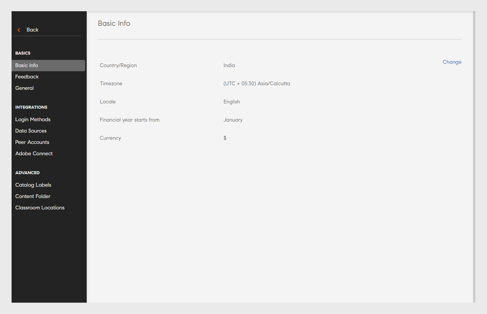

# 設定

瞭解您可以設定為管理員的Learning Manager帳戶設定。

您可以變更管理員設定檔設定，並更新帳戶設定。 檢視您的設定檔資訊、新增/變更設定檔像片，以及修改&#x200B;**[!UICONTROL About me]**&#x200B;內容。 更新您的公司資訊、設定使用者的登入方法，以及透過帳戶設定設定設定連線整合。

## 設定您的Adobe Learning Manager

此培訓擷取帳戶層級設定的基本內容。

如果您無法啟動培訓，請寫信給 <almacademy@adobe.com>。

## 帳戶設定 {#accountsettings}

若要更新組織的帳戶設置，請按下 **[!UICONTROL Settings]** 左側窗格。

**基本資訊 （公司資訊）**

單擊 **[!UICONTROL Change]** 頁面並編輯國家/地區、時區、區域設置和財政年度設置。

**配置連絡人管理**

如果您想要新增或變更貴組織的支援管理員電子郵件地址，請按一下左窗格上的「**[!UICONTROL General]**」進行設定。 按一下&#x200B;**[!UICONTROL Support Email ID]**&#x200B;旁的&#x200B;**[!UICONTROL Change]**&#x200B;並新增電子郵件ID。 當學習者按一下頁面頁尾的&#x200B;**[!UICONTROL Contact Admin]**&#x200B;時，系統會將電子郵件傳送給這些管理員。

新增其他以分號作為分隔符號的電子郵件ID。

**登錄方法** - 管理員可以選擇內部或外部用戶訪問帳戶的模式。

* **內部使用者：** 對於內部使用者，您可以將Adobe ID或單點登錄設置為登錄模式。
* **外部使用者：**&#x200B;對於外部使用者，您可以設定Adobe ID、單一登入或Learning Manager ID。

如果您選擇Learning Manager ID，外部使用者可在建立其Learning Manager使用者名稱和密碼後登入此帳戶。

>[!NOTE]
>
>如果設定了多個外部配置檔，則所有配置檔都可以具有一種類型的登入。 例如，如果登入類型為 Adobe ID，則所有使用者檔案都必須僅使用 Adobe ID 來登入。 每個設定檔不能有其單獨的登入類型。

可以使用Adobe ID或使用單一登錄應用程式訪問學習管理器。 單點登錄是一種機制，允許用戶進行一次身份驗證並多次訪問多個應用程式。 此配置對組織不是必需的。 如果您的組織有以SAML 2.0為基礎的SSO提供者，您可以使用它來設定Learning Manager應用程式。 您的組織層級和Learning Manager應用程式需要此設定。 如果您選擇使用SSO，請聯絡Adobe支援以接收設定指示

**意見反應**

按一下左窗格上的&#x200B;**[!UICONTROL Feedback]**&#x200B;設定問卷，以便讓學習者完成課程後取得意見反應。 請參閱[課程功能說明內容](/help/migrated/administrators/feature-summary/courses.md#add-l1-and-l3-feedback)，瞭解如何建立L1與L3意見反應。

**多次嘗試**

選擇 **[!UICONTROL Settings]** > **[!UICONTROL General]** > **[!UICONTROL Multiple Attempts]**。

如果啟用「多次嘗試」複選框，則作者可以為互動式電子學習課程或模組設置「多次嘗試」。選中第二個複選框后，管理員可以預設為任何新創建的互動式電子學習課程設置“無限次嘗試”。

*選取多次嘗試核取方塊*

**課程稽核**

按一下左窗格中的&#x200B;**[!UICONTROL General]**，然後選取[課程調節]選項以啟用[課程調節]功能。 若要進一步瞭解此功能，請參閱[課程稽核](courses.md#main-pars_header_1879001177)。

**討論區**

如果啟用“討論区”複選框，則學習者和教師可以使用“學習者”應用程式中的“課程”頁面中的“討論”標籤貼文課程評論。 但是，如果課程級別設置指示未選擇此功能，則課程級別設置優先於管理員設置。

**學習者儀錶板**

在左窗格中，按兩下學習者儀錶板。 此頁面允許您選擇要在學習者頁面上顯示的小部件。 選擇要在學習者頁面中啟用的小組件。 未選擇的小部件將不會顯示在學習者頁面中。

**Adobe Connect**

按一下左窗格上的&#x200B;**[!UICONTROL Adobe Connect]**，設定Adobe Connect帳戶以主持虛擬教室工作階段。 如需詳細資訊，請參閱[Adobe Connect](adobeconnect-integration.md)功能說明。

## 一般設定 {#general}

啟用或停用下列設定：

<table>
 <tbody>
  <tr>
   <th>
    
<b>名稱</b>

    </th>
   <th>
    
<b>說明</b>

   </th>
  </tr>
  <tr>
   <td>顯示課程效果</td>
   <td>如果啟用，學習者可以在課程磁貼上查看當前的課程效果。 此功能僅適用於課程。 學習計劃或Certificates不支援星級評定。 它可用於課程和學習方案但不適用於認證。</td>
  </tr>
  <tr>
   <td>課程審核</td>
   <td>如果啟用，則對課程的所有更改都必須經過管理員批准，學習者才能看到課程。</td>
  </tr>
  <tr>
   <td>討論區</td>
   <td>如果啟用“討論区”複選框，則學習者和教師可以使用“學習者”應用程式中的“課程”頁面中的“討論”標籤貼文課程評論。 但是，如果課程級別設置指示未選擇此功能，則課程級別設置優先於管理員設置。</td>
  </tr>
  <tr>
   <td>多次嘗試</td>
   <td>如果啟用，作者可以為課程模組配置多次嘗試。</td>
  </tr>
  <tr>
   <td>探索技能選項</td>
   <td>如果啟用，學習者可以探索同伴和領導技能，並訂閱他們選擇的技能。</td>
  </tr>
  <tr>
   <td>技能/標記可見度</td>
   <td>對學習者顯示所有技能與標籤。 您可以顯示所有技能與標籤，或顯示已指派的技能與標籤，或學習者可見之目錄中的技能與標籤。</td>
  </tr>
  <tr>
   <td>學習物件的唯一識別碼</td>
   <td>如果已啟用，管理員或作者可以為每個學習物件新增唯一ID。</td>
  </tr>
  <tr>
   <td>顯示篩選面板</td>
   <td>
    
控制學習者應用程式中的使用者可以使用哪些篩選器面板來縮小搜尋結果。 選項包括：

    <ul>
     <li>目錄</li>
     <li>類型</li>
     <li>格式</li>
     <li>期間</li>
     <li>技能</li>
     <li>技術水準</li>
     <li>標記</li>
    </ul>
    
當學習者啟動學習者應用程式時，在「我的學習」和「目錄」區段中，學習者可以在各自的面板中看到篩選器。

    
<b>注意： </b>篩選器<b>格式</b>和<b>期間</b>預設為關閉，在發行後不會立即向學習者顯示。 管理員應該啟用它們。  
</td>
  </tr>
  <tr>
   <td>顯示目錄清單</td>
   <td>如果啟用，學習者可以看到可供他們使用的所有目錄的清單。 學習者可以使用它來優化學習對象的顯示方式。</td>
  </tr>
  <tr>
   <td>產品術語</td>
   <td>Learning Manager有一個用於整個產品的標準術語。 修改術語以符合組織的需求。</td>
  </tr>
  <tr>
   <td>模組版本更新</td>
   <td>配置預設設置以更新內容。 可以從課程頁面修改每個內容的設置。</td>
  </tr>
  <tr>
   <td>自動註冊使用者</td>
   <td>如果啟用，新匯入的使用者會自動註冊。 依預設，使用者必須先手動註冊，然後才能開始使用Learning Manager。</td>
  </tr>
  <tr>
   <td>自動刪除內部使用者</td>
   <td>如果啟用，如果內部使用者在指定天數內未存取系統，則會自動刪除。 此功能適用於只有角色<b>學習者</b>的使用者。 若要還原存取權，使用者必須連絡管理員。 </td>
  </tr>
  <tr>
   <td>顯示目錄標籤</td>
   <td>如果啟用，管理員和作者可以設置目錄標籤和值，並將其連結到學習物件。 選擇此選項還允許作者將課程、學習路徑、認證或工作輔助添加到目錄中。</td>
  </tr>
  <tr>
   <td>學習者可檢視其分數</td>
   <td>如果啟用，學習者可以在學習者成績單中檢視其分數。</td>
  </tr>
  <tr>
   <td>摘要電子郵件</td>
   <td>
    
管理員可以啟用或停用傳送電子郵件給學習者。 管理員也能夠控制傳送電子郵件的頻率。

    <ul>
     <li>對於 <b>活動帳戶</b>，摘要電子郵件預設處於禁用狀態，管理員可以手動啟用它。</li>
     <li>對於 <b>試用帳戶</b>，摘要電子郵件的選項將保持禁用狀態，管理員無法啟用該選項。</li>
    </ul>
    
如果該功能已禁用，則：

    <ul>
     <li>摘要電子郵件</b>選項<b>將被禁用。</li>
     <li>學習者看不到文摘電子郵件訂閱的用戶設置。</li>
    </ul>
    
 如果已啟用該功能，則：

    <ul>
     <li>管理員可以啟用和修改摘要電子郵件選項。</li>
     <li>從李伯應用程式的個人資料 <b>設定 </b>，學習者（不在免打擾清單中）可以選擇訂閱/取消訂閱摘要電子郵件。</li>
    </ul></td>
  </tr>
  <tr>
   <td>啟用訓練卡圖示 </td>
   <td>如果啟用，將在學習者應用程式的「培訓卡」上看到圖示。 </td>
  </tr>
  <tr>
   <td>頁尾連結</td>
   <td>
    
添加顯示為頁腳的連結或電子郵件ID。 您最多可以添加三個頁腳連結。

    
要自訂頁腳上的連結，請執行以下步驟：

    <ol>
     <li>按兩下 <b>新增更多，</b>在指定的欄位中輸入名稱、URL或電子郵件 ID。 在URL前綴加上 http:// 或 https://。</li>
     <li>若要跨所有區域級聯更改，請按下“ <b>複製</b>”。 這可確保所有語言都獲取名稱和URL。</li>
     <li>若要保存更改，請按下儲存<b></b>。您可以看到確認變更的快顯視窗訊息。 按兩下 確定 後，頁尾會填入新添加的連結。</li>
    </ol>
    
此外，您還可以：

    <ul>
     <li>按兩下重設</b>圖示可重設「說明</b>」和<b>「聯絡管理員</b>」字段中的預設值<b>。<b></li>
     <li>自定義所有語言的頁腳連結。 <b>按兩下</b>拉式清單，選擇語言，然後在指定欄位中添加<b>名稱和</b><b>URL</b>。保存更改后，更新的鏈接將顯示在頁腳上。 </li>
    </ul></td>
  </tr>
  <tr>
   <td>報表時區 </td>
   <td>
    
設置帳戶級別首選項以在以下時區導出學習成績單：

    <ul>
     <li>UTC （預設行為）</li>
     <li>帳戶層級時區偏好設定</li>
    </ul>
    
使用工作API下載的學習者成績單也會在選取的時區下載資料。

    
<b>注意： </b>發行後，學習者成績單預設不會立即變更。 管理員可以從「管理員&gt;設定&gt;一般&gt;報表時區」進行此設定。
</td>
  </tr>
 </tbody>
</table>

<table border="0" cellpadding="0" cellspacing="0" width="1709">
 <tbody>
  <tr>
   <td height="20" width="147">名字</td>
   <td>說明</td>
  </tr>
  <tr>
   <td height="20">顯示課程效果</td>
   <td>如果啟用，學習者可以在課程磁貼上查看當前的課程效果。</td>
  </tr>
  <tr>
   <td height="20">課程審核</td>
   <td>如果啟用，則對課程的所有更改都必須經過管理員批准，學習者才能看到課程。</td>
  </tr>
  <tr>
   <td height="20">討論區</td>
   <td>如果啟用“討論区”複選框，則學習者和教師可以使用“學習者”應用程式中的“課程”頁面中的“討論”標籤貼文課程評論。 但是，如果課程級別設置指示未選擇此功能，則課程級別設置優先於管理員設置。</td>
  </tr>
  <tr>
   <td height="20">多次嘗試</td>
   <td>如果啟用，作者可以為課程模組設定多次嘗試。</td>
  </tr>
  <tr>
   <td height="20">探索技能選項</td>
   <td>如果啟用，學習者可以探索同伴和領導技能，並訂閱他們選擇的技能。</td>
  </tr>
  <tr>
   <td height="20">技能/標記可見度</td>
   <td>向學習者顯示所有技能和標籤。 您可以顯示所有技能和標籤，也可以顯示分配的技能和標籤，或者屬於學習者可見的目錄一部分的技能和標籤。</td>
  </tr>
  <tr>
   <td height="20">學習物件的唯一識別碼</td>
   <td>如果已啟用，管理員或作者可以為每個學習物件新增唯一ID。</td>
  </tr>
  <tr>
   <td rowspan="10" height="191">顯示篩選面板</td>
   <td>控制學習者應用程式中的使用者可以使用哪些篩選器面板來優化其搜尋結果。 選項包括：</td>
  </tr>
  <tr>
   <td height="19">目錄</td>
  </tr>
  <tr>
   <td height="19">型別</td>
  </tr>
  <tr>
   <td height="19">格式</td>
  </tr>
  <tr>
   <td height="19">持續時間</td>
  </tr>
  <tr>
   <td height="19">技能</td>
  </tr>
  <tr>
   <td height="19">技能等級</td>
  </tr>
  <tr>
   <td height="19">標記</td>
  </tr>
  <tr>
   <td height="19">當學習者啟動學習者應用程式時，在「我的學習」和「目錄」區段中，學習者可以在各自的面板中看到篩選器。</td>
  </tr>
  <tr>
   <td height="20">注意：篩選器「格式」和「持續時間」預設為關閉，在發佈後不會立即向學習者顯示。 管理員應該啟用它們。 </td>
  </tr>
  <tr>
   <td height="20">顯示目錄清單</td>
   <td>如果啟用，學習者可以看到他們可用的所有目錄清單。 學習者可以使用此功能來調整學習物件的顯示方式。</td>
  </tr>
  <tr>
   <td height="20">產品術語</td>
   <td>學習管理器具有在整個產品中使用的標準術語。 修改術語以符合組織的需求。</td>
  </tr>
  <tr>
   <td height="20">模組版本更新</td>
   <td>配置預設設置以更新內容。 可以從課程頁面修改每個內容的設置。</td>
  </tr>
  <tr>
   <td height="20">自動註冊使用者</td>
   <td>若啟用，新匯入的用戶將自動註冊。 默認情況下，必須先手動註冊用戶，然後才能使用學習管理器進行開始。</td>
  </tr>
  <tr>
   <td height="20">自動刪除內部使用者</td>
   <td>如果啟用，則內部使用者在指定的天數內未訪問系統時會自動刪除這些使用者。 此功能適用於僅擁有角色學習者的使用者。 要恢復訪問許可權，用戶必須與管理員聯繫。</td>
  </tr>
  <tr>
   <td height="20">顯示目錄卷標</td>
   <td>如果啟用，管理員和作者可以設置目錄標籤和值，並將其連結到學習物件。</td>
  </tr>
  <tr>
   <td height="20">學習者可以視圖他們的分数</td>
   <td>如果啟用，學習者可以在學習者成績單中視圖他們的分數。</td>
  </tr>
  <tr>
   <td rowspan="9" height="172">摘要電子郵件</td>
   <td>管理員可以啟用或禁用向學習者發送電子郵件。 管理員還可以控制所傳送電子郵件的頻率。</td>
  </tr>
  <tr>
   <td height="19">對於活動帳戶，摘要電子郵件預設處於禁用狀態，管理員可以手動啟用它。</td>
  </tr>
  <tr>
   <td height="19">對於試用帳戶，摘要電子郵件的選項將保持禁用狀態，管理員無法啟用該選項。</td>
  </tr>
  <tr>
   <td height="19">如果該功能已禁用，則：</td>
  </tr>
  <tr>
   <td height="19">摘要電子郵件選項將被禁用。</td>
  </tr>
  <tr>
   <td height="19">學習者看不到文摘電子郵件訂閱的用戶設置。</td>
  </tr>
  <tr>
   <td height="19"> 如果已啟用該功能，則：</td>
  </tr>
  <tr>
   <td height="19">管理員可以啟用和修改摘要電子郵件選項。</td>
  </tr>
  <tr>
   <td height="20">從 learber 應用程式上的個人資料設定，學習者（不在免打擾清單中）可以選擇訂閱/取消訂閱摘要電子郵件。</td>
  </tr>
  <tr>
   <td height="20">啟用訓練卡圖示</td>
   <td>如果已啟用，在學習者應用程式的訓練卡上會顯示圖示。</td>
  </tr>
  <tr>
   <td rowspan="8" height="153">頁尾連結</td>
   <td>新增顯示為頁尾的連結或電子郵件ID。 您最多可以新增三個頁尾連結。</td>
  </tr>
  <tr>
   <td height="19">要自訂頁腳上的連結，請執行以下步驟：</td>
  </tr>
  <tr>
   <td height="19">1. 按下「添加更多」 在指定的欄位中輸入名稱以及URL或電子郵件 ID。 在URL前綴加上 http:// 或 https://。</td>
  </tr>
  <tr>
   <td height="19">2. 要將更改級聯到所有區域設置，請按下“複製”。 這可確保所有語言都獲取名稱和URL。</td>
  </tr>
  <tr>
   <td height="19">3. 要保存更改，請按下儲存。 您可以看到確認變更的快顯視窗訊息。 按兩下 確定 後，頁尾會填入新添加的連結。</td>
  </tr>
  <tr>
   <td height="19">此外，您還可以：</td>
  </tr>
  <tr>
   <td height="19">按下重設圖示可重置說明和聯繫人管理員字段中的預設值。</td>
  </tr>
  <tr>
   <td height="20">自定義所有語言的頁腳連結。 按一下「語言」下拉式清單，選取語言，然後在指定欄位中新增「名稱」和URL。 儲存變更後，更新的連結會出現在頁尾中。</td>
  </tr>
  <tr>
   <td rowspan="5" height="96">報表時區</td>
   <td> 設置帳戶級別首選項以在以下時區導出學習成績單：</td>
  </tr>
  <tr>
   <td height="19">UTC （預設行為）</td>
  </tr>
  <tr>
   <td height="19">帳號級時區偏好設定</td>
  </tr>
  <tr>
   <td height="19">使用作業 API 下載的學習者成績單也會下載所選時區的數據。</td>
  </tr>
  <tr>
   <td height="20">注意：在發行後，學習者成績單預設不會立即變更。 管理員可以從管理員&gt;設定&gt;常規&gt;報表時區配置此設置。</td>
  </tr>
  <tr>
   <td height="19">Badgr 整合</td>
   <td>如果啟用，學習者將能夠將他們的徽章上傳到 Badgr 網站。 在客戶教育方案中，組織希望能夠“認證”其客户，併為他們提供商機，以便在社交媒體上顯示這些憑據。 這激勵學習者學習培訓並與他人分享他/她的成就。 </td>
  </tr>
  <tr>
   <td height="135">
    
顯示評分
</td>
   <td>
    <ul>
     <li>如果啟用<b>課程成效</b>選項，學習者將只能看到課程成效的值。</li>
     <li>如果啟用<b>星級評等</b>選項，學習者將只能檢視平均星級評等和已評等課程的學習者人數。 </li>
    </ul>
    
此功能僅適用於課程。 學習計畫或憑證不支援星級評等。  <b>注意： </b>此變更只會影響學習者應用程式。 

    
在所有其他應用程式（管理員、作者、管理員、自訂管理員、自訂作者）中，設定（星級評等/課程成效/停用顯示評等）的變更不會有任何影響。 

    
對於新帳戶，<b>顯示評等</b>區段預設會啟用<b>星級評等</b>選項。

    
對於現有帳戶，如果帳戶先前已啟用選項<b>課程成效</b>，則會在選取選項課程成效的情況下啟用<b>顯示評分</b>區段。 如果停用選項<b>課程效果</b>，則也會停用<b>顯示評等</b>區段。 啟用<b>顯示評等</b>區段時，預設會啟用<b>星級評等</b>選項。
</td>
  </tr>
  <tr>
   <td height="19">淘汰</td>
   <td>從下列選項中選取任一淘汰選項：<li>停用后，已註冊的學習者將能夠視圖和執行作，但尚未註冊的學習者將失去訪問許可權。</li><li>停用后，已註冊和尚未註冊的學習者都將失去訪問許可權。</li>
<b>注意：</b> 您可以從課程、學習路徑或認證概述頁面中停用課程、學習路徑或認證。
 </td>
  </tr>
 </tbody>
</table>

<table>
 <tbody>
  <tr>
   <td>
    
學習路徑
</td>
   <td>
    
如果啟用了「啟用學習路徑</b>的擴展功能」選項<b>，管理員將能夠在學習路徑中包含學習路徑，並將這些學習路徑與課程合併。該選項是不可逆轉的。 
</td>
  </tr>
  <tr>
   <td>
    
講師管理 
</td>
   <td>
    
啟用此設置可限制在創建教室/虛擬教室會話時可以選擇的教師清單。 擁有講師特權的所有使用者只能被指定為任何會話的講師。 此限制不適用於遷移工作流程。 

  </td>
  <tr>
    <td>
      
技能導入

    </td>
    <td>
      
如果啟用，您可以選擇要導入技能的外部源。 現有學習資源的技能將在初始運行期間導入技能存放庫一次。 對於所有後續的學習資源導入，技能將僅針對新導入的專案導入到技能存放庫中。      啟用該選項后，作是不可逆的。 以後無法禁用或更改為其他源。
      

    </td>
  </tr>
  </tr>
 </tbody>
</table>

>[!NOTE]
>
>啟用技能導入設置后，帳戶布局無法切換到經典視圖，即在啟用技能導入&#x200B;**選項后禁用**&#x200B;切換到經典帳戶。

## 重新命名學習物件 {#renaminglearningobjects}

此功能僅提供英文語言版本。

管理員現在可以在學習管理器中重命名學習物件。 以下是可以重命名的術語。

模組\
課程\
學習計劃\
認證\
學習計劃\
工作輔助\
目錄\
技能\
徽章\
宣告\
我的學習\
排行榜\
成效\
先決條件\
準備工作\
核心內容\
Testout\
自學\
混合\
課堂\
虛擬教室\
活動

## 配置檔設定 {#profilesettings}

1. 按下右上角與您的照片/帳戶相鄰的下拉箭頭，然後選擇 **[!UICONTROL Profile Settings]**.
1. 在快顯視窗對話框中，您可以通過懸停滑鼠並按下 **[!UICONTROL Edit]** 設定檔照片區域來添加/更改照片。
1. 按兩下旁邊的內容&#x200B;**[!UICONTROL Edit]**&#x200B;以新增/修改&#x200B;**[!UICONTROL About]**。
1. 按兩下 **[!UICONTROL Save]。**

## 内容檔案夾 {#content-folder}

學習管理器支持專用內容資料夾。 管理員可以配置專用內容資料夾，並使用自定義角色將其訪問許可權提供給特定的自定義作者。 請注意，標準作者（也稱為正式作者）仍可繼續存取帳戶中的所有內容。 因此，完全作者可存取所有資料夾和所有內容。

內容資料夾可由管理員設定。 只有在配置后，內容資料夾才會對作者可見，並且他們能夠將內容放置在一個或多個資料夾中。

要添加 內容資料夾，請在管理員應用程式中按兩下> **[!UICONTROL Settings]** **[!UICONTROL Content Folder]**。

*變更內容資料夾設定*

### 資料夾

資料夾是內容的存放庫，是帳戶中可用的整個內容資料庫的子集，具有以下屬性：

* 只有管理員可以建立、編輯或刪除資料夾。
* 管理員只能控制對檔案夾的存取，以作為定義自訂管理員角色的一部分。
* 內容&#x200B;**必須始終與至少一個資料夾**&#x200B;相關聯。 若要從開始，所有內容都將與公用資料夾相關聯，稍後可加以變更。
* 內容可以在建立時與多個資料夾相關聯，複製操作也可以進行這種關聯
* 帳戶內的所有資料夾名稱必須是唯一的，否則命名資料夾將會發生錯誤。

資料夾只會控制內容的可見性，不會建立內容的復本。 因此，編輯內容將會反映在所有關聯的資料夾中。

### 公用資料夾

公用資料夾始終存在於帳戶中，最初，所有內容都將是此資料夾的一部分。 稍後，作者可以將內容從此資料夾移至其他資料夾。 公用資料夾具有以下屬性：

* 默認情況下，所有類型的作者都可以訪問與此資料夾關聯的所有內容。
* 屬於公用資料夾的任何內容都不能屬於任何其他資料夾。 反之亦然。

此資料夾不能成為可設定角色定義的一部份。 因此，在可配置角色定義中沒有公用資料夾不會限制對公用資料夾的訪問。

### 私人資料夾

* 管理員建立的任何資料夾都是私人資料夾。

### 檔案夾作

**新增資料夾**

要添加資料夾，請按兩下 **[!UICONTROL Add]** 視窗的右上角。

**刪除資料夾**

您也可以刪除資料夾。 選擇要刪除的資料夾，按下「作」 選單， 然後按下 **[!UICONTROL Delete Folder]**。

>[!NOTE]
>
>如果資料夾的所有關聯內容資料夾也與其他資料夾相關聯，則可以刪除該資料夾。 如果存在僅連結到要刪除的資料夾的連結內容，請先將內容移動到另一個資料夾，然後刪除該資料夾。

## 教室位置

管理員可以使用此設置創建和配置教室位置資料庫。 作者可以選擇預先配置的位置來設置他們的課堂事件。 從資料庫中選擇一個位置以自動填充位置信息、URL和授權限制。

身為管理員，您可以：

### 匯入位置CSV

透過匯入CSV的位置檔案來新增帳戶中的位置。 CSV檔必須包含列「城市」。。

### 新增位置

新增下列：

1. 位置名稱：輸入教室的名稱。
2. 地點資訊：輸入地點的相關資訊。
3. 地點區域：輸入的值會顯示為學習者的「培訓地點」篩選條件。
4. 位置URL：輸入位置的URL。
5. 座位限制：輸入房間的座位容量。

*添加教室位置*

您還可以在CSV的説明下添加位置。 CSV必須包含以下欄位..

* 名稱
* 資訊
* url
* 座位限制
* 地區

<!---->

### 設定 {#admin-classroom-settings}

選擇 **編輯** 可更改以下內容：

* **允許作者創建位置**&#x200B;信息：啟用後，作者創建的所有位置信息都將列在“所有位置”標籤下。 學習者還可以在目錄和日曆篩選器下看到這些位置。
* **允許作者修改與刪除位置**：
啟用後，作者將能夠修改和刪除所有「課堂」 位置。 作者的修改將反映在整個平臺上，包括報表。

## 常見問題 {#frequentlyaskedquestions}

+++如何為內容資料庫建立不同的資料夾？

點選 **[!UICONTROL Settings]** > **[!UICONTROL Content Folder]**。 要添加資料夾，請按下 **[!UICONTROL Add]** 右上角，然後在對話框中輸入資料夾的名稱和描述。

內容資料夾可由管理員設定。 只有在配置后，內容資料夾才會對作者可見，並且他們能夠將內容放置在一個或多個資料夾中。

如需詳細資訊，請參閱內容 [檔案夾](settings.md#content-folder)部分。
+++

+++如何為帳戶添加財政年度？

在&#x200B;**[!UICONTROL Settings]** > **[!UICONTROL Basic Info]**&#x200B;中，按一下&#x200B;**[!UICONTROL Change]**。 從&#x200B;**[!UICONTROL Financial year starts from]**&#x200B;下拉式清單中選取月份。
+++
