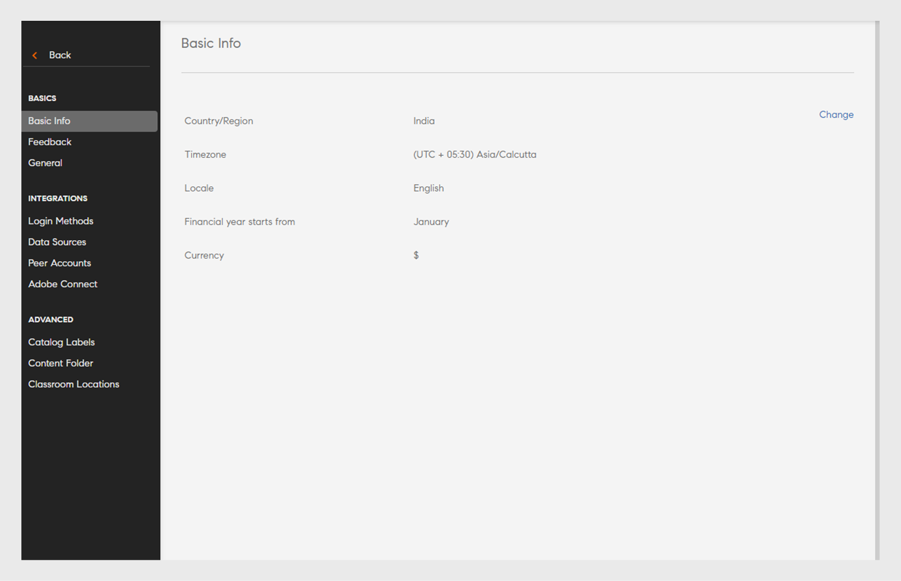
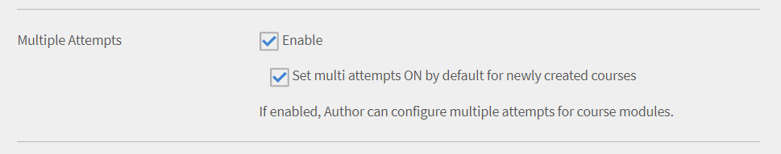
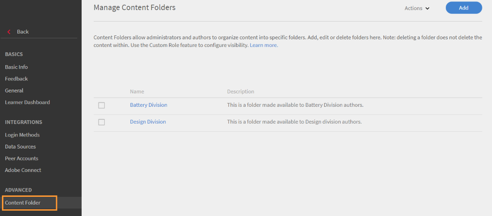
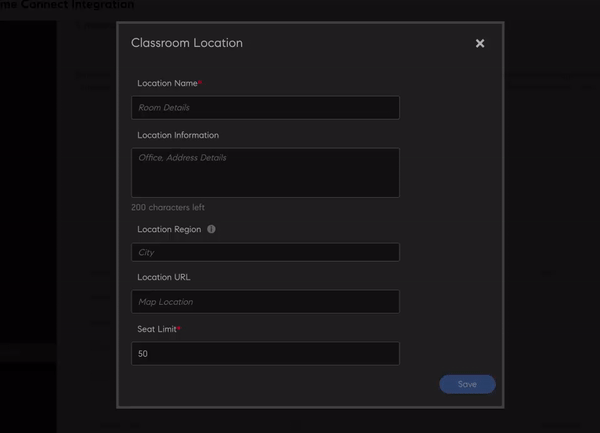
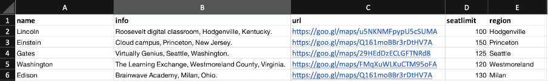

# 設定

了解管理員可以設定的學習管理員帳號設定。

你可以更改管理員設定並更新帳戶設定。 查看您的個人檔案資訊、新增/更改個人照片，以及修改 **[!UICONTROL About me]** 內容。 更新公司資訊、設定使用者登入方式，以及透過帳號設定設定 Connect 整合。

## 設定您的 Adobe Learning Manager

此訓練涵蓋帳戶層級設定的基本概念。

如果你無法啟動訓練，請寫信至 <almacademy@adobe.com>。

## 帳號設定 {#accountsettings}

要更新您組織的帳戶設定，請點擊 **[!UICONTROL Settings]** 左側窗格。

**基本資訊（公司資訊）**

點擊 **[!UICONTROL Change]** 頁面並編輯國家、時區、地點及財政年度設定。

**設定聯絡人管理員**

如果您想新增或更改您組織的支援管理員電子郵件地址，可以點擊 **[!UICONTROL General]** 左側窗格來設定。 點擊 **[!UICONTROL Change]** 旁邊 **[!UICONTROL Support Email ID]** 並新增電子郵件 ID。 當學習者點擊 **[!UICONTROL Contact Admin]** 頁面底部時，郵件會寄送給這些管理員。

再加一些分號分隔的電子郵件識別碼。

**登入方式** - 管理員可以選擇內部或外部使用者存取帳號的模式。

* **內部使用者：** 對於內部使用者，你可以設定 Adobe ID 或單一登入作為登入模式。
* **外部使用者：** 對於外部使用者，你可以設定 Adobe ID、單一登入或學習管理器 ID。

如果你選擇學習管理員 ID，外部使用者在建立學習管理員的使用者名稱和密碼後，就能登入這個帳號。

>[!NOTE]
>
>如果設定多個外部設定檔，所有設定檔都可以有任何一種登入方式。 例如，如果登入類型是 Adobe ID，所有個人檔案都必須只使用 Adobe ID 登入。 每個個人檔案無法擁有獨立的登入類型。

你可以使用 Adobe ID 或單點登入來存取學習管理員應用程式。 單一登入是一種機制，允許使用者一次驗證，並多次存取多個應用程式。 此配置對組織而言並非強制。 如果你的組織有基於 SAML 2.0 的 SSO 供應商，可以用它來設定 Learning Manager 應用程式。 此設定在組織層級及 Learning Manager 應用程式中皆為必要。 如果你選擇使用 SSO，請聯絡 Adobe 客服以取得設定說明

**回饋**

點擊 **[!UICONTROL Feedback]** 左側窗格設定問卷，以在完成課程後獲得學習者的回饋。 請參閱 [課程功能說明內容](/help/migrated/administrators/feature-summary/courses.md#add-l1-and-l3-feedback) ，說明如何製作 L1 與 L3 回饋。

**多次嘗試**

選擇 **[!UICONTROL Settings]** > **[!UICONTROL General]** > **[!UICONTROL Multiple Attempts]**。

如果你啟用「多次嘗試」勾選框，作者可以設定互動式電子學習課程或模組的「多次嘗試」。選擇第二個勾選框後，管理員可預設為任何新建立的互動式電子學習課程設定「無限次嘗試」。

*選擇「多次嘗試」勾選框*

**課程管理**

從左側窗格點擊 **[!UICONTROL General]** ，選擇課程管理選項以啟用課程管理功能。 欲了解更多此功能，請參閱 [課程管理](courses.md#main-pars_header_1879001177)。

**討論區**

如果你啟用討論區勾選框，學習者和講師就可以在學習者應用程式的課程頁面的討論標籤中，對課程發表評論。 然而，如果課程層級設定顯示未選擇此功能，則課程層級設定優先於管理員設定。

**學習器儀表板**

從左側窗格點選「學習者儀表板」。 此頁面允許你選擇想在學習者頁面上顯示的元件。 在學習者頁面選擇你想啟用的小工具。 未被選中的元件將不會出現在學習者頁面。

**Adobe Connect**

點擊 **[!UICONTROL Adobe Connect]** 左側窗格以設定 Adobe Connect 帳號以舉辦虛擬教室課程。 欲了解更多資訊，請參閱  [Adobe Connect](adobeconnect-integration.md) 功能說明。

## 一般設定 {#general}

啟用或停用以下設定：

<table>
 <tbody>
  <tr>
   <th>
    
<b>名稱</b>

    </th>
   <th>
    
<b>說明</b>

   </th>
  </tr>
  <tr>
   <td>展現課程效能</td>
   <td>啟用後，學習者可以在課程圖塊上看到目前的課程效能。 此功能僅適用於課程。 學習課程或證書不支援星級評分。 它適用於課程和學習計畫，但不提供認證。</td>
  </tr>
  <tr>
   <td>課程管理</td>
   <td>若啟用，所有課程變更必須先經過管理員批准，課程才會顯示給學習者。</td>
  </tr>
  <tr>
   <td>討論區</td>
   <td>如果你啟用討論區勾選框，學習者和講師就可以在學習者應用程式的課程頁面的討論標籤中，對課程發表評論。 然而，如果課程層級設定顯示未選擇此功能，則課程層級設定優先於管理員設定。</td>
  </tr>
  <tr>
   <td>多次嘗試</td>
   <td>啟用後，作者可設定課程模組的多次嘗試。</td>
  </tr>
  <tr>
   <td>探索技能選項</td>
   <td>若啟用，學習者可探索同儕與領導技能，並訂閱他們選擇的技能。</td>
  </tr>
  <tr>
   <td>技能/標籤可見度</td>
   <td>向學習者顯示所有技能與標籤。 你可以顯示所有技能和標籤，或顯示已指派的技能和標籤，或是目錄中對學習者可見的。
   
<b>重要學習者助理與目錄可見性</b>

   
如果您的帳號使用 Learner Assistant，請記得所選為 Assistant 內容來源的目錄並不受每位學習者目錄可見度的範圍限制。 即使某些訓練在目錄檢視中無法被特定學習者看到，助理仍可使用已設定目錄的內容。

   
Adobe 建議只選擇包含你願意向所有可存取學習者展示的內容（以摘要或解釋形式）的目錄。 

   </td>

</tr>
  <tr>
   <td>唯一學習物件 ID</td>
   <td>若啟用，管理員或作者可為每個學習物件新增唯一 ID。</td>
  </tr>
  <tr>
   <td>節目濾鏡面板</td>
   <td>
    
控制學習者應用程式中使用者可用的篩選面板，以優化搜尋結果。 選項如下：

    <ul>
     <li>目錄</li>
     <li>類型</li>
     <li>格式</li>
     <li>持續時間</li>
     <li>技能</li>
     <li>技能等級</li>
     <li>標記</li>
    </ul>
    
當學習者啟動學習者應用程式時，在「我的學習」和「目錄」區塊中，學習者可以在各自面板中看到篩選條件。

    
<b>注意：</b>格式<b></b>與<b>時長</b>篩選器預設關閉，且不會在發布後立即顯示給學習者。管理員應該啟用這些功能。  
</td>
  </tr>
  <tr>
   <td>節目目錄列表</td>
   <td>若啟用，學習者可查看所有可用的目錄清單。 學習者可以利用此方法精煉學習物件的顯示方式。</td>
  </tr>
  <tr>
   <td>產品術語</td>
   <td>Learning Manager 有一套貫穿整個產品的標準術語。 調整術語以符合組織需求。</td>
  </tr>
  <tr>
   <td>模組版本更新</td>
   <td>設定預設設定來更新內容。 設定可從課程頁面針對每項內容進行調整。</td>
  </tr>
  <tr>
   <td>自動註冊使用者</td>
   <td>若啟用，新匯入的使用者會自動註冊。 預設情況下，使用者必須手動註冊才能開始使用 Learning Manager。</td>
  </tr>
  <tr>
   <td>自動刪除內部使用者</td>
   <td>若啟用，內部使用者若在指定天數內未登入系統，將自動刪除。 此功能適用於僅有 Learner</b> 角色<b>的使用者。要恢復存取權限，使用者必須聯絡管理員。 </td>
  </tr>
  <tr>
   <td height="20">自動刪除清除使用者</td>
   <td>若啟用，內部使用者若在指定天數內未登入系統，將自動刪除。 此功能適用於僅有 Learner 角色的使用者。 要恢復存取權限，使用者必須聯絡管理員。 啟用此選項後，你可以指定被清除使用者在 ALM 中永久刪除的時間。</td>
  </tr>
  <tr>
  <tr>
   <td>展示目錄標籤</td>
   <td>若啟用，管理員與作者可設定目錄標籤與值，並將其連結至學習物件。 選擇此選項也允許作者將課程、學習路徑、認證或工作輔助資料加入目錄。</td>
  </tr>
  <tr>
   <td>學習者可以查看自己的分數</td>
   <td>啟用後，學習者可在學習者成績單中查看自己的分數。</td>
  </tr>
  <tr>
   <td>摘要電子郵件</td>
   <td>
    
管理員可以啟用或關閉向學習者發送電子郵件。 管理員也能控制郵件發送頻率。

    <ul>
     <li>對於 <b>活躍帳號</b>，摘要郵件預設會被停用，管理員可以手動啟用。</li>
     <li>對於 <b>試用帳號</b>，摘要郵件的選項將保持關閉，管理員無法啟用該選項。</li>
    </ul>
    
如果此功能被停用，則：

    <ul>
     <li><b>摘要郵件</b>選項將被停用。</li>
     <li>學習者無法看到使用者的摘要電子郵件訂閱設定。</li>
    </ul>
    
 如果啟用此功能，則：

    <ul>
     <li>管理員可以啟用並修改摘要郵件選項。</li>
     <li>在 <b>Learber 應用程式的個人資料設定 </b>中，學習者（不在 DND 名單中）可以選擇訂閱或取消訂閱摘要郵件。</li>
    </ul></td>
  </tr>
  <tr>
   <td>啟用訓練卡圖示 </td>
   <td>啟用後，Learner 應用程式的訓練卡上會出現圖示。 </td>
  </tr>
  <tr>
   <td>頁腳連結</td>
   <td>
    
新增連結或電子郵件帳號，這些帳號會顯示為頁尾。 你最多只能新增三個頁腳連結。

    
要自訂頁腳上的連結，請執行以下步驟：

    <ol>
     <li>點選 <b>「新增更多</b>」，在指定欄位輸入姓名及網址或電子郵件 ID。 網址前要加上 http:// 或 https://。</li>
     <li>要將變更串接到所有地區，請點擊 <b>複製</b>。 這確保所有語言都能取得名稱和網址。</li>
     <li>要儲存變更，請點擊 <b>儲存</b>。 你會看到一個跳出的訊息確認變更。 點擊確定後，頁腳會被新加入的連結填滿。</li>
    </ol>
    
此外，你還可以：

    <ul>
     <li>點擊<b>重置</b>圖示，即可在說明</b>與<b>聯絡管理員</b>欄位中重置預設值<b>。</li>
     <li>請自訂頁尾的連結以支援所有語言。 點擊 <b>「語言」</b> 下拉選單，選擇語言，並在指定欄位中加入 <b>名稱</b> 與 <b>網址</b> 。 儲存變更後，更新後的連結會出現在頁尾。 </li>
    </ul></td>
  </tr>
  <tr>
   <td>報告時區 </td>
   <td>
    
設定帳號層級偏好以匯出以下時區的學習成績單：

    <ul>
     <li>UTC（預設行為）</li>
     <li>帳戶層級時區偏好</li>
    </ul>
    
使用 Jobs API 下載的學習者成績單也會下載所選時區的資料。

    
<b>注意： </b>學習者成績單在發布後，預設不會立即更改。 管理員可以從管理員&gt;設定&gt;一般&gt;報告時區設定此設定。
</td>
  </tr>
 </tbody>
</table>

<table border="0" cellpadding="0" cellspacing="0" width="1709">
 <tbody>
  <tr>
   <td height="20" width="147">名稱</td>
   <td>說明</td>
  </tr>
  <tr>
   <td height="20">展現課程效能</td>
   <td>啟用後，學習者可以在課程圖塊上看到目前的課程效能。</td>
  </tr>
  <tr>
   <td height="20">課程管理</td>
   <td>若啟用，所有課程變更必須先經過管理員批准，課程才會顯示給學習者。</td>
  </tr>
  <tr>
   <td height="20">討論區</td>
   <td>如果你啟用討論區勾選框，學習者和講師就可以在學習者應用程式的課程頁面的討論標籤中，對課程發表評論。 然而，如果課程層級設定顯示未選擇此功能，則課程層級設定優先於管理員設定。</td>
  </tr>
  <tr>
   <td height="20">多次嘗試</td>
   <td>啟用後，作者可設定課程模組的多次嘗試。</td>
  </tr>
  <tr>
   <td height="20">探索技能選項</td>
   <td>若啟用，學習者可探索同儕與領導技能，並訂閱他們選擇的技能。</td>
  </tr>
  <tr>
   <td height="20">技能/標籤可見度</td>
   <td>向學習者顯示所有技能與標籤。 你可以顯示所有技能和標籤，或顯示已指派的技能和標籤，或是目錄中對學習者可見的。</td>
  </tr>
  <tr>
   <td height="20">唯一學習物件 ID</td>
   <td>若啟用，管理員或作者可為每個學習物件新增唯一 ID。</td>
  </tr>
  <tr>
   <td rowspan="10" height="191">節目濾鏡面板</td>
   <td>控制學習者應用程式中使用者可用的篩選面板，以優化搜尋結果。 選項如下：</td>
  </tr>
  <tr>
   <td height="19">目錄</td>
  </tr>
  <tr>
   <td height="19">類型</td>
  </tr>
  <tr>
   <td height="19">格式</td>
  </tr>
  <tr>
   <td height="19">持續時間</td>
  </tr>
  <tr>
   <td height="19">技能</td>
  </tr>
  <tr>
   <td height="19">技能等級</td>
  </tr>
  <tr>
   <td height="19">標記</td>
  </tr>
  <tr>
   <td height="19">當學習者啟動學習者應用程式時，在「我的學習」和「目錄」區塊中，學習者可以在各自面板中看到篩選條件。</td>
  </tr>
  <tr>
   <td height="20">注意：格式與時長篩選器預設關閉，且不會在發布後立即顯示給學習者。 管理員應該啟用這些功能。 </td>
  </tr>
  <tr>
   <td height="20">節目目錄列表</td>
   <td>若啟用，學習者可查看所有可用的目錄清單。 學習者可以利用此方法精煉學習物件的顯示方式。
   
<b>重要學習者助理與目錄可見性</b>

   
如果您的帳號使用 Learner Assistant，請記得所選為 Assistant 內容來源的目錄並不受每位學習者目錄可見度的範圍限制。 即使某些訓練在目錄檢視中無法被特定學習者看到，助理仍可使用已設定目錄的內容。

   
Adobe 建議只選擇包含你願意向所有可存取學習者展示的內容（以摘要或解釋形式）的目錄。 

   </td>

</tr>
  <tr>
   <td height="20">產品術語</td>
   <td>Learning Manager 有一套貫穿整個產品的標準術語。 調整術語以符合組織需求。</td>
  </tr>
  <tr>
   <td height="20">模組版本更新</td>
   <td>設定預設設定來更新內容。 設定可從課程頁面針對每項內容進行調整。</td>
  </tr>
  <tr>
   <td height="20">自動註冊使用者</td>
   <td>若啟用，新匯入的使用者會自動註冊。 預設情況下，使用者必須手動註冊才能開始使用 Learning Manager。</td>
  </tr>
   <td height="20">展示目錄標籤</td>
   <td>若啟用，管理員與作者可設定目錄標籤與值，並將其連結至學習物件。</td>
  </tr>
  <tr>
   <td height="20">學習者可以查看自己的分數</td>
   <td>啟用後，學習者可在學習者成績單中查看自己的分數。</td>
  </tr>
  <tr>
   <td rowspan="9" height="172">摘要電子郵件</td>
   <td>管理員可以啟用或關閉向學習者發送電子郵件。 管理員也能控制郵件發送頻率。</td>
  </tr>
  <tr>
   <td height="19">對於活躍帳號，摘要郵件預設會被停用，管理員可以手動啟用。</td>
  </tr>
  <tr>
   <td height="19">對於試用帳號，摘要郵件的選項將保持關閉，管理員無法啟用該選項。</td>
  </tr>
  <tr>
   <td height="19">如果此功能被停用，則：</td>
  </tr>
  <tr>
   <td height="19">摘要郵件選項將被停用。</td>
  </tr>
  <tr>
   <td height="19">學習者無法看到使用者的摘要電子郵件訂閱設定。</td>
  </tr>
  <tr>
   <td height="19"> 如果啟用此功能，則：</td>
  </tr>
  <tr>
   <td height="19">管理員可以啟用並修改摘要郵件選項。</td>
  </tr>
  <tr>
   <td height="20">在 Learber 應用程式的個人資料設定中，學習者（不在 DND 名單中）可以選擇訂閱或取消訂閱摘要郵件。</td>
  </tr>
  <tr>
   <td height="20">啟用訓練卡圖示</td>
   <td>啟用後，Learner 應用程式的訓練卡上會出現圖示。</td>
  </tr>
  <tr>
   <td rowspan="8" height="153">頁腳連結</td>
   <td>新增連結或電子郵件帳號，這些帳號會顯示為頁尾。 你最多只能新增三個頁腳連結。</td>
  </tr>
  <tr>
   <td height="19">要自訂頁腳上的連結，請執行以下步驟：</td>
  </tr>
  <tr>
   <td height="19">1. 點選「新增更多」，在指定欄位輸入姓名及網址或電子郵件 ID。 網址前要加上 http:// 或 https://。</td>
  </tr>
  <tr>
   <td height="19">2. 要將變更串接到所有地區，請點擊複製。 這確保所有語言都能取得名稱和網址。</td>
  </tr>
  <tr>
   <td height="19">3. 要儲存變更，請點擊儲存。 你會看到一個跳出的訊息確認變更。 點擊確定後，頁腳會被新加入的連結填滿。</td>
  </tr>
  <tr>
   <td height="19">此外，你還可以：</td>
  </tr>
  <tr>
   <td height="19">點擊重置圖示，即可在說明與聯絡管理員欄位中重置預設值。</td>
  </tr>
  <tr>
   <td height="20">請自訂頁尾的連結以支援所有語言。 點擊「語言」下拉選單，選擇語言，並在指定欄位中加入名稱與網址。 儲存變更後，更新後的連結會出現在頁尾。</td>
  </tr>
  <tr>
   <td rowspan="5" height="96">報告時區</td>
   <td> 設定帳號層級偏好以匯出以下時區的學習成績單：</td>
  </tr>
  <tr>
   <td height="19">UTC（預設行為）</td>
  </tr>
  <tr>
   <td height="19">帳戶層級時區偏好</td>
  </tr>
  <tr>
   <td height="19">使用 Jobs API 下載的學習者成績單也會下載所選時區的資料。</td>
  </tr>
  <tr>
   <td height="20">注意：學習者成績單在發布後，預設不會立即更改。 管理員可以從管理員&gt;設定&gt;一般&gt;報告時區設定此設定。</td>
  </tr>
  <tr>
   <td height="19">Badgr 整合</td>
   <td>啟用後，學習者將能將徽章上傳至Badgr網站。 在客戶教育情境中，組織希望能夠「認證」客戶，並讓他們有機會在社群媒體上展示這些憑證。 這激勵學習者接受培訓並與他人分享成就。 </td>
  </tr>
  <tr>
   <td height="135">
    
節目收視率
</td>
   <td>
    <ul>
     <li>若 <b>啟用課程效能</b> 選項，學習者將只能看到課程效能的價值。</li>
     <li>若 <b>啟用星級評分</b> 選項，學習者將只能查看平均星級評分及評分該課程的學習人數。 </li>
    </ul>
    
此功能僅適用於課程。 學習課程或證書不支援星級評分。  <b>注意： </b>此變更僅影響學習者應用程式。 

    
在其他所有應用程式（管理員、作者、管理員、自訂管理員、自訂作者）中，設定的更改（星級評分/課程效能/關閉節目評分）都不會有任何影響。 

    
對於新帳號， <b>節目評分</b> 區預設會啟用 <b>星級評分</b> 選項。

    
對於現有帳號，如果該帳號之前啟用 <b>了「課程有效性</b> 」選項，那麼 <b>「顯示評分</b> 」區塊會啟用，並選擇「課程有效性」選項。 若 <b>關閉「課程有效</b>」選項，則 <b>節目評分</b> 區塊也會被停用。 啟用 <b>節目評分</b> 區塊時， <b>星級評分</b> 選項預設會啟用。
</td>
  </tr>
  <tr>
   <td height="19">退休</td>
   <td>可從以下選項中選擇退休選項之一：<li>退休後，已註冊學習者將能查看並執行操作，但尚未註冊的學習者將失去存取權限。</li><li>退休後，已註冊及尚未註冊的學員將失去使用權。</li>
<b>注意：</b> 你可以從他們的總覽頁面退休課程、學習路徑或證照。
 </td>
  </tr>
  <tr>
   <td height="19">在搜尋結果中顯示所有已註冊課程</td>
   <td>啟用後，學習者即使在已註冊的學習路徑或認證中，也能在搜尋結果中看到課程。</td>
  </tr>
 </tbody>
</table>

<table>
 <tbody>
  <tr>
   <td>
    
學習路徑
</td>
   <td>
    
若 <b>選擇「啟用學習路徑</b> 的擴展功能」選項，管理員將能將學習路徑納入學習路徑，並將這些學習路徑與課程合併。 這個選項是不可逆的。 
</td>
  </tr>
  <tr>
   <td>
    
教官管理 
</td>
   <td>
    
啟用此設定，限制在建立課堂/虛擬課堂時可選擇的講師名單。 所有擁有該講師權限的使用者只能被指派為任何會話的講師。 此限制不適用於遷移工作流程。 

  </td>
  <tr>
    <td>
      
技能引進

    </td>
    <td>
      
如果啟用，你可以選擇外部來源來匯入技能。 現有學習資源的技能會在初次運行時匯入一次技能庫。 在所有後續的學習資源匯入中，技能僅會匯入新匯入的技能倉庫。
      一旦啟用該選項，該動作即無法逆轉。 你之後無法停用或切換到其他來源。
      

    </td>
  </tr>
  <tr>
    <td>
      
替代課程/路徑

    </td>
    <td>
      
當學習者完成一門課程/路徑時，另一組指定的課程/路徑可透過替代方式標記為已完成。 學習者不會自動註冊透過替代路線標記為已完成的課程/路徑，只會獲得實際完成的課程/路徑的學分、徽章和積分。 可用的選項包括：啟動追溯完成項目與啟動追溯未完成項目。
      

    </td>
  </tr>
  </tr>
 </tbody>
</table>

>[!NOTE]
>
>啟用技能匯入設定後，帳號版面無法切換到經典視圖，也就是說，啟用技能匯入&#x200B;**選項後**，切換到經典帳號會被停用。

## 重新命名學習物件 {#renaminglearningobjects}

此功能僅提供英文版本。

管理員現在可以在學習管理員中重新命名學習物件。 以下是可重新命名的術語。

模組\
河道\
學習計畫\
認證\
學習計畫\
就業援助\
目錄\
技巧\
徽章\
公告\
我的學習\
排行榜\
效能\
前置條件\
前期工作\
核心內容\
測試\
自學進度\
混合\
教室\
虛擬教室\
活動

## 設定檔設定 {#profilesettings}

1. 點擊右上角照片/帳號旁的下拉箭頭，選擇 **[!UICONTROL Profile Settings]**。
1. 在彈出視窗中，你可以透過滑鼠懸停或點擊 **[!UICONTROL Edit]** 個人照片區域來新增或更改照片。
1. 點擊相鄰內容&#x200B;**[!UICONTROL Edit]**&#x200B;即可新增或修改&#x200B;**[!UICONTROL About]**&#x200B;內容。
1. 點擊 **[!UICONTROL Save]。**

## 內容資料夾 {#content-folder}

學習管理員支援私有內容資料夾。 管理員可以設定私人內容資料夾，並透過自訂角色提供對特定自訂作者的存取權限。 請注意，標準作者（也稱為完整作者）仍可存取帳號中的所有內容。 因此，完整作者擁有所有資料夾和內容的存取權。

內容資料夾可由管理員設定。 只有設定好後，內容資料夾才會對作者可見，並能將內容放入一個或多個資料夾。

要新增內容資料夾，請在管理員應用程式中點擊 **[!UICONTROL Settings]** > **[!UICONTROL Content Folder]**。

*變更內容資料夾設定*

### 資料夾

資料夾是內容的儲存庫，內容是擁有以下屬性的帳號中整個內容庫的子集：

* 只有管理員才能建立、編輯或刪除資料夾。
* 管理員只能在定義自訂管理員角色時控制資料夾存取權。
* 內容 **必須始終與至少一個資料夾**&#x200B;相關聯。 首先，所有內容都會綁定在 Public 資料夾，之後可以更改。
* 內容可在建立時綁定多個資料夾，這也可以透過複製操作實現
* 所有資料夾名稱必須在帳號內唯一，否則命名資料夾時會出現錯誤。

資料夾只控制內容的可見性，並不會產生內容的複製品。 因此，編輯內容會在所有相關的資料夾中反映。

### 公用資料夾

帳號中始終存在一個公開資料夾，起初所有內容都會屬於這個資料夾。 之後，作者可以將內容從這個資料夾移到其他資料夾。 公共資料夾具有以下屬性：

* 所有與此資料夾相關的內容預設都會對所有類型的作者開放。
* 任何屬於公開資料夾的內容，都不能屬於其他資料夾。 反之亦然。

這個資料夾不能成為可設定角色定義的一部分。 因此，沒有在可設定的角色定義中放置公共資料夾，並不會限制對公共資料夾的存取。

### 私人資料夾

* 管理員建立的任何資料夾都是私人資料夾。

### 資料夾操作

**新增資料夾**

要新增資料夾，請點擊 **[!UICONTROL Add]** 視窗右上角。

**刪除資料夾**

你也可以刪除資料夾。 選擇要刪除的資料夾，點選動作選單，然後點選 **[!UICONTROL Delete Folder]**。

>[!NOTE]
>
>當所有相關內容也與其他資料夾綁定時，資料夾可以被刪除。 如果有內容連結了但只有該資料夾被刪除，先把內容移到另一個資料夾，然後再刪除該資料夾。

## 教室地點

管理員可以使用此設定建立並設定教室位置的資料庫。 作者可以選擇預先設定的地點來設置教室活動。 從圖書館選擇地點，即可自動填寫地點資訊、網址及座位限制。

作為管理員，你可以：

### 匯入地點 CSV

透過匯入 CSV 檔案來新增地點。 CSV 檔案必須包含「城市」欄位。

### 新增地點

補充以下內容：

1. 地點名稱：輸入教室名稱。
2. 地點資訊：輸入地點資訊。
3. 地點區域：輸入的值會以學習者訓練地點篩選器的形式出現。
4. 地點網址：輸入地點的網址。
5. 座位限制：輸入房間的座位容量。

*新增教室地點*

你也可以利用 CSV 檔的幫助新增地點。 CSV 必須包含以下欄位：

* 名稱
* 資訊
* 網址
* 座位限制
* 地區

<!---->

### 設定 {#admin-classroom-settings}

選擇 **編輯** 以更改以下內容：

* **允許作者建立地點**：啟用後，作者所建立的所有地點都會列在「所有地點」標籤下。 學習者也會在目錄與行事曆篩選中看到這些地點。
* **允許作者修改和刪除位置**：啟用後，作者將能修改和刪除所有 Classroom 位置。 作者所做的修改將反映在整個平台，包括報告中。

## 常見問題 {#frequentlyaskedquestions}

+++如何為內容庫建立不同的資料夾？

點擊 **[!UICONTROL Settings]** > **[!UICONTROL Content Folder]**。 要新增資料夾，請點擊 **[!UICONTROL Add]** 右上角，並在對話框中輸入資料夾名稱與描述。

內容資料夾可由管理員設定。 只有設定好後，內容資料夾才會對作者可見，並能將內容放入一個或多個資料夾。

欲了解更多資訊，請參閱內容資料夾](settings.md#content-folder)章節[。
+++

+++如何為帳戶新增財務年度？

在>**[!UICONTROL Basic Info]**&#x200B;中&#x200B;**[!UICONTROL Settings]**，點擊 **[!UICONTROL Change]**。從 **[!UICONTROL Financial year starts from]** 下拉選單中選擇月份。
+++
