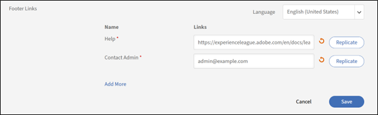

# Adobe Learning Manager 的基本設定

## 概觀

基本資訊區塊是您 Adobe Learning Manager 設定的基礎，包含定義學習平台在不同地區、語言及商業情境中運作的關鍵組織參數。

## 主要優點

* 提供區域專屬內容傳遞與使用者體驗。
* 標準化時間顯示、日期格式及貨幣表示方式。
* 提供部分時區的自動夏令時間調整。
* 減少了跨平台手動調整的需求。

## 設定基本設定

### 存取基本資訊設定

1. 以管理員身份登入 Adobe Learning Manager。
2. 在左側導航列選擇 **[!UICONTROL Settings]** 。

   

3. 選擇 **[!UICONTROL Basic Info]** 該 **[!UICONTROL Basics]** 類別。

   

4. 選擇 **[!UICONTROL Change]** 修改基本設定。

### 更改基本設定

**國家/地區**

Adobe Learning Manager 管理員設定中的國家/地區下拉選單允許你指定與該組織相關的國家或地區。 此設定用於本地化，確保平台符合區域偏好、合規要求及時區需求。

**時區**

時區下拉選單讓你可以定義平台的預設時區。 這確保所有時間敏感的活動，如課程時間表、截止日期及報告，都能準確對齊組織或學員的當地時間。

**地點**

地點指的是帳戶的語言和區域設定。 Locale 下拉選單允許管理員設定平台介面與內容顯示給使用者的語言。 此選項確保學習者與管理員能以偏好語言與平台互動。

**財政年度開始於**

此選項允許您定義組織財政年度的起始月份。 例如，如果您的組織財政年度從十二月開始，您可以將此選項設為十二月。 報告和分析將與本財政年度相符。

**貨幣**

貨幣選項允許你定義帳戶的預設貨幣。 這筆貨幣用於定價學習項目，如課程、學習路徑及證照。 例如，如果您的組織在美國營運，您可以將貨幣設定為美元（USD）。 同樣地，歐洲的營運可以選擇歐元（EUR）。

### 更改回饋設定

Adobe Learning Manager 的回饋設定為管理員提供工具，收集並管理來自學習者（L1）與管理者（L3）的回饋。 這些環境確保課程與學習目標被有效評估，促進持續改進。

在開始從學習者那裡收集有價值的洞見之前，你需要啟用 L1 回饋功能並設定其參數。 第一步是進入回饋設定區，開啟所有新課程的功能，同時選擇回饋表單的主要語言。

### 啟用 L1 回饋

在 L1 回饋標籤中，找到標示為「啟用新建立課程與學習路徑的 L1 回饋」的切換開關。 選擇開關來開啟它。 這會自動包含你新建立課程的 L1 回饋表單。

**選擇預設語言**

請使用「語言」下拉選單選擇回饋表單的預設語言。 這確保問題以正確的語言呈現給學習者。

**針對不同課程類型配置問卷**

Adobe Learning Manager 允許您根據課程是自學模組還是由教師主導的課堂課程，自訂問題。 這確保你收到的回饋具體且相關。 在此步驟中，您將選擇並精煉自學課程與課堂課程的問題，以收集最有意義的資料。

**自學課程**：

* **必修問題**：問卷中包含一個必修問題：「你有多大可能推薦這門課給同事？」 這是一個標準的淨推薦值分數（NPS）問題，提供整體課程滿意度的關鍵指標。
* **自訂問題**：檢視所提供的問題清單。 要在回饋表單中包含問題，請確保旁邊的切換開關設為「是」。 要移除問題，請切換開關為「否」。
* **新增自訂問題**：如果你有針對自學內容的額外問題，請點選「新增更多」連結，為問卷新增並新增自訂陳述。

**關於課堂課程**：

* **客製化問題**：檢視針對教室訓練量身打造的問題清單。 在每個問題旁邊切換開關為「是」以包含該問題，或將該問題從回饋表單中剔除。
* **新增自訂問題**：若要新增符合您教室環境或主持風格的新問題，請選擇「新增更多」連結建立並加入清單。

**設定回饋提醒**

為了最大化回應率，設定自動提醒是個好習慣。 此步驟將教你如何設定與排程這些提醒，定義它們何時發送、多頻繁出現以及持續多久。 主動提醒學習者，你可以大幅增加收集到的回饋量。

1. **新增提醒**：在該 **[!UICONTROL L1 Feedback Reminders]** 區塊中選擇 **[!UICONTROL Add New Reminder]**。

   

2. **定義提醒事項排程**：在 **出現的提醒設定** 面板中，使用下拉選單和輸入欄位來設定提醒事項：

   a. **[!UICONTROL When to send]**：選擇是發送 **[!UICONTROL On Course Completion]** 提醒還是 **[!UICONTROL After Course]** 完成。
b. **[!UICONTROL Recurrence]**：選擇提醒的頻率（例如，每週一次）。
c. **[!UICONTROL For]**：請指定提醒發送的總時長（以週為單位）（例如4週）。

3. **[!UICONTROL  Save the reminder]**： 選擇藍色勾選圖示以儲存新的提醒設定。 如果需要，你可以重複這個過程來增加更多提醒。

   

4. 在頁面右上角選擇 **[!UICONTROL Save]** 套用 L1 回饋設定。

### 啟用 L3 反饋

在你能從學習者的主管那裡收集回饋之前，你需要先設定 L3 回饋設定。 第一步是進入回饋設定頁面，選擇 L3 回饋標籤。 接著，你可以設定回饋請求的語言，並檢視將寄給經理的主要問題。

**選擇 L3 回饋標籤**

在回饋設定頁面選擇 L3 回饋標籤。

**請檢視回饋陳述**

學習者的主管會向學習者提出三級回饋，作為一個他們可以同意或不同意的單一陳述。 預設的說明是：「員工在接受培訓後表現明顯提升。」 您可以編輯此聲明以更符合您組織的需求。

**選擇預設語言**

選擇「語言」下拉選單，以選擇回饋請求的預設語言。

**設定回饋提醒**

為了確保經理能及時提供回饋，你需要設置自動提醒。 此步驟涉及設定這些提醒何時發送及頻率。 截圖顯示 L3 回饋提醒可以設定為完成課程時發送一次，但如果需要，也可以新增更多提醒。

1. **[!UICONTROL Add a new reminder]**： 要建立新提醒，請選擇連結 **[!UICONTROL Add New Reminder]** 。
2. **[!UICONTROL Define reminder schedule]**： 在 **[!UICONTROL Reminder Settings]** 面板中，選擇下拉選單和輸入欄位來設定提醒：a. **[!UICONTROL When to send]**：選擇提醒發送時間。 選項是 和 **[!UICONTROL On Course Completion]** **[!UICONTROL After Course completion]**。
b. **[!UICONTROL Recurrence]**：選擇提醒頻率。 如果重複是 **[!UICONTROL Once]**，代表經理會收到一次通知以提供回饋。 可用的選項包括——一天一次、每週一次、每月一次。
3. 設定好排程後，選擇藍色勾勾圖示以儲存提醒設定。 提醒會出現在現有提醒清單中。

   

4. 在頁面右上角選擇 **[!UICONTROL Save]** 套用 L3 回饋設定。

## 一般設定

### 概觀

Adobe Learning Manager 的一般設定為管理員提供集中位置，以配置整體學習者體驗與管理流程。 這些設定允許你啟用或關閉各種功能，以依照組織的特定需求調整平台。

主要可配置的一般設定包括：

* **課程效能與審核：** 選擇向學習者顯示課程效能評分，並啟用課程審核功能，所有課程變更需經管理員批准。
* **學習者參與功能：** 你可以啟用或關閉如 **討論區** （用於課程評論）、外部資源的技能分享，以及 **摘要郵件** ，讓學習者隨時掌握新內容與進度。
* **內容與課程管理：**&#x200B;設定允許設定&#x200B;**互動式電子學習的多次嘗試**、為內容新增&#x200B;**獨特學習物件 ID**，以及設定模組版本更新&#x200B;**的預設行為**。
* **使用者管理：** 啟用 **自動註冊使用者** ，以自動新增使用者，並 **自動刪除已停用指定期間的內部使用者** 。
* **自訂與顯示**：您可以控制學習者看到的內容，例如啟用或關閉 **篩選面板** 以搜尋、顯示 **目錄標籤**，以及自訂最多三個 **頁腳連結**。

### 課程管理

課程管理讓您能監督並管理作者對課程的更新。 它確保任何課程內容的變更在發布給學習者前，都會經過管理員審核與批准。 選擇課程管理時，作者若對課程做了任何修改，必須先取得管理員批准才能發布課程。

例如，當作者更新課程、新增或移除模組，並嘗試發佈該課程時，

1. 每當作者重新發布有變更的課程時，你會收到通知。
2. 選擇通知以查看作者所做的變更。
3. 比較舊內容和新內容。
4. 批准或拒絕變更：a. 批准變更以重新發布課程並更新。
b. 拒絕這些變更以保留先前版本的課程有效。
5. 作者會收到你的決定通知，無論是批准還是拒絕。

### 討論區

Adobe Learning Manager 中的討論區選項允許學習者參與與課程、模組或學習計畫相關的討論。 你可以啟用並管理此功能，促進學習者間的合作與知識分享。 討論區與特定課程或模組相連結，使其在情境中具有相關性。

作為學習者，你可以透過討論標籤與其他學習者及講師互動。 你可以查看任何你正在瀏覽或報名的課程貼文。 如果管理員啟用了課程的討論，你可以查看該課程筆記標籤旁的討論標籤。

當你選擇課程的討論標籤時，可以看到該課程現有的貼文和留言。 如果你已經報名了課程，也可以開始打字或留言讓其他用戶看到。 輸入訊息後，點擊「發佈」。 你的貼文必須包含至少10個字元。

該貼文會立即在討論區分頁中看到。 你可以將貼文排序為「最新在第一」或「最舊在第一」，並刪除你寫過的文章。 即使你退選了課程，仍然可以查看所有貼文並刪除你寫過的貼文。

作為管理員，你可以管理討論，確保相關性與適當性。 學習者會收到回覆或討論更新的通知。

### 多次嘗試

選擇此選項後，作者可設定課程或模組層級可重複嘗試的次數。 它允許學習者完成課程或評量後重修。  此環境適用於包含小考、測驗或需要評估的課程類型。

### 技能、標籤、產品與角色的可見度

此選項決定學習者是只看到已指派的技能或標籤，還是目錄中對學習者可見的部分，或是所有技能與標籤。 這包括與課程或學習路徑相關的技能、標籤、產品和角色。

選擇 **[!UICONTROL Edit]** 限制學習者能看到的內容：

學習者接著探索他們可見的技能與標籤，並訂閱他們選擇的技能。

### 唯一學習物件 ID

這個選項允許你為每個學習對象（例如課程、學習路徑、證照或工作輔助工具）指派唯一識別碼。 這確保每個學習物件都有獨特的 ID，對於追蹤、報告及與外部系統整合非常有用。

啟用時，作者會在建立學習物件時看到一個欄位，以加入學習物件 ID。 他們可以依照情況加入ID。 獨特 ID 適合與第三方系統整合，包括學習記錄儲存庫（LRS）及學習管理系統（LMS）。 獨特的 ID 也讓你或作者更容易搜尋特定的學習對象，並透過學習者逐字稿追蹤它們。

### 節目濾鏡面板

此選項允許您控制學習者應用程式中可選擇的篩選選項。 這些篩選器幫助學習者在「我的學習」和「目錄」區塊中精細搜尋結果。 以下篩選選項可供選擇：

* 團體
* 目錄
* 類型
* 格式
* 持續時間
* 技能
* 技能等級
* 標記
* 價格
* 價格範圍
* 地點
* 產品
* 建議等級

>[!NOTE]
>
>篩選&#x200B;**[!UICONTROL Format]****[!UICONTROL Duration]**&#x200B;器預設關閉，學習者不會立即顯示。你必須明確選擇它們。

### 產品術語

Adobe Learning Manager 有特定的產品術語來定義學習物件，例如課程、學習路徑或工作輔助工具。 你可以根據喜好，將術語以英文和法文自訂。 下載產品術語範本，並以規範性規則替換學習計畫。 同樣地，法語中類似的詞條也請更改。 接著上傳修改後的範本，選擇儲存以更新產品中的術語。

更多資訊請參閱 Adobe Learning Manager 中的產品術語。

### 模組版本更新

此選項允許管理員更新模組內容，同時不影響已修讀該模組課程的學習進度。 這確保學習者能順利繼續學習，而作者也能保持內容的更新。 啟用此選項後，作者可以上傳新版本的模組（例如 SCORM、AICC 或 xAPI 套件）來取代現有模組。

* 已開始模組的學員將繼續使用他們所選修的版本。
* 新學習者將自動存取更新版本。
* Adobe Learning Manager 會追蹤模組的不同版本，以便報告和稽核。

### 自動註冊使用者

此選項允許你在系統新增特定目錄或學習內容時自動註冊使用者。 這確保使用者能立即取得相關學習教材，無需人工介入。

* 新用戶加入系統時，會自動註冊到預先定義的目錄或課程。
* 管理員可根據使用者屬性如角色、群組或其他條件，定義使用者自動註冊的目錄或課程規則。 請參閱 [Adobe Learning Manager](/help/migrated/administrators/feature-summary/learning-plans.md) 中的學習計畫，或 [在註冊](https://elearning.adobe.com/2024/05/automatically-enroll-external-user-groups-in-courses-upon-registration/) 課程時自動註冊外部使用者群組以獲得更多資訊。

### 自動刪除內部使用者

若使用者在指定時間內未使用Adobe Learning Manager，此選項會被刪除。  請指定使用者在不登入 Adobe Learning Manager 的情況下可存取的天數。 使用此選項，您也可以在指定期間後自動移除非活躍的內部使用者。 這有助於透過移除不再活躍的使用者，維持使用者資料庫的乾淨與有條理。

* 內部使用者若在限定期間內未活躍，將自動被刪除。
* 用戶在刪除前會收到通知，讓他們有機會登入並防止被移除。
* 若要恢復存取權限，刪除的使用者必須聯絡帳號管理員。

### 展示目錄標籤

此選項允許作者在建立學習物件時設定目錄標籤。 學習者接著會在學習者申請的目錄區塊中看到目錄標籤。 這些標籤幫助學習者辨識並區分各種可用的目錄。 若取消選擇，課程或學習物件會移至預設目錄。

### 自訂合規類型

此選項允許作者定義並管理符合組織特定需求的合規類型，同時建立學習物件。 作者可以在他們正在創作的課程中加入合規標籤和截止日期。
這對於追蹤並執行根據獨特組織政策的員工合規訓練特別有用。

### 學習者可以查看自己的分數

選擇此選項可確保學習者能在學習者成績單中查看測驗分數。 在成績單中，Quiz_score、Quiz_score_max、Highest_Quiz_score和Highest_Quiz_score_max欄幫助學習者查看評量分數。 這些分數幫助學習者追蹤進度並了解表現。

若取消勾選，測驗分數不會出現在學習者的學習成績單中。

### 摘要電子郵件

此選項允許您向學習者發送摘要電子郵件，提供學習活動、進度及即將到來的截止日期更新。 這些電子郵件旨在讓學習者隨時掌握並參與他們的培訓計畫。 這些電子郵件記錄學習者的活動，例如已完成的課程。

你可以在電子郵件範本設定中調整郵件頻率。 此外，你也可以自訂摘要郵件內容，加入與學習者相關的具體細節。

>[!NOTE]
>
>* 對於活躍帳號，摘要郵件預設會被關閉，你可以手動啟用。
>* 試用帳號的摘要郵件選項將持續關閉，且無法啟用。

### 啟用課程/學習路徑/認證/工作援助卡圖示

此選項允許作者在學習者的課程卡上為不同類型的學習內容添加封面圖片。 這些圖片幫助學習者一目了然地辨識內容類型（例如課程、學習路徑、認證或工作輔助）。 在建立學習物件時，作者可以在課程中加入封面圖片。

若未選擇該選項，卡片上不會顯示任何圖示。

### 頁腳連結

此選項允許您自訂學習者應用程式的頁腳部分，加入連結至外部資源、公司網站或其他相關頁面。 這些連結會出現在學習者應用程式介面底部，並可快速存取重要資訊。 這些連結可以引導學習者前往外部網站、說明頁面或公司政策。 他們讓學習者能直接從應用程式輕鬆取得額外資源。

以下是你可以自訂頁腳連結的方法：

1. **[!UICONTROL Add links]**： 在指定的欄位中選擇 **[!UICONTROL Add More]** 並輸入姓名及網址或電子郵件 ID。 確保網址前綴為 http:// 或 https://。
2. **[!UICONTROL Replicate across locales]**：選擇 **[!UICONTROL Replicate]** 將變更串接到所有地區，確保所有語言擁有相同的名稱與網址。
3. 選擇 **[!UICONTROL Save]** 套用變更。

**其他選項：**

* 重置預設值：在說明與聯絡管理員欄位中選擇重置圖示，恢復為預設值。
* 自訂所有語言：從下拉選單中選擇一種語言，然後新增該語言的名稱和網址。 儲存變更以更新所選語言的頁腳連結。

### 報告時區

此選項允許您設定帳戶層級偏好，匯出特定時區的學習成績單與課程摘要報告。 可用的選項包括：

* UTC（預設行為）
* 帳戶層級時區偏好

此選項同時確保透過工作 API 下載的學習者成績單反映所選時區。

### Badgr 整合

選擇此選項可讓學習者：

* 將他們的徽章上傳到Badgr官網。
* 在社群媒體上分享徽章。

運作方式：

* 在 Badgr 整合區段選擇選項。
* 學習者可從 Adobe Learning Manager 登入他們的 Badgr 帳號。
* 在 Adobe Learning Manager 中獲得的徽章會自動上傳到 Badgr 帳號。

>[!NOTE]
>
>* Adobe Learning Manager 在整合過程中並未提供 Badgr 帳號。 學習者必須建立自己的 Badgr 帳號。
>* 學習者可直接從學習者應用程式的徽章頁面設定 Badgr 帳號。

更多資訊請參閱 [Badgr](/help/migrated/learners/feature-summary/badges.md#support-for-badgr-badges) 徽章支援。

### 節目收視率

此選項允許您在學習者應用程式中啟用或停用課程評分的顯示。 啟用後，學習者可以查看課程評分，幫助他們做出明智的選課決定。

* 若選擇課程效能選項，學習者將只能看到課程效能的價值。 課程成效是根據學習者回饋（L1）、測驗分數（L2）及經理回饋（L3）計算。
* 若選擇星級選項，學習者將只能查看平均星級及評分該課程的學習人數。 星級評分是學習者完成課程後所給予所有評分的平均值。

對於新帳號，節目評分區預設會啟用星級評分選項。

對於現有帳號，如果該帳號之前啟用了「課程有效性」選項，那麼「顯示評分」區塊會啟用，並選擇「課程有效性」選項。 若關閉課程效能選項，則節目評分區塊也會被關閉。 啟用節目評分區塊時，星級評分選項預設會啟用。

### 預設視圖（學習者角色）

此選項指的是學習者對課程目錄的檢視。 選擇清單檢視勾選框，將學習者的視圖從預設的格狀視圖改為清單視圖。

### 學習路徑

如果你選擇 **[!UICONTROL Enable Extended features of Learning Path]**，可以在學習路徑中包含學習路徑，並將這些學習路徑與課程合併。 這個選項是不可逆的。

### 教官管理

此選項確保作者能從預定名單中選擇虛擬教室或教室課程的講師。

**主要特色：**

* 限制講師選擇：只有具備講師角色的使用者才能被指派到課程中。
* 對遷移工作流程的影響：此限制不適用於遷移工作流程。

### 模組預覽

如果你選擇啟用，作者可以在建立課程後以學習者身份預覽課程。

### 啟用課程/學習路徑/認證的定價

此選項允許您啟用課程、學習路徑及認證的電子商務功能。 此功能主要用於將 Adobe Learning Manager 與 Adobe Commerce 整合，讓組織能夠從培訓服務中獲利。
啟用此功能後，貨幣欄位會出現在基本資訊頁面。

當課程需收費時，作者可指定課程、學習路徑或認證價格。 學習者可直接從 Adobe Learning Manager 購買培訓，或 [使用客製化的 AEM 網站](/help/migrated/integrate-aem-learning-manager.md)。

>[!NOTE]
>
>某些類型的訓練，如定期認證及經理認可課程，則無法購買。

### 啟用多項目 SKU 購物車

此選項允許學習者將多項培訓項目（課程、學習路徑、證照）加入購物車，並一併購買。 此功能是與 Adobe Commerce 整合的電子商務功能的一部分。

此功能對於販售多種培訓項目的組織特別有用，並希望簡化學習者的購買流程。

**主要特色：**

* 多重購買：學習者可將多件商品加入購物車，並在一次交易中購買。 更多資訊請參見多商品購物車。
*簡化結帳：減少學習者為每項訓練項目分別購買的需求。
* SKU 管理：管理員可管理課程、學習路徑及認證的 SKU，以確保正確的追蹤與報告。

### 玩家設定

此選項允許作者針對不同賽道等級自訂流體球員。 作者可以設定訓練內容如何在播放器中顯示給學習者。 這包括內容語言、介面偏好設定及播放選項相關的設定。

### 經理可以標記完成

此選項允許管理者為員工標記課程、認證或學習路徑完成。 此功能適用於學習者已完成平台外訓練或需要人工介入以更新進度的情況。
管理者可透過以下方式標記課程完成：

* 檢查清單模組：檢查清單模組允許管理者根據特定任務或標準評估學習者的表現。 作者必須在課程創建時啟用此模組，並指派經理擔任審查員。
* 課程頁面：在課程頁面上：a.    選擇左側窗格的 **[!UICONTROL Learners]** 分頁。
b.    選擇你想標記的學習者。
c.    選擇 **[!UICONTROL Actions]** > **[!UICONTROL Mark Completion]**。

**補充說明：**

* 經理也可以匯出學習者名單以供報告使用。
* 若課程包含多個實例，管理者可分別檢視並管理每個實例的學習者。

### 退休

此選項允許作者退休不再相關或不必要的培訓內容（課程、學習路徑、認證）。 退休內容會從學習者目錄中移除，但仍可在報告與歷史資料中取得以便追蹤。 你有兩個選擇：

1. 退休後，註冊學習者將能查看並執行操作，但尚未註冊的學習者將失去以下存取權限：a. 註冊學習者：i. 已註冊退休課程或學習路徑的學習者仍可存取內容。
二、 他們可以繼續執行完成課程或觀看教材等行動。
b. 尚未註冊的學習者：i. 未在課程或學習路徑退役前註冊的學習者，將不再看到目錄中的內容。
二、 他們將完全失去對已退休內容的存取權。
2. 退休後，已註冊及尚未註冊的學習者將失去以下權限：a. 註冊學習者：i. 已註冊課程或學習路徑的學習者，一旦課程退休後將失去內容存取權。
二、 他們將無法查看或執行任何已退休內容的操作。
b. 尚未註冊的學習者：i. 尚未註冊課程或學習路徑的學習者也會失去存取權，因為該內容將不再出現在目錄中。

### 自動退休

此選項允許作者設定課程自動退休的特定日期。 當課程退役後，該課程不再提供給新修課者，但已註冊的學習者仍可存取並完成該課程。

重點說明：

* 一旦設定自動退休日期，課程會在指定日期自動轉為退休狀態。
* 退休課程對新學習者來說不會在課程目錄中顯示，但現有學習者仍可存取並完成。

### 在搜尋結果中顯示所有已註冊課程

此選項允許學習者即使已註冊學習路徑或認證，也能在搜尋結果中查看課程。

### 技能引進

這個選項允許你從外部來源（如 LinkedIn Learning 和 Go1）匯入技能，並使用相應的連結工具。 此功能將外部技能雲與人才管理系統整合進 Adobe Learning Manager，提升平台有效管理與運用技能的能力。

外部內容提供者的技能會被加入 Adobe Learning Manager 中由管理員定義的技能庫。 這些技能會在課程創建流程中提供給作者。

1. 選擇 **[!UICONTROL Enable]**。

   

2. 從 **[!UICONTROL Select Skills Source]** 下拉選單選擇內容提供者。
3. 選擇 **[!UICONTROL Save]**。
請注意，一旦啟用該選項，該動作將不可逆轉。 你之後無法停用或切換到其他來源。

