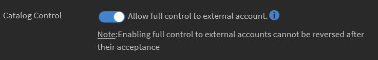
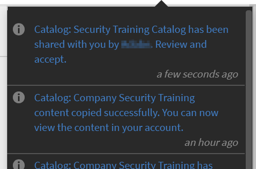
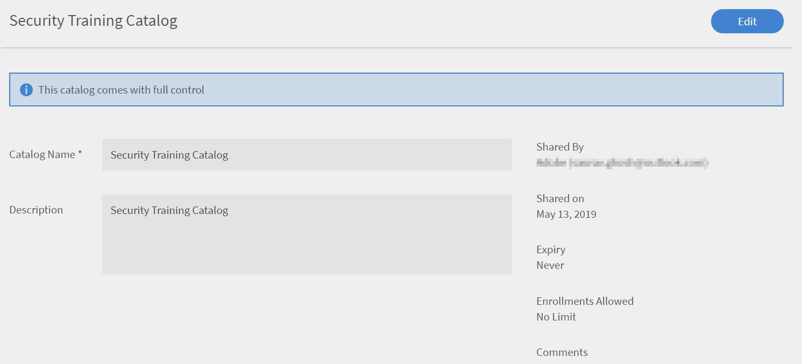
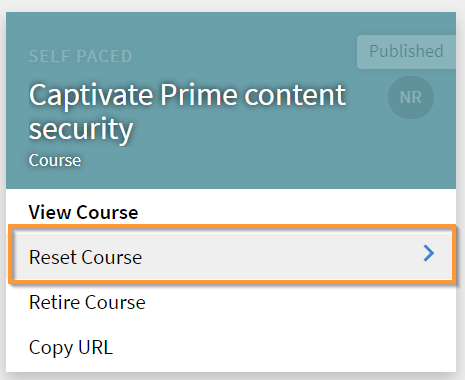
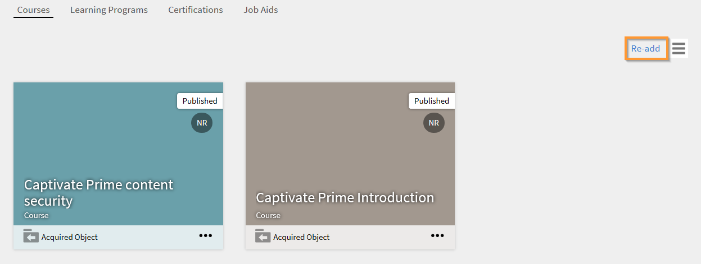
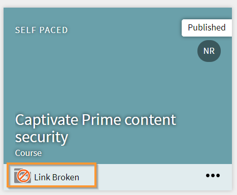

# 啟用共用目錄的完整控制權

## 建立目錄 {#createcatalog}

身為管理員，您可以建立課程、學習計畫、工作輔助和認證的目錄。

如需詳細資訊，請參閱 [目錄](/help/migrated/administrators/feature-summary/catalogs.md).

## 共用目錄 {#sharecatalog}

您可以與組織的內部使用者或任何外部使用者共用目錄。 但是，共用是專屬的。 換言之，內部共用目錄無法與外部群組共用，反之亦然。

課程、學習計畫、工作輔助和認證是共用目錄支援的學習物件。

如需詳細資訊，請參閱 [共用目錄](/help/migrated/administrators/feature-summary/catalogs.md).

## 啟用共用目錄的完整控制權 {#fullcontrol}

您可以將目錄的完整存取權授與外部帳戶。 帳戶管理員可以接著接受目錄，並據此新增或刪除學習或模組。

若要將完全控制許可權授與外部帳戶，

1. 將學習新增至目錄後，您必須與外部使用者共用目錄。
1. 在外部帳戶對話方塊上，新增外部組織管理員的子網域和電子郵件ID。
1. 在「目錄控制」選項中，切換按鈕以允許外部使用者完全控制目錄。

   

   *允許完全控制共用目錄*

   當您允許完整的目錄控制時，外部組織的管理員會接受允許修改目錄的要求。 然後，外部組織的作者可以編輯課程或新增模組。

   如需詳細資訊，請參閱以下各節。

## 外部組織的管理員 {#administratorofexternalorganization}

先前組織的管理員啟用目錄的完全控制後，外部組織的管理員即接受請求並檢視目錄。

1. 按一下通知圖示可檢視通知以接受目錄。

   <!---->

1. 若要接受目錄邀請，請按一下[接受]。
1. 在目錄清單上，如果您啟動已與您共用的目錄，則會看到目錄現在具有完整控制權的訊息。

   

   *檢視目錄詳細資訊*

1. 您可以修改目錄名稱和說明。

## 分享學習計畫、認證和工作輔助的目錄 {#sharecatalogforlearningprogramcertificationandjobaids}

就像授與課程的完整目錄控制項一樣，管理員也可以授與下列專案的完整目錄控制項：

* 學習計畫
* 認證
* 工作輔助

## 重設課程 {#resetcourse}

1. 在連結中斷的目錄卡片上，按一下 **[!UICONTROL Reset Course]**.

<!-- -->

1. 按一下「重設」按鈕後，您會看到警示訊息。 重設課程：

   * 從目錄中移除所有新新增的內容。
   * 更新與原始共用目錄同步的目錄。
   * 還原與父級學習物件的關係。

   重設目錄是不可逆的。 您無法復原對目錄所做的變更。

1. 若要接受變更，請按一下「是」。
1. 在課程目錄上，您可以看到目錄沒有訊息 *連結中斷* 再也不用了。

   當您檢視目錄詳細資訊時，您可以看到目錄現在已恢復其原始狀態。

## 重新新增學習物件 {#readdalearningobject}

如果您在無意中移除了課程、學習計畫、認證或工作輔助，您可以將其還原。

若要還原已刪除的學習物件，請按一下[重新新增]。

此動作會反轉動作並還原目錄檢視中的學習物件。

*再次新增學習物件*

按一下「重新新增」按鈕後，會出現一則確認訊息，告知您學習物件已成功新增至目錄。

## 外部組織 {#externalorganization}

當外部帳戶管理員接受目錄後，作者現在可以新增課程和學習計畫。

1. 身為使用者，您會收到通知，告知您的帳戶現在可以使用目錄。
1. 若要檢視課程清單，請按一下 **[!UICONTROL Courses]** 位於左側導覽窗格。 您可以檢視所有由您建立並與您共用的課程。
1. 若要檢視課程詳細資料，請按一下 **[!UICONTROL View Course]** 在課程卡上。

   <!---->

1. 在課程詳細資訊頁面中，您可以檢視有關課程和共用模組的資訊。 若要新增模組，請按一下新增模組。 將模組新增至現有模組時，新模組會出現在現有模組的末尾。 您可以隨時重新排列模組。
1. 新增模組後，按一下「重新發佈」。

   重新發佈模組後，您會在目錄卡上看到訊息 *連結中斷*.

   由於您已使用新模組更新原始目錄，因此與所獲得課程的現有關係已不存在。

   由於學習物件的內容已被修改，因此學習物件將與來源帳戶不同步。

   <!---->

新增並重新發佈模組後，如果您覺得先前在目錄中無意中新增或刪除了課程，您可以重設模組，並將模組回覆成最初與完整控制共用時的狀態。
