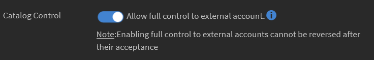
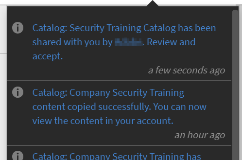
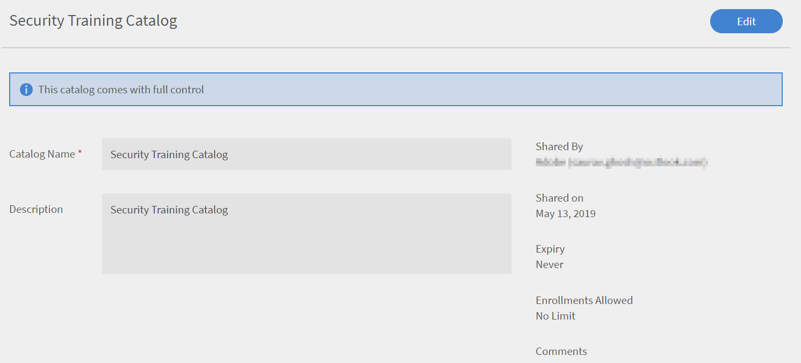
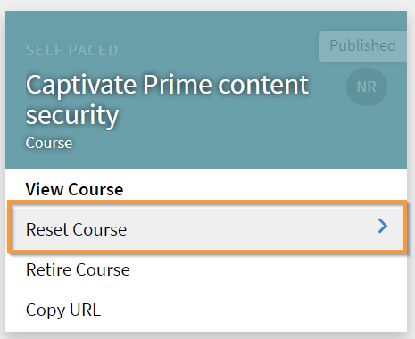
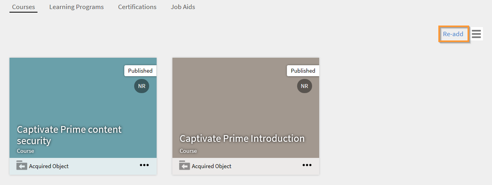
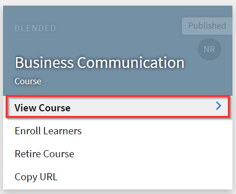
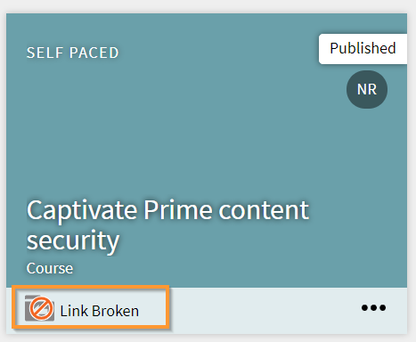

# 啟用對共享目錄的完全控制

## 建立目錄 {#createcatalog}

作為管理員，您可以建立課程目錄、學習計畫、工作輔助工具及證照。

欲了解更多資訊，請參閱 [目錄](/help/migrated/administrators/feature-summary/catalogs.md)。

## 分享目錄 {#sharecatalog}

你可以將目錄分享給組織內部使用者，或任何外部使用者。 不過，這種分享是排他性的。 換句話說，內部共享的目錄無法與外部群組共享，反之亦然。

課程、學習計畫、工作輔助工具及認證是共享目錄中支持的學習對象。

欲了解更多資訊，請參閱 [分享目錄](/help/migrated/administrators/feature-summary/catalogs.md)。

## 啟用對共享目錄的完全控制 {#fullcontrol}

你可以授權外部帳號完整存取你的目錄。 帳號管理員接著可以接受該目錄，並相應地新增或刪除學習模組。

若能完全控制外部帳戶，

1. 在將學習內容加入目錄後，你必須與外部使用者分享該目錄。
1. 在外部帳號對話框中，新增該外部組織管理員的子網域及電子郵件 ID。
1. 在「目錄控制」選項中，切換按鈕，允許外部使用者完全控制目錄。

   

   *允許對共享目錄的完全控制*

   當您允許完全目錄控制時，外部組織的管理員會接受修改目錄的請求。 外部組織的作者可以編輯課程或新增模組。

   更多資訊請參考下方章節。

## 外部組織管理者 {#administratorofexternalorganization}

一旦前組織的管理員啟用對目錄的完全控制權，外部組織的管理員接受請求、接受目錄並檢視。

1. 點擊通知圖示以查看接受目錄的通知。

   <!---->

1. 要接受目錄邀請，請點擊接受。
1. 在目錄清單中，如果你啟動已分享給你的目錄，你會看到一則訊息顯示目錄現在完全掌控了。

   

   *查看目錄詳情*

1. 你可以修改目錄名稱和描述。

## 分享學習計畫、認證及工作輔助工具的目錄 {#sharecatalogforlearningprogramcertificationandjobaids}

如同授予課程的完整目錄控制權，管理員亦可授權以下課程的完整目錄控制：

* 學習計畫
* 認證
* 工作輔助工具

## 重設航向 {#resetcourse}

1. 在連結斷裂的目錄卡上，點擊 **[!UICONTROL Reset Course]**。

<!-- -->

1. 點擊重置按鈕後，你會看到警示訊息。 重新調整航向：

   * 從目錄中移除所有新增內容。
   * 與原始共享目錄同步更新目錄。
   * 恢復與父學習對象的關係。

   重設目錄是無法逆轉的。 你無法撤銷你對目錄所做的更改。

1. 要接受變更，請點擊「是」。
1. 在課程目錄中，你可以看到課程目錄不再顯示「連結中斷&#x200B;*」的訊息*。

   當你查看目錄細節時，可以看到目錄已恢復到原始狀態。

## 重新新增學習物件 {#readdalearningobject}

如果您不小心移除了課程、學習計畫、證照或工作協助，您可以恢復該課程。

若要還原已刪除的學習物件，請點擊「重新加入」。

此動作會反轉該動作，並在目錄檢視中恢復學習物件。

*再次新增學習對象*

點擊「重新新增」按鈕後，會跳出確認訊息，表示學習物件已成功加入目錄。

## 外部組織 {#externalorganization}

一旦外部帳號管理員接受該目錄，作者即可新增課程與學習計畫。

1. 作為使用者，你會收到通知，該目錄現在已在你的帳戶中開放。
1. 要查看課程列表，請點擊 **[!UICONTROL Courses]** 左側導覽窗格。 你可以看到所有由你創建並分享給你的課程。
1. 欲查看課程詳情，請點擊 **[!UICONTROL View Course]** 課程卡。

   <!---->

1. 在課程詳情頁面，你可以看到課程及共用模組的資訊。 要新增模組，請點擊新增模組。 當你將模組加入現有模組時，新的模組會出現在現有模組的末尾。 你隨時可以重新排列模組。
1. 新增模組後，點擊重新發布。

   當你重新發佈模組後，目錄卡上會看到「連結中斷&#x200B;*」的訊息*。

   由於您已更新原始課程目錄，與所取得課程的關係已不復存在。

   學習物件會與來源帳號不同步，因為學習物件的內容已被修改。

   <!---->

新增並重新發布模組後，若您覺得之前不小心新增或刪除了課程，您可以重置模組，並完全控制地恢復到最初分享時的原始狀態。
