# 建立和修改技能與層級

建立、指派及修改技能與層級。

技能圖是組織中員工技能組、知識和特徵的分組。 這些技能圖可協助公司/組織設定或提升員工的績效期望。 技能可讓員工調整其行為以符合組織的期望。

Adobe Learning Manager可讓您使用技能圖，根據學習者的技能組合來對應學習者的績效。 當學習者完成某些課程時，學習者可以透過檢視技能圖瞭解自己對於每項技能的優勢。

Learning Manager LMS中「技能」的基本用途是為管理員提供符合業務目標的學習工具。

## 新增技能 {#addaskill}

身為管理員，您可以執行下列動作：

* 將網域對應到技能。
* 新增多個技能層級。
* 新增徽章至層級。

若要新增技能，請遵循下列步驟：

1. 在左窗格中，選取&#x200B;**[!UICONTROL Skills]** > **[!UICONTROL Add]** > **[!UICONTROL Add SKills]**。 為技能提供名稱和說明。

   

   *新增技能的名稱和描述*

1. 將網域指派給技能。 建立技能時，您可以將其對應到Learning Manager支援的最相關技能領域。 如需詳細資訊，請參閱&#x200B;[***對應網域技能***](/help/migrated/administrators/feature-summary/curation-skills.md)。

   開始在欄位中輸入網域，您就能看到建議。 選擇與技能相關的一個或多個選項。

   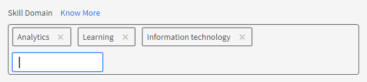

   *新增網域*

1. 指派技能的層級。 若要新增層級，請按一下&#x200B;**[!UICONTROL Add]**。

   您可以建立並指派技能給員工。 技能有各種層次，每個層次都需要獲得一定數量的學分。

   您最多可以為一個技能指派三個層級。 學習路徑是將學習者註冊到各種學習物件，然後這些學習物件會轉換為滿足各種技能水準要求的某個數量的學分。

   完成這些學習物件(LO)和層級後，學習者現在就能在比以前更有效率的層級上執行作業。

   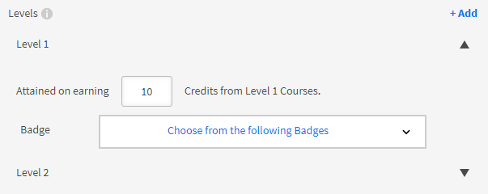

   *新增技能等級*

   新增技能時，您也可以將小數位數指派給學分。 積分最多會顯示兩位小數。

   小數點支援只有英文版。

1. 選擇層級的徽章。 從&#x200B;**[!UICONTROL Badge]**&#x200B;下拉式清單中，選取必須作為該層級徽章的影像。
1. 若要儲存變更，請按一下&#x200B;**[!UICONTROL Save]**。

   建立技能後，您可以在&#x200B;**[!UICONTROL Skill]**&#x200B;頁面上找到新建立的技能。 您也可以檢視網域和技能的簡短說明。 您也可以檢視已指定給每個層次的層次與銷退折讓。

   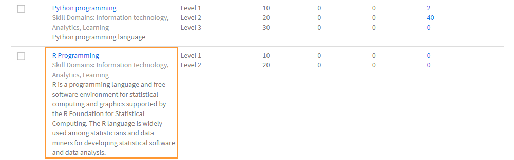

   *檢視技能清單*

## 將技能指派給學習者 {#assigntheskilltolearners}

管理員可以將技能指派給學習者。

建立您的技能並儲存後，這些技能會列在技能頁面中。 現在，您可以開始將這些技能指派給學習者，如下所示：

1. 在&#x200B;**[!UICONTROL Skill]**&#x200B;頁面上，按一下包含已註冊該技能的學習者人數的超連結。 若為新建立的技能，所有層級的學習者人數為零。

   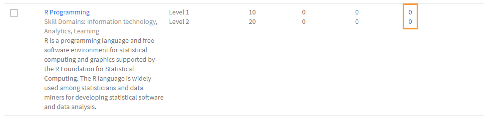

   *檢視指派給某項技能的學習者*

   在此範例中，新增第1級的學習者。 按一下層級1旁的超連結。

1. 在學習者對話方塊中，按一下&#x200B;**[!UICONTROL Add Learners]**。

   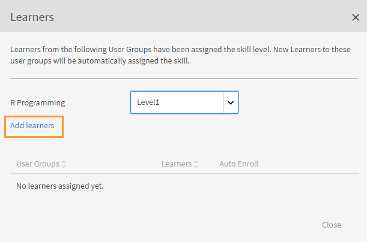

   *新增學習者*

1. 搜尋學習者並新增學習者。 您也可以新增使用者群組。

   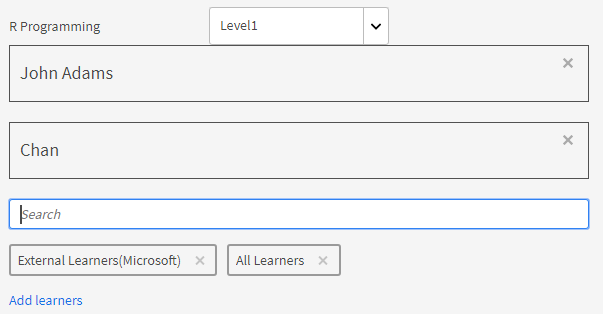

   *搜尋並新增學習者*

1. 若要儲存變更，請按一下&#x200B;**[!UICONTROL Save]**。

   在您指派學習者後，使用者群組中的所有學習者（如果有的話）都會預設自動註冊該技能。 您可以按一下&#x200B;**[!UICONTROL Auto Enroll]**&#x200B;按鈕，讓學習者選擇退出自動註冊。

   

   *停用自動註冊*

   個別學習者可自動註冊，或由管理員註冊學習計畫。

1. 按一下「**[!UICONTROL Close]**」後，您可以看到已指派給您已建立之技能的學習者總數。

   在此範例中，使用者群組中有兩個個別學習者和三個學習者。

   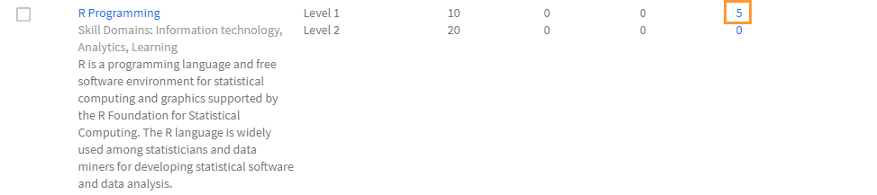

   *指派給某項技能的學習者數*

## 將技能指派給課程 {#assignskilltocourse}

建立技能後，作者可以建立課程並將技能指派給課程。

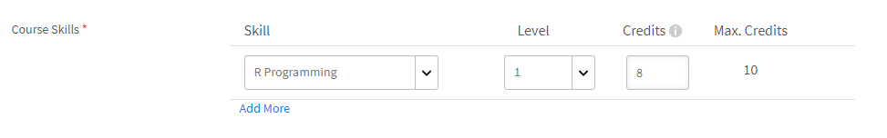

*指派技能給課程*

作者發佈課程後，您可以在&#x200B;**[!UICONTROL Skill]**&#x200B;頁面上看到與技能等級相關聯的課程計數，當您指派技能給新課程時，此計數會增加。

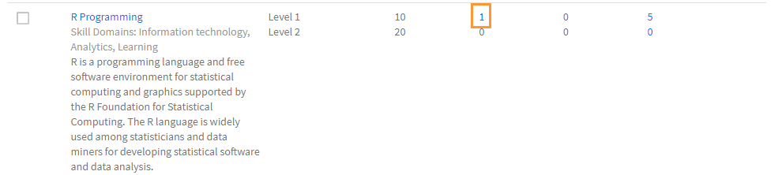

*與技能等級相關的課程數目*

## 將工作輔助指派給技能 {#assignajobaidtotheskill}

工作輔助是學習者無需註冊任何特定學習物件（例如課程或學習計畫）即可存取的培訓內容。

建立工作輔助時，作者可以將技能等級與其建立關聯。 建立沒有技能的工作輔助並將它與有技能的課程相關聯時，不會將該技能連結到工作輔助。

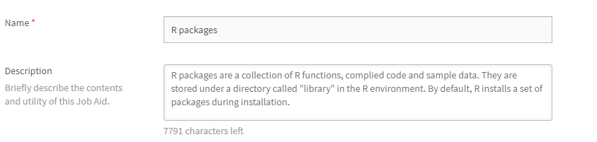

*建立工作輔助*

在&#x200B;**[!UICONTROL Skill]**&#x200B;頁面上，您可以看到與該技能等級相關聯的工作輔助數目。

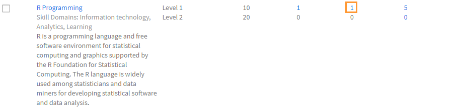

*技能的工作輔助數目*

## 搜尋技能 {#searchskill}

輸入技能的名稱並從顯示的選項中選擇技能，即可搜尋任何技能。 提前輸入搜尋也適用於此處。

您可以在「技能」頁面的&#x200B;**[!UICONTROL Active]**&#x200B;和&#x200B;**[!UICONTROL Retired]**&#x200B;區段中搜尋技能。

## 編輯技能 {#editaskill}

在&#x200B;**[!UICONTROL Skill]**&#x200B;頁面上，按一下您要修改的技能。 在&#x200B;**[!UICONTROL Edit Skill]**&#x200B;對話方塊中進行必要的變更，例如

* 新增或刪除技能領域。
* 編輯技能的名稱和說明。
* 新增技能等級或修改現有等級。
* 新增或刪除技能的徽章。

完成變更後，請按一下&#x200B;**[!UICONTROL Save]**。

## 淘汰技能 {#retireaskill}

若要淘汰技能，請在&#x200B;**[!UICONTROL Skill]**&#x200B;頁面上選取您要淘汰的技能。

從&#x200B;**[!UICONTROL Actions]**&#x200B;功能表，按一下頁面右上角的&#x200B;**[!UICONTROL Retire]**。

當您淘汰一項技能時，該技能將不再出現在課程中。

技能淘汰後，就無法再與任何其他課程或工作輔助建立關聯，也無法指派給學習者，直到重新發佈為止。 現有的關聯和指派不受技能淘汰的影響。

## 重新發佈技能 {#republishaskill}

一旦您淘汰某項技能，該已淘汰的技能就會出現在&#x200B;**[!UICONTROL Retired]**&#x200B;標籤中。 此索引標籤會顯示所有已淘汰技能的清單。

若要重新發佈已淘汰的技能，請選擇該技能，然後從&#x200B;**[!UICONTROL Actions]**&#x200B;功能表按一下&#x200B;**[!UICONTROL Republish]**。

這會恢復技能，您可以在&#x200B;**[!UICONTROL Active]**&#x200B;索引標籤中再次看到技能。

## 刪除技能 {#deleteaskill}

您只能刪除先前已淘汰的技能。

在&#x200B;**[!UICONTROL Retired]**&#x200B;索引標籤中，選取您要刪除的技能，然後從&#x200B;**[!UICONTROL Actions]**&#x200B;功能表按一下&#x200B;**[!UICONTROL Delete]**。

僅當技能未與任何學習者、課程或工作輔助相關聯時，您才可以刪除技能。

## 指派技能給講師

新增包含講師技能的CSV檔案。 然後，這些技能會新增至技能清單。

1. 在熒幕的右上角，選取&#x200B;**[!UICONTROL Add]** > **[!UICONTROL Assign skills to instructor]**。
1. 上傳csv。 CSV中的欄包括：

   * 技能名稱
   * 技能等級
   * 講師電子郵件或講師UUID

   對於啟用UUID的帳戶，請將「講師電子郵件」欄取代為「講師UUID」。

   按一下「儲存」。

   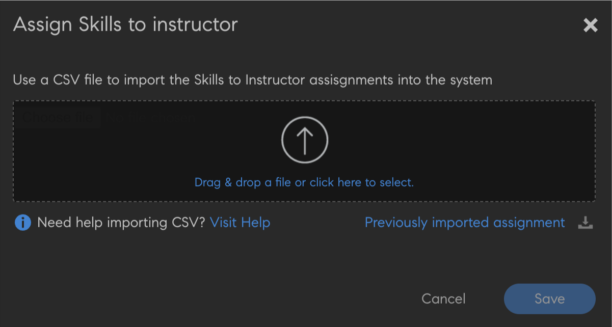

   *從CSV新增講師技能*

1. 您會看到確認快顯訊息。

   注意：如果CSV包含不正確的欄位，則會彈出以下錯誤訊息。

   

   不正確欄位的&#x200B;*錯誤訊息*

### 技能頁面

在「技能」頁面上，有一個名為「講師」的欄，代表指定給某項技能的講師人數。 如果按一下講師人數，畫面會顯示快顯視窗，其中顯示指派給技能的講師。

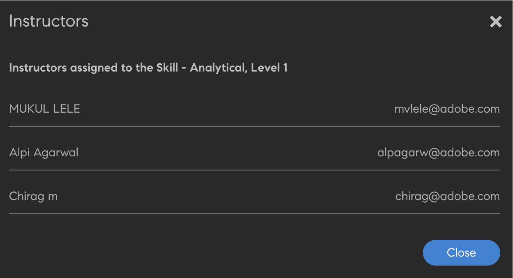

*技能頁面*

### 下載技能指派CSV

1. 在[技能]頁面上，按一下&#x200B;**[!UICONTROL Add]** > **[!UICONTROL Assign Skills to instructor]**。
1. 在對話方塊中，按一下&#x200B;**[!UICONTROL Previously Added Assignment]**。
1. 將會下載您上次上傳的CSV。

>[!NOTE]
>
>我們建議您先下載技能指派CSV、編輯然後上傳檔案。

## 常見問題 {#frequentlyaskedquestions}

+++如何將學習者從技能中移除？

您無法從技能中移除學習者。 不過，您可以新增新學習者或使用者群組至該技能。
+++

+++如何讓學習者自動註冊技能？

自動註冊功能僅適用於使用者群組。 將使用者群組（例如「所有作者」）註冊到技能並儲存時，預設會啟用自動註冊。 因此，使用者群組「所有作者」的任何新增專案也會獲得該技能。

如果您停止自動註冊「所有作者」的該技能等級，則任何新增至「所有作者」使用者群組的新使用者都不會獲得該技能。
+++

+++如何重新啟動自動註冊？

將已停止自動註冊的相同使用者群組再次註冊到技能層級。

這樣做會重新啟動自動註冊，此功能關閉時新增到群組的學習者也會獲得現在指定的技能。

也就是說，每當您重新註冊使用者群組以啟動「自動註冊」時，它會重新整理使用者群組成員並將技能指派給所有目前成員。
+++

+++如何將技能指派給課程？

如需程式的詳細資訊，請參閱[指派技能給課程](skills-levels.md#assignskilltocourse)一節。
+++

+++如何變更技能等級？

若要變更技能的單一或多個層級，請編輯技能，並修改現有層級的屬性。
+++

+++如何啟用徽章和技能，使其與課程完成繫結？

將課程建立為作者時，技能可以與課程完成相關聯。 在「設定」區段中，您可以設定課程完成的技能條件。

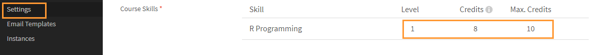

若要啟用課程完成的徽章，請在作者應用程式的&#x200B;**[!UICONTROL Instances]**&#x200B;區段中，啟用必要的徽章。
+++

+++即使徽章顯示「進行中」，管理員是否仍可以將徽章標籤為完成？

管理員可將學習物件標示為完成。 技能與徽章與學習物件相關聯，且無法單獨標示&#x200B;**[!UICONTROL Complete]**。

換句話說，若要取得徽章，**必須完成相關的學習物件**。
+++

### 更多相關資訊

* [技能和Adobe Learning Manager](https://elearning.adobe.com/2018/11/skills-captivate-prime/)
