# 創建與修改技能與等級

創建、指派並修改技能與等級。

技能地圖是組織中員工技能組合、知識與特質的集合。 這些技能地圖幫助公司/組織設定或提升員工的績效期望。 技能使員工能將行為與組織期望對齊。

Adobe Learning Manager 讓你能利用技能地圖，根據學習者的技能組合來繪製他們的表現。 當學習者完成部分課程後，可以透過技能地圖了解自己在各項技能上的表現。

學習管理管理系統中的技能（Skills in the Learning Manager LMS）的基本目的是為管理員提供一個工具，使學習與業務目標對齊。

## 新增技能 {#addaskill}

作為管理員，您可以執行以下任務：

* 將領域對應到技能。
* 增加多層技能。
* 在關卡中加入徽章。

要新增一項技能，請依照以下步驟操作：

1. 在左側窗格選擇 **[!UICONTROL Skills]** > **[!UICONTROL Add]** > **[!UICONTROL Add SKills]**。 給這個技能一個名字和描述。

   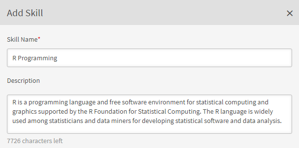

   *新增技能名稱和描述*

1. 為該技能指派一個領域。 在建立技能時，你可以將其映射到學習管理器支援的最相關技能領域。 更多資訊請參見 [***「地圖技能與領域***](/help/migrated/administrators/feature-summary/curation-skills.md)」。

   開始在欄位輸入網域，你就能看到推薦。 選擇與該技能相關的選項。

   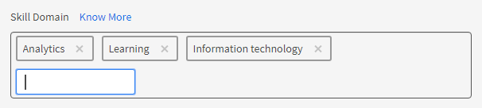

   *新增網域*

1. 把等級分配給技能。 要新增關卡，請點擊 **[!UICONTROL Add]**。

   你可以為員工創建並指派技能。 技能有不同等級，每個等級都需要獲得一定數量的信用點數。

   你最多只能為一個技能分配三級。 學習路徑是將學習者註冊到各種學習對象，這些學習對象會轉化為一定數量的學分，滿足各技能層級的要求。

   一旦這些學習對象（LO）和等級達成，學習者就能比以往更有生產力地表現。

   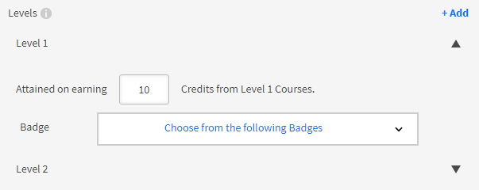

   *增加技能等級*

   新增技能時，也可以對信用點分配小數。 製作名單顯示至小數點後兩位。

   十進位支援僅提供英文版本。

1. 選擇該關卡的徽章。 從 **[!UICONTROL Badge]** 下拉選單中選擇一張必須用作該關卡徽章的圖片。
1. 要儲存變更，請點擊 **[!UICONTROL Save]**。

   技能建立完成後，你可以在 **[!UICONTROL Skill]** 頁面上找到新建立的技能。 你也可以看到領域和技能的簡短說明。 你也可以查看每個關卡分配的關卡和製作人員名單。

   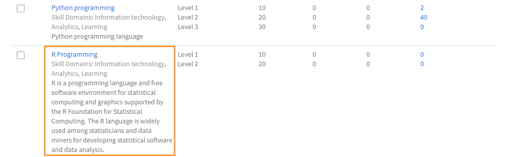

   *技能列表*

## 大量增加技能

管理員可直接在 Adobe Learning Manager 的「新增技能&#x200B;**」對話框中加入多項技能，使用批量上傳選項**。

大量新增技能：

1. 從左側窗格選擇 **技能** 。

1. 選擇 **新增** > **新增技能**。   彈出一個「 **新增技能** 」視窗。

1. 選擇&#x200B;**大量新增技能（上傳 CSV）。**

   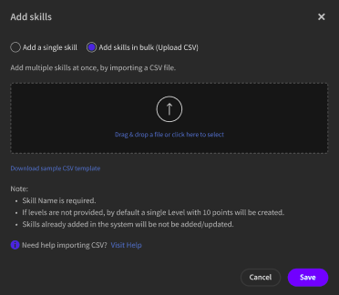
   *新增技能的彈窗會讓選項批量新增技能。*

1. 上傳包含技能細節的 CSV 檔。

1. 選擇 **儲存**。

## 將技能分配給學習者 {#assigntheskilltolearners}

管理者可以將技能分配給學習者。

當你創建並儲存技能後，技能會被列在技能頁面。 現在，你可以開始將這些技能分配給學習者，如下：

1. 在頁面 **[!UICONTROL Skill]** 上，點擊顯示該技能註冊人數的超連結。 對於新創造的技能，所有等級的學習者數量為零。

   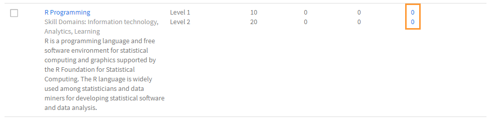

   *查看分配到某項技能的學習者*

   在這個例子中，加入第一級的學習者。 點擊第一層旁邊的超連結。

1. 在學習者對話框中，點擊 **[!UICONTROL Add Learners]**。

   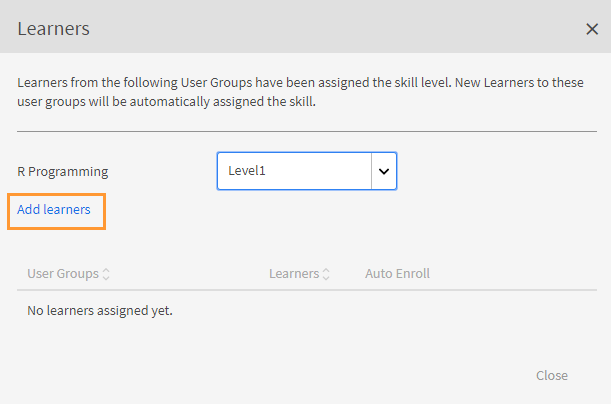

   *新增學習者*

1. 搜尋學習者並新增學習者。 你也可以新增使用者群組。

   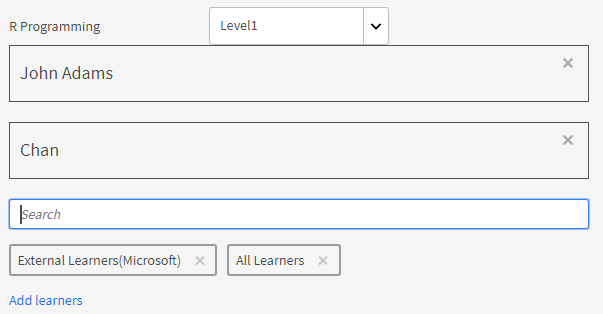

   *搜尋並新增學習者*

1. 要儲存變更，請點擊 **[!UICONTROL Save]**。

   分配學習者後，使用者群組中所有學習者（如有）預設自動註冊到該技能。 你可以點擊 **[!UICONTROL Auto Enroll]** 按鈕讓學習者選擇退出自動註冊。

   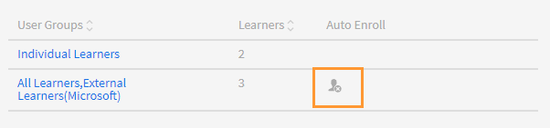

   *關閉自動註冊*

   個別學習者可自行自動註冊，或由管理員自行註冊學習計畫。

1. 點擊 **[!UICONTROL Close]**&#x200B;後，你可以看到分配到你所創建技能的總學習人數。

   在這個例子中，使用者群組中有兩個獨立學習者和三個學習者。

   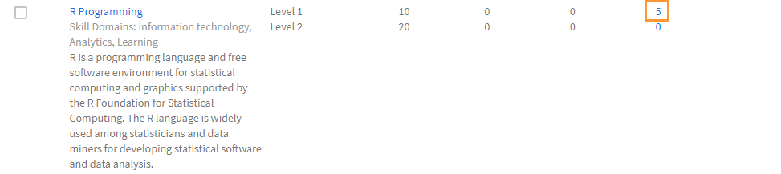

   *分配到某項技能的學習人數*

## 將技能指派到課程中 {#assignskilltocourse}

一旦你建立了技能，作者就可以建立課程，並將技能指派到課程上。

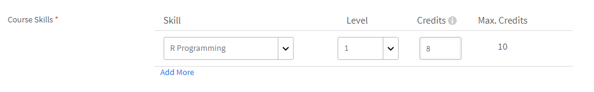

*將技能分配到課程中*

作者發布課程後， **[!UICONTROL Skill]** 頁面上可以看到與技能等級相關的課程數量，當你將該技能分配到新課程時，該等級會增加。

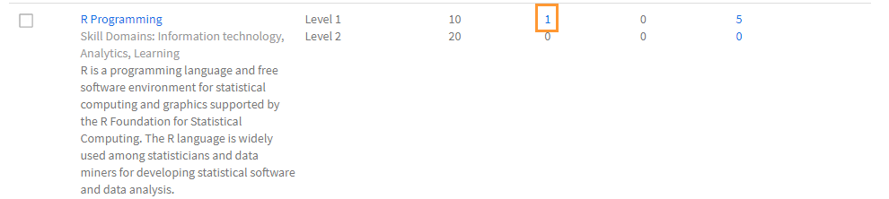

*與技能等級相關的課程數量*

## 為該技能指定工作輔助工具 {#assignajobaidtotheskill}

工作輔助工具是學習者無需註冊特定學習對象（如課程或學習計畫）即可取得的訓練內容。

在撰寫工作輔助工具時，作者可以根據技能等級來參考。 沒有技能的職涯輔助工具，並將其與有技能的課程連結，並不代表該技能與職涯輔助工具連結起來。

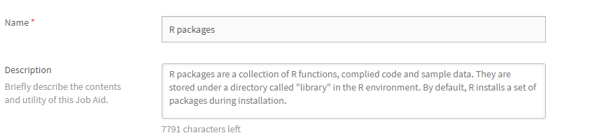

*建立就業輔助工具*

在頁面 **[!UICONTROL Skill]** 上，你可以看到與該技能等級相關的工作輔助工具數量。

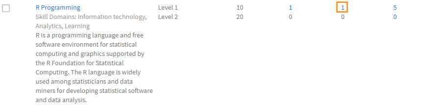

*技能的職業輔助工具數量*

## 搜尋技能 {#searchskill}

輸入技能名稱，從選項中選擇技能即可搜尋。 預先打字搜尋也適用於此處。

你可以在 **[!UICONTROL Active]** 技能頁面的 **[!UICONTROL Retired]** 各個區塊中搜尋技能。

## 編輯技能 {#editaskill}

在頁面 **[!UICONTROL Skill]** 上，點擊你想修改的技能。 在對話框 **[!UICONTROL Edit Skill]** 中，做必要的修改，例如，

* 新增或刪除技能領域。
* 編輯技能名稱與描述。
* 新增技能等級或修改現有等級。
* 新增或刪除技能徽章。

完成變更後，請點擊 **[!UICONTROL Save]**。

## 退役一項技能 {#retireaskill}

要退休一項技能，請在頁面 **[!UICONTROL Skill]** 上選擇你想退休的技能。

在 **[!UICONTROL Actions]** 選單中，右上角點擊 **[!UICONTROL Retire]**。

當你退休一項技能時，該技能將不再出現在賽道上。

當一項技能被退休時，除非重新發布，否則無法與任何課程或工作輔助工具相關聯，也無法指派給學習者。 現有的協會與分配不會因技能退休而受到影響。

## 重新發佈一項技能 {#republishaskill}

一旦你退休了某個技能，該退休技能就會出現在分 **[!UICONTROL Retired]** 頁中。 分頁會顯示所有已退休技能的清單。

若要重新發布已退休的技能，選擇該技能，然後在選單中 **[!UICONTROL Actions]** 點擊 **[!UICONTROL Republish]**。

這樣技能會恢復，你也可以在 **[!UICONTROL Active]** 分頁中再次看到該技能。

## 刪除技能 {#deleteaskill}

你只能刪除之前已經退休的技能。

在分 **[!UICONTROL Retired]** 頁中選擇你想刪除的技能，然後在 **[!UICONTROL Actions]** 選單中點選 **[!UICONTROL Delete]**。

只有當技能與任何學習者、課程或工作輔助工具無關聯時，才能刪除該技能。

## 指派技能給講師

新增一個包含教師技能的 CSV 檔案。 這些技能隨後會被加入技能清單。

1. 在螢幕右上角，選擇 **[!UICONTROL Add]** > **[!UICONTROL Assign skills to instructor]**。
1. 上傳 csv。 CSV 中的欄位如下：

   * 技能名稱
   * 技術水準
   * 講師電子郵件或講師UUID

   對於啟用 UUID 的帳號，請將「講師電子郵件」欄位替換為「講師 UUID」。

   點擊儲存。

   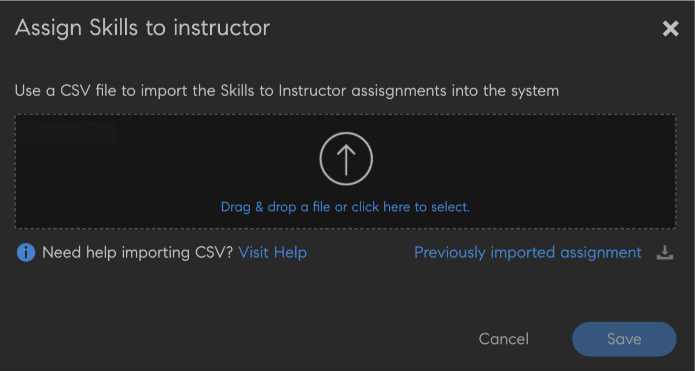

   *從 CSV 新增講師技能*

1. 你會看到確認訊息。

   注意：若 CSV 欄位錯誤，會跳出以下錯誤訊息。

   

   *錯誤欄位訊息*

### 技能頁面

在技能頁面上，有一欄叫做「講師」，代表某項技能分配的講師人數。 點擊教練人數，會跳出一個視窗，顯示分配給該技能的教練。

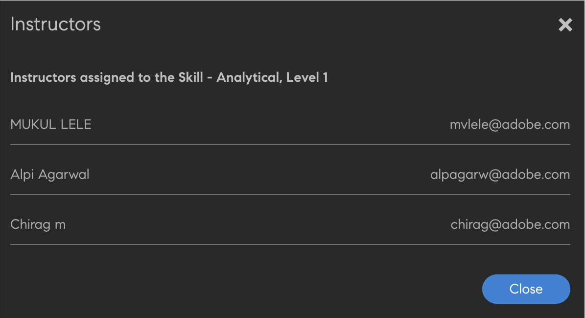

*技能頁面*

### 下載技能作業 CSV

1. 在技能頁面，點擊 **[!UICONTROL Add]** > **[!UICONTROL Assign Skills to instructor]**。
1. 在對話框中，點擊 **[!UICONTROL Previously Added Assignment]**。
1. 你最後上傳的 CSV 會被下載。

>[!NOTE]
>
>我們建議您先下載技能分配的 CSV，編輯後再上傳檔案。

## 常見問題 {#frequentlyaskedquestions}

+++我該如何將學習者從技能中移除？

你無法將學習者從技能中移除。 不過你可以新增學習者或使用者群組到技能中。
+++

+++如何自動讓學習者註冊某項技能？

自動註冊功能僅限使用者群組使用。 例如，當你註冊一個使用者群組，例如所有作者，並儲存技能時，預設會啟用自動註冊。 因此，所有新增的用戶群組「所有作者」也會被分配該技能。

如果你停止自動註冊該技能等級的「所有作者」，新增到「所有作者」使用者群組的使用者就不會被分配該技能。
+++

+++如何重新開始自動登記？

請將同一使用者群組重新註冊到已停止自動註冊的技能等級。

這樣做會重新啟動自動註冊，且關閉此功能時加入群組的學習者也會被分配該技能。

也就是說，每當你重新註冊一個使用者群組以啟動自動註冊時，系統會刷新使用者群組成員，並將技能分配給所有現有成員。
+++

+++我該如何為課程指派一項技能？

欲了解更多程序資訊，請參閱「將技能分配給課程](skills-levels.md#assignskilltocourse)」章節[。
+++

+++我該如何改變技能等級？

若要更改技能中的一個或多個等級，請編輯技能並修改現有等級的屬性。
+++

+++我該如何啟用徽章和技能，讓它們與課程完成掛鉤？

技能可以與課程完成度掛鉤，並以作者身份創建課程。 在設定區，你可以設定完成課程的技能標準。

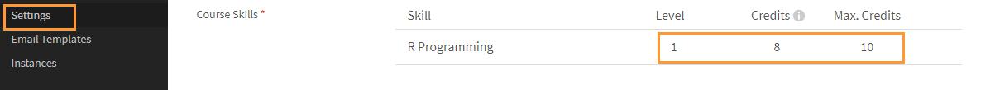

要啟用課程完成徽章，請在 **[!UICONTROL Instances]** 作者應用程式的區塊啟用所需的徽章。
+++

+++即使徽章顯示「進行中」，管理員可以將徽章標記為完成嗎？

管理員可以將學習物件標記為完成。 技能與徽章與學習對象相關聯，且無法單獨標記 **[!UICONTROL Complete]** 。

換句話說，要獲得徽章， **必須完成相關的學習對象**。
+++

### 更像這樣

* [技能與 Adobe 學習管理器](https://elearning.adobe.com/2018/11/skills-captivate-prime/)