# 以管理員身分監控及調節社交學習

身為管理員，您可以啟用、停用及監視在社交學習中執行的活動。 社交學習功能啟用後，學習者即可檢視該功能，並開始參與社交學習。

## 在社交學習中啟用及設定設定 {#enableandconfiguresettingsinsociallearning}

若要啟用並設定「社交學習」功能，請執行下列動作：

1. 按一下 **[!UICONTROL Social Learning]** 從左側導覽面板。 系統會將您重新導向至活動頁面。
1. 啟用 **[!UICONTROL Social Learning]** 功能使用 **[!UICONTROL Enable]** 按鈕（若您是第一次開啟）。 否則，可從以下位置啟用： **[!UICONTROL Settings]** 頁面。

   快顯對話方塊會出現，如下面的熒幕擷圖所示。

   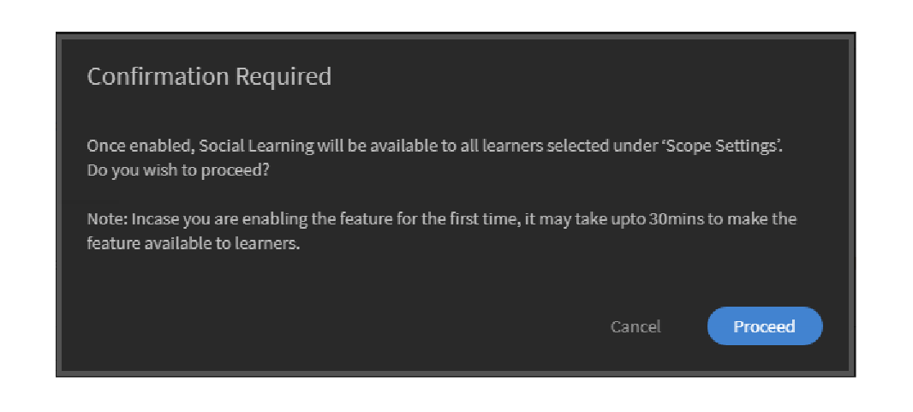 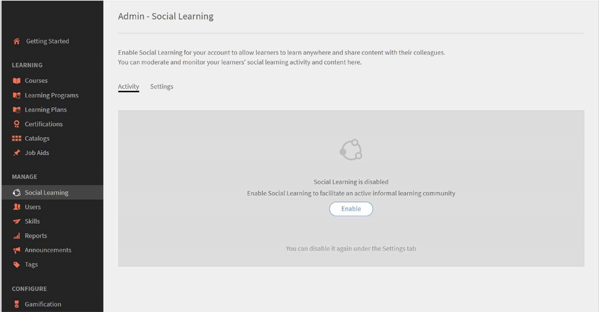

   *啟用社交學習*

<!-- 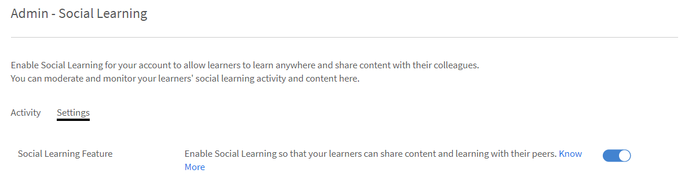 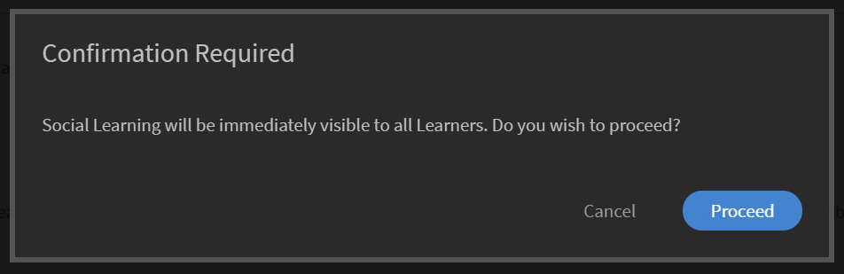-->

管理員可以設定社交學習的設定。 設定包含的內容組織型別，例如 **[!UICONTROL Manual-Only Curation]** 和 **[!UICONTROL No Curation]**. 範圍設定可設為不同的範圍，例如使用者型別（內部/外部）或帳戶中存在的任何其他作用中欄位。 管理員可設定URL路徑，讓學習者從此處下載AdobeLearning Manager案頭應用程式。

## 內容策劃 {#contentcuration}

由於社交學習是非正式學習，因此其功能與其他社群媒體平台類似。 人們經常會發現社群媒體會讓人分心，因為他們經常消費不相關的內容，而這會影響他們的生產力。 此想法可透過內容協調和組織來滿足。

**[!UICONTROL Manual-Only Curation]** 和 **[!UICONTROL No Curation]** 是管理員可選取的兩個組織選項。

**[!UICONTROL Auto-assisted Manual Curation]：** Learning Manager具備人工智慧式自動組織引擎，能聰明地找出任何格式內容的精髓，以便日後提供給所需學習者。 它也可以根據給定的信賴度分數，核准或拒絕內容發佈。

例如，Adarsh是學習者，他發現部落格很有趣，因此在Adobe Learning Manager的Social Learning平台上發佈部落格。 貼文接著會傳送至AI支援的內容組織引擎，由其預測內容中存在的技能，並將這些技能與相關展示板技能進行比較。 如果任何技能相符，則會張貼內容，否則僅會傳送以進行手動組織。

張貼所需的最低信賴分數為50%。

**[!UICONTROL Manual-Only Curation]：** 若要在內容上線之前檢查內容的真實性，管理員可以啟用僅限手動組織的設定。 啟用僅限手動管理的設定後，就會移至排名在前的SME （最多3個）進行組織。 根據平均回應，會據此核准/拒絕貼文。 如果回應大於等於50%，則貼文上線否則被拒絕。 如需SME的詳細資訊， [按一下這裡](social-learning-configurations-as-an-admin.md#SubjectMatterExpertsSMEs).

## 自動組織內容 {#autocuration}

手動仲裁內容通常容易發生錯誤並需要大量時間。 此外，該程式不可擴充，且不適合大量社交活動。 因此，在為許多活躍於社交活動的使用者提供服務時，自動組織內容就變得至關重要。

在Learning Manager中，有一個選項可自動組織內容。 組織工作由啟用AI的引擎驅動，在管理員對應預先定義的技能與某項技能後，該引擎會對應與預先定義的技能搭配運作。 如需詳細資訊，請參閱 [技能領域對應](curation-skills.md).

在自動組織中，允許下列內容型別：

* PDF
* 音訊和視訊檔案
* Presentations- PPT或PPTX
* 檔案 — .doc， .docx

管理員可以啟用在管理員應用程式內自動組織內容的選項。

1. 在管理員應用程式的左窗格中，按一下 **[!UICONTROL Social Learning]**.
1. 在頁面上，按一下索引標籤 **[!UICONTROL Settings]**.
1. 啟用選項 **[!UICONTROL Auto-assisted Manual Curation]**.

   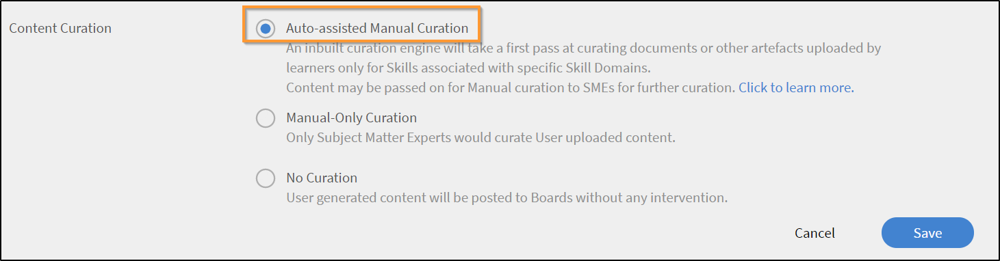

   *選取「自動輔助手動組織」選項*

當使用者上傳展示板中的內容時，AI型演演算法會從內容中清除文字，然後文字會傳遞至組織引擎。 組織引擎會嘗試尋找內容中存在的技能。

來自上傳內容的預測技能與內容上傳所在展示板的技能相符。  如果任何技能符合且信賴分數超過面板技能的50%，內容會張貼在面板中。 如果信賴分數小於50%，則會傳送內容以供手動組織。

每當內容自動組織時，使用者都會收到通知，告知內容可在先前上傳的展示板中使用。

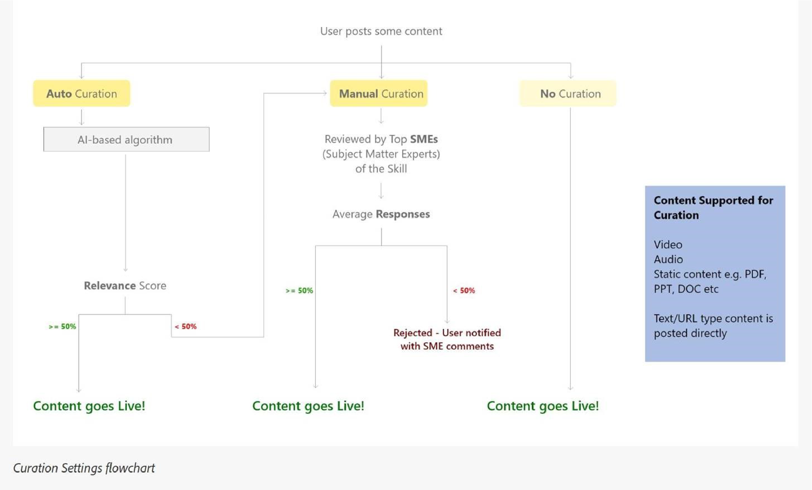

*組織設定的流程圖*

如果僅手動組織開啟，建議管理員新增技能的SME。 管理員可以預先為具有某一技能專門知識的使用者提供SME分數，以新增SME。 若要進一步瞭解如何向SME提供點數，  [按一下這裡](social-learning-configurations-as-an-admin.md#SubjectMatterExpertsSMEs).

**無組織：** 所有學習者的貼文都會自動發佈，無需任何內容稽核。

<!--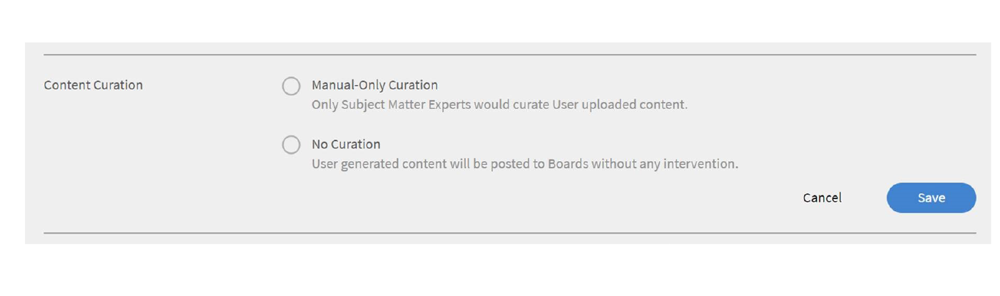-->

## 關於自動組織內容的常見問題 {#faq-auto-curation}

+++SME監管貼文需要多久時間？

SME最少會有24小時來組織貼文。 由於時區差異，這可能會增加到47小時。

+++

+++如果這三個SME全部可用，是否會移至下一組？ 總是會有三個SME參與嗎？

組織請求會在第一天前往SME頂端。 如果他們沒有回應，那麼要求會在隔天送到接下來的3個SME。

如果三個新SME沒有回應，則會向討論區的版主提出要求。

如果展示板版主未回應，請求就會自動核准。

+++

+++如果有兩個SME組織，但有一個沒有 — 該請求是移至第四個SME還是該請求會取平均值（無論第一輪SME對貼文的評價如何）？

需要50%的核准評等才能核准此貼文。 同樣地，會使用50%拒絕評等來拒絕貼文。 SME每次完成核準時，都會評估其是否達到50%。

如果一天後未達到50%，則會傳送至下一組SME，讓先前的未回應組織請求過期。

例如，組織要求會在第一天傳送給三位SME；其中一位SME核准該要求，而兩位沒有回應。 第二天，組織要求會進入下一組三個SME；現在此層級共有四個作用中的SME。 必須由至少兩位SEM核准才能核准組織。（如果2個核准和2個拒絕，則系統會採用前50%的值。）

+++

+++根據我看到的內容，只有當有人建立新面板時，才會指派「版主」（而且並非強制性） — 如果將SME指派給與面板關聯的技能，學習者將「版主」指派給面板的使用案例為何？

以下是Social版主的責任：

* 可編輯展示板名稱、說明、展示板可見度設定及其他組態。
* 當貼文不適合對象時，可在留言板上刪除貼文。
* 版主會收到展示板的「不當使用報告」通知。
* 如果討論區沒有SME，版主會收到監管請求。

+++

+++我們的訓練團隊將會新增/監控與技能水準相關的技能，以及指派給這些技能的SME。

SME是根據技能（而非技能等級）新增/指派。 一切如期進行。

+++

+++社交學習「版主」和社交學習「SME」有何不同？

**版主：** 展示板的次要擁有者。 在電路板建立期間，它們由建立者加入，因此他們可以在沒有建立者的情況下控制電路板。 依預設，展示板的建立者為版主。

**SME：** 主題專家是特定技能的專家。 管理員可以指派SME給特定技能，以組織該技能的內容。 SME會收到連結至其技能之展示板的組織請求。 學習者也可以藉由獲得SME點數而成為SME。

+++

+++如果有兩個或三個SME被指派某項技能 — 社交學習貼文核准或拒絕是否取決於所有SME的組織或誰先組織？

需要50%的核准評等才能核准此貼文。 同樣地，會使用50%拒絕評等來拒絕貼文。 SME每次完成核準時，都會評估其是否達到50%。

如果一天後未達到50%，則會傳送至下一組SME，讓先前的未回應組織請求過期。

+++

## 範圍設定 {#scopesettings}

在社交學習中，範圍會決定您所看到的面板，這會控制內容的可見度。 例如，如果使用者有範圍， ***Vendor_A***，他/她只能看到由屬於相同範圍的其他人建立的展示板和相關貼文 ***Vendor_A***.

這可讓管理員維護單獨組織中的廠商、合作夥伴或部門等同類使用者。

為內部和外部使用者啟用社交學習和排行榜。

有不同的區段可啟用內部和外部使用者。

**為內部學習者啟用**

在此區段中，您可以選擇使用者特性，以定義內部使用者的社交學習範圍。 具有相同特性的使用者 **值** 共用相同的社交學習空間。

從 **使用者特性** 從下拉式清單中選擇所需的選項。

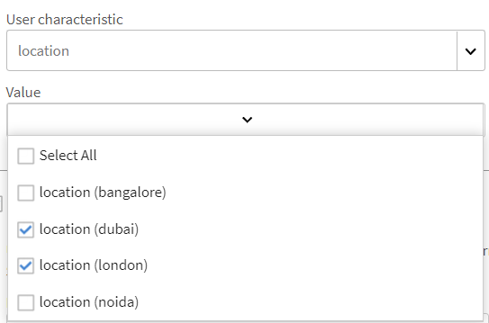

*選取使用者特性以定義範圍*

依預設，選項 **[!UICONTROL All Internal Users]** 「使用者特性」下拉式清單選項一律選取。

您可以根據內部使用者的作用中欄位來限定其範圍。

**為外部學習者啟用**

若要定義外部使用者的學習範圍，請使用外部設定檔。 具有相同外部設定檔的學習者會共用相同的社交學習空間。

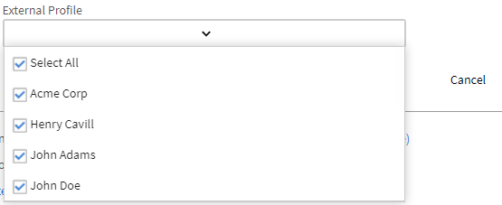

*為外部學習者啟用範圍*

外部使用者根據其外部設定檔設定範圍。

例如，從上方清單，如果您啟用 **[!UICONTROL Acme Corp]**，屬於Acme Corp的所有學習者都可以看見他們已建立的看板。 如果您停用選項 **亨利·卡維爾**，學習者無法看見Henry Cavill建立的任何展示板。

管理員可以根據 **[!UICONTROL User characteristic]** 欄位。

例如，管理員可以將範圍設為 **[!UICONTROL User Type (Internal/External)]** 使用者。 將範圍設定為「使用者型別」時，任何內部學習者在Social Learning平台上共用的內容僅對組織中的其他內部學習者可見，對外部使用者不可見，反之亦然。

管理員選取「使用者特性」後，即可選取「使用者特性」欄位下方的核取方塊，將「社交學習」功能限製為學習者和學習者群組。 按一下值欄位，以選取您要為其啟用社交學習功能的學習者或學習者群組。

依預設，設定範圍的工具為 **[!UICONTROL User Type]** 即內部或外部學習者。

如果作用中欄位不包含任何值，則 **[!UICONTROL Value]** 管理員看不到欄位下拉式清單。

<!-- 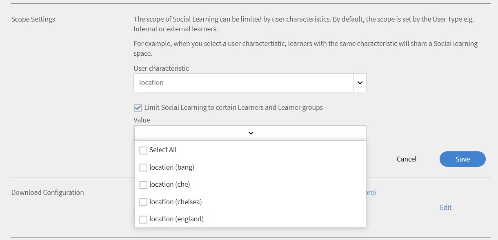-->

使用者也可以使用AdobeLearning Manager案頭應用程式發佈其內容。 視您是Mac或Windows使用者而定，按一下指定的連結以下載案頭應用程式，然後依照指定的步驟將其安裝至您的系統。 如果您在安裝時遇到任何困難， [按一下這裡](../../kb/troubleshooting-issues-with-adobe-learning-manager-desktop-app.md).

## 展示板建立許可權 {#permission}

為了限制所有學習者建立展示板並有效地稽核展示板，管理員可以將建立展示板的許可權授予選定的使用者群組。

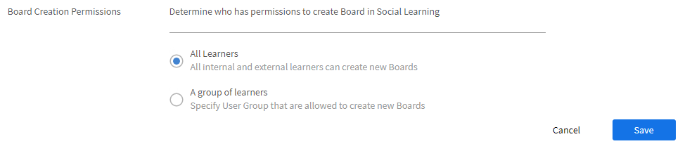

*設定建立展示板的許可權*

依預設，選項 **[!UICONTROL All Learners]** 已啟用。

**[!UICONTROL All Learners]：** 如果您選擇此選項，所有內部和外部使用者都可以建立面板。

**學習者群組：** 如果選擇此選項，則只有擁有建立展示板許可權的使用者會看到 **[!UICONTROL Create New Board]** 社交學習中的連結。 選擇必須被授予建立展示板許可權的使用者群組。 您也可以新增自動產生的以及自訂的使用者群組。

<!--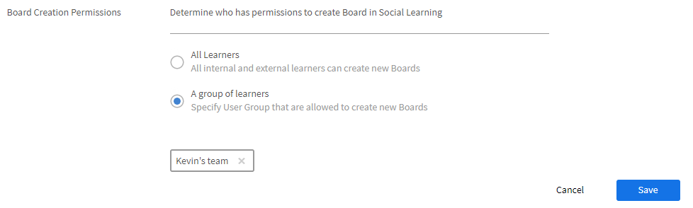-->

共用相同範圍的使用者只能看到展示板。 對於沒有許可權的使用者， **[!UICONTROL Create New Board]** 連結仍會保持隱藏。

任何變更要生效，請等待60分鐘。

## 特殊使用者 {#privilege}

管理員可以將特殊許可權授與使用者群組，使用群組的成員可以參與所有面板。 在「範圍設定」區段中設定的任何限制，都會被特殊使用者群組略過。

使用者群組可以是自動產生或自訂。

已授予此許可權的使用者可存取所有展示板，但 **私人看板**.

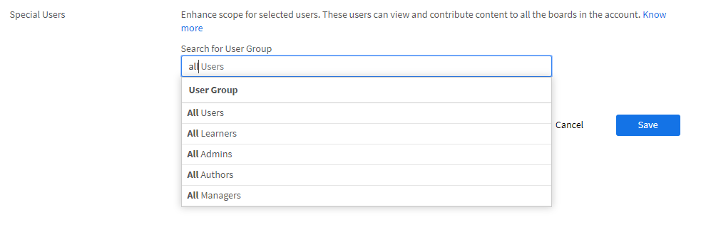

*授予特殊許可權*

當管理員選取使用者群組時，預設情況下，群組中的所有使用者都可以存取所有展示板，無論使用者的範圍為何。 擁有這些提升許可權的任何使用者都可以檢視並參與所有內部和外部面板。

如果使用者擁有足夠的SME點數掌握該技能，特殊使用者會收到跨所有範圍的組織請求。

如果使用者沒有所需的SME分數，則組織許可權會傳給該技能的前三名SME。

在新的範圍內，他/她可獲得各展示板活動的分數。

在「社交」領導面板區段，使用者可以看到其範圍的所有使用者以及特殊使用者。

如果您已獲得特殊使用者許可權，則無論使用者的範圍為何，您皆可在領導板上看到帳戶中的所有使用者。

如果特殊使用者獲得足夠的點數而成為SME，則會出現在 **[!UICONTROL Top Subject Matter Experts]** 列在社交領導者面板中。

任何變更要生效，請等待60分鐘。

## 自訂社交橫幅 {#customize-social-banner}

管理員可以自訂出現在Social Learning首頁頁頁首影像的標題和副標題。 無論管理員如何決定輸入作為標題和副標題，學習者社交學習首頁上的相同功能。

1. 在管理員應用程式上，按一下 **[!UICONTROL Social Learning]** > **[!UICONTROL Settings]**.
1. 按一下 **[!UICONTROL Customize]**.
1. 變更橫幅影像。 影像的尺寸必須至少為 **1600畫素X 240畫素**.
1. 切換選項以隱藏或顯示 **[!UICONTROL Know More]** 橫幅上的連結。
1. 在下面指定的欄位中輸入標題和副標題：

   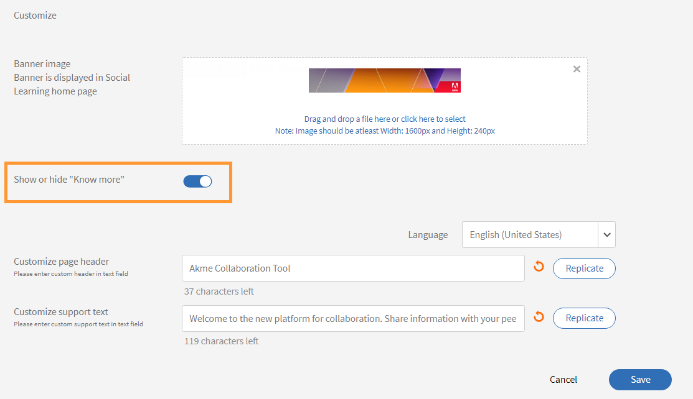

   *自訂社交橫幅*

您有幾個其他選項：

* **[!UICONTROL Language]：** 從下拉式清單中，選擇要翻譯標題和副標題的語言。 您也可以新增不同語言的自訂文字。
* **[!UICONTROL Replicate]：** 按一下此按鈕，即可復寫所有語言的標題和副標題。
* **[!UICONTROL Reset]：** 按一下此按鈕以恢復為原始標題和副標題。

  在社交學習首頁上，管理員提供的資訊會顯示為頁首。

  <!--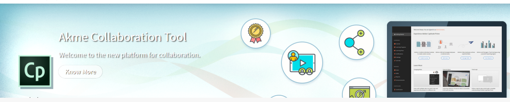-->

## 趨勢 {#trends}

可在「趨勢」區段的「活動」標籤中檢視及追蹤學習者的社交活動趨勢。 您可以檢視不同時段的資料，例如過去七天、上個月、過去三個月和所有時間。

日期篩選器中的預設值為過去七天。

>[!NOTE]
>
>日期篩選器中的預設值為過去七天。

第一個視覺效果為管理員提供下列從日期篩選器選取之時段的資訊：

1. **[!UICONTROL New Posts]**：顯示在該日期期間內建立的新貼文數。 也會顯示整個期間的貼文總數。
1. **[!UICONTROL Percentage of Active users]**：顯示相較於帳戶中可用的使用者總數，社交學習中的作用中使用者總百分比。
1. **[!UICONTROL New Boards]**：顯示已建立的新面板數量。 也會顯示整個期間面板的總數。

第二個視覺效果是折線圖，根據從日期篩選器選取的時段，顯示已建立的看板或貼文數量趨勢。 按一下篩選器以檢視不同的時間選項，例如過去七天、上個月、過去三個月和所有時間。

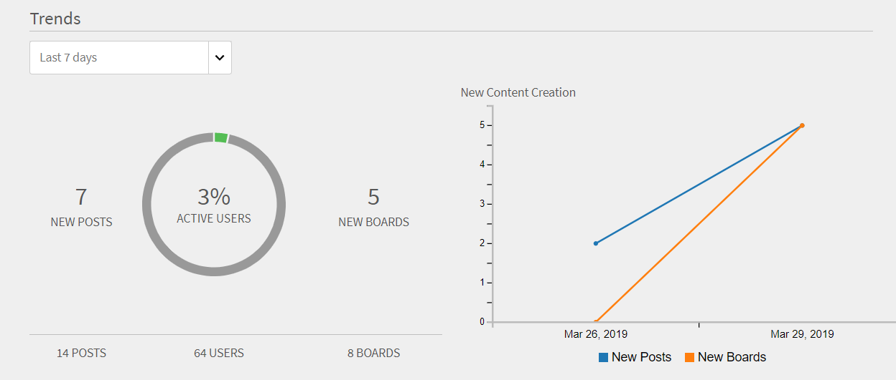

*顯示趨勢的線上圖表*

## 技能 {#skills}

您可以在此章節中檢視已在社交活動平台中使用的所有技能。 管理員可以在建立展示板並將SME對應至展示板時，使用搜尋欄位來尋找尚未使用的技能。 透過執行此動作，SME將在使用此技能建立展示板時收到通知，並且他們可以在手動組織工作流程中檢閱貼文。

對於已停用「社交學習」的帳戶，不會顯示任何技能。 搜尋列也可用於這些帳戶，以便管理員能夠搜尋技能並為其新增SME。

管理員可以檢視活動分數、貼文數、面板、使用者，以及在建立面板或貼文時所使用的每種技能的SME名稱。

<!--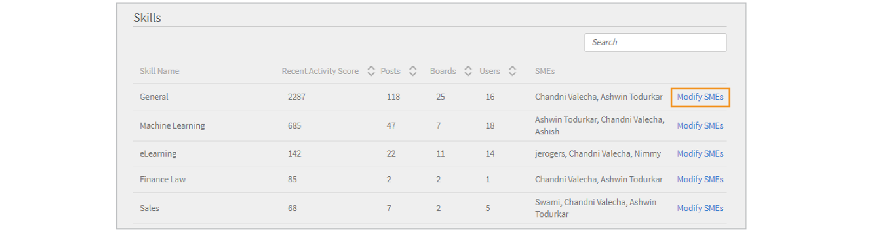-->

<table>
 <tbody>
  <tr>
   <td>
    
<b>sl. 不適用。</b>
</td>
   <td>
    
<b>欄名稱</b>
</td>
   <td>
    
<b>說明</b>
</td>
  </tr>
  <tr>
   <td>
    
1
</td>
   <td>
    
技能名稱
</td>
   <td>
    
顯示社交學習中所使用的技能名稱。
</td>
  </tr>
  <tr>
   <td>
    
2
</td>
   <td>
    
活動分數
</td>
   <td>
    
顯示屬於該技能之所有面板的活動點總和。
</td>
  </tr>
  <tr>
   <td>
    
3
</td>
   <td>
    
貼文
</td>
   <td>
    
顯示使用技能建立的貼文總數。
</td>
  </tr>
  <tr>
   <td>
    
4
</td>
   <td>
    
展示板
</td>
   <td>
    
顯示使用技能建立的面板總數。
</td>
  </tr>
  <tr>
   <td>
    
5
</td>
   <td>
    
使用者
</td>
   <td>
    
顯示已使用該技能的學習者總數。
</td>
  </tr>
  <tr>
   <td>
    
6
</td>
   <td>
    
SME
</td>
   <td>
    
顯示該技能的目前前3名SME。 管理員可以按一下連結，新增或修改SME。
</td>
  </tr>
 </tbody>
</table>

## 技能領域 {#skilldomain}

根據Learning Manager一般使用者最常使用的技能，Adobe Learning Manager已將自動組織系統用來組織內容的25個技能網域清單進行分類。 管理員必須將設定的企業技能對應至Prime提供的技能網域。 技能對應可在建立技能或修改現有技能時從管理員技能頁面完成。 如需如何對應或新增技能的詳細資訊， [按一下這裡](skills-levels.md#Createaskillandalevel).

+++Learning Manager的組織系統所使用的技能網域清單

1. 會計
1. Analytics
1. 商業道德
1. 商法
1. 業務流程
1. 電腦安全性
1. 客戶關係管理
1. 設計
1. 財務
1. 人力資源管理
1. 資訊技術
1. 學習
1. 管理
1. 行銷
1. 醫學
1. 生產與製造
1. 品質管理
1. 銷售
1. 科學研究與工程
1. 社群媒體
1. 軟性技能
1. 策略管理
1. 供應鏈管理
1. 技術通訊
1. 工作場所安全

+++

## 主題專家(SME) {#subjectmatterexpertssmes}

**主題專家** 在某項技能上擁有相當多的知識和專業知識的人。 一個 **SME** 在社交學習中，當管理員將組織設定設為手動，或自動組織方法無法組織內容時，就會扮演重要角色。 「SME」欄中只會顯示前三個SME。

## 成為SME的需求 {#requirementstobeansme}

SME地位只能透過在社交學習中的活動獲得SME點數來獲得。 管理員可根據SME的技能水準授予其積分。

## 將SME新增至技能 {#addingsmestoaskill}

若要將SME新增至技能，請遵循指定步驟：

1. 按一下 **[!UICONTROL Add SMEs]** 或 **[!UICONTROL Modify SMEs]**.

   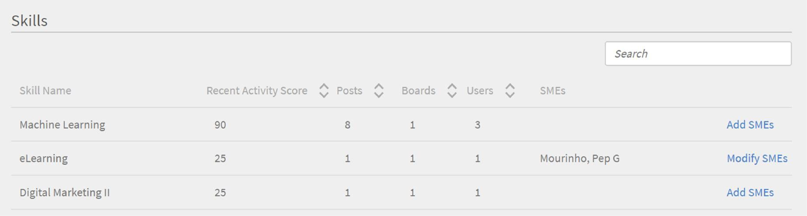

   *新增或修改SME*

1. 按一下 **[!UICONTROL Advanced Options]** 從快顯對話方塊中。

   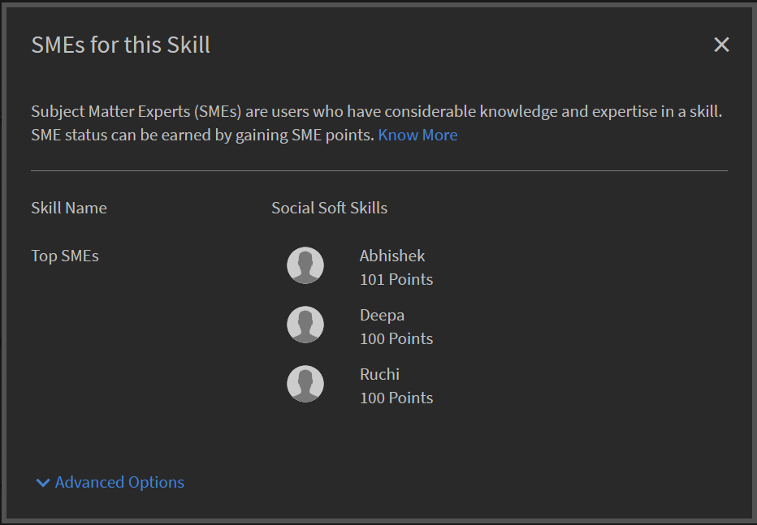

   *檢視進階選項對話方塊*

1. 搜尋具備該技能專門知識的使用者。 找到使用者後，在「 」中輸入您要給予他的點數 **新增點** 輸入方塊。

   如果使用者已經有點，則給予使用者的新點數會新增到目前的點數。

   依預設，每位新使用者加入社交學習時，目前點為0。

   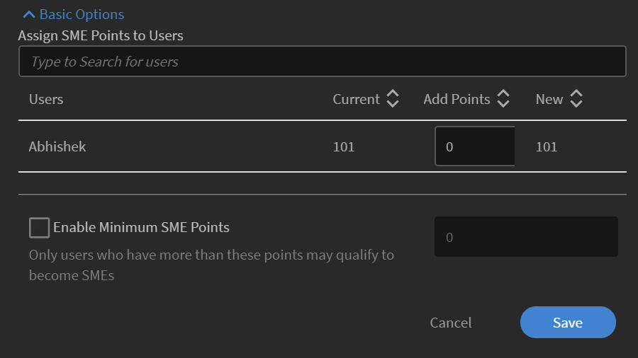

   *為使用者新增點*

1. 藉由選取 **[!UICONTROL Enable Minimum SME Points]** 核取方塊，您可以設定限制使用者在前SME清單中必須顯示為SME的最低點數。 設定臨界值後，點小於或等於所需最小點值的SME將不會列在SME清單中。

   如果 **[!UICONTROL Enable Minimum SME Points]** 如果沒有選取核取方塊，則會將分數最高的前三名使用者視為該特定技能的SME。

1. 按一下 **[!UICONTROL Save]** 按鈕以顯示已進行的變更。

## SME點系統 {#smepointsystem}

**SME會根據下列專案獲得點數：**

* 每次有使用者投票支援他/她所建立的貼文時，就會給他/她2點。
* 每次有使用者投票贊成其評論時，就會給使用者2點。
* 學習者若有回答問題，可獲得5分。
* 每次提供的答案獲得贊成票時，學習者都會再獲得2分。

## 根據組織活動的SME狀態點 {#smestatuspointsbasedoncurationactivity}

**SME也根據下列組織的活動獲得點數：**

* 當由於自動組織不確定內容是否相關而傳送貼文進行手動組織時，SME在提交稽核時獲得5分。

## 下載設定 {#downloadconfigurations}

<!--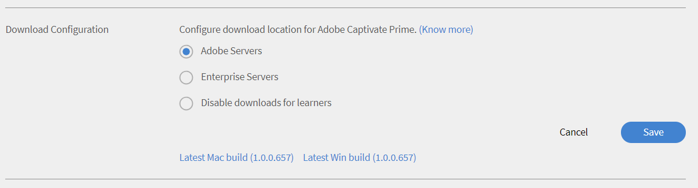-->

對於企業伺服器，管理員可以變更學習者下載Windows和Mac案頭應用程式的位置。

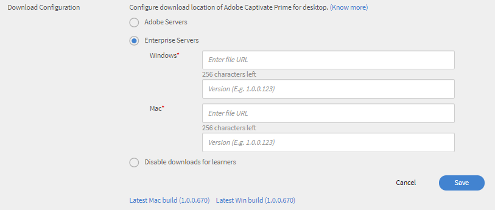

*變更下載位置*

Enterprise Server URL必須公開託管。

## 每月活躍使用者計費計畫的社交活動 {#socialactivitiesformonthlyactiveusersbillingplan}

每次使用者建立新的社交展示板、社交貼文或社交評論時，都會計為有效活動，並依據 **每月啟用使用者**(MAU)計畫帳戶是否遵循MAU帳單模型。 如需詳細資訊，請參閱 [計費管理](billing-management.md).

## 常見問題 {#frequentlyaskedquestions}

+++如何為外部學習者啟用社交學習？

在 **[!UICONTROL Social Learning]** > **[!UICONTROL Settings]**，在範圍設定區段中，啟用選項 **[!UICONTROL Enable for External learners]**. 從下拉式清單中選擇外部設定檔，並定義該設定檔的學習範圍。

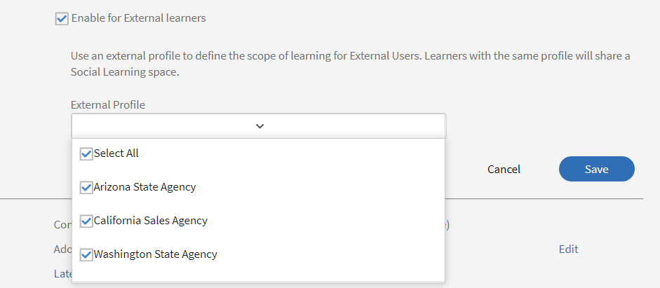

*選取為外部學習者啟用選項*
+++
