# 作為管理員監控與管理社會學習

作為管理員，你可以啟用、停用並監控社會學習中執行的活動。 一旦啟用社交學習功能，學習者即可查看並開始參與社交學習。

社交學習讓學習者能隨時隨地學習並與同事分享內容。 此功能讓學習者能夠互動、交流想法與協作，提升整體學習體驗。

## 在社會學習中啟用並設定設定 {#enableandconfiguresettingsinsociallearning}

要啟用並設定社交學習功能，請執行以下步驟：

1. 從左側導航面板點擊 **[!UICONTROL Social Learning]** 。 你會被導向活動頁面。
1. 如果你是第一次開啟活動頁面的按鈕，請 **[!UICONTROL Social Learning]** 啟用 **[!UICONTROL Enable]** 它。 否則可以從 **[!UICONTROL Settings]** 頁面啟用。

   彈出視窗會像下方截圖一樣出現。

   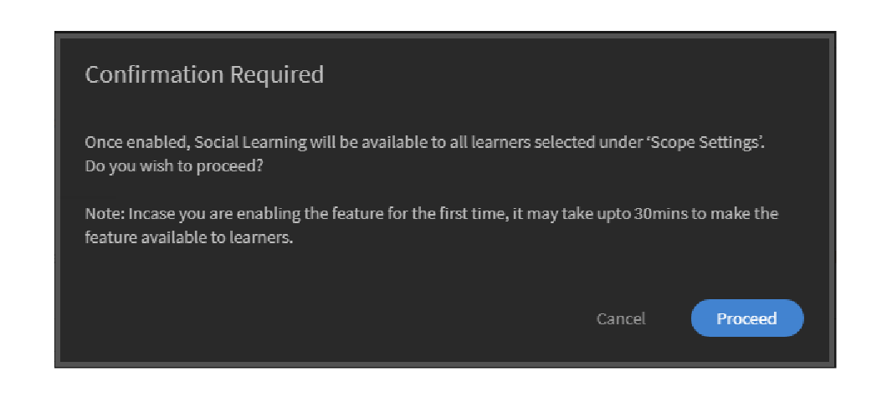 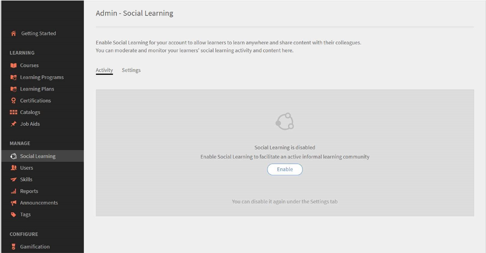

   *促進社會學習*

<!-- 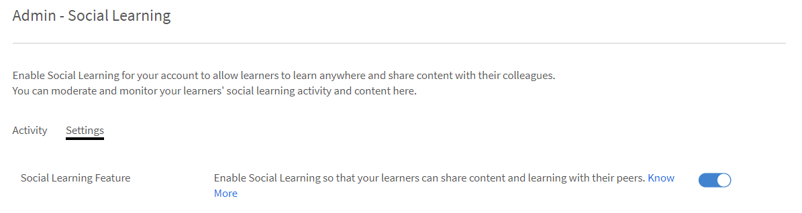 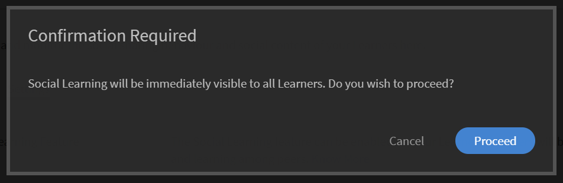-->

管理員可以設定社交學習的設定。 設定包括內容策劃類型，如 **[!UICONTROL Manual-Only Curation]** **[!UICONTROL No Curation]**&#x200B;和 。 範圍設定可以設定為不同的範圍，例如使用者類型（內部/外部）或帳戶中其他活躍欄位。 管理員可以設定學習者下載 Adobe Learning Manager 桌面應用程式的 URL 路徑。

### 內容策展 {#contentcuration}

由於社交學習是一種非正式學習，其功能與其他社群媒體平台相似。 人們常覺得社群媒體分心，因為他們經常接觸無關內容，影響生產力。 這個想法可以透過內容審核與策展來滿足。

**[!UICONTROL Manual-Only Curation]** 以及 **[!UICONTROL No Curation]** 管理員可選擇的兩個策展選項。

**[!UICONTROL Auto-assisted Manual Curation]：** Learning Manager 擁有基於人工智慧的自動策展引擎，能智慧地找出任何格式內容的核心，並提供給未來的學習者。 它也能根據內容的信心分數批准或拒絕發布。

例如，Adarsh 是學習者，他覺得一個部落格很有趣，於是將它發佈到 Adobe Learning Manager 的社交學習平台。 文章接著會被輸入由 AI 驅動的內容策展引擎，該引擎會預測內容中的技能，並與相關的板上技能進行比較。 若技能匹配，則該內容會被發布，否則將送交僅手動整理。

發文的最低信心分數要求為50%。

**[!UICONTROL Manual-Only Curation]：** 在內容上線前檢查真實性，管理員可啟用僅手動策展設定。 啟用「僅限手動」策展設定後，將移交給頂尖專家（最多 3 位）進行策展。 根據平均回應，該貼文會被批准或拒絕。 若回應率超過50%，該貼文即上線，否則即被拒絕。 欲了解更多中小企業資訊，請 [點此](social-learning-configurations-as-an-admin.md#SubjectMatterExpertsSMEs)。

在新的範圍中，他/她會因各行各項活動獲得積分。

在社群排行榜區塊中，使用者可以看到所有與其職權相關的使用者以及特殊使用者。

如果你被賦予特殊使用者權限，你可以在排行榜上看到帳號中的所有使用者，不論使用者的權限為何。

若特殊用戶累積足夠分數成為SME，則會出現 **[!UICONTROL Top Subject Matter Experts]** 在社交排行榜的名單中。

任何變更生效，請等待60分鐘。

### 範圍設定 {#scopesettings}

在社會學習中，範圍決定你看到的板塊，控制內容的可見度。 例如 ***，如果使用者有範圍，例如Vendor_A***，他/她只能看到由同範圍 ***Vendor_A***&#x200B;其他人建立的板子和相關貼文。

這讓管理員能夠維護一群使用者，例如供應商、合作夥伴或組織內的部門。

啟用社交學習與排行榜，供內部及外部使用者使用。

有獨立的區塊來啟用內部與外部使用者。

**內在學習者啟用**

在本節中，您可以選擇使用者特徵，以定義內部使用者的社交學習範圍。 具有相同特質 **的使用者共享** 相同的社交學習空間。

從 **使用者特徵** 下拉選單中，選擇所需選項。

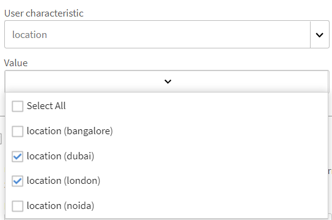

*選擇使用者特性以定義範圍*

預設情況下， **[!UICONTROL All Internal Users]** 使用者特徵下拉選單選項總是被選擇。

你可以根據內部使用者的活躍欄位來範圍範圍。

**為外部學習者提供協助**

要定義外部使用者的學習範圍，請使用外部設定檔。 擁有相同外部資料的學習者共享一個社交學習空間。

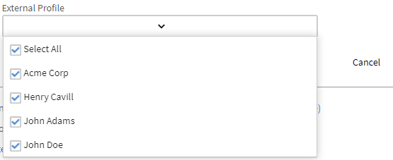

*為外部學習者提供空間*

外部使用者的範圍會根據他們的外部設定檔來設定。

例如，從上述清單中，如果你啟用 **[!UICONTROL Acme Corp]**，所有屬於 Acme Corp 的學習者都能看到他們所建立的看板。 如果你關閉 Henry Cavill **這個選項**，學習者就看不到 Henry Cavill 建立的任何棋盤。

管理員可以根據欄位中顯示 **[!UICONTROL User characteristic]** 的活動欄位來調整內容的可見範圍。

例如，管理員可以設定範圍為 **[!UICONTROL User Type (Internal/External)]** 使用者。 將範圍設為使用者類型時，任何內部學習者在社交學習平台上分享的內容，僅對組織內其他內部學習者可見，外部使用者則無法看到，反之亦然。

管理員選擇使用者特徵後，可透過使用者特徵欄位下方的勾選框，將社交學習功能限制為學習者及學習者群組。 點選值欄位，選擇你想啟用社交學習功能的學習者或學習者群組。

預設範圍由內部或外部學習者決定 **[!UICONTROL User Type]** 。

若活動欄位中沒有任何值， **[!UICONTROL Value]** 則該欄位下拉選單將不會對管理員顯示。

<!-- 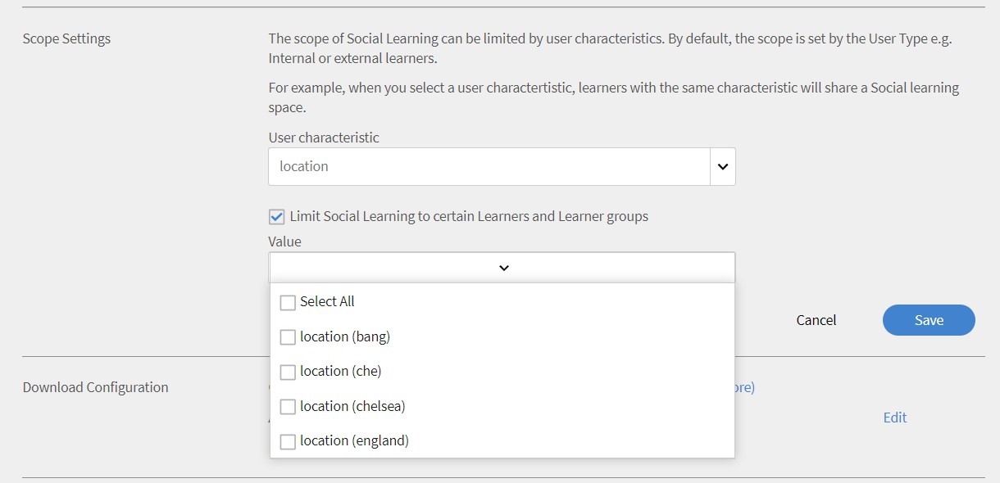-->

使用者也可以透過Adobe Learning Manager桌面應用程式發佈內容。 根據你是 Mac 還是 Windows 使用者，點擊給定的連結下載桌面應用程式，並依照步驟安裝到你的系統。 如果您在安裝過程中遇到任何困難，請 [點此](../../kb/troubleshooting-issues-with-adobe-learning-manager-desktop-app.md)。

### 下載設定 {#downloadconfigurations}

<!--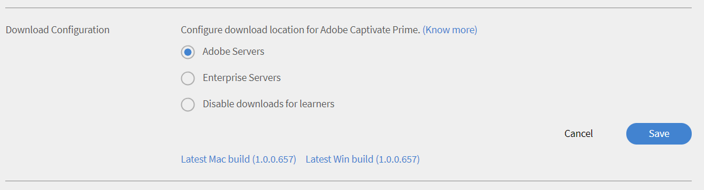-->

對於企業伺服器，管理員可以更改學習者下載桌面應用程式的地點，適用於 Windows 和 Mac。

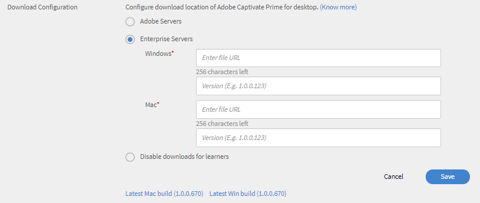

*更改 dowmload 的位置*

Enterprise Server URL 必須是公開架設的。

### 董事會建立權限 {#permission}

為了限制所有學習者創建看板並有效管理看板，管理員可授權特定用戶建立看板。

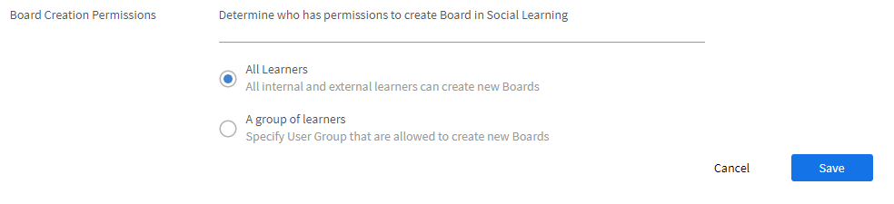

*設定建立看板的權限*

預設情況下，這個選項 **[!UICONTROL All Learners]** 是啟用的。

**[!UICONTROL All Learners]：** 如果你選擇這個選項，所有內部和外部使用者都可以建立看板。

**一群學習者：** 如果你選擇這個選項，只有擁有建立看板權限的使用者才能看到 **[!UICONTROL Create New Board]** Social Learning 中的連結。 選擇必須獲得權限才能建立看板的使用者群組。 你也可以新增自動生成和自訂使用者群組。

<!--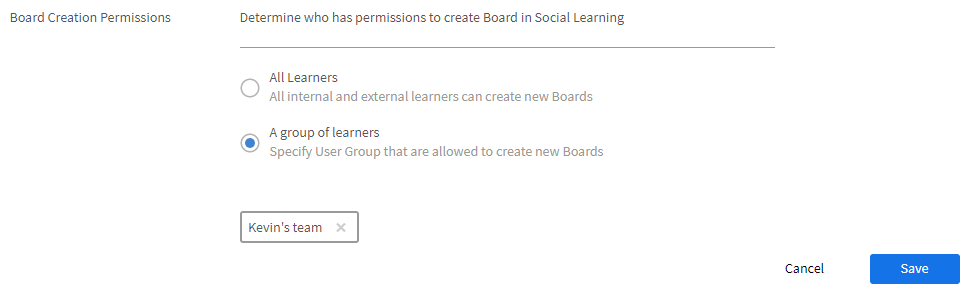-->

共用相同範圍的使用者只能看到該板。 對於沒有權限的使用者，連結 **[!UICONTROL Create New Board]** 會保持隱形。

任何變更生效，請等待60分鐘。

## 特殊使用者 {#privilege}

管理員可以授予使用者群組特殊權限，讓該群組成員能參與所有論壇。 在範圍設定區塊設定的任何限制都會被特殊使用者群組繞過。

使用者群組可以是自動產生的，也可以是自訂的。

獲得此權限的使用者可存取所有看板，唯獨私人看板除外&#x200B;**&#x200B;**。

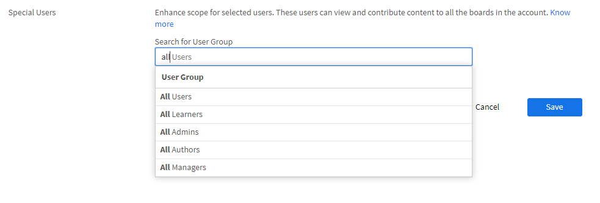

*授予特殊特權*

當管理員選擇使用者群組時，預設情況下，群組內所有使用者都能存取所有板子，不論使用者的權限為何。 任何擁有這些提升權限的使用者都可以查看並參與所有內部與外部的討論板。

如果使用者擁有足夠的 SME 點數，特殊使用者會收到涵蓋所有範疇的策展請求。

若使用者未達到所需的 SME 點數，則策展權限會轉交給該技能的前三名 SME。

在新的範圍中，他/她會因各行各項活動獲得積分。

在社群排行榜區塊中，使用者可以看到所有與其職權相關的使用者以及特殊使用者。

如果你被賦予特殊使用者權限，你可以在排行榜上看到帳號中的所有使用者，不論使用者的權限為何。

若特殊用戶累積足夠分數成為SME，則會出現 **[!UICONTROL Top Subject Matter Experts]** 在社交排行榜的名單中。

任何變更生效，請等待60分鐘。

### 自訂社群橫幅 {#customize-social-banner}

管理員可自訂社交學習首頁標題圖片上的標題與副標題。 無論管理員決定將標題與副標題輸入為何，學習者社交學習首頁的功能皆相同。

1. 在管理應用程式中，點擊 **[!UICONTROL Social Learning]** > **[!UICONTROL Settings]**。
1. 點擊 **[!UICONTROL Customize]**。
1. 更換橫幅圖片。 影像尺寸必須至少 **為1600像素 X 240**&#x200B;像素。
1. 切換隱藏或顯示 **[!UICONTROL Know More]** 連結的選項。
1. 請在下方欄位輸入標題與副標題：

   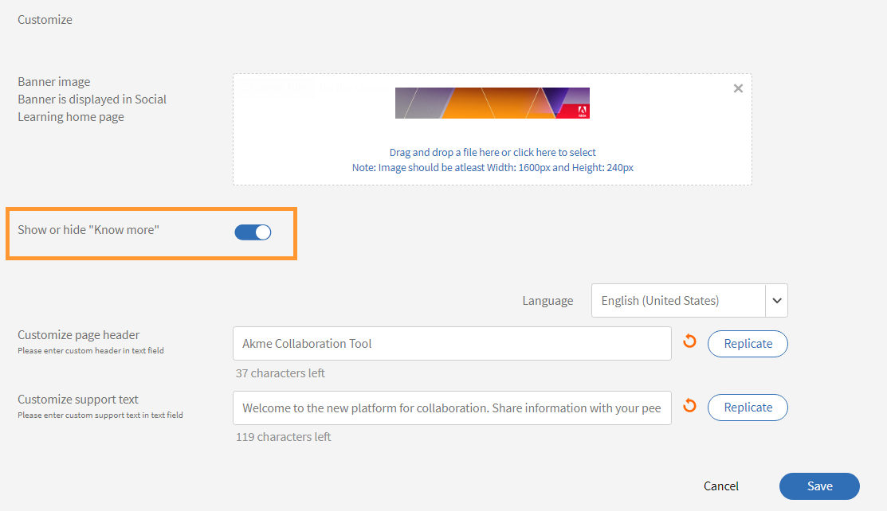

   *自訂社群橫幅*

你還有其他幾個選擇：

* **[!UICONTROL Language]：** 從下拉選單中選擇要翻譯標題和副標題的語言。 你也可以為不同語言新增自訂文字。
* **[!UICONTROL Replicate]：** 點擊此按鈕可將標題與字幕複製至所有語言版本。
* **[!UICONTROL Reset]：** 點擊此按鈕可回復原始標題與副標題。

  在 Social Learning 首頁，管理員提供的資訊會以頁面標題顯示。

  <!--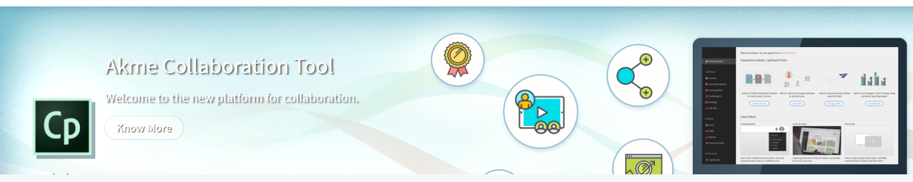-->

### 社會學習觀點

管理員可從以下設定中選擇社交學習檢視：

* 文章檢視 - 選擇此選項可顯示所有論壇的個別貼文。
* 板狀檢視 - 選擇此選項後，會顯示所有可用的板子。

## 內容自動整理 {#autocuration}

手動審核內容往往容易出錯且耗時。 此外，該流程無法擴展，也不適合大量社交活動。 因此，當服務眾多社交活躍用戶時，策展內容自然變得至關重要。

在學習管理員中，有自動策劃內容的選項。 策展由一個具 AI 功能的引擎驅動，管理員將預設技能與技能對應後，將工作與預設技能映射。 欲了解更多資訊，請參閱 [技能領域映射](curation-skills.md)。

在自動策展中，允許以下類型的內容：

* PDF
* 音訊與視訊檔案
* 演講 - PPT 或 PPTX
* 文件- .doc、.docx

管理員可以在管理員應用程式中啟用自動策展內容的選項。

1. 在管理應用程式的左側窗格，點擊 **[!UICONTROL Social Learning]**。
1. 在頁面上，點擊分頁 **[!UICONTROL Settings]**。
1. 啟用這個選項 **[!UICONTROL Auto-assisted Manual Curation]**。

   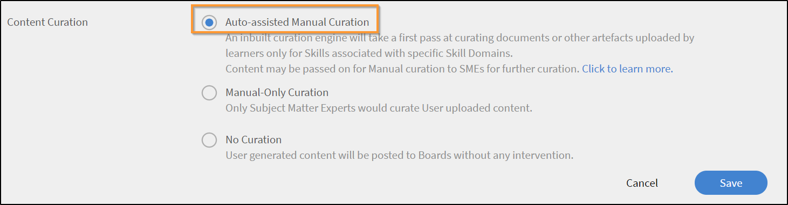

   *選擇自動輔助手動策展選項*

當使用者在板上上傳內容時，基於 AI 的演算法會從內容中擷取文字，並將文字傳遞給策展引擎。 策展引擎會嘗試找出內容中存在的技能。

上傳內容預測的技能會與該內容所在的公告板技能相匹配。  若任何技能的信心分數超過該棋盤技能的50%，該內容會被公布在棋盤上。 若信心分數低於 50%，內容將送交人工整理。

每當內容被自動整理時，使用者會收到通知，該內容已在先前上傳的公告板上可用。

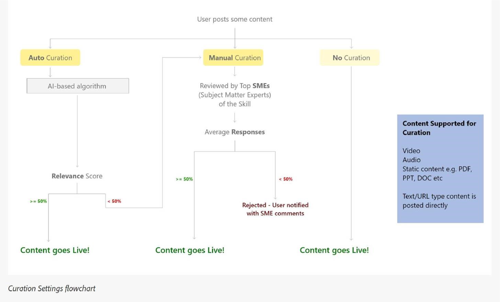

*策展設定流程圖*

建議管理員若啟用僅手動策展，應新增技能專家。 管理員可事先向具備技能專長的用戶提供SME積分，新增SME會員。 想了解更多如何向中小企業提供點數，請  [點此](social-learning-configurations-as-an-admin.md#SubjectMatterExpertsSMEs)。

**無審核：** 所有學習者的貼文都會自動發布，沒有任何內容審核。

<!--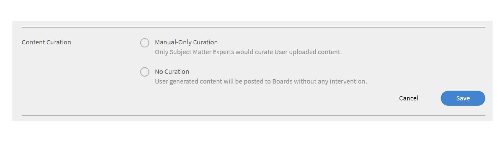-->

## 關於內容自動整理的常見問題 {#faq-auto-curation}

+++一位專家有多少時間來策劃一篇文章？

專家至少有24小時的時間來策劃一篇文章。 由於時差關係，可能會延長至47小時。

+++

+++如果三家都可用，這筆錢會轉給下一組三位專家嗎？ 總是三位專家被納入嗎？

策劃的請求會在第一天送到最高層的專家。 若未回應，隔天將提交給接下來三位專家。

若三位新專家未回應，請求將送交董事會的版主。

若版主未回應，申請將自動通過。

+++

+++如果兩位主題專家負責策劃，只有一位不負責，請求會轉交給第四位主題專家，還是請求會取第一輪專家評定職位的平均值？

申請需達到50%的審核率才能批准該貼文。 同樣地，拒絕貼文會使用50%的評分來拒絕該貼文。 每當中小企業進行核准時，都會評估是否達到50%。

若一天內未達50%，則會送交下一批專家，過期前一輪未回覆的策展請求。

例如，第一天，策展請求會寄給三家中小企業;其中一個人同意了，兩個人沒回應。 隔天，策展請求會送給下一組三位主題專家;目前這個階段，總共有四家活躍的中小企業。 至少需要兩個SEM批准，才能獲得策展批准。（若2人通過、2人拒絕，則達到前50%者將被取走。）

+++

+++據我所知，只有在有人建立新看板時才會指派「版主」——如果 SME 會被分配到該板所關聯的技能，學習者指派「版主」給看板的使用情境是什麼？

以下是社交委員會版主的職責：

* 能夠編輯板名、描述、板子可見性設定及其他設定。
* 若貼文不適合受眾，可刪除該公告板上的貼文。
* 版主會收到「舉報濫用」的公告。
* 若論壇無專家，版主會接收策展請求。

+++

+++我們的培訓團隊將新增並監控與技能等級相關的技能，以及負責這些技能的專家。

專家是根據技能來新增或分配的，而不是技能等級。 這是設計中的。

+++

+++社會學習的「主持人」與社會學習的「專家」有什麼不同？

**版主：** 董事會的次要擁有者。 創作者在製作板時加入這些角色，以便在創作者缺席時能控制該板。 預設情況下，論壇創建者是版主。

**SME：** 主題專家是特定技能的專家。 管理員可以指派專家負責特定技能，以策劃該技能的內容。 SME會收到與其技能相關的委員會策劃請求。 學習者也可以透過累積SME積分成為SME。

+++

+++如果有兩三位專家負責某項技能——社會學習的審核是否取決於所有專家的策展，還是先策劃？

申請需達到50%的審核率才能批准該貼文。 同樣地，拒絕貼文會使用50%的評分來拒絕該貼文。 每當中小企業進行核准時，都會評估是否達到50%。

若一天內未達50%，則會送交下一批專家，過期前一輪未回覆的策展請求。

+++

## 趨勢 {#trends}

學習者的社交活動趨勢可以在趨勢區塊的活動標籤中查看與追蹤。 這些資料可以查看不同時間段，如過去七天、上個月、過去三個月以及所有時間。

過去七天是日期篩選器的預設值。

>[!NOTE]
>
>過去七天是日期篩選器的預設值。

第一個視覺圖示為管理員提供從日期篩選器選定期間的以下資訊：

1. **[!UICONTROL New Posts]**&#x200B;顯示該日期期間內新建立的貼文數量。 同時顯示整個期間的總貼文數量。
1. **[!UICONTROL Percentage of Active users]**&#x200B;顯示社交學習中活躍用戶的總百分比與帳號中可用用戶總數的比例。
1. **[!UICONTROL New Boards]**&#x200B;顯示已建立的新板數。 同時也顯示整個時期的總棋盤數量。

第二個視覺圖是折線圖，顯示根據日期篩選器中選擇的時間段，討論區或貼文數量的趨勢。 點擊篩選器可查看不同時間選項，如過去七天、上個月、過去三個月及所有時間。

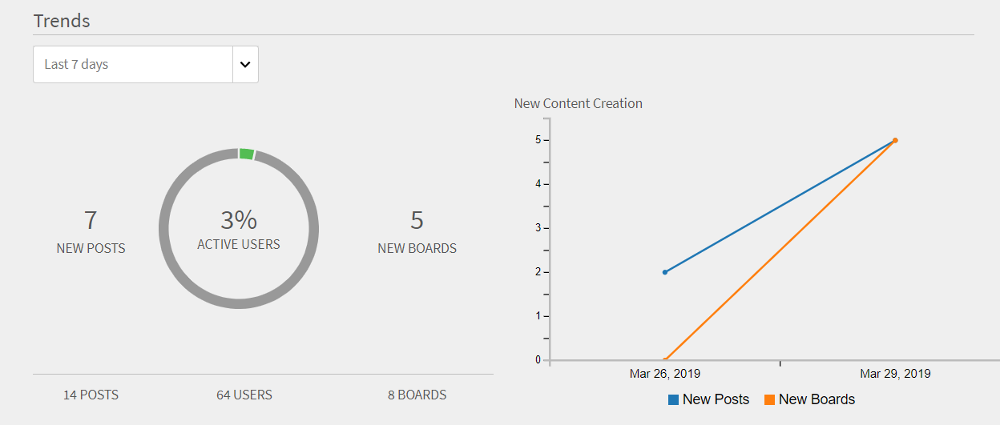

*線圖顯示趨勢*

## 技能 {#skills}

您可以在本區查看所有在社交活動平台上被使用的技能。 管理員可以在建立看板並將主題專家對應到該技能時，利用搜尋欄位尋找尚未使用的技能。 透過此操作，專家會在使用此技能建立看板時收到通知，並能作為手動策展流程的一部分審查文章。

對於關閉社交學習的帳號，則不會顯示任何技能。 搜尋欄也適用於這類帳號，讓管理員能搜尋技能並新增 SME。

管理員可以查看活動分數、貼文數量、討論區數量、使用者數，以及在建立看板或貼文時所使用的技能的主題專家名稱。

<!--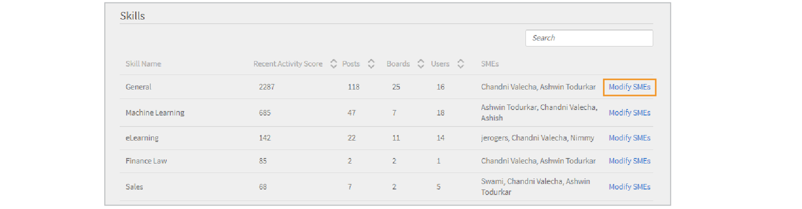-->

<table>
 <tbody>
  <tr>
   <td>
    
<b>SL。 不。</b>
</td>
   <td>
    
<b>欄名</b>
</td>
   <td>
    
<b>說明</b>
</td>
  </tr>
  <tr>
   <td>
    
1
</td>
   <td>
    
技能名稱
</td>
   <td>
    
顯示社會學習中使用的技能名稱。
</td>
  </tr>
  <tr>
   <td>
    
2
</td>
   <td>
    
活動分數
</td>
   <td>
    
顯示屬於該技能的所有棋盤活動點數總和。
</td>
  </tr>
  <tr>
   <td>
    
3
</td>
   <td>
    
貼文
</td>
   <td>
    
顯示使用某項技能創建的總貼文數量。
</td>
  </tr>
  <tr>
   <td>
    
4
</td>
   <td>
    
棋盤
</td>
   <td>
    
顯示使用某項技能所建立的棋盤總數。
</td>
  </tr>
  <tr>
   <td>
    
5
</td>
   <td>
    
使用者
</td>
   <td>
    
顯示使用該技能的學習者總數。
</td>
  </tr>
  <tr>
   <td>
    
6
</td>
   <td>
    
中小企業
</td>
   <td>
    
顯示目前該技能的前三名 SME。 管理員可點擊連結新增或修改主題專家。
</td>
  </tr>
 </tbody>
</table>

## 技能領域 {#skilldomain}

根據 Learning Manager 最終使用者主要使用的技能，Adobe Learning Manager 將 25 個技能領域分類出來，這些領域是自動策展系統用來策劃內容的。 管理員必須將配置的企業技能對應到 Prime 提供的技能領域。 技能的映射可以在創建技能時從管理員技能頁面完成，或是修改現有技能。 想了解更多如何映射或新增技能的資訊，請 [點此](skills-levels.md#Createaskillandalevel)。

+++Learning Manager 策展系統所使用的技能領域列表

1. 會計
1. 分析
1. 商業道德
1. 商業法
1. 業務流程
1. 電腦安全
1. 客戶關係管理
1. 設計
1. 財務
1. 人力資源管理
1. 資訊科技
1. 學習
1. 管理
1. 行銷
1. 醫學
1. 生產與製造
1. 品質管理
1. 銷售
1. 科學研究與工程
1. 社群媒體
1. 軟實力
1. 策略管理
1. 供應鏈管理
1. 技術溝通
1. 職場安全

+++

## 主題專家（SMEs） {#subjectmatterexpertssmes}

**主題專家** 是指在某項技能上擁有豐富知識與專業能力的人。 **當管理員將策展設定設為手動，或自動策展方法無法策展內容時，專家**&#x200B;在社交學習中扮演重要角色。SMEs 欄僅顯示前三名的 SME。

## 成為專家的要求 {#requirementstobeansme}

SME資格僅能透過透過社交學習活動累積SME積分來取得。 管理員可根據專家在技能層級的專業程度給予積分。

## 將 SME 加入技能 {#addingsmestoaskill}

要將 SME 加入技能，請依照以下步驟操作：

1. 點擊 **[!UICONTROL Add SMEs]** 或 **[!UICONTROL Modify SMEs]**。

   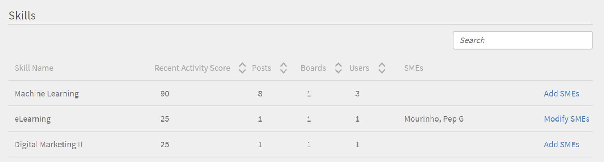

   *新增或修改 SME*

1. **[!UICONTROL Advanced Options]**&#x200B;點擊彈出視窗。

   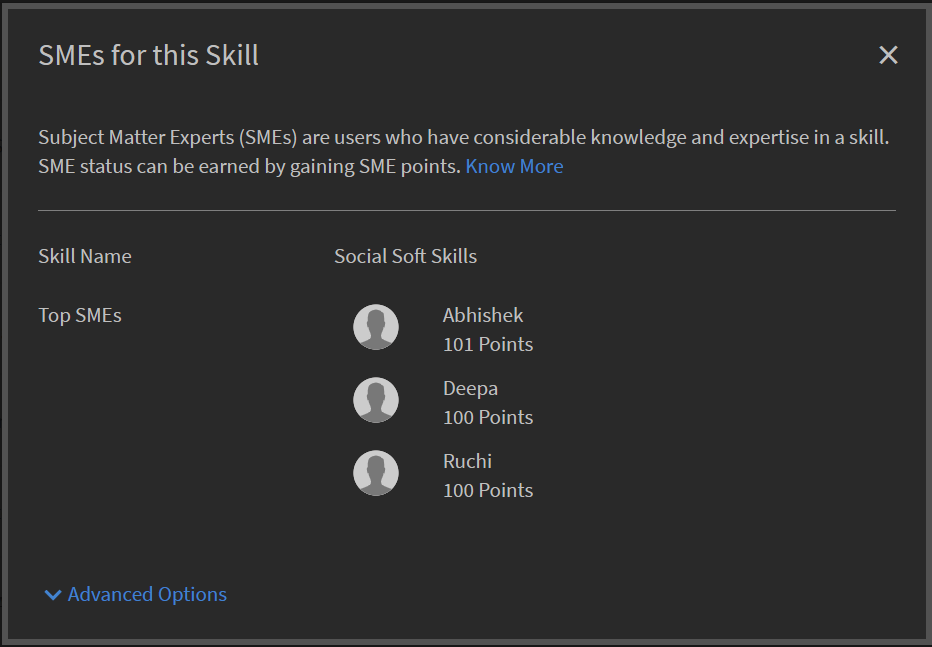

   *檢視進階選項對話框*

1. 尋找具備該技能專業知識的使用者。 找到使用者後，在「加分&#x200B;**」輸入框輸入你想給他或她**&#x200B;多少點數。

   若用戶已有積分，則新增的積分會加總到目前的積分上。

   預設情況下，每一位新用戶加入社交學習，當前點數為 0。

   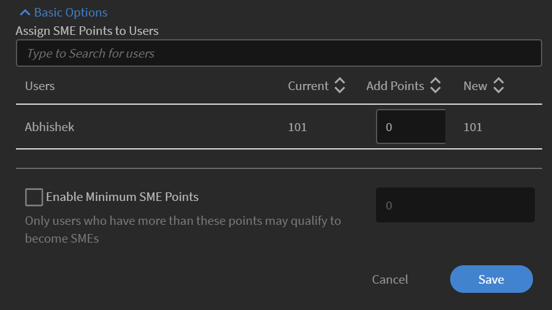

   *為使用者加分*

1. 透過勾選勾 **[!UICONTROL Enable Minimum SME Points]** 選框，您可以設定用戶在頂尖 SMEs 列表中被顯示為 SME 所需的最低點數上限。 一旦設定門檻值，點數低於或等於最低點數的中小企業將不會被列入中小企業名單。

   若未勾選該 **[!UICONTROL Enable Minimum SME Points]** 選項，則該技能點數最高的前三名用戶即視為該技能的專家。

1. 點擊 **[!UICONTROL Save]** 按鈕以顯示已進行的變更。

## SME 積分系統 {#smepointsystem}

**中小企業的積分依據如下：**

* 每當另一位用戶為他/她所發表的貼文按讚時，該用戶可獲得2分。
* 每當另一位用戶為留言按讚，該用戶可獲得2分。
* 答題者可獲得5分。
* 每當所提供的答案獲得讚賞時，學習者可獲得額外2分。

## 根據策展活動獲得的SME狀態積分 {#smestatuspointsbasedoncurationactivity}

**中小企業也會根據策展活動獲得以下項目的積分：**

* 當文章因自動整理不確定內容是否相關而送去人工策展時，主研究員在提交審核時可獲得5分。

## 每月活躍用戶計費計畫的社交活動 {#socialactivitiesformonthlyactiveusersbillingplan}

每當用戶建立新的社群板、社群貼文或社群留言時，若帳號採用 MAU 計費模式，該活動將被視為有效活動，並計入 **每月啟用用戶**（MAU）計畫。 欲了解更多資訊，請參閱帳單管理[&#128279;](billing-management.md)。

## 常見問題 {#frequentlyaskedquestions}

+++如何為外部學習者促進社交學習？

在 **[!UICONTROL Social Learning]** > **[!UICONTROL Settings]**&#x200B;中，在範圍設定區段啟用 **[!UICONTROL Enable for External learners]**。 從下拉選單中選擇一個外部設定檔，並定義該設定檔的學習範圍。

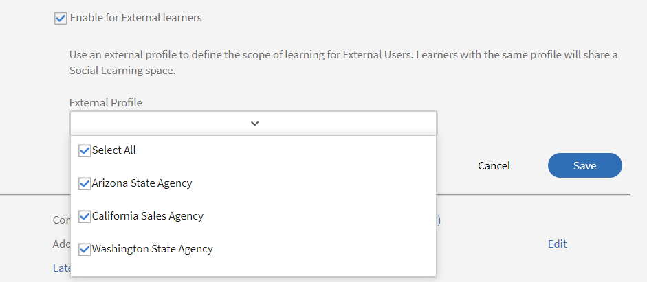

*選擇「為外部學習者啟用」選項*
+++
