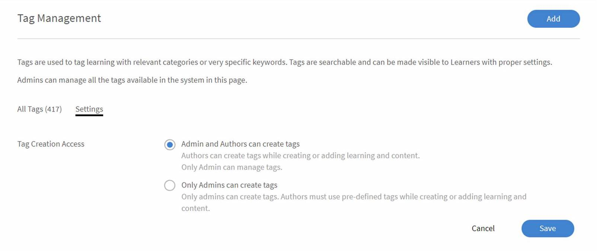

# 標記

管理員現在可以在 Learning Manager 中管理標籤。 使用更好的標籤與易於管理的資料庫，幫助學習者更有效地搜尋並快速找到合適的搜尋結果。 你可以利用這個功能管理冗餘、拼寫錯誤或無關標籤。 你也可以新增、編輯、刪除、附加或替換標籤。

可點擊每個標籤旁的計數，查看與標籤相關的學習物件清單。 該清單顯示課程、學習計畫、證書、工作輔助工具及內容群組的數量。 點擊任一選項查看清單。

你可以用這個 **[!UICONTROL Sort By]** 選項根據使用次數或字母順序排序標籤。

## 標籤介紹

本訓練將教你如何新增、編輯、替換、附加及刪除標籤。 你也會學會如何更改權限設定和使用標籤過濾器。

如果你無法啟動訓練，請寫信至 <almacademy@adobe.com>。

## 新增/刪除/編輯標籤 {#adddeleteedittags}

1. 作為管理員，在左側導覽面板點選 **[!UICONTROL Tags]**。 **[!UICONTROL Tag Management]**&#x200B;頁面打開。
1. 要新增標籤，請點擊 **[!UICONTROL Add]**。 新增按鈕位於頁面右上角。 如果沒有現有標籤，這個 **[!UICONTROL Add]** 按鈕也會在頁面中間 **[!UICONTROL Tag Management]** 顯示。

   新增多個標籤時，請用 （，） 或 （;) 來區分。 標籤名稱最多可包含 50 個字元。

1. 要刪除現有標籤，請點擊勾選方塊選擇該標籤。 你可以一次選擇多個最多五十個標籤來刪除。 要刪除，請遵循以下步驟：

   * 選擇要刪除的標籤>打開 **[!UICONTROL Action]** 下拉選單>選擇 **[!UICONTROL Delete]**。

1. 你一次只能編輯一個標籤。 要編輯標籤，請依照以下步驟操作：

   * 選擇要編輯的標籤>打開**[!UICONTROL Actions]**下拉選單>點擊 **[!UICONTROL Edit]**。

   **[!UICONTROL Edit Tag]**&#x200B;對話框會出現。輸入新標籤名稱並點選 **[!UICONTROL Save]**。

   如果你輸入的標籤名稱已經存在，Adobe Learning Manager 會顯示警告訊息。 不可能有兩個標籤同名。

## 替換標籤 {#replacetags}

1. 選擇你想替換的標籤。 你一次最多可以選擇 50 個標籤。 打開 **[!UICONTROL Actions]** 下拉選單並選擇 **[!UICONTROL Replace]**。
1. **[!UICONTROL Replace Tags]**&#x200B;對話框會顯示所選標籤。

1. 在選項 **[!UICONTROL Name for replaced tags]** 中輸入你想替換所選標籤的新標籤名稱。 你可以選擇用現有的標籤取代它們，或新增新的標籤。

   分號或逗號不能成為標籤名稱的一部分。  請注意，使用這些標籤作為部分 LO 的一部分時，無分號標籤及錯誤訊息顯示將不會被遷移處理。

1. 點擊 **[!UICONTROL Replace]**。

## 附加標籤 {#appendtags}

若對標籤進行附加操作，新或現有標籤會附加到所有與所選標籤相關聯的 LO 與內容群組清單中。

1. 選擇你想附加的標籤。 你一次最多可以選擇 50 個標籤。 打開動作下拉選單並選擇 **[!UICONTROL Append]**。
1. **[!UICONTROL Append Tags]**&#x200B;對話框會顯示所選標籤。
1. 你可以在現有標籤的下拉選單輸入 or 名稱 **[!UICONTROL New Tag]** ，為所有已選標籤的學習附加一個額外標籤。 新標籤會附加到所有 Learning Manager 中相關的學習項目。

   分號或逗號不能成為標籤名稱的一部分。 如果使用，Prime 會顯示錯誤訊息。 請注意，使用這些標籤作為部分 LO 的一部分時，無分號標籤及錯誤訊息顯示將不會被遷移處理。

1. 點擊 **[!UICONTROL Append]**。

## 設定 {#settings}

作為管理員，你可以點擊設定選項，授權作者建立標籤。

*建立標籤的設定頁面*

* 當使用者有權限建立標籤並選擇目前無效的現有標籤時，

  會出現錯誤訊息，表示所選標籤不再有效。 新標籤會透過移除不支援的角色來建立。 在這種情況下，作者應該能在存檔前看到舊標籤被換成新標籤。

* 若使用者沒有建立新標籤的權限，會跳出錯誤訊息表示所選標籤不再有效。 作者可聯絡管理員修改無效標籤。

  作者無法建立或儲存無效標籤。 他們可以移除無效標籤，並新增其他有效的標籤，然後繼續進行。
