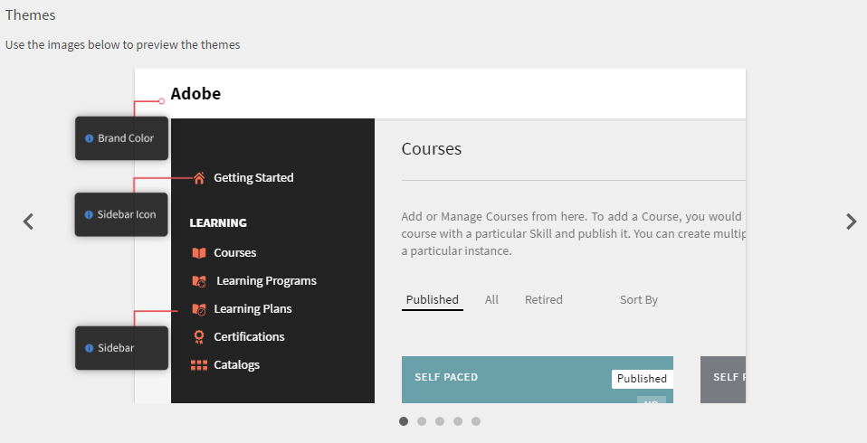
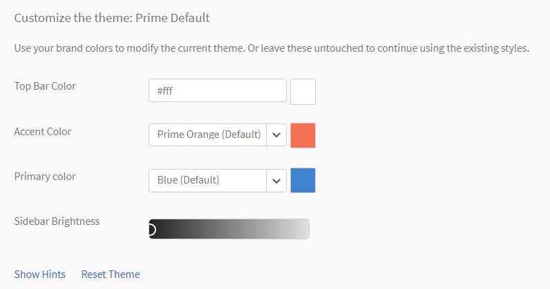
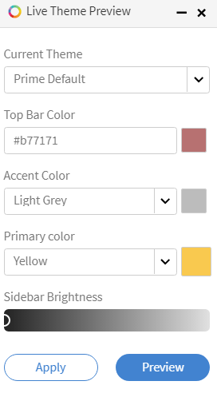

# 顏色主題

Learning Manager中的色彩主題與品牌

Learning Manager可讓您變更應用程式的外觀，以符合貴組織的品牌需求。

## 自訂您的使用者介面

在本次訓練中，您將探索自訂介面外觀的方法，以符合組織的品牌需求。

如果您無法啟動訓練，請寫信到<almacademy@adobe.com>。

## 品牌化 {#branding}

按一下左窗格上的&#x200B;**[!UICONTROL Branding]**&#x200B;以更新您的組織名稱、變更子網域、記錄樣式和主題。 按一下這些主題旁的&#x200B;**[!UICONTROL Edit]**&#x200B;以修改內容。

## 標誌樣式 {#logostyling}

按一下「**[!UICONTROL Edit]**」，在Learning Manager應用程式上設定標誌和公司名稱的外觀。

按一下&#x200B;**[!UICONTROL Upload new logo]**&#x200B;並從您的電腦選擇要上傳的標誌。 您可以在下面預覽標誌和您的組織名稱的外觀。 選擇您選擇的標頭樣式，然後按一下&#x200B;**[!UICONTROL Save]**。

## 主題 {#themes}

提供一組五個代表性影像，用來在套用您的應用程式之前預覽您的顏色主題變更。 分別按一下影像左側和右側的&lt;和>符號來瀏覽這些影像以進行預覽。 或者，您也可以按一下這些影像底部的導覽圓圈，瀏覽預覽快照集。

**挑選佈景主題**

按一下此區段下方的&#x200B;**[!UICONTROL Show hints]**，在影像上顯示提示，如下所示。

*檢視佈景主題上的提示*

Learning Manager應用程式為其使用者提供五個顏色主題選項：

* Prime預設
* 鵝卵石
* 嘉年華
* 秋季
* 冬天
* 生動

>[!NOTE]
>
>生動的主題符合協助工具標準。

*自訂佈景主題的色彩*

您可以自訂「佈景主題」的頂端列色彩、輔色（例如左窗格中的圖示色彩）、主要色彩和側邊欄亮度，但Prime預設佈景主題除外。

在&#x200B;**[!UICONTROL Primary color]**&#x200B;選擇器中，您可以選擇用於沈浸式UI的色彩。

若要自訂，請在左窗格中選擇主題型別，然後按一下品牌顏色和側邊欄圖示顏色旁的方塊。 按一下側邊欄亮度中的側邊欄，向前或向後拖曳以調整亮度。 修改這些選項時，請觀察上述影像中的預覽。

按一下&#x200B;**[!UICONTROL Reset Theme]**&#x200B;以還原主題的原始設定。 完成變更後，請按一下&#x200B;**[!UICONTROL Save]**。

**即時預覽**

按一下「佈景主題」區段左下角的&#x200B;**[!UICONTROL Live Preview]**。 此時會出現快顯視窗，如下所示：

*即時預覽快顯視窗*

從下拉式清單中選擇您選擇的主題，調整設定並按一下&#x200B;**[!UICONTROL Preview]**&#x200B;以檢視應用程式中的即時變更。 現在，您可以瀏覽應用程式的所有功能並見證變更。 您也可以在進行即時預覽時變更您的角色。 在您滿意變更後，可以回到即時佈景主題預覽快顯功能並按一下&#x200B;**[!UICONTROL Apply Theme]**。

當您以即時方式預覽變更時，即時佈景主題預覽快顯視窗仍會顯示在畫面底部。 您可以選擇將快顯視窗最小化。

## 多品牌 {#multiple-branding}

管理員可以在組織內套用多種品牌樣式。 品牌可以根據活動欄位進行自訂，允許不同的使用者群組體驗根據其設定檔或角色量身打造的品牌化。

以下說明如何實作多個品牌：

1. 在管理員應用程式上，選取左窗格中的&#x200B;**品牌**。
1. 在「多重品牌」區段中選取&#x200B;**編輯**。
1. 選取切換按鈕並加以啟用。

### 內部使用者

1. 從下拉式清單中選取使用中的欄位。
1. 您可以根據選取的專案變更組織名稱，並為使用者上傳新的標誌。

### 外部使用者

1. 從下拉式清單中選取使用中的欄位。
1. 您可以根據選取的專案變更組織名稱，並為使用者上傳新的標誌。

>[!NOTE]
>
>內部使用者可以有作用中的欄位，例如外部使用者（例如，管理員必須透過分別選取作用中的欄位值，為內部使用者和外部使用者分別新增多品牌）。

>[!INFO]
>
>如需詳細資訊，請參閱此[部落格](https://elearning.adobe.com/2024/06/multiple-branding-how-to-add-customised-branding-for-internal-and-external-users/)。

#### 要註記的點

* 管理員可以為此作用中欄位值新增多階層品牌，外部使用者可以使用不同的機制登入(SSO單一（Okta、迷你橙色）、社交登入)，並檢查多品牌是否適用。
* 外部使用者具有作用中欄位和作用中欄位值，例如內部使用者：即使它是共用的，管理員必須在多品牌中個別指定。 套用後，外部使用者可以使用不同的機制登入(SSO單一（Okta、迷你橙色）、社交登入)，並檢查多品牌推廣是否適用。
* 外部使用者從某個設定檔移至另一個設定檔：將外部使用者從一個設定檔移至另一個設定檔，不會影響使用者的作用中欄位值，除非管理員或外部使用者在登入或註冊時編輯/刪除作用中欄位值

>[!NOTE]
>
>為內部和外部使用者設定多個品牌時，具有相同作用中欄位名稱、相同作用中欄位值但不同設定。 在這種情況下，建議客戶使用相同的組態設定（標誌、主題、組織名稱）以避免不一致。

## 自訂您的帳戶 {#customize}

Adobe Learning Manager可讓您自訂帳戶，以提供增強的使用者體驗。

下列清單顯示可自訂的元件。 若要自訂帳戶，請連絡Learning Manager [支援](mailto:captivateprimesupport@adobe.com)。

<table>
 <tbody>
  <tr>
   <td>
    
<b>自訂</b>
</td>
   <td>
    
<b>建議事項</b>
</td>
  </tr>
  <tr>
   <td>
    
自訂訓練卡片顏色
</td>
   <td>
    
 

    <ul>
     <li>最多只能使用12種自訂顏色。 </li>
     <li>顏色會套用到所有學習物件。 這些顏色會依序套用至所有學習物件（培訓），十六進位顏色代碼是所有顏色(例如#ffffff)的必要格式。</li>
     <li>如果只提供一個顏色，該顏色會套用至所有學習物件。</li>
    </ul>
    
 
</td>
  </tr>
  <tr>
   <td>
    
游標指標影像
</td>
   <td>
    
當使用者將滑鼠游標停留在任何學習物件上時，自訂影像就會出現。 

    <ul>
     <li>當使用者在Learning Manager網頁上滑鼠游標覆蓋時，套用的自訂影像就會顯示。 </li>
     <li>建議大小 — 16x16或24x24畫素</li>
     <li>建議的影像格式 — PNG、JPG</li>
    </ul></td>
  </tr>
  <tr>
   <td>
    
進度圖示影像
</td>
   <td>在頁面之間導覽時顯示。 出現於您看到「4平方」進度Gif的位置。 
    <ul>
     <li>建議大小 — 小於或等於32x32畫素</li>
     <li>建議的影像格式 — GIF、PNG、JPG</li>
    </ul>
    
 
</td>
  </tr>
  <tr>
   <td>
    
字型
</td>
   <td>
    
管理員可以透過<a ref="mailto:learningmanagersupport@adobe.com"> learningmanagersupport@adobe.com</a>聯絡Adobe Learning Manager支援團隊以變更字型。 若要套用字型，必須有CDN。 此外，您必須共用要套用的字型系列。

    
<b>注意：</b>所有瀏覽器都必須支援字型系列。
</td>
  </tr>
  <tr>
   <td>
    
背景影像
</td>
   <td>
    
背景影像僅會顯示在學習者角色中。 

    
您必須將所需的影像套用至學習者的背景。

    <ul>
     <li><b>建議的影像格式：</b> PNG、JPG、JPEG</li>
     <li><b>建議大小： </b>1400x908畫素</li>
    </ul></td>
  </tr>
   <tr>
   <td>
    
法維孔
</td>
   <td>
    
管理員無法變更Adobe Learning Manager帳戶的Favicon。 若要更新Favicon，請透過<a href="mailto:learningmanagersupport@adobe.com">learningmanagersupport@adobe.com</a>聯絡支援團隊 

    
您必須將所需的影像套用至學習者的背景。

    <ul>
     <li><b>建議的影像格式：</b>PNG</li>
     <li><b>建議大小： </b>32x32畫素</li>
    </ul></td>
  </tr>
 </tbody>
</table>

## 設定建議設定 {#configurerecommendationsettings}

在&#x200B;**品牌** > **一般**&#x200B;上，您可以為內部和外部學習者設定建議範圍，並讓學習者在學習者首頁上選擇技能。

在&#x200B;**一般**&#x200B;頁面上，您有以下選項：

<table>
 <tbody>
  <tr>
   <td>
    
學習者首頁
</td>
   <td>
    
選擇<strong>傳統</strong>或<strong>沈浸式</strong>。 如果您選擇「沈浸式」，則會出現其他選項。
</td>
  </tr>
  <tr>
   <td>
    
訓練型別 
</td>
   <td>
    
選擇<strong>自訂</strong>或<strong>產業一致</strong>。 如果學習者少於1000名，則整個帳戶會視為單一範圍。 建議會根據所有學習者而定。 
</td>
  </tr>
  <tr>
   <td>
    
建議範圍設定 
</td>
   <td>
    
選擇一或多個作用中的欄位。 對於<strong>自訂</strong>，您最多可以選擇一個使用中欄位。 對於<strong>產業一致</strong>，您最多可以選擇5個使用中的欄位。 
</td>
  </tr>
  <tr>
   <td>
    
讓學習者能夠探索感興趣的區域
</td>
   <td>
    
僅限傳統體驗。 選擇<strong>是</strong>或<strong>否</strong>。 
</td>
  </tr>
  <tr>
   <td>
    
提示使用者選取興趣領域（技能）  
</td>
   <td>
    
僅限沈浸式體驗。 選擇<strong>是</strong>或<strong>否</strong>。 
</td>
  </tr>
 </tbody>
</table>
