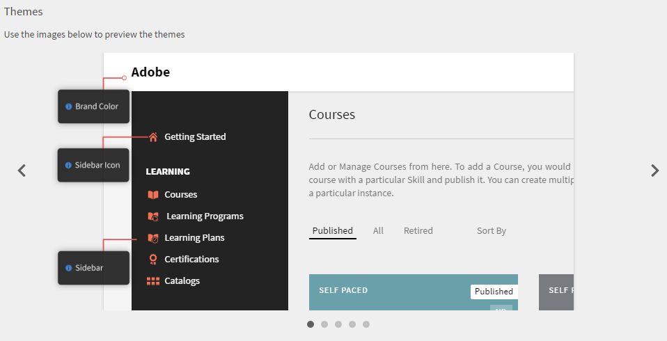
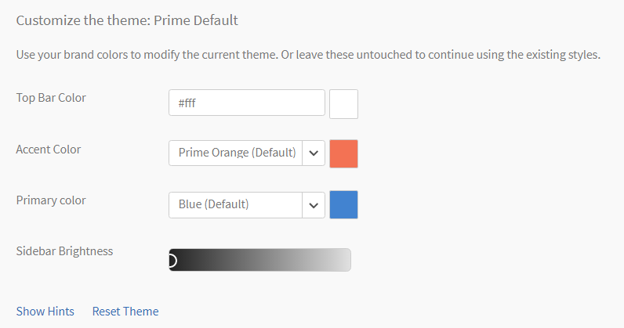
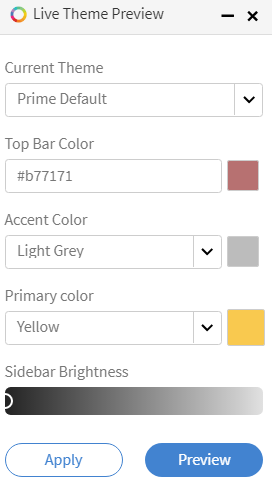

# 色彩主題

學習管理器中的色彩主題與品牌

學習管理工具能讓你調整應用程式外觀，以符合組織的品牌需求。

## 自訂你的使用者介面

在本訓練中，您將探索如何自訂介面外觀，以符合組織的品牌需求。

如果你無法啟動訓練，請寫信至 <almacademy@adobe.com>。

## 品牌形象 {#branding}

點擊 **[!UICONTROL Branding]** 左側窗格以更新您的組織名稱、更改子網域、日誌樣式與主題。 點擊 **[!UICONTROL Edit]** 這些主題旁邊的頁面以修改內容。

## 標誌造型 {#logostyling}

點擊 **[!UICONTROL Edit]** 在學習管理員應用程式中設定您的標誌與公司名稱外觀。

點擊 **[!UICONTROL Upload new logo]** 並從電腦上選擇該標誌上傳。 您可以在下方預覽標誌外觀及組織名稱。 選擇你想要的標題樣式並點擊 **[!UICONTROL Save]**。

## 主題 {#themes}

提供五張代表性圖片，方便預覽色彩主題的變更，然後再套用到應用程式中。 請點擊 &lt; and > 圖片左側和右側的符號來預覽這些圖片。 或者，你也可以點擊這些圖片底部的導航圈，瀏覽預覽快照集。

**選擇一個主題**

點擊 **[!UICONTROL Show hints]** 下方此區可顯示圖片上的提示，如下所示。

*查看主題提示*

學習管理軟體為使用者提供五種色彩主題選項：

* Prime Default
* 卵石
* 嘉年華
* 秋天
* 冬日天空
* 鮮明

>[!NOTE]
>
>Vivid 主題符合無障礙標準。

*自訂主題的顏色*

你可以自訂主題的頂層顏色、強調色（例如左側圖示的顏色）、原色和側邊欄亮度，除了 Prime 預設主題外。

在 **[!UICONTROL Primary color]** 選擇器中，你可以選擇沉浸式介面所使用的顏色。

要自訂，請在左側面板選擇主題類型，然後點擊品牌顏色和側邊欄圖示顏色旁邊的方格。 點擊側邊欄的亮度，向前或向後拖曳即可調整亮度。 在修改這些選項時，請觀察上方圖片中的預覽。

點擊 **[!UICONTROL Reset Theme]** 還原主題的原始設定。 完成變更後點擊 **[!UICONTROL Save]** 。

**現場預覽**

點擊 **[!UICONTROL Live Preview]** 主題區的左下角。 以下會顯示一個彈出視窗：

*即時預覽彈出視窗*

從下拉選單選擇你想要的主題，調整設定，然後點擊 **[!UICONTROL Preview]** 查看應用程式中的變更 Live。 現在，你可以瀏覽應用程式的所有功能，並見證這些變化。 你也可以在進行即時預覽時更改角色。 當您對變更感到滿意後，可以回到 Live 主題預覽彈出功能並點擊 **[!UICONTROL Apply Theme]**。

在你預覽 Live 變更時，Live 主題預覽視窗仍然會出現在螢幕底部。 你可以選擇將彈出視窗降到最低。

## 多重品牌 {#multiple-branding}

管理者可以在組織內套用多種品牌風格。 品牌可依據活躍欄位自訂，讓不同用戶群能體驗符合其個人檔案或職務的品牌塑造。

以下是實施多重品牌的方法：

1. 在管理應用程式中，選擇&#x200B;**左側選區的品牌。**
1. 在多重品牌區塊選擇 **編輯** 。
1. 選擇切換按鈕並啟用。

### 內部使用者

1. 從下拉選單中選擇一個活躍欄位。
1. 根據選擇，你可以更改組織名稱，並為使用者上傳新的標誌。

### 外部使用者

1. 從下拉選單中選擇一個活躍欄位。
1. 根據選擇，你可以更改組織名稱，並為使用者上傳新的標誌。

>[!NOTE]
>
>內部使用者可以擁有像外部使用者一樣的活躍欄位（例如，管理員必須分別選擇內部使用者與外部使用者的多重品牌值，並選擇活躍欄位值）。

>[!INFO]
>
>想了解更多資訊，請參考這個 [部落格](https://elearning.adobe.com/2024/06/multiple-branding-how-to-add-customised-branding-for-internal-and-external-users/) 。

#### 注意事項

* 管理員可以為這個活躍欄位值新增多層品牌，外部使用者則可用不同機制（SSO Single（Okta、Mini orange）、社群登入）登入，並檢查是否適用多品牌。
* 外部使用者有一個活躍欄位和活躍欄位值，與內部使用者相同：即使共享，管理員必須在多品牌設定中另行指定。 套用後，外部使用者可以使用不同機制（SSO Single（Okta、Mini Orange）、社群登入）登入，並檢查是否適用多品牌。
* 外部使用者從一個設定檔移動到另一個設定檔：將外部使用者從一個設定檔移到另一個設定檔，不會影響該使用者的活動欄位值，除非管理員或外部使用者在登入或註冊時編輯或刪除該活躍欄位值

>[!NOTE]
>
>當內部與外部使用者同時設定多個品牌，且使用相同的活躍欄位名稱、相同的活動欄位值，但設定不同時， 在這種情況下，建議客戶使用相同的設定（標誌、主題、組織名稱）以避免差異。

## 自訂您的帳號 {#customize}

Adobe Learning Manager 允許你自訂帳號，提供更佳的使用者體驗。

以下清單顯示可自訂的元件。 如需自訂帳號，請聯絡 Learning Manager  [客服](mailto:captivateprimesupport@adobe.com)。

<table>
 <tbody>
  <tr>
   <td>
    
<b>自訂</b>
</td>
   <td>
    
<b>建議內容</b>
</td>
  </tr>
  <tr>
   <td>
    
自訂訓練卡顏色
</td>
   <td>
    
 

    <ul>
     <li>最多只能有 12 種自訂顏色。 </li>
     <li>所有學習物件都會被套用顏色。 顏色會依序套用到所有學習對象（訓練），十六進位顏色編碼是所有顏色所需的格式，例如 #ffffff。</li>
     <li>若只提供一種顏色，該顏色會套用到所有學習物件。</li>
    </ul>
    
 
</td>
  </tr>
  <tr>
   <td>
    
游標指標影像
</td>
   <td>
    
當使用者將滑鼠移至任何學習物件時，自訂圖片就會出現。 

    <ul>
     <li>使用者滑鼠移至學習管理員網頁時，將顯示自訂圖片。 </li>
     <li>建議尺寸 - 16x16 或 24x24 像素</li>
     <li>推薦圖片格式 - PNG、JPG</li>
    </ul></td>
  </tr>
  <tr>
   <td>
    
進度圖示圖片
</td>
   <td>在瀏覽頁面時會顯示。 請在看到「4-square」進度動圖的地方出現。 
    <ul>
     <li>建議尺寸 - 小於或等於 32x32 像素</li>
     <li>推薦圖片格式 - GIF、PNG、JPG</li>
    </ul>
    
 
</td>
  </tr>
  <tr>
   <td>
    
字體
</td>
   <td>
    
管理員可聯絡 Adobe Learning Manager 支援團隊 <a ref="mailto:learningmanagersupport@adobe.com"> ，learningmanagersupport@adobe.com</a> 聯絡他們更改字型。 套用字型時，需要 CDN。 此外，你必須分享要應用的字型家族。

    
<b>注意：</b> 字型家族必須在所有瀏覽器上都支援。
</td>
  </tr>
  <tr>
   <td>
    
背景圖片
</td>
   <td>
    
背景影像僅在學習者角色中可見。 

    
你必須擁有需要應用於學習者背景的形象。

    <ul>
     <li><b>推薦圖片格式：</b> PNG、JPG、JPEG</li>
     <li><b>建議尺寸： </b>1400x908 像素</li>
    </ul></td>
  </tr>
   <tr>
   <td>
    
Favicon
</td>
   <td>
    
管理員無法更改 Adobe Learning Manager 帳號的收藏夾。 如需更新 favicon，請聯絡客服團隊 learningmanagersupport@adobe.com  

    
你必須擁有需要應用於學習者背景的形象。

    <ul>
     <li><b>推薦圖片格式：</b>PNG</li>
     <li><b>建議尺寸： </b>32x32 像素</li>
    </ul></td>
  </tr>
 </tbody>
</table>

## 設定推薦設定 {#configurerecommendationsettings}

在 **Branding** > **General** 中，你可以為內部與外部學習者設定推薦範圍，並讓學習者在學習者首頁選擇技能。

在 **一般** 頁面，你有以下選項：

<table>
 <tbody>
  <tr>
   <td>
    
學習者首頁
</td>
   <td>
    
選擇 <strong>經典模式 </strong>或 <strong>沉浸式</strong>模式。 如果你選擇沉浸式，其他選項就會出現。
</td>
  </tr>
  <tr>
   <td>
    
訓練類型 
</td>
   <td>
    
請選擇 <strong>客製化 </strong>或 <strong>產業連結</strong>。 若學習者少於1000人，整個帳戶視為單一範圍。 此建議基於所有學習者。 
</td>
  </tr>
  <tr>
   <td>
    
建議範圍設定 
</td>
   <td>
    
選擇一個或多個活躍領域。 自訂<strong></strong>模式最多只能選擇一個活躍欄位。在 <strong>產業連結</strong>中，你最多只能選擇五個活躍領域。 
</td>
  </tr>
  <tr>
   <td>
    
讓學習者能夠探索感興趣的領域
</td>
   <td>
    
只限經典體驗。 選擇 <strong>是 </strong>或 <strong>否</strong>。 
</td>
  </tr>
  <tr>
   <td>
    
提示使用者選擇興趣領域（技能）  
</td>
   <td>
    
只是為了沉浸式體驗。 選擇 <strong>是</strong> 或 <strong>否</strong>。 
</td>
  </tr>
 </tbody>
</table>
