# Adobe Learning Manager中的使用者群組

Adobe Learning Manager中的使用者群組可協助您根據部門、位置或角色等常見屬性來組織學習者。 將使用者分組可讓您更輕鬆地一次指派課程、管理許可權並追蹤多個使用者的學習進度。

>[!INFO]
>
>觀看這場ALM Academy培訓，瞭解如何依名稱、電子郵件ID以及結合多個自動產生的使用者群組來建立使用者群組。   

## 使用者群組型別

Adobe Learning Manager支援下列使用者群組：

1. **自動產生的使用者群組：**&#x200B;在Adobe Learning Manager中，系統會根據使用者角色和屬性自動建立一些使用者群組。 這些系統定義的群組包含所有作者、所有管理員、所有學習者和所有管理員。 Adobe Learning Manager會產生這些群組，協助您依角色組織使用者。 您無法重新命名或刪除這些系統定義的群組。

2. **自訂使用者群組：**&#x200B;在Adobe Learning Manager中，管理員可以建立自訂使用者群組，以根據特定條件組織學習者。 這些群組是動態的，會自動新增符合已定義條件的使用者。 自訂群組可協助指派目標學習路徑、套用自訂品牌化，以及產生重點報表。 它們是管理及個人化學習體驗的彈性工具。

## 建立自訂使用者群組

管理員可手動建立使用者群組，以根據定義的屬性來組織使用者。 這些群組可以是動態的，會自動新增符合指定條件的使用者。 使用者群組可簡化指派學習路徑、套用自訂品牌化及產生鎖定目標報表等工作。

若要建立自訂使用者群組：

1. 在系統管理員首頁上選取&#x200B;**使用者**。
2. 選取&#x200B;**使用者群組**，然後選取&#x200B;**新增**。

   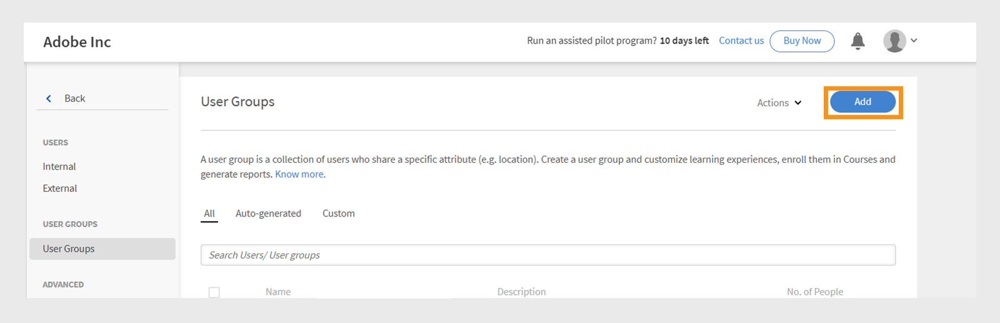
   _在使用者群組頁面中新增使用者群組的按鈕_

3. 輸入群組名稱和說明。

   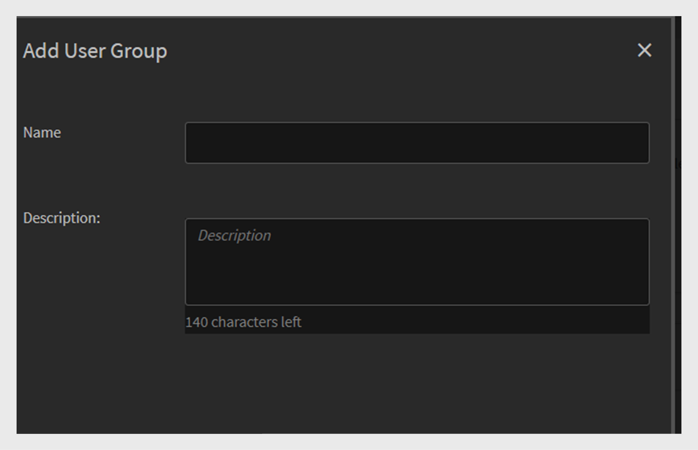
   _輸入欄位以輸入群組名稱和選擇性描述_

## 將使用者新增至使用者群組

管理員可透過兩種方式將使用者新增至使用者群組：

### 使用者區段

管理員可以使用包含和排除集，在使用者區段中新增或移除使用者或使用者群組。

* **包含集**&#x200B;將使用者新增至自訂使用者群組。 您可以包含一或多個使用者群組，而Adobe Learning Manager會使用邏輯(AND/OR)來決定要包含哪個使用者。 請參閱此[區段](#_Inclusion_and_exclusion)，深入瞭解AND/OR邏輯。
* **排除集**&#x200B;會從群組移除使用者，即使他們屬於包含集亦然。 這會精簡群組的使用者清單。

若要將使用者新增至群組：

1. 在&#x200B;**包含學習者**&#x200B;欄位中搜尋並選取使用者或現有的使用者群組。

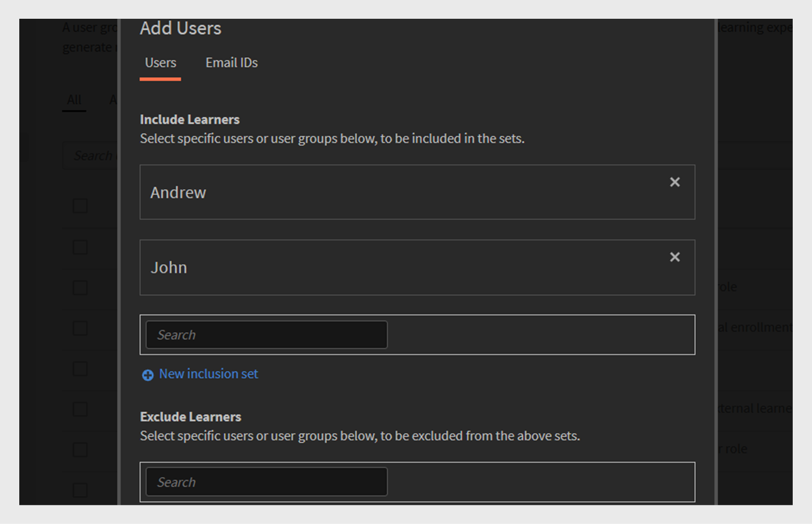
_包含設定以將特定使用者或群組新增到自訂使用者群組_

### 電子郵件ID區段

1. 以逗號分隔、分號或分行符號格式輸入使用者電子郵件地址，以將使用者新增至群組。

2. 選取&#x200B;**驗證電子郵件Id**。

   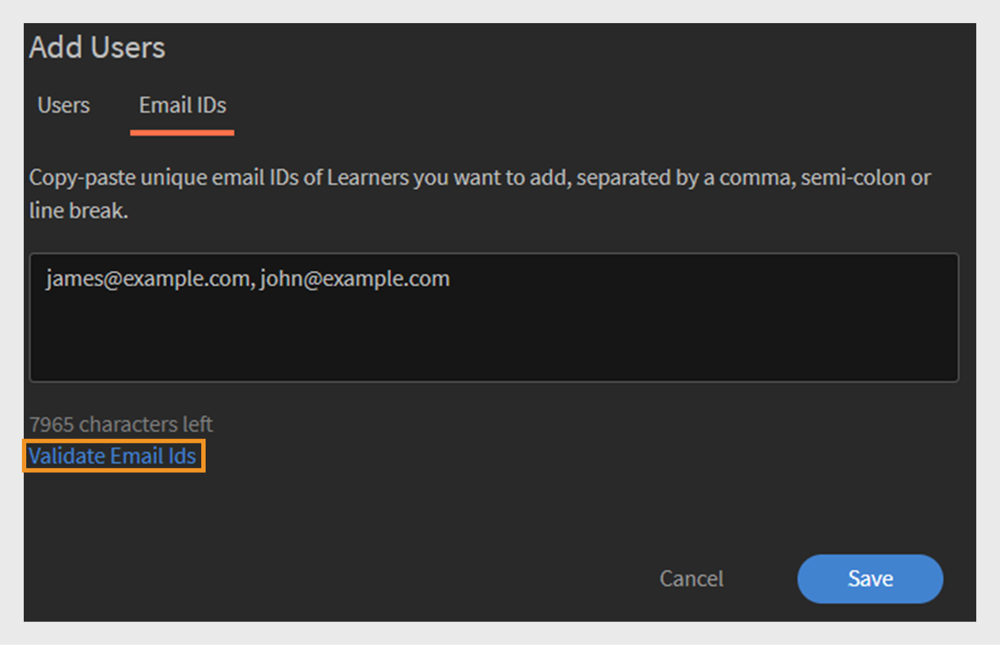
   _選取[驗證電子郵件ID]以驗證輸入的電子郵件ID_

   如果Adobe Learning Manager沒有電子郵件ID，或電子郵件ID不正確，您會看到錯誤。

   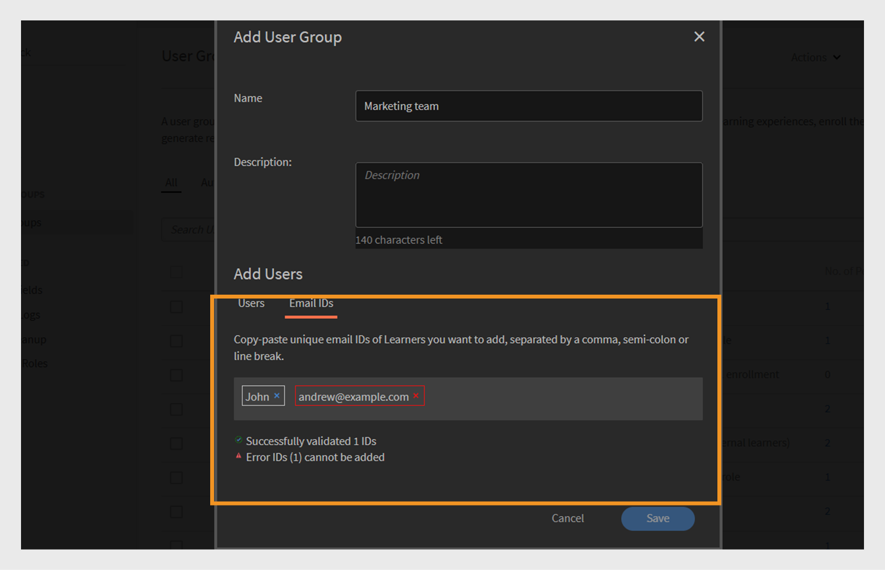
   _手動輸入多個電子郵件地址以新增使用者至群組的欄位_

3. 選取&#x200B;**儲存**&#x200B;以建立群組。

## 從群組排除使用者

管理員可以將特定使用者從使用者群組中排除，即使他們符合群組的條件亦然。 如果您想要制定例外狀況（例如阻止特定使用者收到指派的課程或出現在連結至該群組的報表中），這會很有幫助。

若要在建立自訂使用者群組時排除特定使用者或整個使用者群組：

1. 選取任何&#x200B;**使用者群組**，然後選取&#x200B;**新增**。
2. 瀏覽至&#x200B;**排除學習者**&#x200B;區段。
3. 選取要排除的使用者或群組。

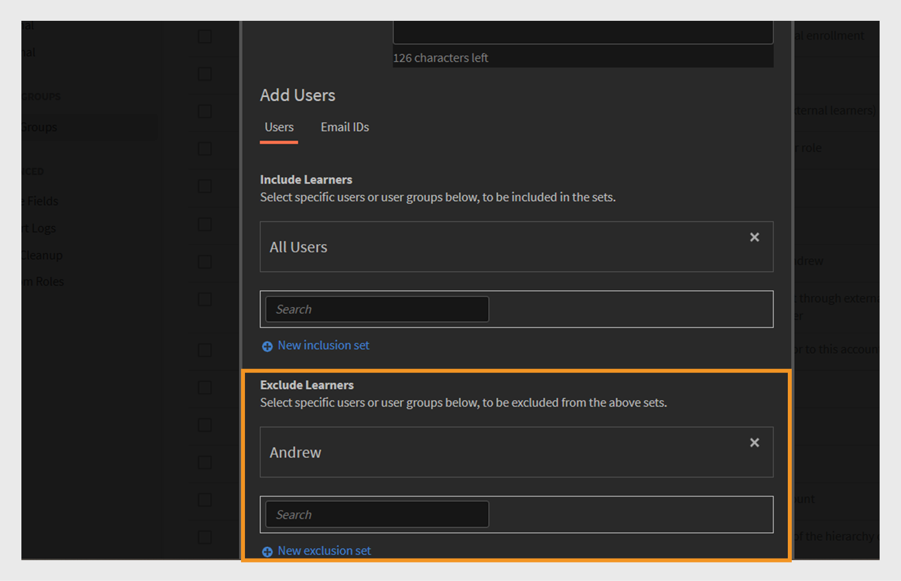
_從自訂群組移除使用者或群組的排除設定_

## 檢視群組成員

管理員可以檢視使用者群組中的使用者清單，包括名稱、電子郵件ID和狀態等詳細資訊。 若要檢視使用者清單：

1. 選取&#x200B;**使用者**，然後選取&#x200B;**使用者群組**。
2. 選取群組，然後在&#x200B;**否。 人員**&#x200B;資料行。

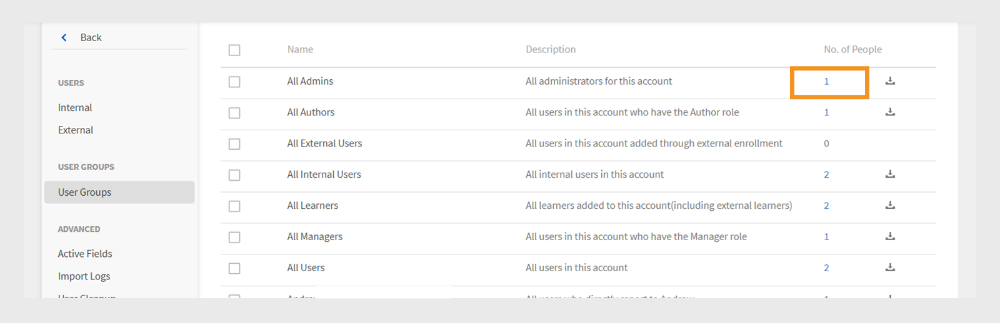
_目前包含在所選使用者群組中的使用者清單_

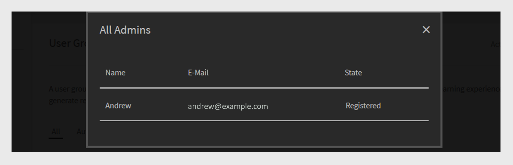
_所選使用者群組上可用的使用者清單_

## 下載群組成員

管理員可以下載群組成員清單，以檢視使用者詳細資訊，包括名稱、電子郵件、狀態、新增日期（UTC時區）、刪除日期（UTC時區）和上次登入日期（UTC時區）。 這有助於追蹤、報告和稽核群組成員資格。

1. 選取&#x200B;**使用者**，然後選取&#x200B;**使用者群組**。
2. 選取群組旁的下載圖示，將報表匯出為CSV檔案。

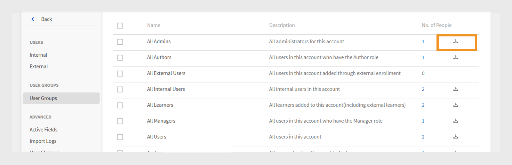
_下載圖示以將群組成員資料匯出為CSV檔案_

以下是群組成員報表的欄：

* **名稱**：使用者的名稱
* **電子郵件**：使用的電子郵件識別碼
* **狀態**：使用者的狀態（已註冊或未註冊）。
* **新增日期（UTC時區）**：以UTC時區新增使用者的日期。
* **刪除日期（UTC時區）**：在UTC時區中刪除使用者的日期。
* **上次登入日期（UTC時區）**：使用者上次登入UTC時區的日期。

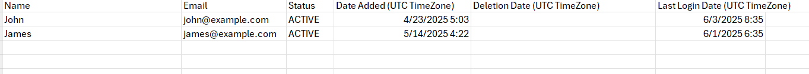
_範例CSV包含使用者詳細資料_

## 編輯使用者群組

管理員可以編輯群組以變更其名稱、說明或其他詳細資訊。

若要編輯使用者群組：

1. 在管理員首頁上選取&#x200B;**使用者**。
2. 選取&#x200B;**使用者群組**。
3. 選取您要編輯的使用者群組。
4. 進行必要的變更，例如更新名稱、說明或其他詳細資訊。
5. 選取&#x200B;**儲存**&#x200B;以套用變更。 變更將套用至使用者群組。

_要修改使用者群組名稱、說明或成員資格規則的欄位_

## 刪除使用者群組

管理員可以刪除不再需要的使用者群組，讓群組清單保持井然有序且為最新狀態。

若要刪除使用者群組：

1. 選取&#x200B;**使用者**，然後選取&#x200B;**使用者群組**。
2. 選取您要刪除的群組。
3. 選取&#x200B;**動作**，然後選取&#x200B;**刪除**。

   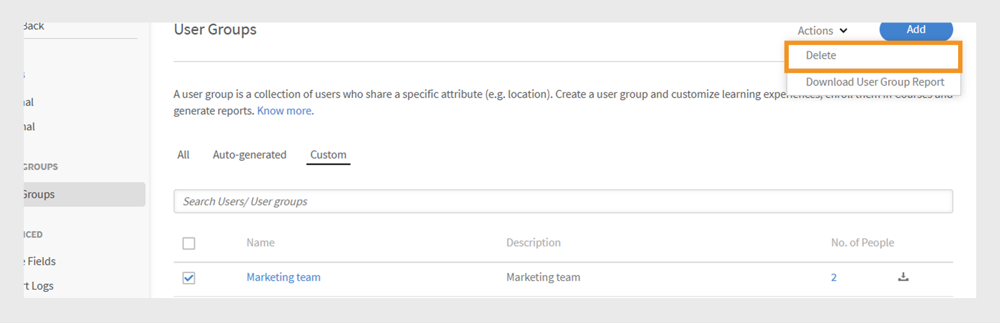
   在[動作]功能表中的[刪除]選項移除使用者群組&#x200B;__

4. 出現提示時確認刪除。 將刪除該使用者群組。

## 下載使用者群組報表

Adobe Learning Manager的使用者群組報表可讓管理員和管理人員深入瞭解不同使用者群組，例如部門、角色或外部合作夥伴。 這些報表可跨群組進行比較，以評估學習進度、課程完成率和參與程度。

若要下載報表：

1. 選取&#x200B;**使用者**，然後選取&#x200B;**使用者群組**。
2. 選取&#x200B;**動作**，然後選取&#x200B;**下載使用者群組報告**。

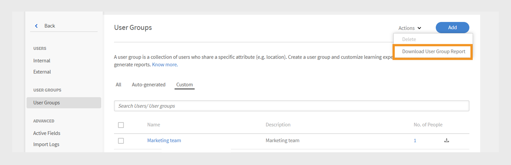
_從[動作]功能表下載群組層級資訊和中繼資料的選項_

此報表包含：

| 欄 | 說明 |
|---|---|
| 使用者群組型別 | 使用者群組的類別，例如自動產生的或自訂群組。 |
| 名稱 | 指派給使用者群組的名稱。 |
| 說明 | 使用者群組用途或範圍的簡短說明。 |
| 建立者（名稱） | 建立群組的管理員全名。 |
| 建立者（電子郵件） | 建立群組的管理員的電子郵件地址。 |
| 建立時間（UTC時區） | 建立群組的日期和時間，如國際標準時間(UTC)所示。 |
| 使用者人數 | 目前包含在群組中的使用者總數。 |

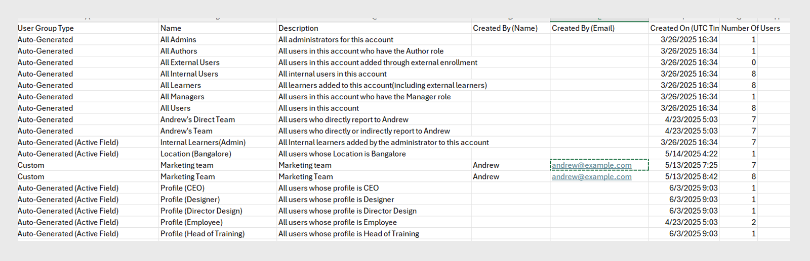
_使用者群組報告包含所有欄位_

## 建立自訂使用者群組的包含和排除規則

新增自動產生或現有的使用者群組來建立&#x200B;**自訂使用者群組**&#x200B;時，Adobe Learning Manager會根據&#x200B;**AND/OR邏輯**&#x200B;套用特定的&#x200B;**包含和排除規則**。 這些規則取決於使用者群組在包含和排除集中的組合方式。

您可以將一或多個自動產生的使用者群組新增至包含集。 套用的邏輯取決於您選取這些群組的方式：

### 在使用者群組中使用AND邏輯

如果您選取同一個包含集中的多個使用者群組，使用者必須符合所有條件才能包含在內。

例如，

* 銷售團隊群組： 120位使用者
* 地點（班加羅爾）群組：80位使用者
* **both**&#x200B;群組中的常見使用者： 40位使用者

Adobe Learning Manager會使用AND邏輯來建立只有40名使用者的群組。 這些使用者屬於Sales Team並且也位於Bangalore，同時符合兩個條件。

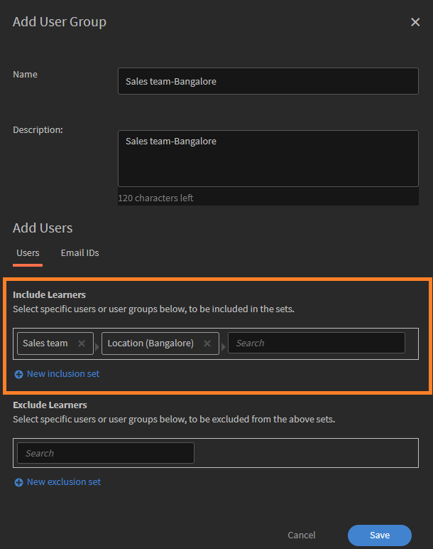
_使用AND邏輯合併多個群組的範例_

### 在使用者群組中使用OR邏輯

如果您將使用者群組新增至個別包含集中，則會包含符合任何條件的使用者。 例如：

* 銷售團隊群組： 120位使用者
* 地點（班加羅爾）群組：80位使用者
* 任一群組中的使用者總數：160位使用者（部分使用者可能同時位於兩個群組中）

當您使用OR邏輯時，Adobe Learning Manager會新增位於Sales Team或班加羅爾的使用者。 這表示其中包含符合這兩個條件中任何一個的使用者。 因此，該群組在移除重複專案後會包含160名使用者。

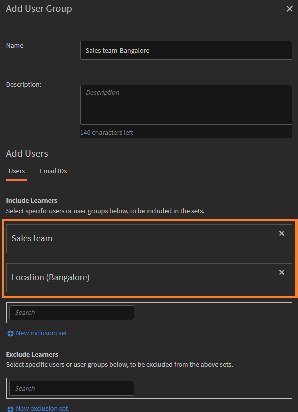
_使用OR邏輯合併多個群組的範例_

