# Adobe Learning Manager 中的使用者群組

Adobe Learning Manager 中的使用者群組能幫助你根據共通屬性（如部門、地點或角色）組織學習者。 將使用者分組讓分配課程、管理權限以及同時追蹤多位使用者的學習進度變得更容易。

>[!INFO]
>
>觀看這場 ALM Academy 培訓，學習如何依據姓名、電子郵件 ID 以及合併多個自動產生的使用者群組建立使用者群組。   

## 使用者群組類型

Adobe Learning Manager 支援以下使用者群組：

1. **自動產生的使用者群組：** 在 Adobe Learning Manager 中，系統會根據使用者角色與屬性自動建立部分使用者群組。 這些系統定義的群組包括所有作者、所有管理員、所有學習者和所有管理者。 Adobe Learning Manager 會產生這些群組，幫助依角色組織使用者。 你無法重新命名或刪除這些系統定義的群組。

2. **自訂使用者群組：** 在 Adobe Learning Manager 中，管理員可以建立自訂使用者群組，根據特定條件組織學習者。 這些群組是動態的，會自動加入符合定義條件的使用者。 自訂群組協助指派目標學習路徑、套用客製化品牌，並產生針對性的報告。 它們是管理與個人化學習體驗的彈性工具。

## 建立自訂使用者群組

管理員會手動建立使用者群組，根據定義的屬性組織使用者。 這些群組可以是動態的，會自動加入符合指定條件的使用者。 使用者群組簡化了分配學習路徑、套用客製化品牌及產生目標報告等任務。

要建立自訂使用者群組：

1. 在管理員首頁選擇 **使用者** 。
2. 選擇 **使用者群組** ，然後選擇 **新增**。

   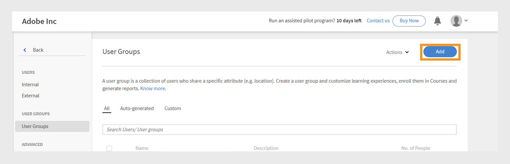
   _在使用者群組頁面新增使用者群組的按鈕_

3. 輸入群組名稱和說明。

   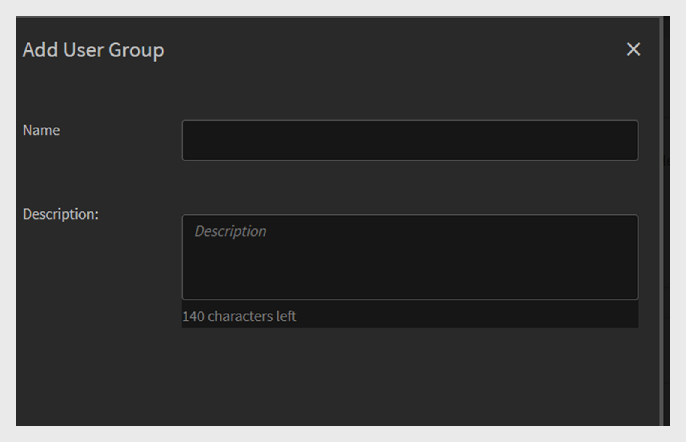
   _輸入欄位以輸入群組名稱及可選描述_

## 新增使用者到使用者群組

管理員可以透過兩種方式將使用者加入使用者群組：

### 使用者區

管理員可以在使用者區塊使用包含與排除設定來新增或移除使用者或使用者群組。

* **包含集** 會將使用者加入自訂使用者群組。 你可以加入一個或多個使用者群組，Adobe Learning Manager 會用邏輯（AND/OR）來決定要包含哪個使用者。 請參閱本 [節](#_Inclusion_and_exclusion) 以了解更多關於 AND/OR 邏輯的資訊。
* **排除集** 會將使用者從群組中移除，即使他們原本是包含集的一部分。 這會精煉群組的使用者清單。

要將使用者加入群組：

1. 在「包含學習者&#x200B;**」欄位中搜尋並選擇使用者或現有使用者群組**。

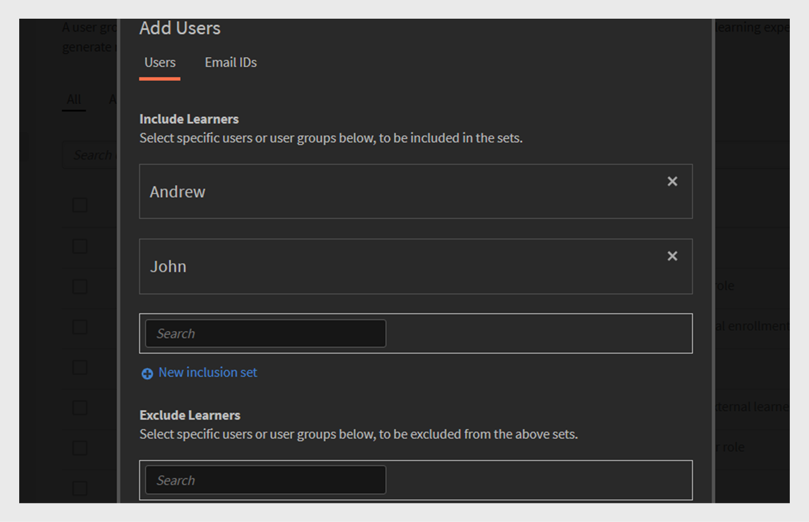
_包含設定，將特定使用者或群組加入自訂使用者群組_

### 電子郵件識別碼區塊

1. 請以逗號分隔、分號或換行格式輸入使用者的電子郵件地址，將使用者加入群組。

2. 選擇 **驗證電子郵件識別碼**。

   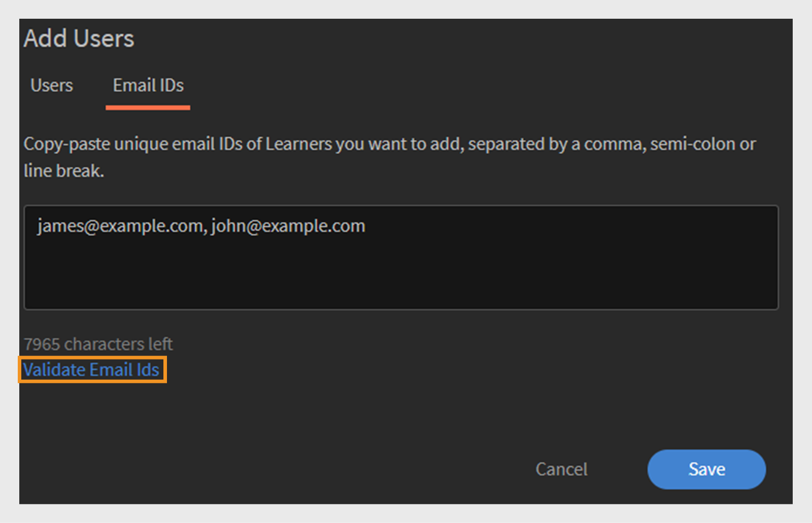
   _選擇驗證電子郵件 ID 以驗證輸入的電子郵件 ID_

   如果 Adobe Learning Manager 沒有電子郵件 ID 或電子郵件 ID 錯誤，你會看到錯誤訊息。

   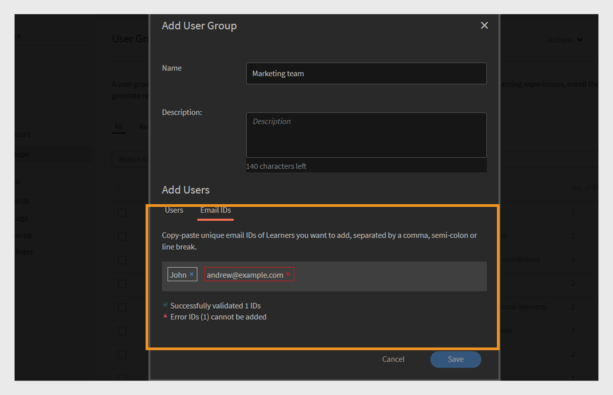
   _手動輸入多個電子郵件地址以加入群組的欄位_

3. 選擇 **儲存** 以建立群組。

## 排除群組中的使用者

管理員即使符合該群組的標準，也可以將特定使用者排除在外。 當你想破例時，這很有幫助，例如阻止某些使用者接收指定課程或出現在與該群組連結的報告中。

在建立自訂使用者群組時，要排除特定使用者或整個使用者群組：

1. 選擇任何 **使用者群組** ，然後選擇 **新增**。
2. 請前往 **「排除學習者** 」區塊。
3. 選擇你想排除的使用者或群組。

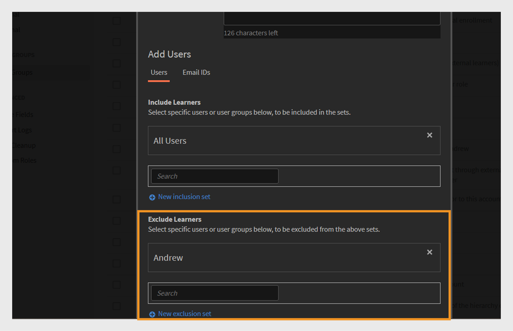
_排除設定，用以移除使用者或群組出自訂群組_

## 查看群組成員

管理員可以查看使用者群組中的使用者清單，包括姓名、電子郵件 ID 和州等詳細資訊。 要查看使用者名單：

1. 選擇 **使用者** ，然後選擇 **使用者群組**。
2. 選擇一個群組，然後選擇「編號」中的 **數值。 《人物** 》專欄。

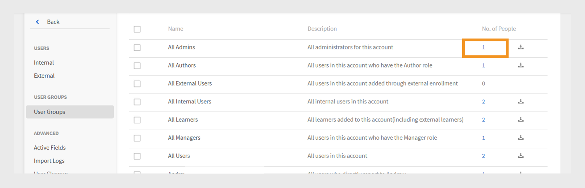
_目前已包含在特定使用者群組中的使用者列表_

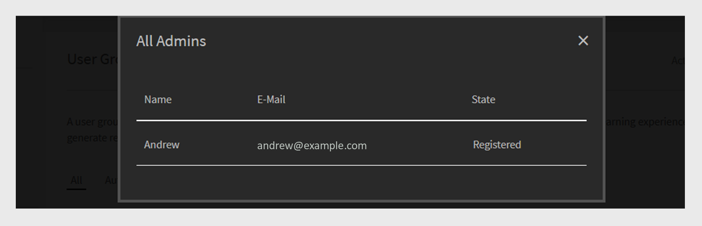
_所選使用者群組可用使用者名單_

## 下載群組成員

管理員可以下載群組成員名單，以檢視使用者資料，包括姓名、電子郵件、狀態、新增日期（UTC時區）、刪除日期（UTC時區）及最後登入日期（UTC時區）。 這有助於追蹤、報告及審核群組成員狀況。

1. 選擇 **使用者** ，然後選擇 **使用者群組**。
2. 選擇群組旁的下載圖示，將報告匯出為 CSV 檔案。

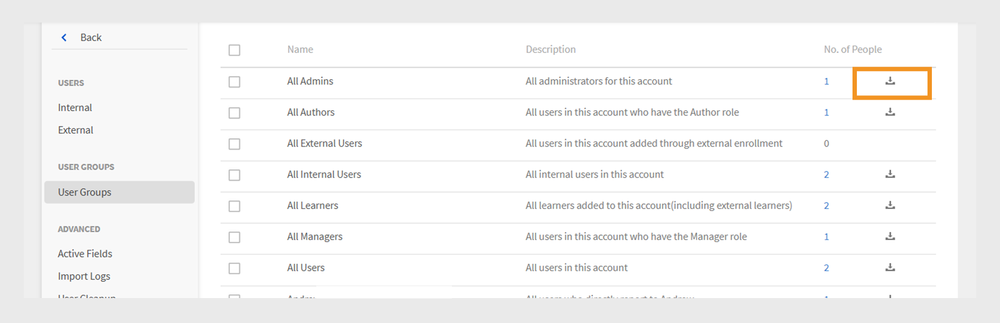
_下載圖示以匯出群組成員資料為 CSV 檔案_

以下是該小組成員報告的欄目：

* **名稱**：使用者姓名
* **電子郵件**：使用時的電子郵件 ID
* **狀態**：使用者狀態（註冊或未註冊）。
* **新增日期（UTC 時區）：**&#x200B;使用者在 UTC 時區被加入的日期。
* **刪除日期（UTC 時區）：**&#x200B;使用者在 UTC 時區被刪除的日期。
* **最後登入日期（UTC 時區）：**&#x200B;使用者最後一次在 UTC 時區登入的日期。

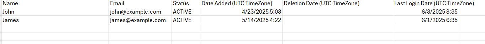
_範例 CSV 包含使用者資料_

## 編輯使用者群組

管理員可以編輯群組以更改名稱、描述或其他細節。

要編輯使用者群組：

1. 在管理員首頁選擇 **使用者** 。
2. 選擇 **使用者群組**。
3. 選擇你想編輯的使用者群組。
4. 做必要的修改，例如更新名稱、描述或其他細節。
5. 選擇 **儲存** 以套用變更。 這些變更將套用到使用者群組。

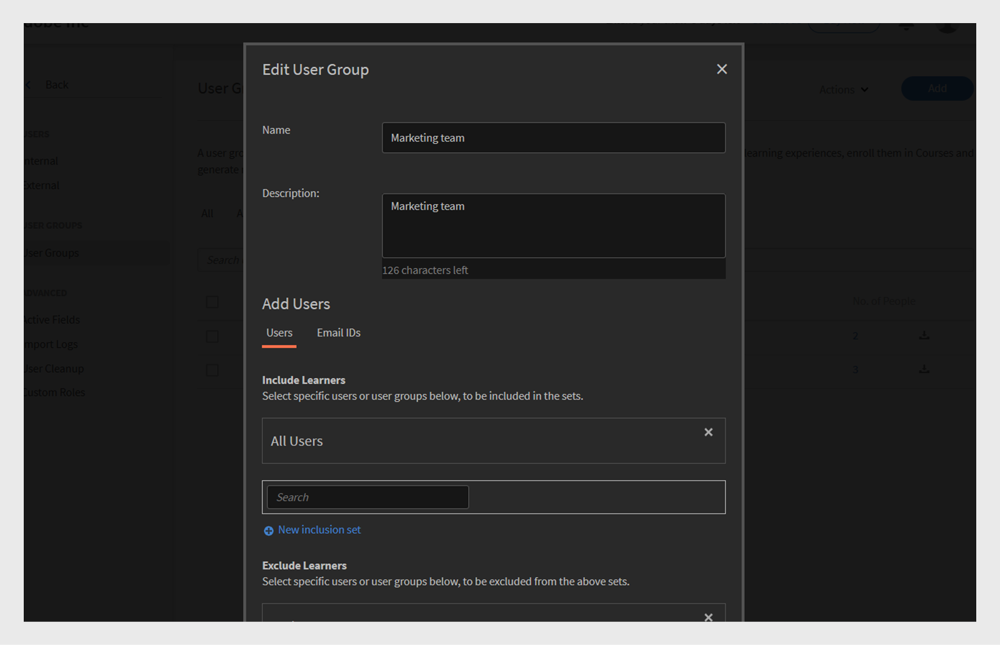
_修改使用者群組名稱、描述或會員規則的欄位_

## 刪除使用者群組

管理員可以刪除不再需要的使用者群組，以保持群組列表的有序與更新。

要刪除使用者群組：

1. 選擇 **使用者** ，然後選擇 **使用者群組**。
2. 選擇你想刪除的群組。
3. 選擇 **動作** ，然後選擇 **刪除**。

   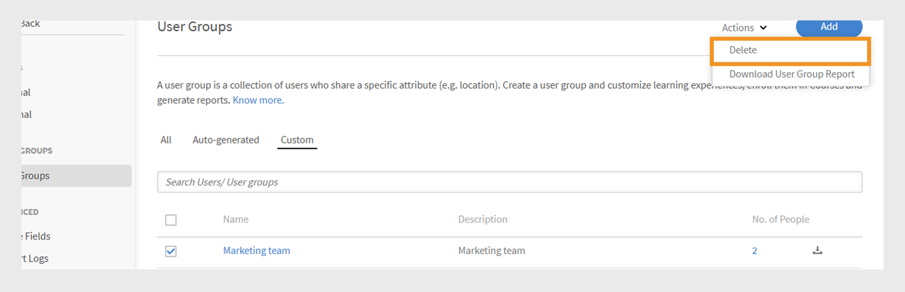
   _在操作選單中刪除使用者群組的選項_

4. 當被要求刪除時確認刪除。 使用者群組將會被刪除。

## 下載使用者團體報告

Adobe Learning Manager 的使用者群組報告為管理員與經理提供不同使用者群組（如部門、角色或外部合作夥伴）表現的洞察。 這些報告使得跨群體比較，以評估學習進度、課程完成率及參與度。

下載報告：

1. 選擇 **使用者** ，然後選擇 **使用者群組**。
2. 選擇「動作&#x200B;**」，然後選擇**「下載使用者群組報告&#x200B;**」。**

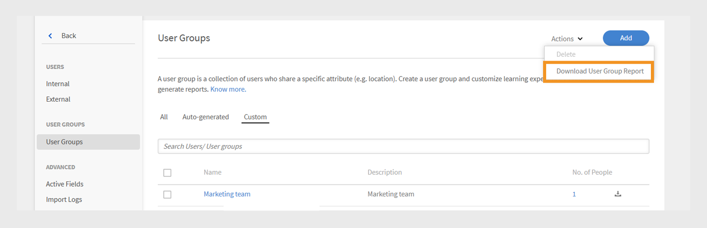
_從動作選單下載群組層級資訊與元資料的選項_

本報告包括：

| 柱狀 | 說明 |
|---|---|
| 使用者群組類型 | 使用者群組的類別，例如自動產生群組或自訂群組。 |
| 名稱 | 使用者群組的名稱。 |
| 說明 | 簡要說明該用戶群的目的或範圍。 |
| 由（姓名）創建 | 創建該群組管理員的全名。 |
| 由（電子郵件）製作 | 創建群組管理員的電子郵件地址。 |
| 創建於（UTC時區） | 群組成立的日期與時間，以協調世界時（UTC）顯示。 |
| 使用者數量 | 目前群組中包含的總用戶數。 |

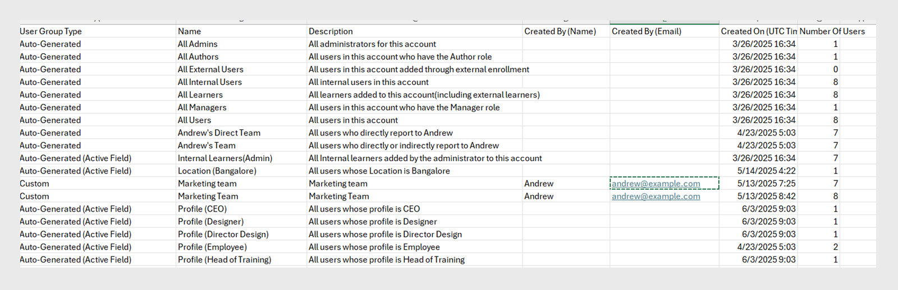
_使用者群組報告包含所有欄位_

## 建立自訂使用者群組的包含與排除規則

當透過新增自動產生或現有的使用者群組建立&#x200B;**自訂使用者群組**&#x200B;時，Adobe Learning Manager 會根據 AND/OR 邏輯&#x200B;**套用特定的**&#x200B;包含與排除規則&#x200B;**&#x200B;**。這些規則取決於包含與排除集合中使用者群組的組合方式。

你可以將一個或多個自動產生的使用者群組加入包含集。 所採用的邏輯取決於你如何選擇這些群組：

### 在使用者群組中使用 AND 邏輯

若在同一包含集中中選擇多個使用者群組，使用者必須符合所有條件才能被納入。

例如，

* 銷售團隊群組：120 名使用者
* 地點（班加羅爾）群組：80 名用戶
* 兩&#x200B;**組常見使用者**：40 名使用者

Adobe Learning Manager 使用 AND 邏輯來建立一個只有 40 名使用者的群組。 這些用戶是銷售團隊成員，且同樣位於班加羅爾，符合這兩項條件。

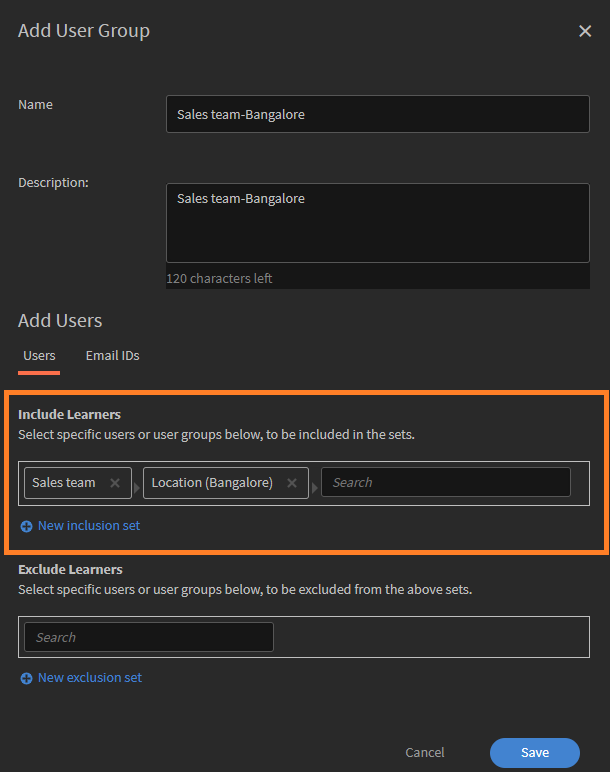
_範例顯示多個群組使用 AND 邏輯合併_

### 在使用者群組中使用 OR 邏輯

如果你將使用者群組加入不同的包含集，符合任何條件的使用者都會被包含在內。 例如：

* 銷售團隊群組：120 名使用者
* 地點（班加羅爾）群組：80 名用戶
* 任一群組的總用戶數：160 名用戶（部分用戶可能同時屬於兩個群組）

使用 OR 邏輯時，Adobe Learning Manager 會新增銷售團隊或位於班加羅爾的使用者。 這表示它包含符合這兩種條件中任一的使用者。 因此，移除重複用戶後，群組包含了 160 名用戶。

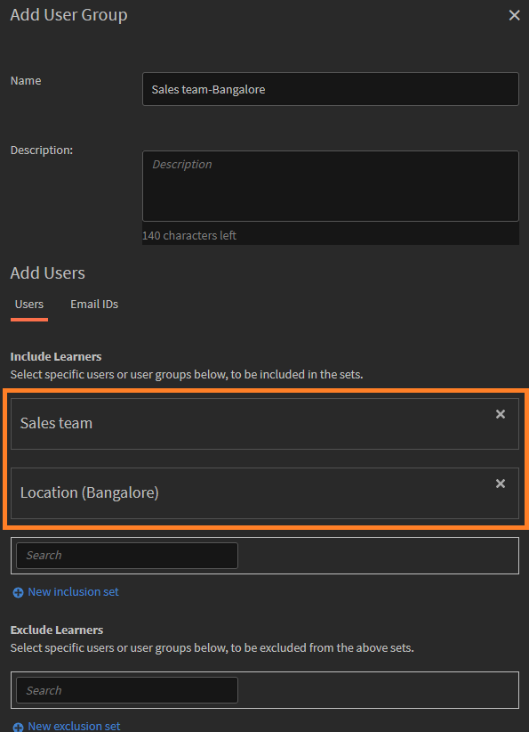
_範例顯示多個群組使用或運籌邏輯合併_

