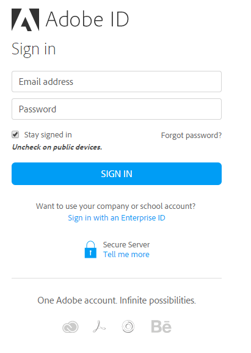

# 使用者登入

第一次使用Adobe學習管理員時，您需要依照下列步驟建立帳戶：

1. 使用管理員寄送歡迎電子郵件時收到的安全連結啟動AdobeLearning Manager 。\
   登入畫面隨即顯示。
1. 按一下「登入」。

*登入AdobeLearning Manager*

1. 輸入Adobe ID和密碼，然後按一下「登入」。\
   如果您忘記密碼，請按一下 **[!UICONTROL Forgot password?]** 連結，並提供您用於建立Adobe ID的電子郵件ID。

1. 或者，您可以按一下「 」來使用Enterprise ID **[!UICONTROL Sign in with an Enterprise ID link]**.

>[!NOTE]
>
>第一次登入後，您的Adobe ID就會與公司帳戶建立關聯。 對於任何後續的登入，您可以將您在歡迎郵件中收到的帳戶URL （第二個URL）加入書籤。

## 使用者登入方法 {#userloginmethods}

如果您是組織的內部使用者，則可使用Adobe ID或單一登入方法來登入Learning Manager。

如果您是組織的外部使用者，則可使用Adobe ID、單一登入或使用Learning Manager ID來登入Learning Manager。
