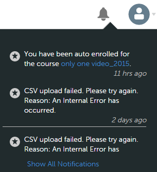
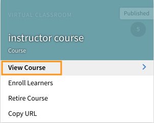
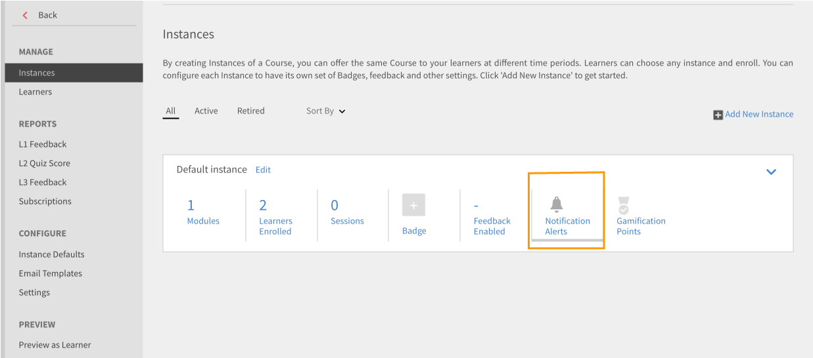
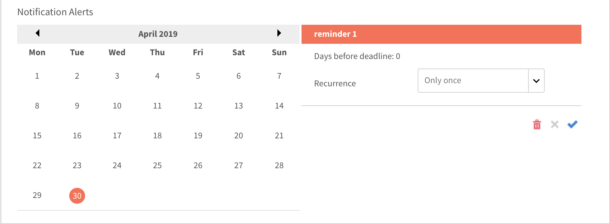
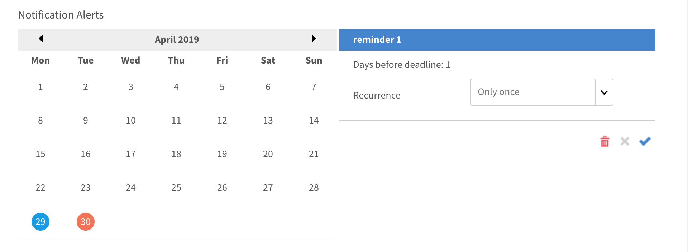
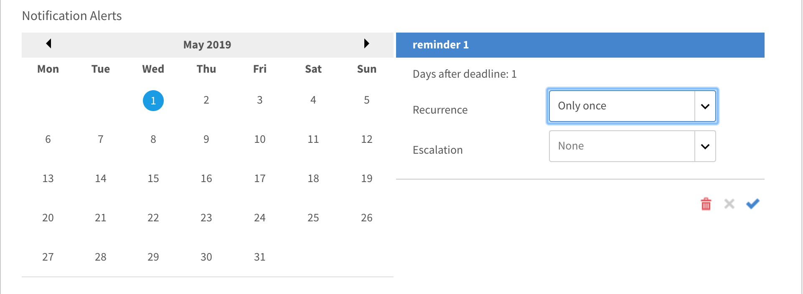
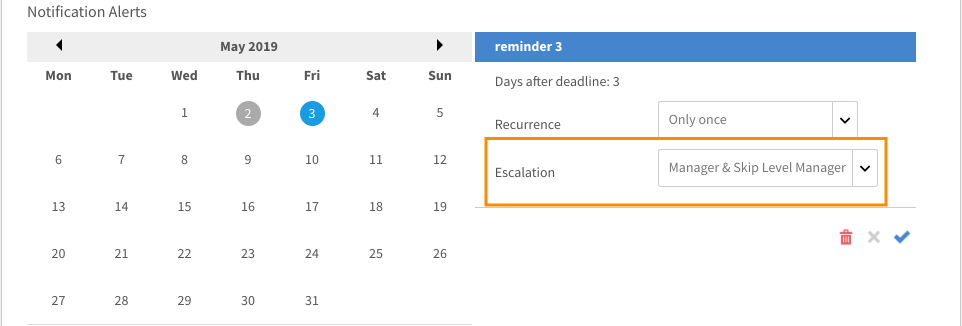

# 通知

通知功能適用於Adobe Learning Manager的所有使用者。 但是，每個使用者根據其角色在不同情況下會獲得不同種類的通知。 所有給使用者的警報和通知都會透過通知快顯對話方塊顯示。

## 存取通知 {#accessnotifications}

使用者按一下視窗右上角的通知圖示即可檢視通知。 此快顯對話方塊會顯示所有通知的醒目提示，以及卷軸出現的時間。 若要檢視關於所有通知的詳細資訊，請按一下快顯對話方塊底部的顯示所有通知。 「通知」頁面便會顯示。

您可以透過通知圖示上方醒目提示的數字來瞭解最新通知的數量。 例如，如果您上次登入後有五個最新的通知，您會看到通知圖示上方顯示數字5。 讀取所有最新通知後，這些數字就會消失。

## 管理員的通知型別 {#typesofnotificationsforadministrators}

管理員會在以下例項下取得通知：

* 每當成功上傳csv使用者清單時。
* 只要上傳使用者的csv清單失敗。 管理員收到一則訊息，說明失敗的原因。
* 管理員也可以為課程和學習計畫設定執行個體層級通知警報。 在此情況下，管理員會根據在執行個體層級選取的頻率來取得通知。

>[!NOTE]
>
>如果管理員除了其角色之外，還有作者或管理員許可權，則管理員會取得與每個角色相關的通知。

管理員角色的通知視窗範例顯示在下列熒幕擷圖中：

*檢視管理通知*

此快顯視窗會顯示所有通知的醒目提示，以及發生時間和卷軸。 您可以根據通知圖示上方醒目提示的數字來瞭解最新通知的數量。 例如，如果您上次登入後有五個最新的通知，您會看到通知圖示上方顯示數字5。 讀取所有最新通知後，這些數字就會消失。

按一下 **[!UICONTROL Show all notifications]** 通知快顯視窗底部的連結，可在個別頁面中檢視所有通知。 在通知頁面上，您可以看到下列內容：

* **所有通知**：在這裡檢視所有通知
* **擱置中**：在這裡檢視擱置中的通知
* **討論**：搜尋課程以檢視正在進行的討論。

## 設定多重層級提升通知 {#setupmultilevelescalationnotifications}

當學習者錯過截止日期時，上報電子郵件可以傳送給經理和略過經理。 您可以在建立課程過程中，甚至是在建立課程之後，針對課程未完成設定多層次升級通知。 提升通知可以設定為以設定的頻率傳送，以傳送給經理或略過經理。

1. 以管理員或作者身分登入，然後按一下「課程」。
1. 選取您要修改提升通知的課程，然後按一下 **[!UICONTROL View Course]**.

   

   *選取檢視課程選項*

1. 按一下 **[!UICONTROL Instances]** > **[!UICONTROL Notification Alerts]**.

   

   *選取通知警示選項*

1. 行事曆隨即開啟，以紅色反白顯示課程設定的截止日期。 按一下醒目提示的日期，檢視為學習者設定的提醒。

   

   *檢視期限提醒*

1. 選取截止日期前的日期，設定提醒。 這可讓您為學習者設定臨近截止日期的提醒。

   

   *設定期限提醒日期*

1. 選取截止日期之後的日期，以設定學習者的提醒排程和經理的上報通知。

   

   *設定提醒和向上呈報日期*

1. 如果學習者即使在升級至經理後仍無法完成課程，設定可讓您升級至學習者的跳過經理。 按一下延長截止日期之後的日期，選取提醒的週期、排程的天數，然後選取 **經理與略過層級經理** 在 **提升** 下拉式清單。 按一下藍色核取記號以儲存通知設定。

   

   *儲存通知設定*

## 常見問題 {#frequentlyaskedquestions}

+++如何在執行個體上設定提醒通知？

在執行個體上，按一下「通知警示」。 行事曆隨即開啟，以紅色反白顯示課程設定的截止日期。 按一下醒目提示的日期，檢視為學習者設定的提醒。 設定提醒，如本所述 [區段](user-notifications.md#Setupmultilevelescalationnotifications).
+++
