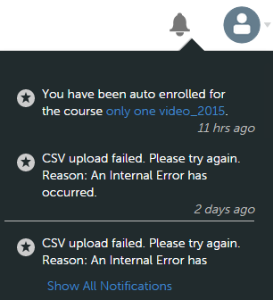
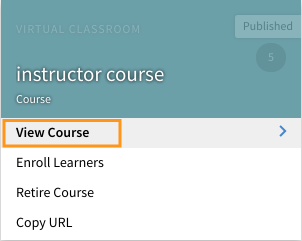
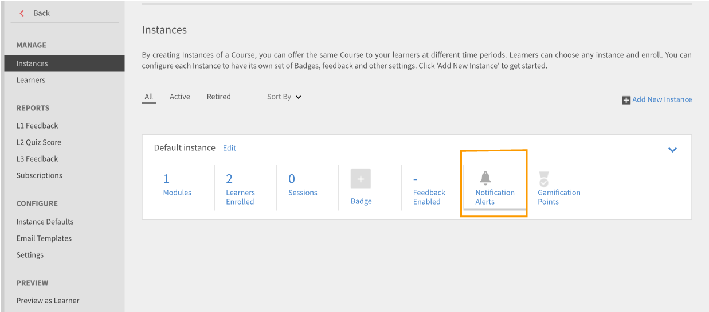
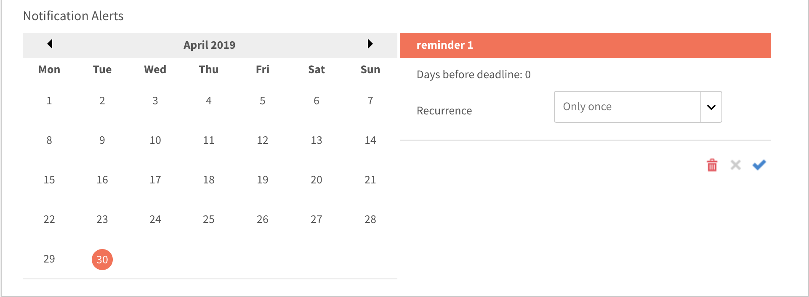
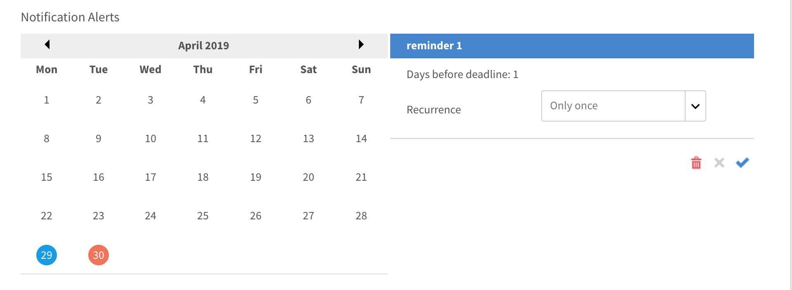
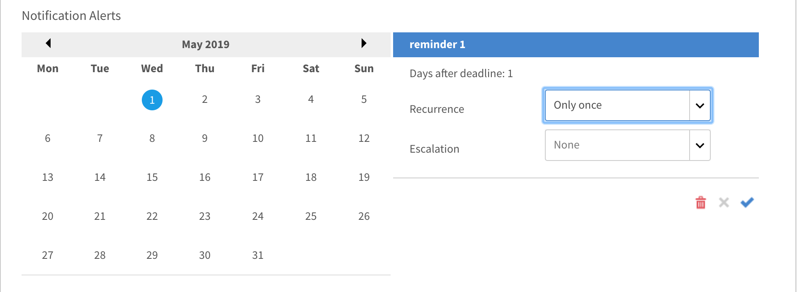
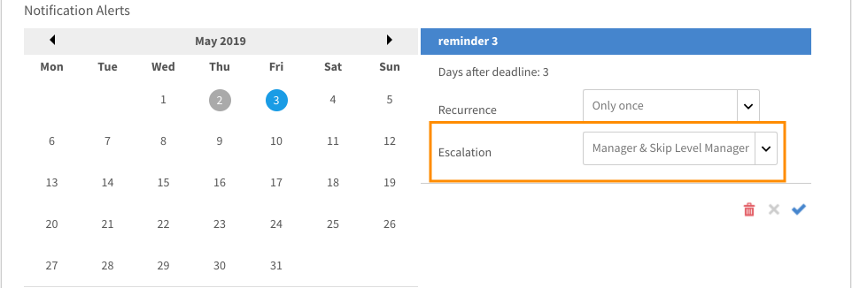

# 通知

通知功能適用於所有 Adobe Learning Manager 使用者。 但每個使用者根據其角色在不同情境下會收到不同類型的通知。 所有通知與通知都會透過通知彈出視窗顯示。

## 存取通知 {#accessnotifications}

使用者可點擊視窗右上角的通知圖示查看通知。 這個彈出視窗會用滾動列顯示所有通知的重點和發生時間。 要查看所有通知的更多資訊，請點擊彈出視窗底部的「顯示所有通知」。 通知頁面會出現。

你可以透過通知圖示上方高亮的數字來知道最新通知的數量。 例如，如果你上次登入後有五個最新通知，你可以看到通知圖示上方顯示數字 5。 這些數字在你看完所有最新通知後就會消失。

## 管理員通知類型 {#typesofnotificationsforadministrators}

管理員會在以下情況下收到通知：

* 只要成功上傳 csv 用戶清單。
* 每當上傳 CSV 用戶清單失敗時， 管理員會收到一則訊息，說明失敗原因。
* 管理員也能設定課程與學習計畫的實例級通知提醒。 在這種情況下，管理員會根據實例層級選擇的頻率來接收通知。

>[!NOTE]
>
>如果管理員除了角色外還擁有作者或管理者權限，管理員就會收到與每個角色相關的通知。

以下截圖顯示管理員角色的通知視窗範例：

*查看管理員通知*

這個彈出視窗會顯示所有通知的重點、發生時間和滾動列。 你可以根據通知圖示上方高亮的數字來知道最新通知的數量。 例如，如果你上次登入後有五個最新通知，你可以看到通知圖示上方顯示數字 5。 這些數字在你看完所有最新通知後就會消失。

點擊 **[!UICONTROL Show all notifications]** 通知彈出視窗底部的連結，可在獨立頁面查看所有通知。 在通知頁面，您可以看到以下內容：

* **所有通知**：請在此查看所有通知
* **待處理**：請點此查看待處理通知
* **討論**：搜尋課程以了解正在進行的討論。

## 設定多層級升級通知 {#setupmultilevelescalationnotifications}

當學員錯過截止日期時，可以將升級郵件發送給經理和跳過經理。 你可以在建立課程的過程中，甚至在課程建立後，設置多層級的升級通知，針對課程未完成。 升級通知可設定為以固定頻率發送給經理或跳過經理。

1. 以管理員或作者身份登入，點選課程。
1. 選擇你想修改升級通知的課程，然後點選 **[!UICONTROL View Course]**。

   

   *選擇「查看課程」選項*

1. 點擊>**[!UICONTROL Instances]**&#x200B;**[!UICONTROL Notification Alerts]**。

   

   *選擇「通知提醒」選項*

1. 會打開一個以紅色標示課程截止日期的行事曆。 點擊標示日期即可查看為學習者設定的提醒。

   

   *查看截止日期提醒*

1. 在截止日前選擇日期來設定提醒。 這讓你能為學習者設置提醒，提醒他們即將到來的截止日期。

   

   *設定截止日期提醒*

1. 選擇截止日期後的日期，安排學習者提醒及向經理發送升級通知的時間表。

   

   *設定提醒和升級日期*

1. 如果學員在升級到經理後仍無法完成課程，設定允許你升級到學員的跳繩經理。 點擊延長截止日期後的日期，選擇提醒的重複次數、排程天數，並在升級&#x200B;**下拉選單中**&#x200B;選擇&#x200B;**「經理與跳過層級經理**」。點擊藍色勾選標記以儲存通知設定。

   

   *儲存通知設定*

## 常見問題 {#frequentlyaskedquestions}

+++如何在實例上設定提醒通知？

在某個實例中，點擊通知提醒。 會打開一個以紅色標示課程截止日期的行事曆。 點擊標示日期即可查看為學習者設定的提醒。 如本 [節](user-notifications.md#Setupmultilevelescalationnotifications)所述，設定提醒。
+++
