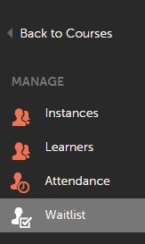

# 輪候表與出勤管理

管理員可以管理學習者的出勤率和課程輪候表。

## 輪候表管理 {#waitlistmanagement}

當名額有限時，學習者會根據其註冊順序輪候任何教室課程。 管理員可選取輪候學習者，並為任何教室課程分配名額限制以外的名額。 學習者會在管理員配置位子後立即註冊課程。

1. 按一下 **[!UICONTROL Courses]** 以管理員身分登入後，便會顯示在左窗格中。
1. 從可用課程清單中，按一下您選擇的任何教室課程的課程名稱。 新頁面隨即出現，內含課程的詳細資訊。

*選取輪候表選項*

1. 按一下 **[!UICONTROL Waitlist]** 在課程詳細資訊頁面的左窗格中。 輪候學習者清單會顯示在頁面上。
1. 選取學習者並按一下 **[!UICONTROL Allocate seats]** 將學習者直接註冊至課程以取代名額限制。

## 出席管理 {#attendancemanagement}

此功能僅適用於教室和虛擬教室課程。 您可以依照下列步驟記錄出席情況：

1. 以管理員身分登入後，請按一下左窗格中的「課程」 。
1. 從可用課程清單中，按一下您選擇的任何教室模組/課程的課程名稱。 新頁面隨即出現，內含課程的詳細資訊。
1. 按一下「出勤」標籤、選取學習者，然後按一下「儲存」以標籤出勤。

>[!NOTE]
>
>如果課程包含多個模組，且學習者僅完成其中一個，您可以選取單一模組並按一下「儲存」。 如果學習者完成課程的所有模組，您可以按一下「全選」選項並按一下「儲存」。

Adobe Connect虛擬教室工作階段的出席情況會在工作階段後2-3小時內自動標示。 只有在標示出勤率後，才會標示學習者的虛擬教室課程完成。
