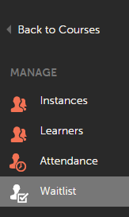

# 候補名單與出勤管理

管理者可以管理學習者的出勤及候補名單。

## 候補名單管理 {#waitlistmanagement}

當名額有限時，學生會根據選課順序被列入候補名單。 行政人員可選擇候補學生，並分配超過任何教室課程名額的名額。 學員在管理員分配名額後即可註冊課程。

1. 登入管理員後點左 **[!UICONTROL Courses]** 邊窗格。
1. 從可用課程列表中，點擊你選擇的任一課堂課程名稱。 新增一頁，提供課程詳細資訊。

*選擇候補名單選項*

1. 點擊 **[!UICONTROL Waitlist]** 課程詳情頁的左側窗格。 候補學習者名單會顯示在頁面上。
1. 選擇學習者，並點擊 **[!UICONTROL Allocate seats]** 直接將學習者註冊到超越名額限制的課程。

>[!NOTE]
>
>已註冊的學習者無法被移至候補名單，且其名額無法重新分配給其他學習者。

## 出席管理 {#attendancemanagement}

此功能僅適用於教室及虛擬教室課程。 您可以依照以下步驟記錄出席情況：

1. 登入管理員後，請在左側窗格點選「課程」。
1. 在可用課程列表中，點選你選擇的教室模組或課程名稱。 新增一頁，提供課程詳細資訊。
1. 點選「出席」標籤，選擇學習者，然後點選「儲存」以標記出席。

>[!NOTE]
>
>如果課程中有多個模組，且學習者只完成其中一模組，你可以選擇單一模組並點擊儲存。 如果學習者完成課程中所有模組，你可以點擊「全部」選項並選擇儲存。

基於 Adobe Connect 的虛擬教室課程會在課程結束後 2-3 小時自動記錄出席。 學習者的虛擬教室課程完成率僅在點名後才會被評分。
