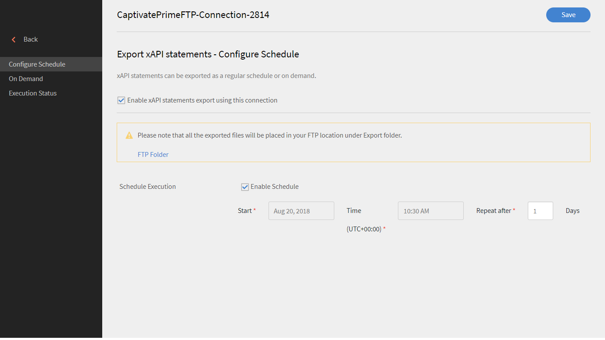

# Learning Manager中的xAPI

## 什麼是xAPI？ {#whatisxapi}

Experience API (xAPI)是eLearning軟體規格，可讓學習內容和學習系統透過記錄和追蹤所有學習體驗的方式彼此交談。 學習體驗會記錄在學習記錄存放區(LRS)中。 LRSs可以存在於傳統學習管理系統(LMS)中或獨立存在。

如需有關xAPI的詳細資訊，請參閱[xAPIc規格](https://github.com/adlnet/xAPI-Spec)。

## Learning Manager如何支援xAPI？ {#howdoeslearningmanagersupportxapi}

Learning Manager已內建學習記錄存放區。 此LRS可完全接受來自Learning Manager內託管內容的xAPI陳述式。 它甚至接受第三方產生的xAPI陳述式。 這些xAPI陳述式會儲存在Learning Manager中，然後可於Learning Manager外部匯出，以視覺化方式呈現至任何第三方資料倉儲系統。

## 您何時使用xAPI？ {#whendoyouusexapi}

對於跨多個系統的一般使用者來說，擷取學習體驗的需求日益增加。  也需要追蹤學習者與訓練內容的確切互動。 其範圍超出「開始」、「進行中」和「完成」（SCORM只會擷取這些屬性）。

## 在Learning Manager中使用xAPI {#usingxapiinprime}

### 設定您的應用程式 {#setupyourapplication}

1. 以整合管理員身分登入。 選取&#x200B;**[!UICONTROL Applications > Register]**。

   

   *啟動頁面以註冊應用程式*

1. 註冊新的應用程式。

   

   *註冊新的應用程式*

1. 定義應用程式的範圍。

   * 如果&#x200B;**[!UICONTROL Admin role xAPI read and write access]**&#x200B;已啟用，管理員便能張貼並取得xAPI陳述式與檔案。
   * 如果&#x200B;**[!UICONTROL Learner role xAPI read and write access]**&#x200B;已啟用，管理員便能張貼並取得xAPI陳述式與檔案。

1. 儲存變更。 您取得開發人員ID和密碼。

**端點**：

按一下以下連結以檢視xAPI swagger檔案：

[xAPI Swagger檔案](https://learningmanagereu.adobe.com/docs/primeapi/xapi/)

>[!NOTE]
>
>Learning Manager支援的xAPI版本為1.0.3。


## API驗證 {#apiauthentication}

Learning Manager xAPI使用OAuth 2.0架構來驗證及授權您的使用者端應用程式。 註冊應用程式後，您就可以取得clientId和clientSecret。 「取得URL」會用於瀏覽器，因為它會使用預先設定的帳戶(例如SSO、Adobe ID)驗證Learning Manager使用者。

```
GET https://learningmanager.adobe.com/oauth/o/authorize?client_id=<Enter your clientId>&redirect_uri=<Enter a url to redirect to>&state=<Any String data>&scope=<admin:xapi or learner:xapi>&response_type=CODE.
```

## 以Learning Manager LO身分追蹤xAPI陳述式 {#trackingxapistatementsasprimelo}

身為作者，您現在可以在建立課程時選擇xAPI模組，以便在Learning Manager外部監控使用者體驗。 例如，您可以使用此功能來評估使用者在用於課程使用的協力廠商平台上的活動。

1. 建立&#x200B;**[!UICONTROL Activity Module]**&#x200B;時，在**[!UICONTROL Type]**選項中，使用彈出式選單來選取&#x200B;**[!UICONTROL xAPI-based Module.]**

   

   *選取選項xAPI型模組*

1. 系統要求您提供IRI。 若未提供，Learning Manager會自動產生一個。

   活動的IRI在帳戶中是唯一的。 也就是說，Learning Manager中的兩個模組不能有相同的IRI。 在下列情況下會產生新的IRI：

   * 當具有xAPI模組的課程在帳戶間共用時。
   * 當具有xAPI模組的認證重複發生時


   任何具有上述IRI的xAPI陳述式都會在上述模組中受到追蹤，並反映在Learning Manager報表中。

1. 若要複製自動產生的IRI，請重新造訪「活動模組」頁面。
1. Publish模組。

**點注意：**

* Learning Manager目前僅支援   mbox做為識別碼。 不支援其他識別碼，包括mboz_sha1、openid 、帳戶。

* stateId和profileId在搭配Learning Manager使用時為UUID。
* PUT請求不會覆寫xAPI代理/設定檔、活動/設定檔和活動/狀態的檔案
* Actor不支援未識別的群組。
* GET陳述式不支援引數「related_activities」。
* GET陳述式不支援引數&#39;format=ids&#39;和&#39;format=canonical&#39;。
* 作廢xAPI陳述式不會復原陳述式發佈時在Learning Manager中發生的任何動作。

## 產生報表 {#generatereports}

xAPI報表可產生為Excel報表。 以系統管理員身分，開啟&#x200B;**[!UICONTROL Reports > Excel reports > xAPI activity report]**。

下載的報表會擷取學習者和管理員針對任何陳述式所張貼的所有資訊。

對於任何第三方整合，可以使用FTP和Box聯結器產生/排程相同的報表。 請依照下列步驟執行：

以&#x200B;**整合管理員>開啟FTP/Box聯結器>從左側面板選取xAPI活動報告**&#x200B;身分登入。 選擇以排程/產生報表。



*排程或產生報表*

* 當在xAPI陳述式中只傳送原始分數而沒有最高分數時，測驗分數不會顯示在LT中。

* 若要在Learning Manager中取得百分比分數，縮放分數會透過xAPI傳送。

## 範例報告 {#samplereport}

[xAPI報表範例。](assets/xapireport8842560559890766717csv.zip)
