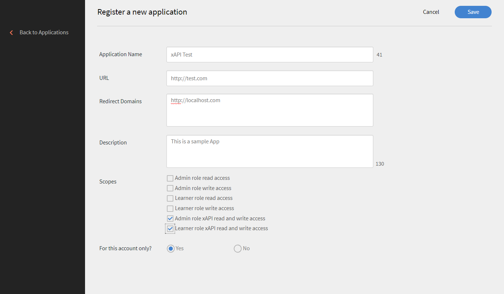
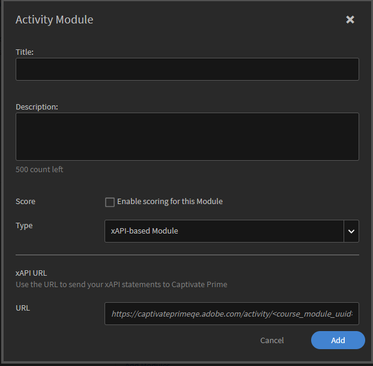

# 學習管理器中的 xAPI

## 什麼是 xAPI？ {#whatisxapi}

體驗 API（xAPI）是一項電子學習軟體規範，允許學習內容與學習系統以方式相互溝通，並記錄並追蹤各類學習經驗。 學習經驗會被記錄在學習記錄庫（Learning Record Store，簡稱LRS）中。 LRS可以存在於傳統學習管理系統（LMS）中，也可以獨立存在。

欲了解更多 xAPI 相關資訊，請參閱 [xAPIc 規範。](https://github.com/adlnet/xAPI-Spec)

## Learning Manager 如何支援 xAPI？ {#howdoeslearningmanagersupportxapi}

Learning Manager 內建了學習記錄庫。 此 LRS 具備完整功能，能接受來自已託管於 Learning Manager 內容的 xAPI 語句。 它甚至接受第三方產生的 xAPI 語句。 這些 xAPI 語句儲存在 Learning Manager 中，然後可以匯出到 Learning Manager 之外，並可視化到任何第三方資料倉儲系統中。

## 你什麼時候會使用 xAPI？ {#whendoyouusexapi}

越來越多地需要捕捉跨越多個系統的最終使用者學習經驗。  同時也需要追蹤學習者對培訓內容的精確參與度。 它超越了開始、進行中和完成（SCORM 僅包含這些屬性）。

## 在 Learning Manager 中使用 xAPI {#usingxapiinprime}

### 請先設定您的應用程式 {#setupyourapplication}

1. 以整合管理員身份登入。 選擇 **[!UICONTROL Applications > Register]**。

   

   *申請註冊啟動頁面*

1. 註冊新申請。

   

   *註冊新申請*

1. 定義申請範圍。

   * 如果 **[!UICONTROL Admin role xAPI read and write access]** 啟用了，管理員就能發佈並取得 xAPI 的語句和文件。
   * 如果 **[!UICONTROL Learner role xAPI read and write access]** 啟用了，管理員就能發佈並取得 xAPI 的語句和文件。

1. 儲存變更。 你會拿到開發者 ID 和秘密。

**終點**：

點擊下方連結可查看 xAPI swagger 文件：

[xAPI Swagger 文件](https://learningmanagereu.adobe.com/docs/primeapi/xapi/)

>[!NOTE]
>
>Learning Manager 支援的 xAPI 版本為 1.0.3。


## API 認證 {#apiauthentication}

Learning Manager xAPI 使用 OAuth 2.0 框架來驗證並授權您的客戶應用程式。 註冊應用程式後，你可以取得 clientID 和 clientSecret。 瀏覽器中會使用 Get URL 來驗證學習管理員使用者的身份，使用預先設定的帳號（如 SSO、Adobe ID）。

```
GET https://learningmanager.adobe.com/oauth/o/authorize?client_id=<Enter your clientId>&redirect_uri=<Enter a url to redirect to>&state=<Any String data>&scope=<admin:xapi or learner:xapi>&response_type=CODE.
```

## 以學習管理工具 LO 追蹤 xAPI 語句 {#trackingxapistatementsasprimelo}

作為作者，你現在可以在建立課程時選擇 xAPI 模組，以監控 Learning Manager 以外的使用者體驗。 例如，你可以利用此功能評估第三方平台上用於課程消費的使用者活動。

1. 在 **[!UICONTROL Type]** 選項中建立 **[!UICONTROL Activity Module]**&#x200B;時，請使用彈出選單選擇&#x200B;**[!UICONTROL xAPI-based Module.]**

   

   *選擇基於 xAPI 的模組選項*

1. 請您提供一份IRI。 若未提供，Learning Manager 會自動產生。

   活動的 IRI 在整個帳戶中是唯一的。 這表示 Learning Manager 中的兩個模組不能有相同的 IRI。 在以下情況下會產生新的IRI：

   * 當包含 xAPI 模組的課程在不同帳號間共享時，
   * 當帶有 xAPI 模組的認證重複出現時


   任何帶有上述 IRI 的 xAPI 語句都會在上述模組中被追蹤，並反映在學習管理器的報告中。

1. 要複製自動產生的 IRI，請重新造訪活動模組頁面。
1. 發佈模組。

**注意事項：**

* Learning Manager 目前僅支援 mbox 作為識別碼。 其他識別碼如 mboz_sha1、openid、帳戶則不支援。

* stateID 和 profileID 在 Learning Manager 中使用時是 UUID。
* PUT 請求不會覆蓋 xAPI agents/profile、activity/profile 和 activity/state 的文件
* Actor 不支援未識別群組。
* GET 陳述中不支援參數「related_activities」。
* 參數 &#39;format=ids&#39; 和 &#39;format=canonical&#39; 在 GET 語句中不被支援。
* 取消 xAPI 語句並不會撤銷 Learning Manager 中在該語句發布時發生的任何操作。

## 產生報告 {#generatereports}

xAPI 報告可以產生為 Excel 報告。 作為管理員，請開放 **[!UICONTROL Reports > Excel reports > xAPI activity report]**。

下載的報告會取得學習者與管理員發布的所有陳述資訊。

同樣的報告也可以用 FTP 和 Box 連接器來產生/排程，用於第三方整合。 請遵循以下步驟：

以整合管理員身份登入 **>開啟 FTP/Box 連接器>從左側面板選擇 xAPI 活動報告** 。 選擇排程/產生報告。


*排程或產生報告*

* 當 xAPI 語句中只傳送原始分數且沒有最高分數時，測驗分數不會在 LT 中顯示。

* 要在 Learning Manager 取得百分比分數，會透過 xAPI 傳送縮放分數。

## 範例報告 {#samplereport}

[xAPI 報告範例。](assets/xapireport8842560559890766717csv.zip)
