# Microsoft Teams專用AdobeLearning Manager應用程式

## 如何設定

在MS Teams上設定ALM需要三個步驟，並且需要ALM管理員和Microsoft Azure管理員的協助。 在某些組織中，Azure管理員和MS團隊管理員不同，因此也需要額外的MS團隊管理員。

**ALM管理員 — 整合管理員角色可核准Teams應用程式**

在整合管理員核准MS Teams應用程式後，MS Teams應用程式商店將提供AdobeLearning Manager應用程式，您的學習者可加以存取。 不過，應用程式將不會有通知、無訊息登入，而且不會為MS Teams中的學習者釘選應用程式。

**Microsoft Azure管理員會核准Azure儀表板中ALM應用程式的許可權**

Azure管理員必須核准ALM應用程式所需的許可權。 這可讓ALM應用程式傳送通知給MS Teams，並允許無訊息登入。 在無訊息登入中，使用者不需要另外登入，就能在瀏覽器上AdobeLearning Manager。

**MS Teams管理員會為ALM團隊建立原則**

系統管理中心的MS Teams管理員應該為所有使用者釘選ALM應用程式，並允許將其作為全域原則。 如果ALM僅由公司中的特定群組使用，則MS Teams管理員必須選擇自訂原則並僅將其套用至該特定群組。

## 整合管理員角色可核准Teams應用程式

請遵循下列步驟：

1. 在整合管理員應用程式上，選取 **[!UICONTROL Applications]** > **[!UICONTROL Featured Apps]**，並選取 **[!UICONTROL ALM Teams app]**.

   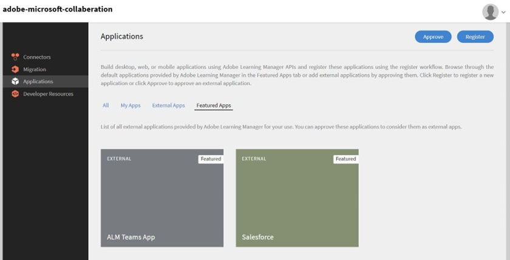
   *選取ALM Teams應用程式*

1. 在畫面的右上角，選取 **[!UICONTROL Approve]**.

   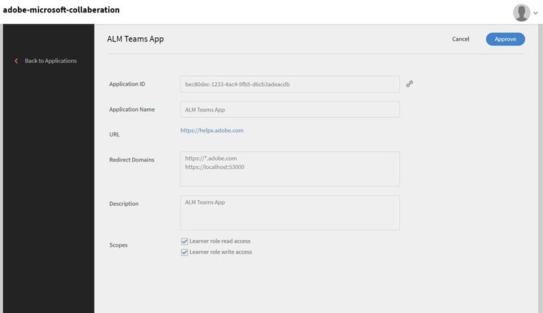
   *在應用程式設定頁面上選取核准*

1. 選取 **[!UICONTROL OK]** 在出現的對話方塊上。

   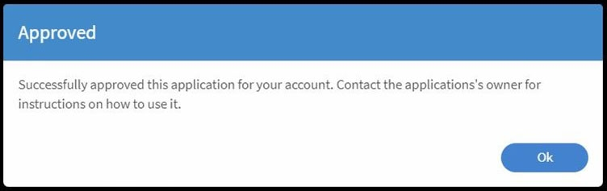
   *核准後選取「確定」*

1. 核准後，您就可以在外部應用程式區段中看到「ALM Teams應用程式」。

   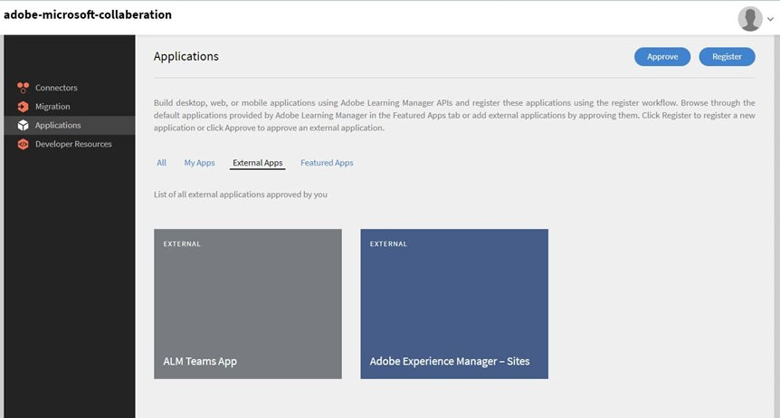
   *ALM Teams應用程式會顯示在「應用程式」頁面上*

現在，使用者可以在MS Teams上存取ALM應用程式。

## Microsoft Azure管理員會核准Azure儀表板中ALM應用程式的許可權

請遵循下列步驟：

1. 以Azure管理員的身分，導覽至Azure控制面板中的管理Azure Active Directory區段。

   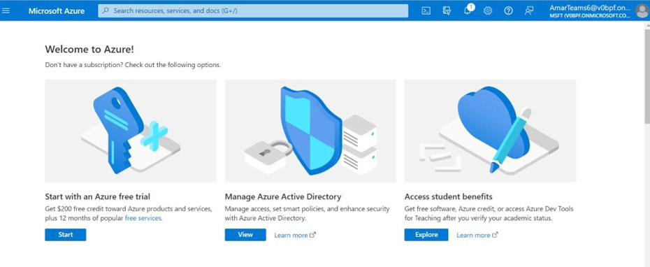
   *啟動Azure儀表板*

1. 將下列連結貼到個別的瀏覽器視窗中：

   `https://login.microsoftonline.com/<tenantIdTobeReplaced>/oauth2/authorize?client_id=8d349d9f-bf59-4ece-8022-a41e87d81903&response_type=code&redirect_uri=https://learningmanager.adobe.com`

1. 在上述連結中，取代 `<tenantIdTobeReplaced>` 租使用者id可在下方的概觀頁面中使用。 輸入新的URL。

1. 將Adobe Learning Manager應用程式新增至您的Azure應用程式。

   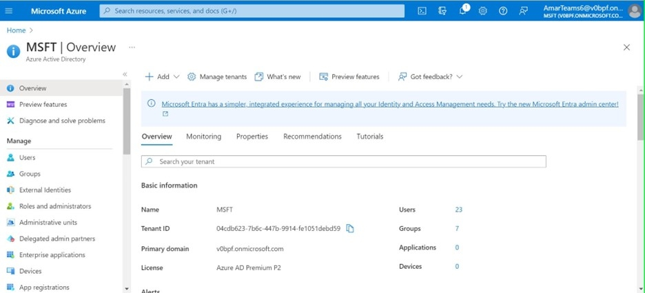
   *新增至Azure*

1. 選取「企業應用程式」頁簽，然後選取所有應用程式。 您會看到此處列出ALMTeamsApp。

   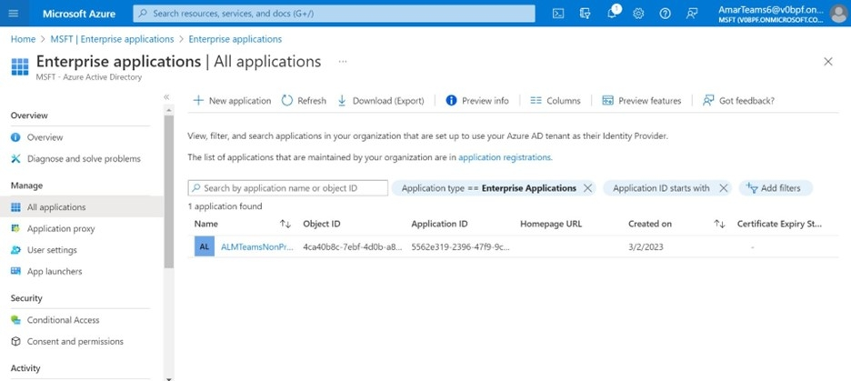
   *檢視ALM應用程式*

1. 按一下應用程式，並導覽至許可權索引標籤。

   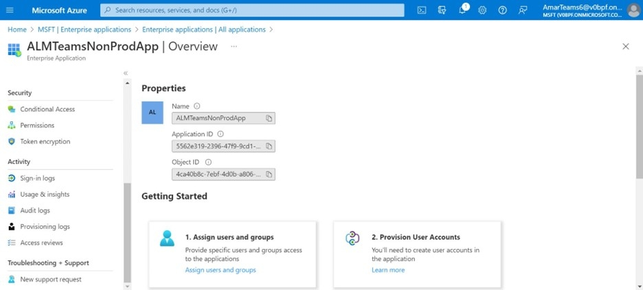
   *檢視許可權索引標籤*

1. 在「許可權」索引標籤中，選取「 **[!UICONTROL Grant admin consent for MSFT]**&#39;授予ALM Teams應用程式許可權。

   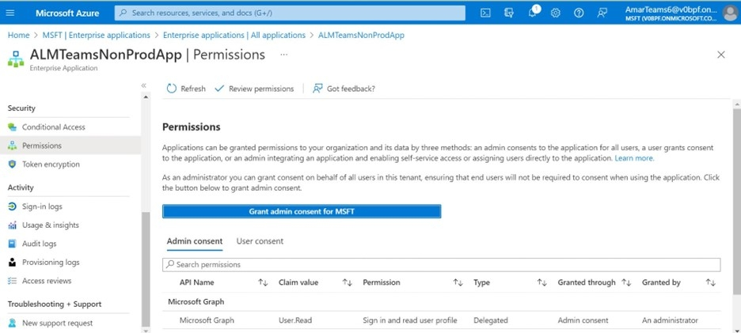
   *選取許可權*

1. 選取 **[!UICONTROL Accept]**.

   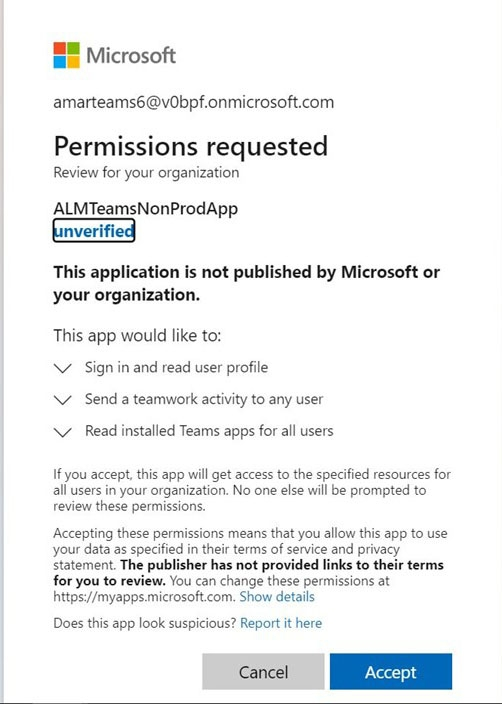
   *選取「接受」*

1. 授與後，這些許可權會授予ALM應用程式，以允許無訊息登入，並傳送通知給MS Teams應用程式中的學習者。

   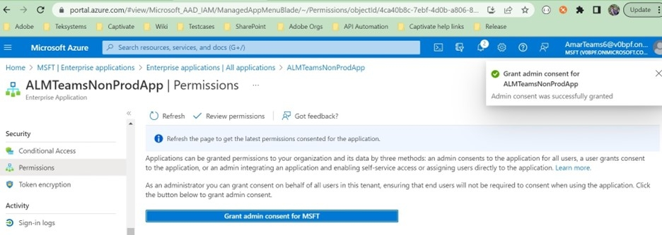
   *已授予存取權*

## MS Teams管理員會為Teams應用程式建立原則

請遵循下列步驟：

1. 身為MS Teams管理員，請在管理中心建立將Teams應用程式新增到學習者的Teams應用程式的原則。

   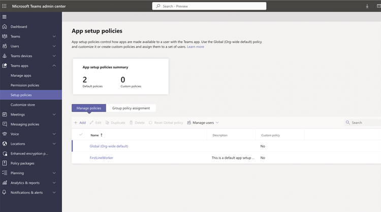
   *建立原則*

1. 導覽至設定原則區段。 建立全域原則並選取 **[!UICONTROL Add apps]** 釘選應用程式子區段中的。

   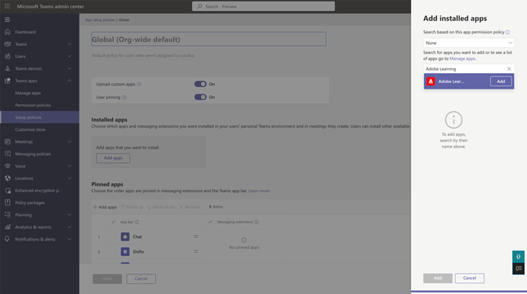
   *新增原則*

1. 在接下來的對話方塊中，搜尋 **[!UICONTROL Adobe Learning Manager]**，並新增應用程式。 這會在已安裝應用程式區段中新增Adobe Learning Manager。

   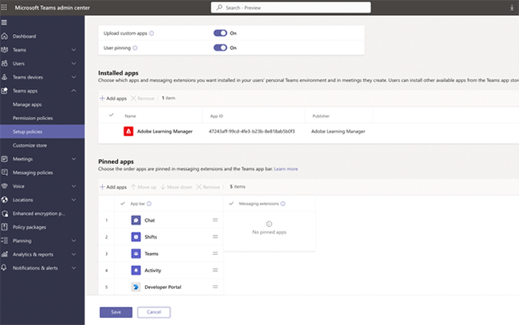
   *安裝應用程式*

1. 儲存此原則。 這可讓組織中的所有人使用該應用程式。

或者，管理員也可以建立自訂原則，而不是全域原則。 新增Adobe學習管理員至該自訂原則，然後僅將自訂原則套用至需要存取Adobe學習管理員的使用者集。
