# Microsoft Teams 的 Adobe Learning Manager 應用程式

## 如何設定

在 MS Teams 上設定 ALM 包含三個步驟，需要 ALM 管理員及 Microsoft Azure 管理員的協助。 在某些組織中，Azure 管理員與 MS Teams 管理員並不相同，因此還需要額外的 MS Teams 管理員。

**ALM 管理員 - 整合管理員角色批准 Teams 應用程式**

整合管理員批准 MS Teams 應用程式後，Adobe Learning Manager 應用程式將在 MS Teams 應用程式商店中提供，學習者也能存取。 然而，應用程式不會有通知、靜音登入功能，且不會在 MS Teams 中為學習者置頂。

**Microsoft Azure Admin approves the permission for ALM app in Azure dashboard**

Azure 管理員必須核准 ALM 應用程式所需的權限。 這樣 ALM 應用程式就能向 MS Teams 發送通知並允許靜默登入。 在靜音登入中，使用者不必在瀏覽器中分別登入 Adobe Learning Manager。

**MS Teams 管理員為 ALM Teams 建立政策**

MS Teams 管理中心的管理員應該會為所有使用者釘選 ALM 應用程式，並允許它作為全域政策。 若 ALM 僅由公司內某個群組使用，則 MS Teams 管理員必須選擇自訂政策，並僅套用於該特定群組。

## 整合管理員角色批准 Teams 應用程式

請依照以下步驟操作：

1. 在整合管理員應用程式中，選擇 **[!UICONTROL Applications]** > **[!UICONTROL Featured Apps]**，然後選擇 **[!UICONTROL ALM Teams app]**。

   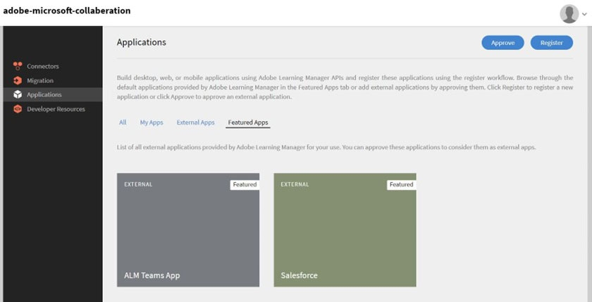
   *選擇 ALM Teams 應用程式*

1. 在螢幕右上角，選擇 **[!UICONTROL Approve]**。

   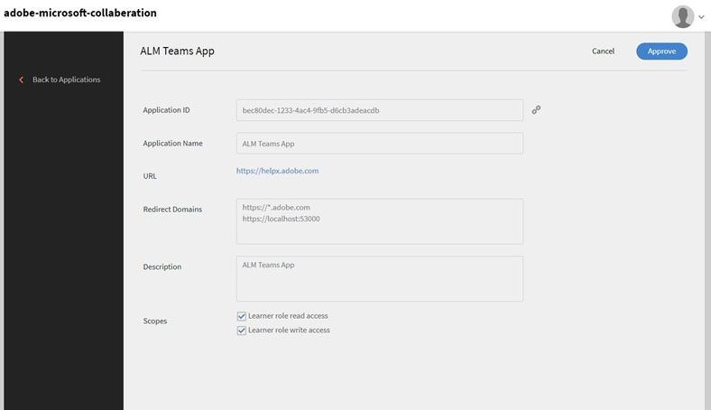
   *在應用程式設定頁面選擇「批准」*

1. **[!UICONTROL OK]**&#x200B;選擇出現的對話框。

   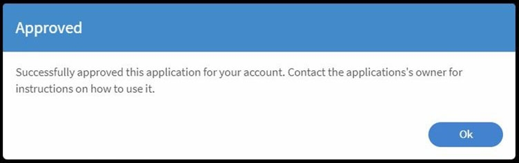
   *核准後選擇確定*

1. 核准後，您將能在外部應用程式區塊看到「ALM Teams App」。

   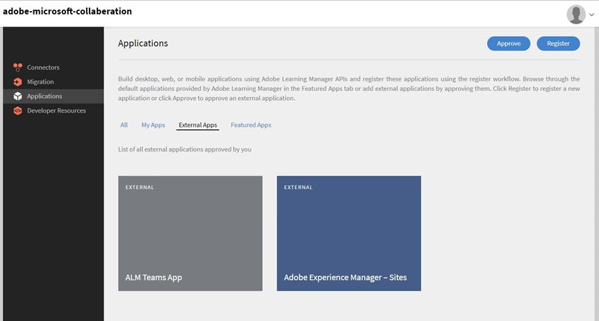
   *ALM Teams 應用程式會出現在應用程式頁面*

現在，用戶可以在 MS Teams 上使用 ALM 應用程式。

## Microsoft Azure Admin approves the permission for ALM app in Azure dashboard

請依照以下步驟操作：

1. 作為 Azure 管理員，請前往 Azure 儀表板中的「管理 Azure Active Directory 」區塊。

   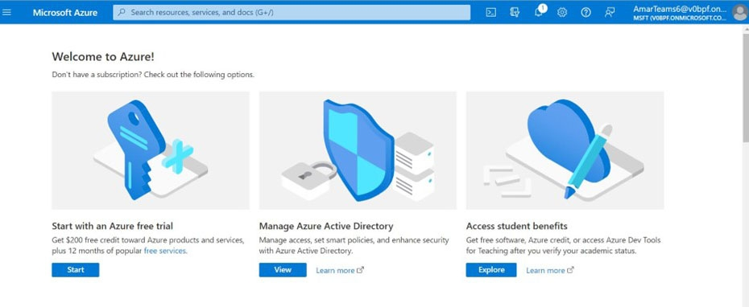
   *Launch Azure dashboard*

1. 請將以下連結貼上到另一個瀏覽器視窗：

   `https://login.microsoftonline.com/<tenantIdTobeReplaced>/oauth2/authorize?client_id=8d349d9f-bf59-4ece-8022-a41e87d81903&response_type=code&redirect_uri=https://learningmanager.adobe.com`

1. 在上方連結中，請將房客ID替換 `<tenantIdTobeReplaced>` 為下方概覽頁面中提供的租戶ID。 輸入新的網址。

1. 將 Adobe Learning Manager 應用程式加入你的 Azure 應用程式。

   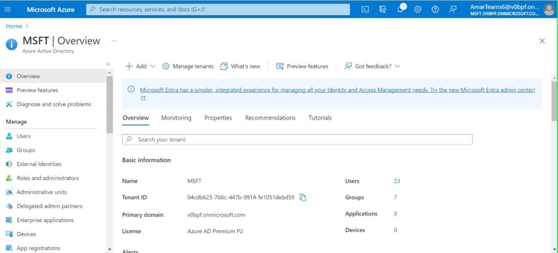
   *Add to Azure*

1. 選擇企業應用程式標籤，並選擇所有應用程式。 你會看到 ALMTeamsApp 在那裡。

   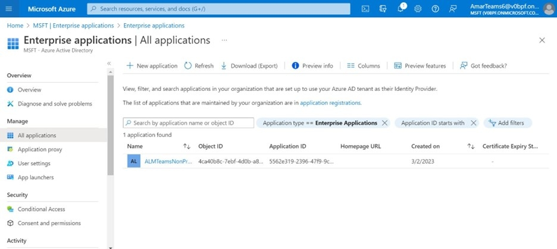
   *查看 ALM 應用程式*

1. 點擊應用程式，然後進入權限標籤。

   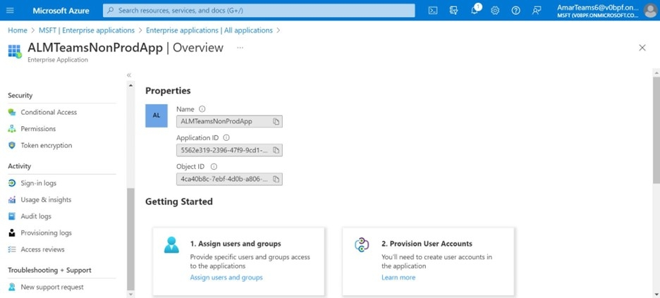
   *查看權限標籤*

1. 在權限標籤中，選擇 &#39; **[!UICONTROL Grant admin consent for MSFT]**&#39; 以賦予 ALM Teams 應用程式權限。

   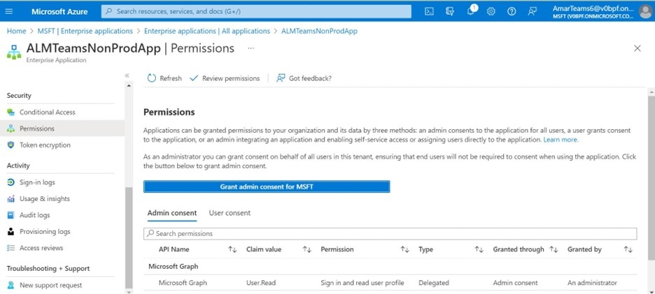
   *選擇權限*

1. 選擇 **[!UICONTROL Accept]**。

   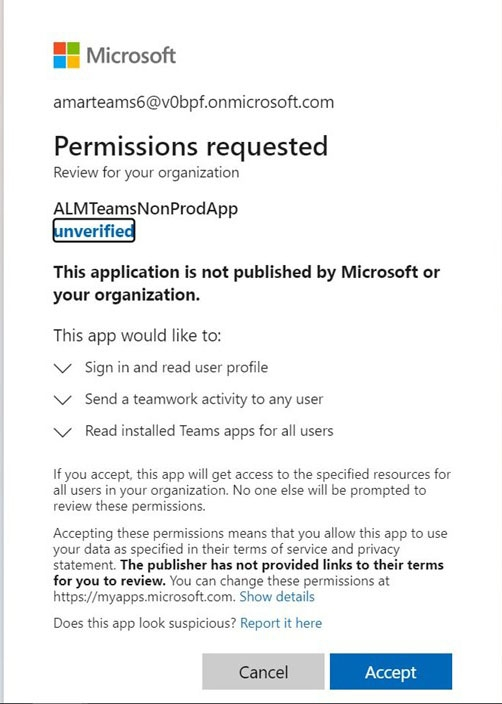
   *選擇接受*

1. 一旦授權，這些權限將讓 ALM 應用程式允許靜默登入，並在 MS Teams 應用程式中向學習者發送通知。

   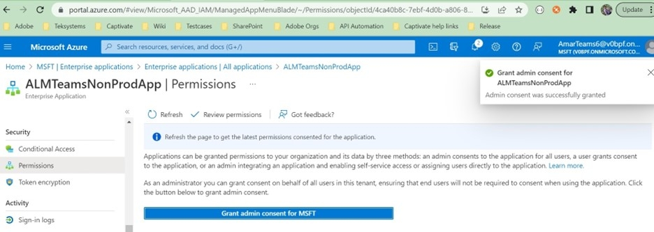
   *進入權限已准許*

## MS Teams 管理員為 Teams 應用程式建立政策

請依照以下步驟操作：

1. 作為 MS Teams 管理員，在管理中心建立政策，將 Teams 應用程式加入學習者的 Teams 應用程式。

   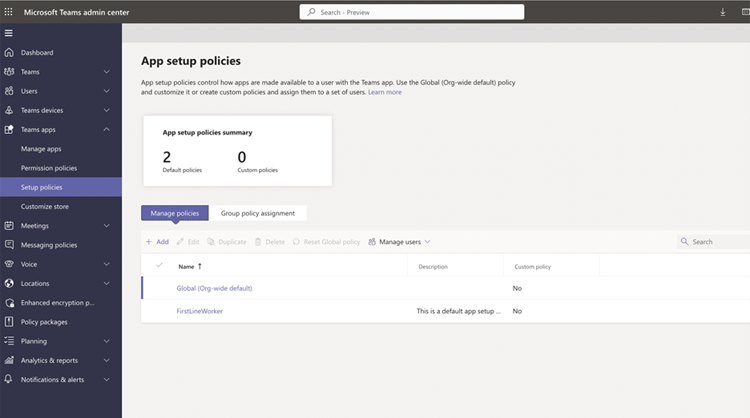
   *制定政策*

1. 請前往「設定政策」區塊。 建立一個全域政策，然後在置頂應用程式子區選出 **[!UICONTROL Add apps]** 。

   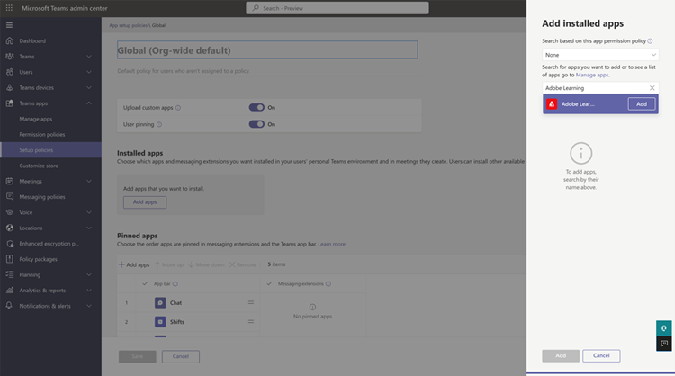
   *新增保單*

1. 在接下來的對話框中搜尋 **[!UICONTROL Adobe Learning Manager]**，然後新增該應用程式。 這會新增 Adobe Learning 管理員，位於已安裝應用程式區塊。

   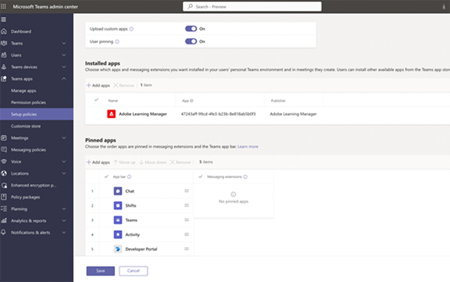
   *安裝應用程式*

1. 拯救這份保單。 這讓整個組織的每個人都能使用這個應用程式。

或者，管理員也可以建立自訂政策，而非全域政策。 將 Adobe Learning Manager 加入該自訂政策，然後只套用該自訂政策給需要存取 Adobe Learning Manager 的使用者。
