# Adobe Learning Manager 參考網站（ALM 參考網站）AEM 網站套件

Adobe Learning Manager （ALM） 可與 Adobe Experience Manager （AEM） 網站整合。 這讓你能以最少的程式碼工作量，為 Adobe Learning Manager 建立自己的網站和響應式行動介面。 透過此整合，您可以為使用者打造客製化的學習體驗。

為了建立這樣的體驗，ALM 提供了 Adobe Learning Manager 參考網站套件（ALM 參考網站套件），以 ZIP 檔形式安裝於你的 AEM Sites 實例中。

該套件包含 AEM Sites 的網頁範本與網站元件，以及可嵌入的小工具，例如學習目錄、可嵌入小工具、行事曆等等。

安裝 ALM 參考網站套件後，你可以開始為 Adobe Learning Manager 建立一個網站，並架設在你的 AEM Sites 實例上。 使用者接著可以在網站上拖放這些元件。

>[!IMPORTANT]
>
>AEM Sites 的 Adobe Learning Manager （ALM） 套件提供快速啟動程式碼區塊以供實作使用。 此套件專為無頭部署設計。 一旦使用了提供的程式碼庫，維護與進一步開發就成為你的責任，這也是基於 Adobe Learning Manager 的無頭應用程式的標準做法。 底層 API 將繼續由 Adobe Learning Manager 支援。

## 安裝 ALM 參考網站套件

### 先決條件

* AEM 網站與 Adobe Commerce 的授權。
* AEM 本地部署 6.5 或 Adobe Experience Manager - 雲端服務
* Adobe Commerce 2.4.3

在您確保 AEM Sites 環境安全後，必須安裝 ALM 參考網站套件。 此套件包含 AEM 網頁與網站元件，協助建構學習平台。

參考網站套件託管在 [**GitHub 倉庫**](https://github.com/adobe/adobe-learning-manager-reference-site/releases/tag/1.0.0)中。

欲了解更多資訊，請參閱說明文件。

## 建立應用程式 [!DNL Adobe Learning Manager]

安裝 AEM 網站套件後，您必須設定一個 ALM 應用程式，將您的學習入口網站與 AEM 網站連接。

此情境適用於 AEM，且 [!DNL Adobe Learning Manager]。

請依照以下步驟操作：

1. 作為整合管理員，請點擊 **[!UICONTROL Applications]**。
1. 要建立新應用程式，請在頁面右上角點擊 **[!UICONTROL Register]**。
1. 在「註冊新申請」畫面，請輸入以下資料：

   1. 應用程式名稱：您所建立的應用程式名稱。
   1. 網址：您組織的網址。
   1. 重定向網域：AEM 網站的主機網域。 你也可以指定萬用字。
   1. 說明：應用程式的描述。
   1. 範圍：選擇學習者角色讀取權限及學習者角色寫入權限。
   1. 僅限此帳戶？：若您想使用現有ALM帳戶的應用程式，請選擇「是」。

1. 完成變更後，點擊儲存。

請注意螢幕上的應用程式憑證。

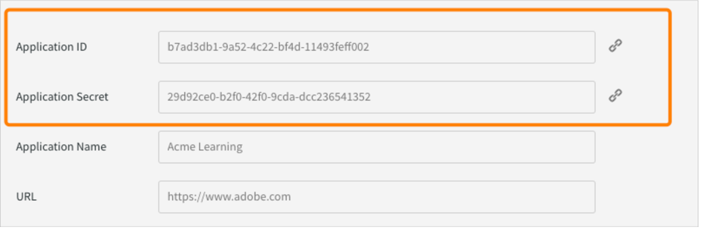
*申請憑證*

要批准申請，請點擊 **[!UICONTROL Approve]**。

## 去拿代幣

1. 在開發者資源標籤中，點擊 **[!UICONTROL Access Tokens for Testing and Development]**。

   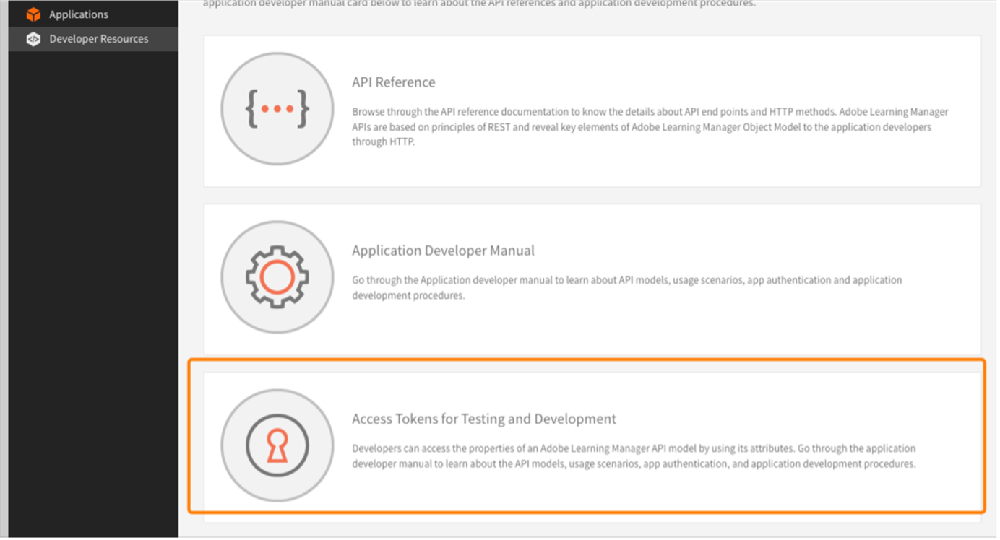

   *選擇存取權杖進行測試與開發*

1. 請輸入以下細節：

   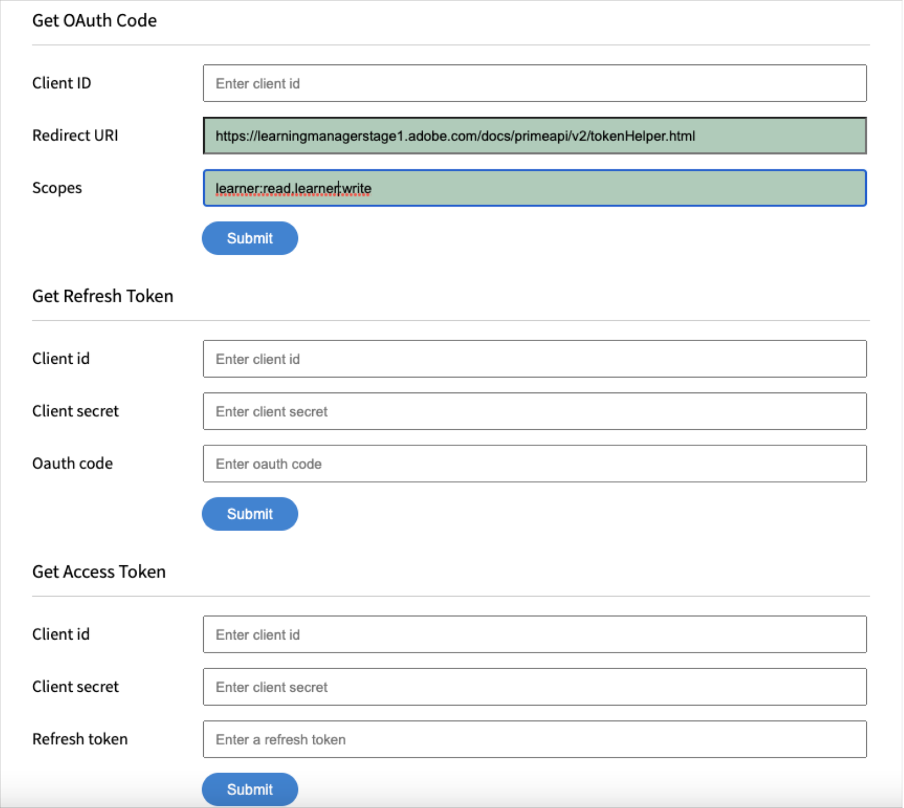
   *輸入代幣細節*

   1. 取得 OAuth 代碼：輸入前一節的客戶 ID，並更改範圍。 點擊提交以取得 Oauth 代碼。
   1. 取得刷新令牌：輸入前一節的客戶端 ID 和秘密。 另外，輸入你從前一步取得的 OAuth 代碼。 點擊提交。
   1. 取得存取權杖：輸入前一部分的客戶 ID 和秘密資料。 另外輸入你從前一步獲得的刷新代幣。 點擊提交。
   1. 取得存取權杖詳情：輸入你從前一步取得的存取權杖。 點擊提交。

1. 你可以從接下來的 JSON 回應中獲得詳細資訊。 回應包含存取權杖、刷新權杖、使用者角色、帳號 ID、使用者 ID 以及到期時間。 請注意刷新標記，因為你會重複使用它。

## 在 AEM 中設定 ALM 帳戶

1. 啟動你的 AEM 實例。
1. 點選雲端服務>設定。
1. 點選 Adobe Learning Manager 設定。

   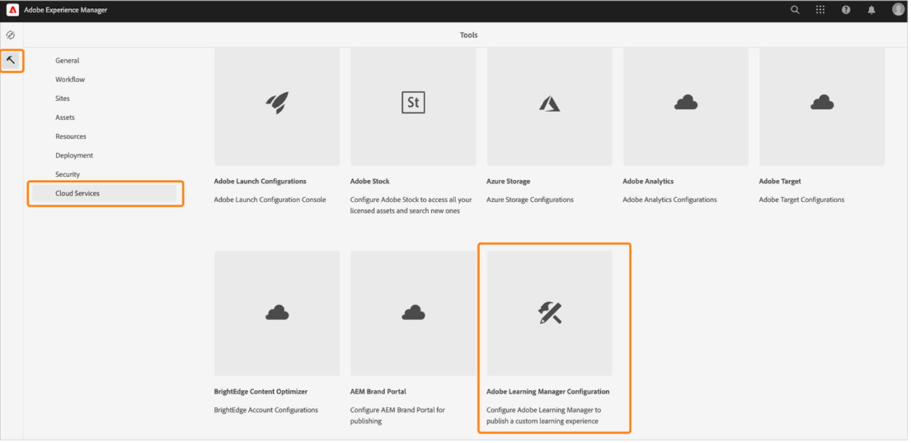
   *選擇 Adobe Learning Manager 設定*

1. 點擊建立>設定資料夾。 說出你的資料夾。

   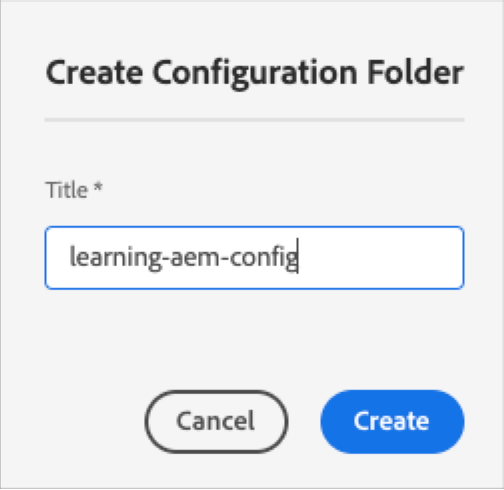
   *建立設定*

1. 在學習專案中，選擇你所建立的設定。

1. 請參考配置細節。

   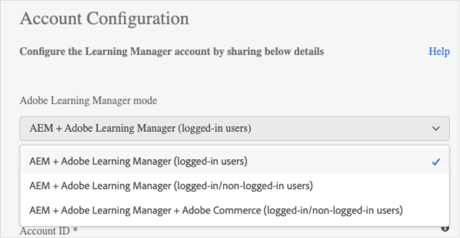
   *建立設定資料夾*

   1. Adobe Learning Manager 模式：選擇你想要的學習體驗，無論是登入還是未登入的學習者。
   1. Adobe Learning Manager 網址：輸入學習服務所託管的 ALM 實例的網址。
   1. 帳號ID：ALM帳號的ID。
   1. 客戶端 ID、客戶端秘密與作者刷新令牌：輸入你在 ALM 建立應用程式時取得的憑證。
   1. 小工具自訂：更多資訊請參見[與 AEM](/help/migrated/integrate-aem-learning-manager.md) 整合 `.`

1. 儲存並關閉設定。

### AEM + Adobe Learning Manager（登入/未登入用戶）

Adobe Learning Manager 現在讓你能向現有及潛在客戶及合作夥伴展示產品與培訓，無需強制建立帳號或登入。 此功能將協助你推動產品與培訓的採用，透過快速且簡便地預覽訓練內容，突顯並推廣產品特色。 因此，您可以有效地展示產品與服務，特別是向潛在客戶和合作夥伴展示，提升產品知名度。 易於取得且更易接觸，促進興趣提升，有助於推動培訓報名與學習採用。

透過此工作流程，學習者可在不登入 Adobe Learning Manager 的情況下預覽訓練、存取培訓資訊或搜尋培訓內容。 此工作流程不適用於原生 Learning Manager 介面（僅適用於 AEM 網站及其他無頭介面）。

**設定並啟用學習平台連接器**

本節強調配置及啟用以下連接器所需的步驟：

**訓練資料存取**

此連接器可讓你的 AEM Sites 基礎或其他客製化無頭使用者介面，能取得並呈現訓練資訊給學習者，並在學習者登入前或登入後實現無縫的培訓資訊搜尋。

此連接器僅在使用 AEM Sites 或其他無頭介面時才需要。

連接器將訓練中繼資料匯出至資料儲存與檢索解決方案，以及搜尋啟用系統。 因此，你可以設定基於 AEM Sites 或其他客製化的無頭使用者介面，利用這兩項服務來取得訓練資料、呈現網頁，並為學習者提供優化的訓練搜尋功能。 例如，一個未登入的 AEM Sites 介面，可以利用匯出的元資料協助學習者搜尋、瀏覽及存取顯示培訓資訊的培訓頁面。

啟用此連接器，建立並呈現基於 AEM Sites 的網頁，並為學習者在登入前後提供客製化體驗。 啟用此連接器，建立並呈現基於 AEM Sites 的網頁，並為學習者在登入前後提供客製化體驗。

* Adobe Learning Manager cdn 基本網址 - 從訓練資料存取連接頁面輸入資料擷取 CDN 服務路徑的基礎網址。
* 管理員刷新令牌 - 輸入你在前一節中指定的刷新令牌。
* 訓練中繼資料庫 URL - 從訓練資料存取連接頁面輸入搜尋啟用與搜尋資料檢索服務路徑的基礎 URL。
* Adobe Learning Manager 註冊網址 - 輸入由帳號整合管理員產生的自助註冊網址，學習者用以註冊訓練。

### AEM + Adobe Learning Manager + Adobe Commerce（登入/未登入用戶）

Adobe Learning Manager 現提供解決方案，幫助您無縫整合學習平台與 Adobe 商務。 此版本將讓您輕鬆將原生、AEM 網站或其他無頭學習管理介面與 Adobe Commerce 連接。 這種整合讓你能在學習平台上實現電子商務能力。 你現在可以向客戶和商業夥伴提供付費培訓，並輕鬆在原生與非原生學習管理器介面上啟用培訓購買。 學習者也可在不登入 Adobe Learning Manager 的情況下預覽訓練、存取培訓資訊或搜尋培訓內容。

使用者可以使用已存在的 AEM 應用程式並核准，而不必自行建立一個應用程式。

* Adobe Learning Manager cdn 基礎網址 - 從 Adobe Commerce 連線頁面輸入資料擷取 CDN 服務路徑的基礎網址。
* Adobe Commerce URL - 輸入你使用的 Adobe Commerce 實例的 URL。
* GraphQL 代理路徑 - 用戶端學習管理元件直接存取 Adobe Commerce GraphQL 端點，因此可能會發生 CORS 錯誤。 為避免此錯誤，所有通話必須由與 AEM 相同的端點提供，或透過加入 CORS 標頭的代理伺服器來提供。
* Adobe Commerce 商店名稱 - 輸入你在前一節決定的 Adobe Commerce 商店名稱。
* Adobe Commerce 客戶代幣壽命（以秒計）- 輸入客戶代幣壽命，表示登入會話的預先設定期間。
* 管理員刷新令牌 - 輸入你在前一節中指定的刷新令牌。

## 自訂網頁

利用 AEM 參考網站及可用的小工具自訂您的網頁。

1. 啟動你的 AEM 實例。
1. 點選「網站」並開啟設定頁面。
1. 點擊 **[!UICONTROL Learning Site]** > **[!UICONTROL Language Masters]** > **[!UICONTROL English]**。 專案中的所有網頁都包含在資料夾中。

   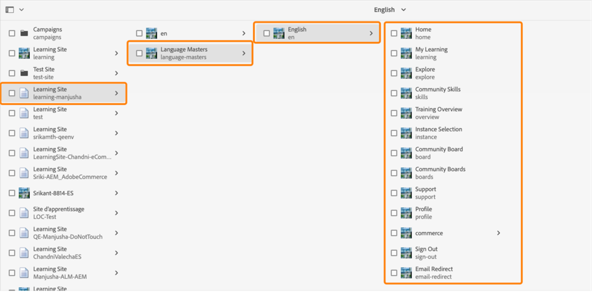
   *查看所有網頁*

1. 選擇任何範本並點擊 **[!UICONTROL Edit]**。

1. 在頁面上，點擊元件設定按鈕並更改元件的屬性。

   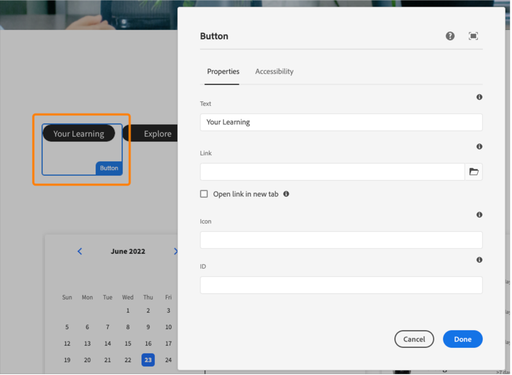
   *選擇設定按鈕*

1. 預覽您的更改，或您也可以發布該頁面。

## 建立網頁

除了參考網站套件提供的範本外，你也可以根據 AEM 範本建立網頁。

1. 在 AEM 主頁，點擊建立>頁面。

1. 選擇你想自訂的範本。 點擊下一步。

1. 進入頁面屬性。

   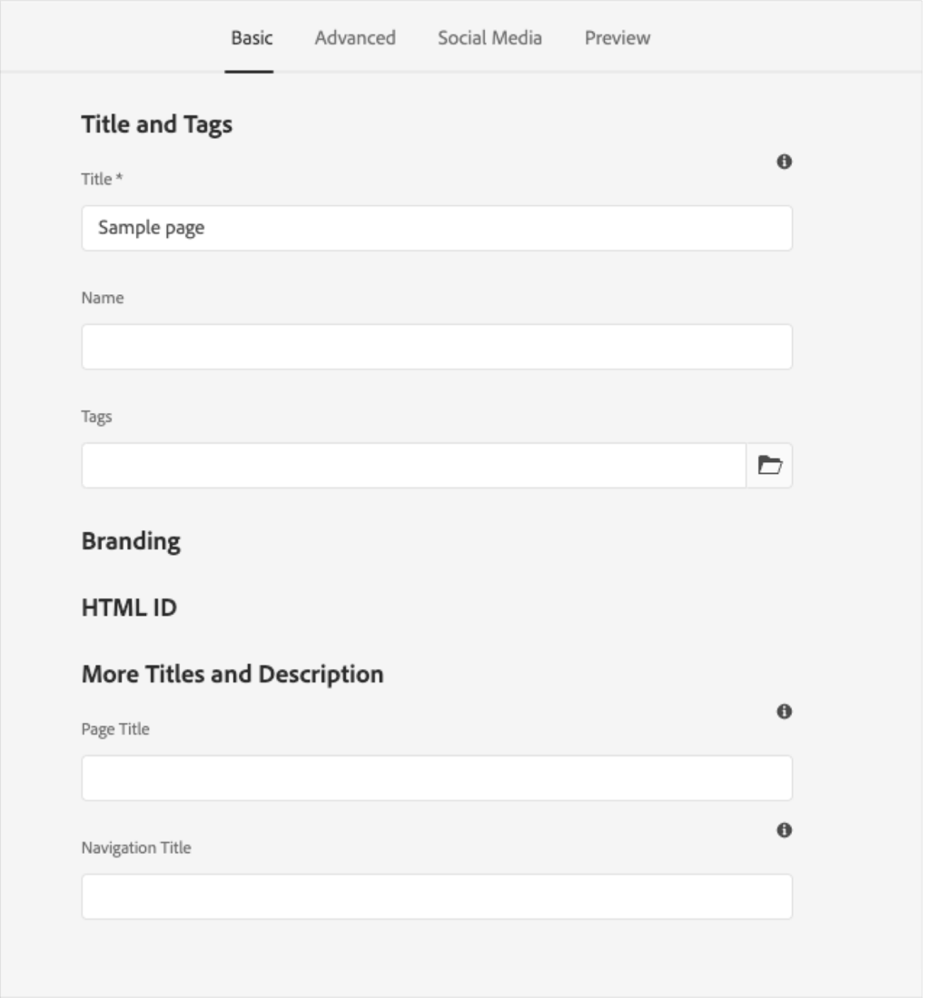
   *頁面屬性*

1. 要建立頁面，請點擊 **[!UICONTROL Create]**。

1. 選擇新頁面並點擊 **[!UICONTROL Edit]**。

1. 在頁面上插入一個元件，例如學習 **-內容**。

   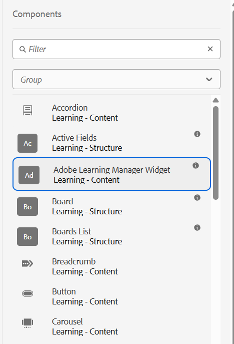
   *依網站篩選*

1. 選擇頁面上必備的目錄篩選器。

## 從 Blueprint 建立網站

ALM 參考網站套件提供「學習網站藍圖」，讓您能為學習平台建立網站。 AEM 藍圖允許您直接從 AEM Sites 元件建立網頁。 你不需要使用任何範本。

1. 在 AEM 開始頁面，點擊 **[!UICONTROL Sites]**。

1. 點擊 **[!UICONTROL Create]** > **[!UICONTROL Site]**。

1. 點擊學習網站藍圖。

   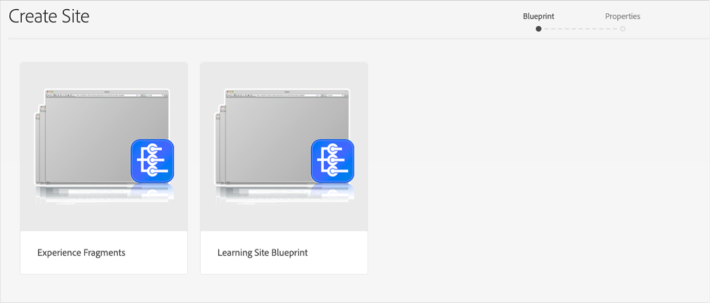

   *從藍圖建立網站*

1. 點擊下一步。

1. 在屬性頁面輸入頁面的元資料。 點擊「建立」。

   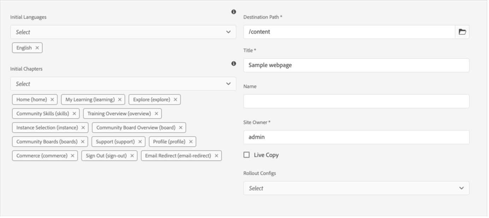
   *選擇學習網站藍圖*

1. 點擊首頁超連結，導覽至您已建立網站的首頁。 在此頁面，您可以自訂小工具與目錄元件。

## 寫程式設計你的網站

除了使用內建範本並利用所見即所得（WYSIWYG）元件從零建立網站外，你也可以撰寫程式碼並建置網站。

程式碼在 [參考網站的 GitHub 倉庫](https://github.com/adobe/adobe-learning-manager-reference-site) 裡，方便你開始使用。

範本的主要部分包括：

* core：Java 套件，包含所有核心功能，如 OSGi 服務、監聽器或排程器，以及與元件相關的 Java 程式碼，如 servlet 或請求過濾器。
* ui.apps：包含專案中的 /apps（及 /etc）部分，例如 JS&amp;CSS 客戶函式庫、元件、範本。
* ui.content：包含使用 ui.apps 元件的範例內容
* ui.frontend：包含 React 元件。

所有程式碼都在倉庫裡，幫助你啟動並運作。

## 匯入並新增學習管理工具元件至現有網頁或範本

安裝 AEM 參考網站套件會將學習管理員元件加入您的 AEM 網站實例。 預設情況下，您可以將這些元件加入我們開箱即用的網頁專案（網站）學習網站。 這些元件也可在你從學習網站藍圖建立的網站上取得。

不過，如果你想將這些新加入的 Learning Manager 元件用於現有的網頁專案或網站，應該依照以下步驟匯入。

1. 安裝 ALM 參考網站套件。

1. 打開網頁專案，然後進入 HTML 檔案（就是你想加入學習管理員元件的網頁或網頁範本）。
1. 參加會議

   打開 HTML 檔案，將以下程式碼片段加入頁面元件，讓程式碼在頁面渲染中的學習元件之前執行。

   *`<sly data-sly-use.configModel="com.adobe.learning.core.models.GlobalConfigurationModel"/>`*
   *`<meta name="cp-config" content="${configModel.config}" />`*

   前述程式碼在頁面的元標籤中加入映射配置，這是學習元件渲染所需的。 更多細節請參閱 [Adobe Learning Manager 參考網站](https://github.com/adobe/adobe-learning-manager-reference-site/blob/master/ui.apps/src/main/content/jcr_root/apps/learning/components/page/customheaderlibs.html)。

1. 確保你已經將設定映射到網頁專案。
1. 打開你想匯入學習管理員元件的 AEM Sites 範本。
1. 在範本頁面編輯器中，導覽到允許元件容器並選擇 **政策**。
1. 在政策頁面中，導覽至「允許元件>屬性」，並選擇以下元件「學習 - 內容」、「學習-表單」及「學習-結構」

以下程序使範本能滿足匯入學習管理器元件的客戶端函式庫相依性。

包含這些元件的網頁應該載入這些函式庫，才能成功渲染並使用元件。

1. 在範本頁面編輯器中，點選頁面資訊，然後點擊頁面政策。
1. 在政策頁面，前往「屬性>用戶端函式庫」，並將這些資料加入你的範本頁面：

   1. learning.site
   1. 學習網站
   1. learning.commerce

儲存此範本後，您可以在所有由此範本衍生的網頁中加入學習管理員元件。
