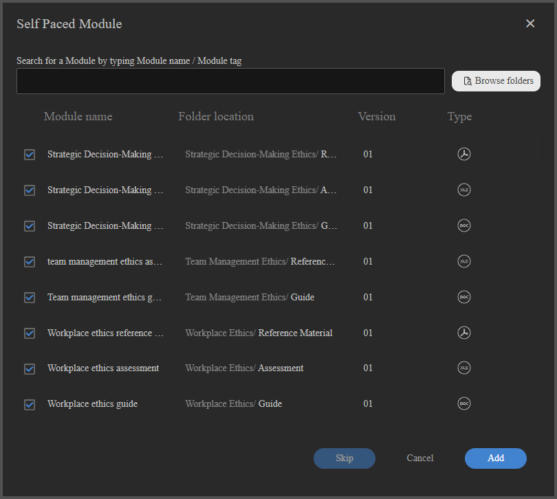
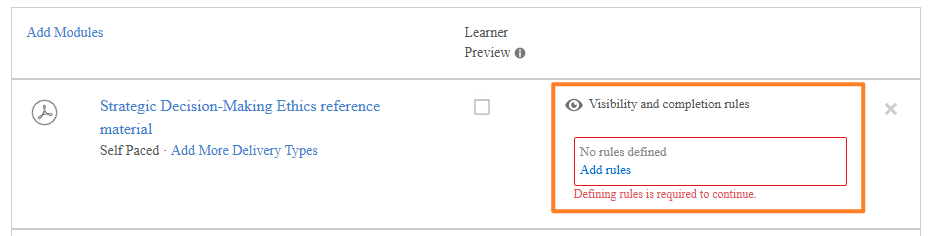

# 作者適應性課程

## 建立並配置適應性課程

建立一個包含每個模組可見性和完成規則的課程，讓不同學習者根據他們的使用者群組能看到並完成不同的內容。

>[!NOTE]
>
>自適應課程類型僅 **在您的帳戶啟用可見性與完成規則** 時使用。 如果你找不到建立適應性課程的選項，請請你的管理員啟用適應性學習。

### 建立適應性課程

1. 以作者身份登入 Adobe Learning Manager。

   

2. 在左側導覽中，選擇 **課程**。 然後選擇 **新增**。
3. 請輸入課程名稱、說明及其他細節。
4. 選擇 **內容可見性與完成度規則** 的切換。

   

5. 在確認對話框中選擇 **「是** 」。

   

   **在適應性課程中加入模組**

   加入所需的模組。 可透過上傳內容、從內容庫中選擇內容，或新增課堂或虛擬課堂課程來新增內容模組。

   **支援自適應規則的模組類型（內容模組）：**

   * 自我進度的電子學習
   * 課堂課程
   * 虛擬教室課程
   * 活動模組

   **不支援自適應規則的模組類型：**

   * **工作前模組：** 在核心內容開始前向所有學習者展示。 無法設定可見性或完成規則。
   * **測驗模組：** 對所有學習者開放。 完成免考即完成整個課程，無論內容模組狀態如何。 無法設定可見性或完成規則。
   * **工作輔助** ：所有註冊學習者隨時可見。

6. 選擇 **新增**。

### 為每個模組設定可見性與完成規則

新增內容模組後，設定其自適應規則：

1. 選擇你想設定的模組。
2. 在模組設定中，找到 **可見性與完成規則** 區塊。

   

3. 選擇 **新增規則** 以新增能看到此模組的使用者群組。

   

   

   這些組別的學習者會看到課程中的模組，但除非同時是必修課程，否則不需要完成。

4. 選擇 **儲存**。
5. 課程中每個內容模組都重複這個步驟。

**關鍵規則：**

* 如果有團體把某個模組定為必修，那就是該學習者的必修。
* 您必須至少將一個模組設定為 **必須** ，至少針對至少一個使用者群組，才能發佈。 系統會阻止發表，直到符合此條件。

### 徵兵州的課程

當課程處於草稿狀態時，代表整個適應性結構可以完整設計、配置與優化，然後再鎖定給學習者的階段。 此階段，作者可定義課程應作為適應性課程或一般課程，且此決定在課程出版前可逆。 這使得選秀階段變得至關重要，因為這是唯一能建立或改變課程核心適應性的關鍵時刻。

在草稿中，作者對課程結構擁有完全的控制權。 他們可以自由新增、移除或重新排序模組，以塑造預期的學習流程。 同時，他們也能透過為每個模組定義可見性規則，在細緻層級配置自適應行為。 這些規則決定了哪些使用者群組可以存取特定模組，讓課程日後能提供個人化的學習體驗。 除了可見性外，作者也可以定義完成規則，將模組標記為強制性或可選性，適用於不同使用者群。 系統要求至少一個模組為必修，以確保有意義的完成標準。

草稿狀態也允許對自適應邏輯進行無限制編輯。 作者可以反覆新增、修改或移除規則，無需系統限制，讓在定稿前能嘗試不同配置。 除了自適應設定外，所有標準課程元素仍可編輯，包括課程標題與描述等課程元資料，以及底層學習內容，如 SCORM 模組或其他資產。

重要的是要了解，draft 中的自適應配置僅適用於核心課程模組。 其他元件，如前期工作或測試內容，則不支援自適應規則，且不受可見性或完成設定影響。

最後，草稿狀態是最後一次驗證課程設置的機會，然後才會發布。 課程一旦發布，該自適應配置即為永久且無法回退。

### Preview as Learner

選擇 **預覽為學習者** ，無論使用者群組規則如何，課程中的所有模組都會顯示。 這讓作者與管理者能完整了解課程結構。 生產環境中的學習者只會看到使用者群組顯示的模組。

### 發布適應性課程

發布自適應課程的工作流程與一般課程相同。

設定完所有模組及其規則後，選擇 **發佈**。

課程一旦出版，即可報名。 學習者在開啟課程時，只會看到為其使用者群組設定的模組。

>[!IMPORTANT]
>
>一旦課程發表，你就不能把課程從適應性切換到正規課程，反之亦然。 發佈前請確認你的設定。

### 更新已發表的適應性課程

你可以隨時更新已發表的適應性課程。 變更對已註冊學習者幾乎即時生效。

請注意，你現在無法更改自適應航向的可見度設定。 你不能讓課程變成非自適應的。

>[!NOTE]
>
>學習者在轉換實例中不能被列入候補名單，否則註冊將被封鎖。

### 新增或修改模組

1. 打開已出版的課程。
2. 選擇 **編輯**。
3. 新增、編輯或移除模組，並調整其可見性與完成規則。
4. 重新發布課程內容。

**影響：**

| 變化 | 對已註冊在學學習者的影響 |
|---|---|
| 新增必修模組（對學習者使用者群組開放） | 完成要求中會新增一個模組。 若該模組為教室或虛擬課堂且無剩餘名額，學習者將被列入該模組的候補名單。 |
| 模組被移除或隱藏，供學習者使用者群組使用 | 模組已從完成要求中移除。 若這是最後一個必修模組，課程將自動完成。 |
| 模組由學習者使用者群組的必修改為選修 | 模組仍可見;學習者不再需要完成該模組即可完成課程。 |
| 新增必修模組（學員已完成課程） | 該模組會對學習者開放，但不會自動獲得座位或使用。 新模組只有在觸發刷新完成時才會被存取。 |

### 實例切換行為

切換適應性課程實例的學習者，將延續其進展：

* 他們已完成的模組在新實例中仍會完成。
* 新實例中僅佔用未完成的可見模組席位。
* 當實例沒有空位時，他們不能被列入候補名單。 報名將被封鎖。

## 管理適應性課程的名額限制與候補名單

Adobe Learning Manager 中的自適應課程會在個別教室或虛擬教室層級強制執行座位限制。 與一般課程不同，整個課程會封鎖整個名額，適應性課程會立即為學習者報名，並只在沒有名額的特定課程中排隊等候。 學習者可無中斷地存取其他所有模組。

### 座位限制在適應性課程中的運作方式

當學習者報名包含教室或虛擬教室模組的自適應課程時，系統僅檢查根據使用者群組對學習者可見的課程名額。

* 若所有可見的教室或虛擬教室課程均有空位，學習者即註冊並立即享有完整使用權。
* 若有一個或多個可見課程無空位，學習者將被立即列入該課程候補名單。 他們可以立即開始並推進其他所有模組。

下表說明所有適應性課程的名額與候補名單情境。

| 入學時的狀況 | 結果 |
|---|---|
| 所有可見的CR/VC場次均有空位 | 已註冊並可完整使用所有模組 |
| 一個或多個可見的CR/VC會議已滿 | 已註冊;僅列入全場候補;其他模組可立即進入 |
| 學習者已註冊;作者新增強制CR/VC課程，且無名額 | 學員在新課程中被列入候補名單;現有進度與存取權不受影響 |
| 學習者退學 | 所有原有名額立即空出;下一位候補學員依入學日期排序通過 |
| 使用者群組變更會將一個會話從學習者的可見集合中移除 | 座位立即空出 |
| 學習者完成課程;新的強制CR/VC課程將被顯示 | 模組可見，但沒有自動分配座位。 學習者必須觸發刷新完成才能進入該課程。 |
| 行政人員或講師負責分配名額 | 該學員的所有候補CR/VC課程會同時通過 |

### 查看候補名單

1. 在管理員檢視中開啟自適應課程。
2. 選擇 **學習者**。
3. 選擇 **候補名單** 標籤。

候補名單標籤列出一個或多個模組被列入候補名單的學習者。 對於自適應課程，報告會以課程-實例-模組層級呈現，而非課程實例層級，因為學習者可能同時在某些模組進行中，卻在其他模組被列入候補名單。

### 清空候補名單並分配名額

當因學員退選、名額上限增加或人工分配而產生名額時，候補名單學員會依報名日期順序（最早報名日期先行）被清除。

若要手動分配一名或多名學員的名額：

1. 開啟適應性課程。
2. 選擇 **「學習者** 」> **候補名單** 標籤。
3. 請選擇你想分配名額的學習者旁邊的勾選框。
4. 選擇 **分配席次**。

選擇「分配名額」會同時清除所有候補課程的候補名單中該學習者，而非僅僅您目前正在觀看的課程。 系統假設座位已實體或虛擬地為學習者安排好。

**候補名單清除觸發條件：**

當發生以下任一情況時，候補名單將自動處理：

* 學員退選課程（所有已舉行課程的名額將空出）
* 每屆會議的名額上限提高
* 學習者會切換實例
* 由行政人員或講師分配名額

>[!NOTE]
>
>當您建立新的自適應課程實例時， **通知候補學習者** 選項將無法使用。 這是預期中的行為，與一般課程不同。

在一般課程中，候補名單會在實例層級追蹤，因此系統可以提示你通知等待的學習者，當有新實例開放時。 在自適應課程中，候補名單會以個別教室或虛擬課 **堂** 層級追蹤，而非實例層級。 沒有實例層級的等待名單來通知新實例建立，因此提示不會出現，也不會自動發送通知。

## 自適應課程的觸發刷新完成

Adobe Learning Manager 的刷新完成功能允許學習者在學習需求改變時重新評估其適應性課程完成度。 當學習者的使用者群組變動、作者更新模組規則，或學習者想以現有設定重修適應性課程時，這點都非常重要。

### 刷新完成的功能

在自適應課程中，學習者的必修模組集合由其完成課程時的使用者群組決定。 若使用者群組後續變動，或作者新增必修模組，學習者可能需要完成額外內容以符合新個人檔案的要求。

刷新完成有兩個功能：

1. 若學習者有新的必修模組未完成，則會回滾其現有課程完成度。
2. 在學習者成績單中建立一份新紀錄，代表更新的完成要求。

原始完成紀錄保存在學員成績單中，作為歷史條目。 先前已完成的模組仍然完成。 除非是新近必修且未公開或未完成的模組，否則學習者無需重複修習。

### 當刷新完成生效時

**情境一：使用者群組變更新增強制模組**

學習者完成一門適應性課程。 他們的使用者群組後來會被更改，新的使用者群組會將先前隱藏或可選的模組變成強制性。

* 現有的完成紀錄仍保留在學習者成績單上。
* 若學習者有新的未完成必修模組，會建立新的學習者成績單列，課程顯示為進行中。
* 學習者必須完成新的必修模組，才能取得新的完成。

**情境二：使用者群組變更導致沒有新的強制模組**

學習者完成一門適應性課程。 他們的使用者群組會變動，但新使用者群組的需求已經由他們現有的完成完成度滿足。

* 該課程目前仍處於完工狀態。
* 不會新增學習者成績單列。
* 學習者無需採取任何行動。

**情境三：學習者主動重考**

已完成適應性課程的學習者可選擇重修，以現有用戶群組資料完成。 當學習者的角色自最初完成後有所改變時，這非常有用。

1. 學習者開啟已完成的適應性課程。
2. 學習者可選擇重修或重讀課程。
3. 課程會根據現有使用者群組重新評估，以決定新的必修模組組合。
4. 新增一列學習者成績單。

**情境四：測試模組行為**

若學習者在刷新完成前完成測驗模組，該測驗結束在刷新後仍然有效。 一旦系統評估課程完成情況（由任何模組完成或學習者行動觸發），課程將自動完成，因為考試免修已完成，除非課程有額外必修且未完成的內容模組。

>[!NOTE]
>
>若學習者在透過考試完成後，新增教室或虛擬課程，並觸發刷新完成，學習者可能不會自動出現在 **新課程的出席與評分** 標籤或 **候補名單** 中。 這是因為免考完成時課程仍維持完成狀態，且名額分配邏輯不會被重新觸發。 如果你需要追蹤新加入課程的免考學生出席情況，請從 **候補名單** 標籤手動分配他們的座位。 請注意，免試模組並非適應性課程的推薦做法。

**情境五：管理員觸發的刷新**

若學習者的個人資料變更，且管理員判斷現有完成紀錄不再反映當前需求，管理員可代表學習者觸發更新完成。

>[!CAUTION]
>
>若適應性課程屬於定期認證，則刷新完成僅適用於學習者在根認證週期中的註冊情況。 後續的重複循環包含一個獨立的自適應路徑實例，且不受刷新影響。 參加定期課程的學習者不會看到模組更新，完成課程也不會回滾。 若貴組織在定期認證中使用自適應課程，請在觸發刷新完成前告知管理員此限制

1. 在管理檢視中開啟學習者個人檔案或課程的學習者標籤。
2. 查找學員的註冊資料。
3. 選擇 **「重新整理可見性」和「完成**」。

ALM 會根據學習者目前的使用者群組重新評估必修模組，若有新的必修模組則回滾完成。
