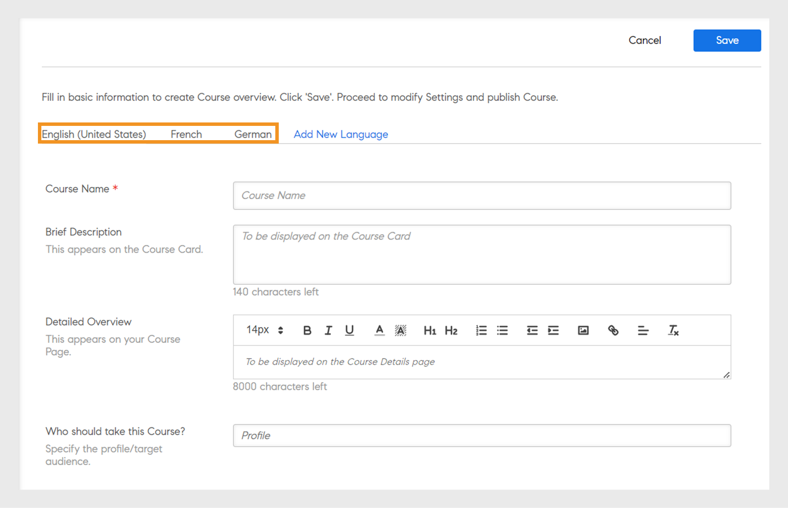
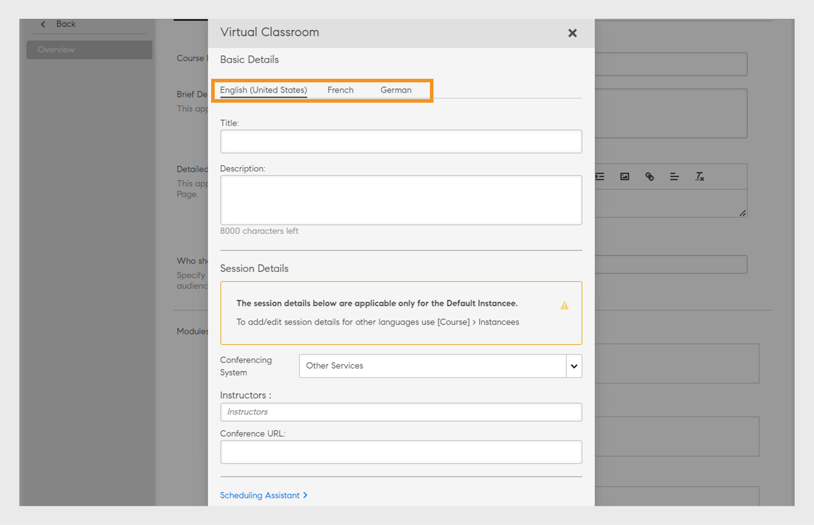
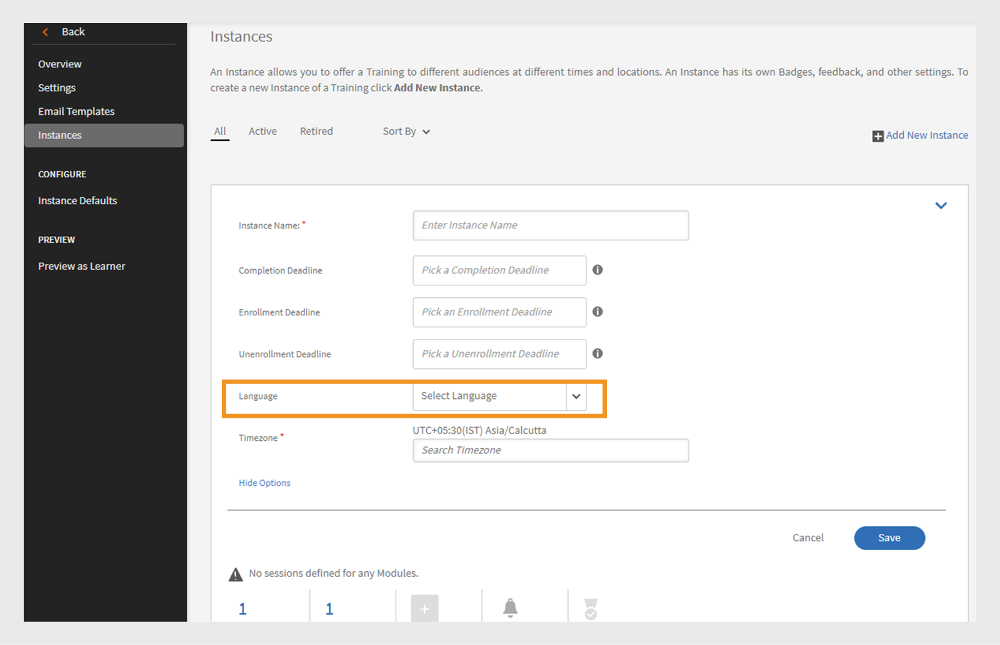
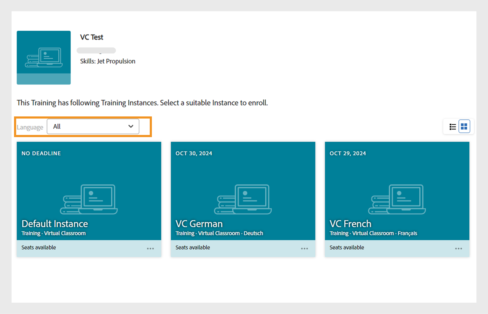
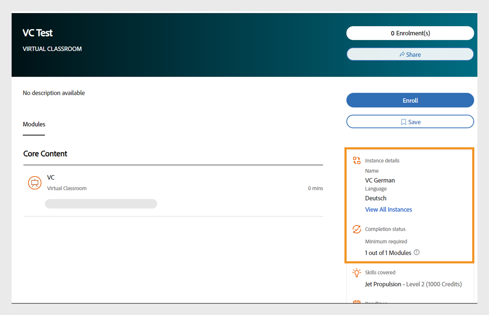

# 新增不同地區設定的學習物件

請閱讀本主題，瞭解如何新增不同語言的課程、認證和學習計畫。

身為作者，您能夠建立學習物件，例如課程、認證、學習計畫。 您也可以用不同的語言建立這些學習物件。

Learning Manager可讓您以數種語言建立學習物件。 當您建立學習物件時，可以新增其他語言的內容和/或中繼資料。 您也可以隨時編輯學習物件的詳細資料，並提供其他語言的學習物件。

若要新增語言，請按一下您要新增語言環境的課程、認證或學習計畫。 從「基本資訊」頁面，按一下頂端的「新增語言」。

*新增語言*

從快顯對話方塊中，選取您要提供給學習者的其他語言或語言，然後按一下「儲存」。

*選取語言*

重新發佈您的課程以使變更生效。

## 具有語言標籤的CR/VC例項的多語言支援

Adobe Learning Manager (ALM)可讓作者使用教室和虛擬教室模組的語言標籤，建立語言專屬的執行個體。 此功能可讓學習者以其慣用語言存取CR/VC模組。 例如，作者可建立具有兩個例項的CR/VC模組：一個使用英文一個使用法文。 學習者可以透過其偏好語言選取執行個體。

### 工作流程

首先，作者會以多種語言建立並發佈課程，啟用執行個體建立頁面上的語言選項。 然後，作者可以選取語言為每個執行個體建立不同的執行個體。 學習者可以根據對應的語言選擇例項。

### 建立多國語言的課程

請依照下列步驟，建立包含多種語言的課程：

1. 以&#x200B;**[!UICONTROL Author]**&#x200B;登入。
2. 選取&#x200B;**[!UICONTROL Courses]** > **[!UICONTROL Add]**&#x200B;以建立課程。
3. 輸入課程的&#x200B;**[!UICONTROL Name]**&#x200B;和&#x200B;**[!UICONTROL Description]**。
4. 選取&#x200B;**[!UICONTROL Add New Language]**&#x200B;並選取必要的語言。 這將會為每個語言建立多個標籤。

   
   _新增語言 — 課程_
5. 移至個別語言標籤，然後輸入課程的&#x200B;**[!UICONTROL Name]**&#x200B;和&#x200B;**[!UICONTROL Description]**。
6. 在英文（美國）索引標籤中，選取&#x200B;**[!UICONTROL Add Module]** > **[!UICONTROL Virtual Classroom Module]**。

   >[!NOTE]
   >
   >教室模組的程式也將相同。

   
新增VC模組的語言

7. 在每個語言標籤上輸入&#x200B;**[!UICONTROL Title]**&#x200B;和&#x200B;**[!UICONTROL Description]**，然後選取&#x200B;**[!UICONTROL Add]**。
8. 輸入課程的必要詳細資訊並發佈課程。

### 建立每種語言的執行個體

您可以從管理員和作者應用程式建立每種語言的執行個體。 請依照下列步驟，從製作應用程式中建立例項：

1. 以&#x200B;**[!UICONTROL Author]**&#x200B;登入。
2. 選取&#x200B;**[!UICONTROL Courses]**&#x200B;並選取多語言課程。
3. 選取&#x200B;**[!UICONTROL Instances]** > **[!UICONTROL Add New Instance]**&#x200B;以建立執行個體。
4. 輸入&#x200B;**[!UICONTROL Instance Name]**&#x200B;並選取&#x200B;**[!UICONTROL Completion Deadline]**。
5. 選取&#x200B;**[!UICONTROL Show More Options]**&#x200B;檢視其他選項。
6. 從&#x200B;**[!UICONTROL Language]**&#x200B;下拉式清單中選取所需的語言。

   
   _選取執行個體的語言_

7. 輸入其他詳細資料並選取&#x200B;**[!UICONTROL Save]**。
8. 使用相同步驟建立其他語言的執行個體。 學習者將能檢視此課程的所有語言例項。

### 選取執行個體並註冊 — 學習者工作流程

學習者可在應用程式中檢視這些語言例項。 他們可以選擇自己偏好的語言例項，註冊並參加該語言的CR/VC工作階段。

請依照下列步驟選取執行個體並註冊：

1. 在學習者應用程式中，前往&#x200B;**[!UICONTROL Catalog]**&#x200B;並選取課程。
2. 您可以看到以下具有多個執行個體的畫面。

   
   學習者的&#x200B;_VC模組_

3. 您可以使用語言篩選器選項進行篩選。 選取您偏好的語言並註冊課程。
4. 選取後，您可在課程總覽頁面上看到下列詳細資訊。

_執行個體詳細資料_

