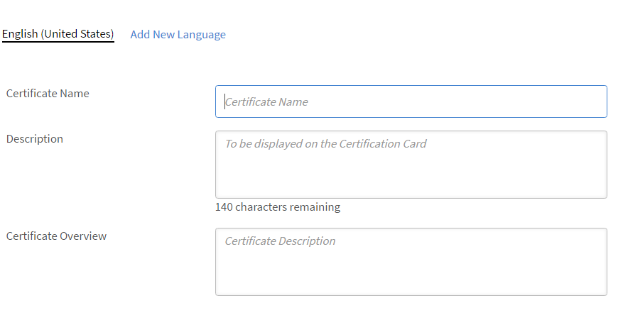
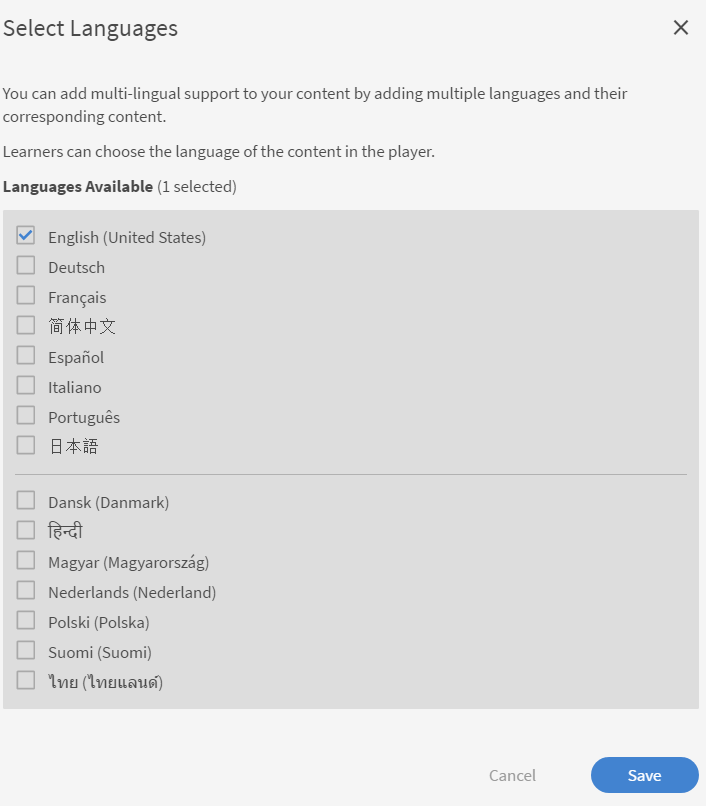

# 新增不同地區設定的學習物件

請閱讀本主題，瞭解如何新增不同語言的課程、認證和學習計畫。

身為作者，您能夠建立學習物件，例如課程、認證、學習計畫。 您也可以用不同的語言建立這些學習物件。

Learning Manager可讓您以數種語言建立學習物件。 當您建立學習物件時，可以新增其他語言的內容和/或中繼資料。 您也可以隨時編輯學習物件的詳細資料，並提供其他語言的學習物件。

若要新增語言，請按一下您要新增語言環境的課程、認證或學習計畫。 從「基本資訊」頁面，按一下頂端的「新增語言」。

*新增語言*

從快顯對話方塊中，選取您要提供給學習者的其他語言或語言，然後按一下「儲存」。

*選取語言*

重新發佈您的課程以使變更生效。
