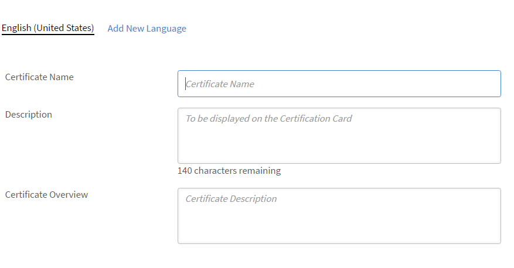
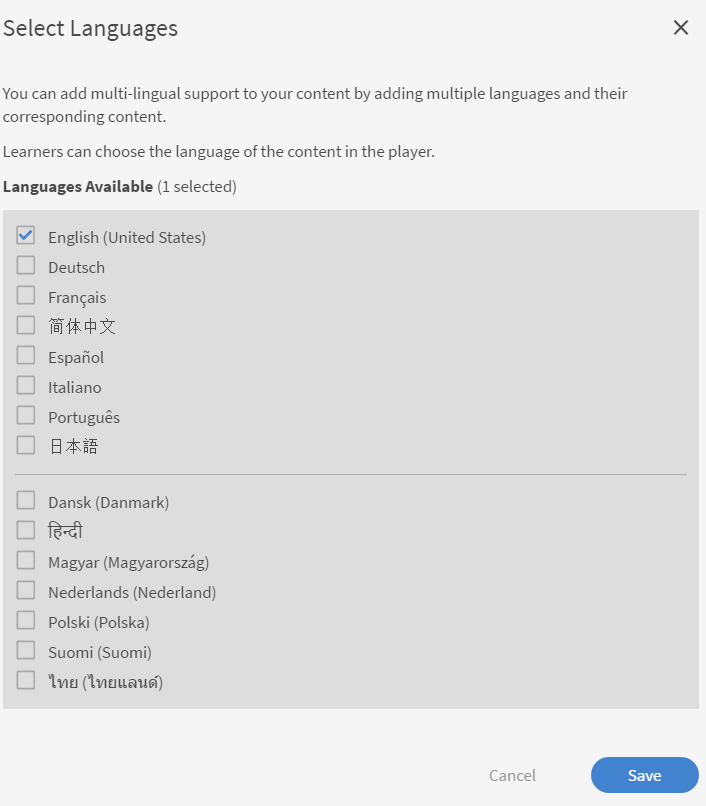
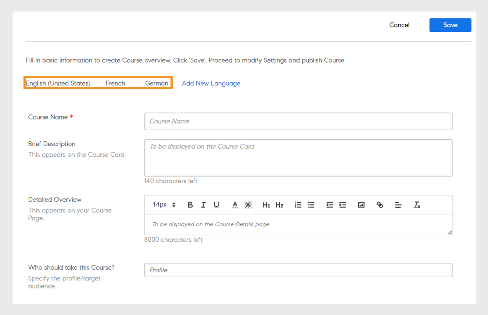
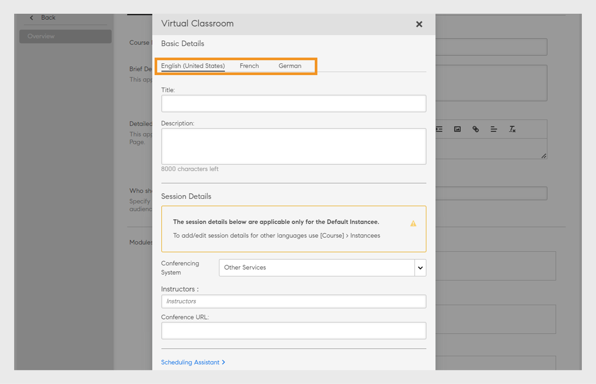
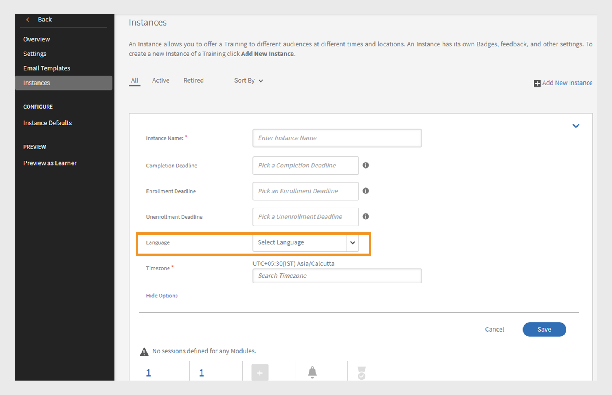
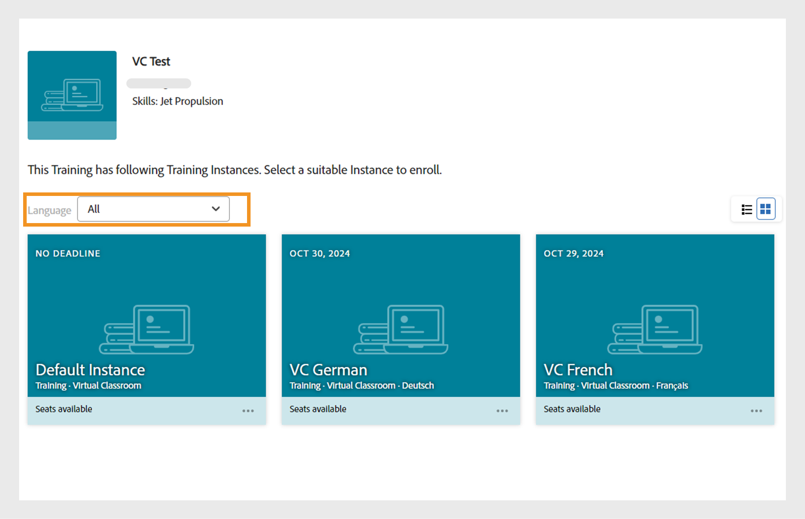
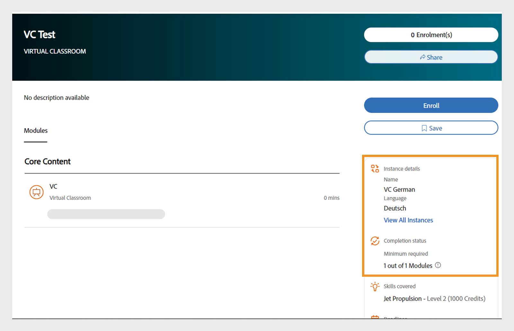

# 在不同地區新增學習物件

閱讀本主題，了解如何新增不同語言的課程、證照和學習計畫。

作為作者，你們有能力建立學習物件，例如課程、認證、學習計畫。 你也可以用不同語言建立這些學習物件。

學習管理器允許你建立多種語言的學習物件。 你可以在建立學習物件時，加入內容和/或其他語言的元資料。 你也可以隨時編輯學習對象的細節，並提供其他語言版本。

要新增語言，請點擊您想新增地點的課程、認證或學習計畫。 從基本資訊頁面，點擊頂部的新增語言。

*新增一種語言*

從彈出視窗中，選擇你想提供給學習者的額外語言，然後點擊儲存。

*選擇一種語言*

重新發布你的課程，讓變更生效。

## 多語言支援 CR/VC 實例及語言標籤

Adobe Learning Manager （ALM） 允許作者利用語言標籤建立針對教室與虛擬教室模組的語言專屬實例。 此功能讓學習者能以偏好語言存取CR/VC模組。 例如，作者可以建立一個包含兩個實例的 CR/VC 模組：一個為英文，一個為法文。 學習者可以選擇自己偏好的語言實例。

### 工作流程

首先，作者會建立並發佈多語言的課程，讓實例建立頁面上能使用語言選項。 作者接著可以透過為每個實例選擇語言來建立不同的實例。 學習者可以根據映射給他們的語言選擇實例。

### 建立多語言課程

請依照以下步驟建立多語言課程：

1. 以 . 登入。**[!UICONTROL Author]**
2. 選擇 **[!UICONTROL Courses]** > **[!UICONTROL Add]** 以建立課程。
3. 輸入 **[!UICONTROL Name]** 課程的 &amp; **[!UICONTROL Description]** 。
4. 選擇 **[!UICONTROL Add New Language]** 並選擇所需的語言。 這樣會為每種語言建立多個分頁。

   
   _新增語言 - 課程_
5. 到對應的語言分頁，輸入 **[!UICONTROL Name]** 課程的 and **[!UICONTROL Description]** 。
6. 在英文（美國）標籤中，選擇 **[!UICONTROL Add Module]** > **[!UICONTROL Virtual Classroom Module]**。

   >[!NOTE]
   >
   >教室模組的流程也相同。

   新增 VC 模組的語言

7. 在每個語言標籤頁輸入 **[!UICONTROL Title]** and **[!UICONTROL Description]** 並選擇 **[!UICONTROL Add]**。
8. 輸入課程所需資料並發布課程內容。

### 為每種語言建立實例

你可以從 Admin 和 Author 應用程式建立每種語言的實例。 請依照以下步驟從作者應用程式建立實例：

1. 以 . 登入。**[!UICONTROL Author]**
2. 選擇 **[!UICONTROL Courses]** 並選擇多語言課程。
3. 選擇 **[!UICONTROL Instances]** > **[!UICONTROL Add New Instance]** 來建立實例。
4. 輸入 並 **[!UICONTROL Instance Name]** 選擇 **[!UICONTROL Completion Deadline]**。
5. 選擇 **[!UICONTROL Show More Options]** 查看其他選項。
6. 從 **[!UICONTROL Language]** 下拉選單選擇所需語言。

   
   _選擇實例的語言_

7. 輸入其他細節並選擇 **[!UICONTROL Save]**。
8. 用同樣步驟建立其他語言的實例。 學習者將能看到本課程的所有語言實例。

### 選擇實例並註冊 – 學習者工作流程

學習者可以在他們的應用程式中看到這些語言實例。 他們可以選擇偏好的語言實例，註冊並參加該語言的 CR/VC 課程。

請依照以下步驟選擇實例並註冊：

1. 在學習者應用程式中，前往並 **[!UICONTROL Catalog]** 選擇課程。
2. 你可以看到以下畫面，裡面有多個實例。

   
   _VC學習模組_

3. 你可以用語言篩選選項過濾。 選擇您偏好的語言並報名課程。
4. 選中後，您可以在課程總覽頁面看到以下詳細資訊。

_實例細節_

