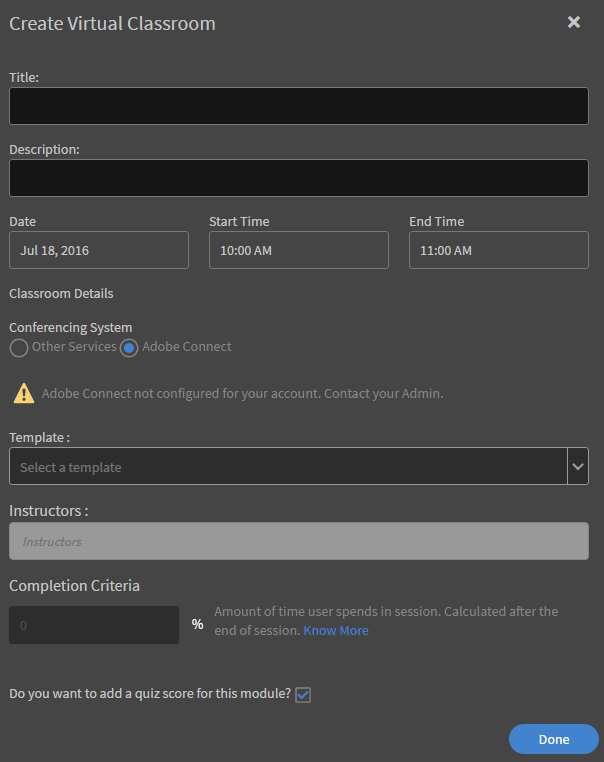
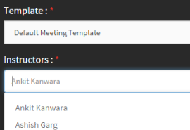

# Adobe Connect整合

作者可在課程建立過程中使用Adobe Connect建立虛擬教室課程。 若要為Learning Manager帳戶啟用Adobe Connect，請聯絡組織的管理員。

## 使用Adobe Connect建立虛擬教室(VC)課程 {#createvirtualclassroomvccoursewithadobeconnect}

1. 在「我的課程」頁面中，按一下「新增模組」，然後選擇「虛擬教室空間」。 「建立虛擬教室」對話方塊隨即顯示。
1. 在&#x200B;**會議系統**&#x200B;選項中，選擇Adobe Connect。

   

   *建立虛擬教室*

1. 輸入標題、說明、VC日期、開始時間和結束時間。

   如果您的帳戶未設定Adobe Connect，則會出現警告訊息，如上方熒幕擷圖所示。 範本、講師和其他Adobe Connect選項均已停用。 您需要聯絡管理員，為帳戶設定Adobe Connect。

1. Adobe Learning Manager應用程式會從Adobe Connect擷取預設範本（會議、培訓和活動）和講師清單（具有主機許可權的使用者）。 選擇您選擇的範本。
1. 從講師清單中選擇VC課程的講師。

   

   *從清單中選取講師*

1. 提供VC課程的完成條件。 完成標準是學習者必須參加課程總時間的百分比，才能視為課程完成。 例如，課程的持續時間是1小時。 如果您提供50%作為完成條件，則如果學習者參加課程甚至30分鐘，則會視為學習者的課程完成。
1. 按一下&#x200B;**[!UICONTROL Done]**。

## 共用的Adobe Connect範本 {#sharedtemplatesofadobeconnect}

依預設，在Adobe Connect帳戶中建立的所有共用範本都會擷取至Learning Manager應用程式。 您可以在Adobe Connect帳戶中將自訂範本設為共用範本，藉此新增自訂範本。
