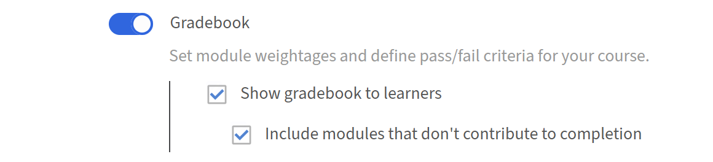

# 作者成績冊

## 為課程設定成績簿

在 Adobe Learning Manager 中為課程設定加權分數，讓每位學習者都能收到根據其模組表現計算出的總分，並讓課程完成與達成最低分數門檻掛鉤。

Gradebook 在建立新課程時會依課程層級設定。 它不能被加入現有已出版的課程中。

>[!NOTE]
>
>學習者若要在課程中看到成績簿，管理員必須先在帳號層級啟用 **成績簿的可見** 性。

### 啟用某門課程的成績簿

* 以作者身份登入 Adobe Learning Manager。
* 在左側導覽中，選擇 **「課程」** ，然後選擇 **新增** 課程。
* 請輸入課程名稱、說明及其他必要資訊。
* 在 **模組** 區塊中，找到 **成績簿** 切換開關。

  

* 選擇 **成績簿** 切換來啟用它。 下面有兩個選項。 兩者預設都是開機：
  * **向學習者顯示成績簿：** 學習者在課程播放器中看到 **成績簿** 分頁，顯示其模組分數、權重分布及綜合成績。 關閉此功能即可在內部計算成績，避免讓學習者看到。
  * **包含不計入最終成績的模組：** 非評分模組（PDF、影片、音訊等）會出現在成績簿中。 非評分模組不計入學習者的最終分數。

### 新增模組並分配權重

啟用成績簿後，加入你的內容模組，並為每個可評分模組分配權重百分比。 權重百分比必須加總到正好 100 才能儲存配置。

* 選擇 **新增模組**。
* 在模組選擇器中，選擇你想新增的模組，然後選擇 **新增**。 模組出現在 **內容** 區。 可評分模組、SCORM、Captivate 內容、AICC、xAPI、原生測驗、活動模組、課堂課程及虛擬課堂課程，皆顯示 **權重** 輸入欄位。 非計分模組的權重欄會顯示破折號。
* 在 **權重** 欄位輸入每個可評分模組的百分比值。 **總權重**&#x200B;指示器會隨著你輸入而更新，必須達到正好&#x200B;**100%**&#x200B;才能存檔。

  

* 對於具有多種投遞類型的模組：只有當 **模組中所有** 投遞類型都支援評分時，才能分配權重。 若任一投遞類型不支援計分，整個模組無法加權。

>[!NOTE]
>
>評分量表不需要跨交付類型一致。 一個滿分100分的課堂課程和一個滿分10分的SCORM模組可以同時存在於同一份成績冊中。 該公式會自動對每個貢獻進行正規化。

### 設定最低及格分數

* 在課程編輯器中，找到 **「通過標準** 」區塊。
* 在 **「各模組** 最低總分」欄位中，輸入 0 到 100 之間的百分比。
* **&#x200B;**&#x200B;0 表示課程僅根據必須完成的模組完成，且無總分門檻。
* 任何分數高於0，代表學習者必須完成必修模組，且達到或超過該總分數。
* 在 **必修模組欄位輸入所需數量** ，或從下拉選單中選擇。

  

* 選擇 **儲存**。

最低及格分數會在成績簿&#x200B;**分頁中顯示給學習**&#x200B;者，讓他們在開始前就知道門檻。

### 為多次嘗試的模組設定分數設定 {#configurescoresettingsmultipleattempts}

當模組允許多次嘗試時，請選擇在成績簿計算中使用的嘗試分數。

* 在課程編輯器中，找到啟用多次嘗試的模組。

  

* 找到 **該模組旁邊的「Score to be use** 」設定。
* 選擇 **最新** 或 **最高**：
  * **最新：** 總是使用最近的嘗試分數。 後續嘗試得分較低者，將取代先前較高分數。
  * **最高：** 保留任何嘗試中最高分數。 後續嘗試分數較低不會減少儲存分數。

    

* 選擇 **儲存**。

### 發布課程

在設定好所有成績簿設定後，使用標準工作流程發布課程。 選擇 **儲存**，然後選擇 **發佈** ，讓課程提供給學習者。

### 最佳實務

* 依據每個模組的相對重要性分配權重。 給予對學習目標最關鍵的模組較高比例。
* 除非有特定原因要隱藏分數，否則請啟用 **「顯示成績簿」給學習者** 。 能看到自己權重和跑步分數的學習者，更容易優先分配努力的優先順序。
* 在學員報名前設定最低及格分數。 在有效報名後更改，可能會影響正在完成的進度。
* 當模組是評估，學習者預期要重試時，使用 **「最高」** 模式。 當你想捕捉目前的知識水準而非最佳效能時，請使用&#x200B;**最新。**
* 儲存前請確認 **總權重** 指示器顯示正好 100%。
