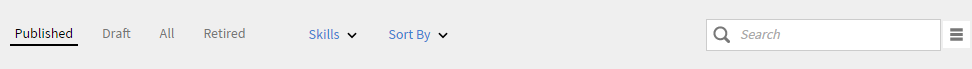

# 目錄

Learning Manager中的目錄包含Learning Manager帳戶中學習者角色的課程、學習計畫和認證。

## 目錄 {#Catalogs-1}

Learning Manager中的所有課程均可在課程區段中取得。 這同樣適用於學習計畫、憑證等。

若只要檢視作者建立的課程，請導覽至區段 **我的課程**.

身為作者，您可以檢視課程目錄，這是帳戶中所有課程的集合。

以作者身分登入後，請按一下 **課程目錄** 在左窗格中檢視Learning Manager中為貴組織提供的所有課程清單。

使用如下圖快照所示的篩選選項，在目錄中尋找課程。

*在目錄中尋找課程*

## 使用Adobe Connect建立虛擬教室(VC)課程 {#createvirtualclassroomvccoursewithadobeconnect}

1. 在「我的課程」頁面中，按一下「新增模組」，然後選擇「虛擬教室空間」。 「建立虛擬教室」對話方塊隨即顯示。
1. 在 **dialog>會議系統** 選項，選擇Adobe Connect
1. 輸入標題、說明、VC日期、開始時間和結束時間。

   如果您的帳戶未設定Adobe Connect，則會出現警告訊息，如上方熒幕擷圖所示。 範本、講師和其他Adobe Connect選項均已停用。 您需要聯絡管理員，為帳戶設定Adobe Connect。

1. Adobe Learning Manager應用程式會從Adobe Connect擷取預設範本（會議、培訓和活動）和講師清單（具有主機許可權的使用者）。 選擇您選擇的範本。

1. 從講師清單中選擇VC課程的講師。

   

   *從清單中選取講師*

1. 提供VC課程的完成條件。 完成標準是學習者必須參加課程總時間的百分比，才能視為課程完成。 例如，課程的持續時間是1小時。 如果您提供50%作為完成條件，則如果學習者參加課程甚至30分鐘，則會視為學習者的課程完成。

1. 按一下 **[!UICONTROL Done]**.
