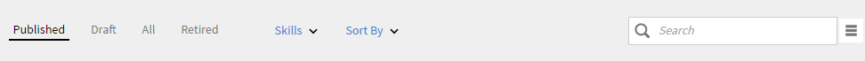
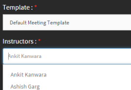

# 目錄

Learning Manager 中的目錄包含學習者角色的課程、學習計畫及認證。

## 目錄 {#Catalogs-1}

學習管理中所有課程皆可在課程區段取得。 學習課程、證書等課程同樣適用。

若要只查看作者所創建的課程，請前往「我的課程」**區塊**。

作為作者，你可以查看課程目錄，這是帳號中所有課程的集合。

登入為作者後，點擊 **左側窗格的課程目錄** ，即可查看您機構學習管理員中所有可用的課程清單。

請使用下方快照所示的篩選選項，在目錄中找到課程。

*在課程目錄中找到*

## 使用 Adobe Connect 建立虛擬教室（VC）課程 {#createvirtualclassroomvccoursewithadobeconnect}

1. 在我的課程頁面，點選新增模組並選擇虛擬教室。 會出現「建立虛擬教室」對話框。
1. 在 **對話框>會議系統** 選項中，選擇 Adobe Connect
1. 輸入標題、描述、VC 日期、開始時間和結束時間。

   如果你的帳號沒有設定 Adobe Connect，會跳出如上方截圖所示的警告訊息。 模板、講師及其他 Adobe Connect 選項皆被停用。 你需要聯絡你的管理員，為你的帳號設定 Adobe Connect。

1. Adobe Learning Manager 應用程式會從 Adobe Connect 取得預設範本（會議、培訓和活動）及講師名單（擁有主機權限的使用者）。 選擇你喜歡的範本。

1. 從授課老師名單中選擇你VC課程的講師。

   

   *從名單中選擇講師*

1. 提供VC課程的完成標準。 完成標準是指學習者必須參加課程總時長的百分比，才能被視為課程完成。 舉例來說，課程時長是1小時。 若你提供50%的完成標準，即使學習者參加課程30分鐘，也即視為完成課程。

1. 點擊 **[!UICONTROL Done]**。
