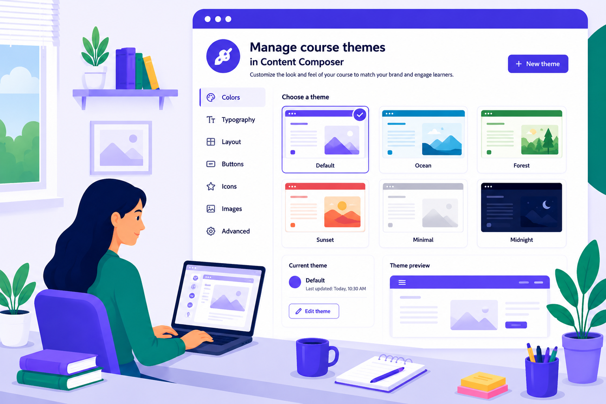

# Adobe Learning Manager 內容撰寫器（測試版）幫助

>[!IMPORTANT]
>
>測試版功能可能存在缺陷，且以「現況」形式提供，且不提供任何形式的保固。 Adobe 擁有是否將測試版功能公開的全權裁量權。 Adobe 無義務維護、更正、更新、變更、修改或以其他方式支援（透過 Adobe 支援服務或其他方式）測試版功能。 若測試版功能正式上線，可能會受到額外條款與條件的約束，包括適用費用。 測試版功能如有變更，恕不另行通知，包括停產。 建議用戶謹慎行事，切勿依賴測試版功能的不中斷或無錯誤運作與效能。 因此，任何測試版功能的使用均需自行承擔風險。 隨著功能演進，產品功能及相關文件可能會有所變化。 本文件反映目前測試版經驗，不應視為最終或完整的產品文件。

## 從概念到課程只需幾分鐘

Adobe Learning Manager 內容撰寫器是一款 AI 課程創作工具，能將一個簡單的語言提示轉化為結構化、可發布的課程，包含課程、評量與媒體內容，且不需先前的教學設計經驗。

內容編輯器透過對話引導作者完成訓練目標、來源資料與學習目標，然後生成具教育意義、符合品牌特色且可直接發佈至 Adobe Learning Manager 的課程。

**主要亮點**

- **AI 導向課程創建**：對話式 AI 會提出針對性問題，將訓練目標轉化為明確且可衡量的學習目標。
- **文件基礎生成**：作者上傳現有文件、政策或資料表。 AI 會從這些材料中生成簡報和大綱;作者在建構前會接受或編輯。
- **教學上有效的產出**：課程、評量與媒體皆依據結構化學習原則產生，確保產出具有教育效益，而非僅僅是快速產出。
- **直接發佈到 Adobe Learning Manager**：完成的課程直接發佈到 Adobe Learning Manager;沒有獨立的創作工具，也沒有手動匯出 SCORM。
- **單一系統工作流程**：課程建立、學習者管理與報告皆集中於同一平台，省去管理多個撰寫與交付工具的負擔。

## 在你簽到之前

>[!IMPORTANT]
>
>您必須使用有效的 Adobe Creative Cloud 帳號登入。 如果你還沒有，可以透過 Adobe Express 建立免費帳號。 欲了解更多資訊，請參閱 [「建立免費的 Adobe Express 帳號](https://helpx.adobe.com/tw/express/web/adobe-express-subscription/free.html)」。 建立 Adobe 帳號後，啟動 Content Composer 並登入開始建立課程。 如果您的組織已有 Creative Cloud 訂閱，請先聯絡管理員，讓他們在登入 Content Composer 前為您設定 Creative Cloud 帳號。

>[!NOTE]
>
>為了獲得最佳的 Content Composer 體驗，建議使用 Google Chrome。 Firefox 和 Safari 在功能或行為上可能有差異。

## 試試 Content Composer

準備好打造你的第一個球場了嗎？ 打開內容撰寫器，從簡單的提示語快速切換到可發表的課程。

**[試試內容作曲家→](https://contentcomposer.adobe.io/)**

<!--

-->

<!---->

## 概觀 {#overview}

<table style="table-layout:auto; border:none; border-collapse:collapse;">
 <tbody>
  <tr>
   <td style="border:none;">
    
    

    <a href="what-is-content-composer.md"><strong>開始使用 Content Composer</strong></a>
    

    
內容撰寫者是什麼、是為誰設計的，以及在開始前你需要什麼。

   </td>
   <td style="border:none;">
    
    

    <a href="write-a-prompt.md"><strong>建立課程</strong></a>
    

    
從簡單的語言提示，在單一引導的工作流程中，逐步轉換成可發表的課程。

   </td>
   <td style="border:none;">
    
    

    <a href="general-course-settings.md"><strong>設定課程設定</strong></a>
    

    
在發佈前，先設定完成標準、測驗分數，以及你的 Adobe Learning Manager 連結。

   </td>
  </tr>
  <tr>
   <td style="border:none;">
    
    

    <a href="apply-theme.md"><strong>管理課程主題</strong></a>
    

    
應用、客製化、創建並匯入視覺主題，以掌控你的球場外觀與氛圍。

   </td>
   <td style="border:none;">
    
    

    <a href="share-collaborate.md"><strong>分享與協作</strong></a>
    

    
分享您的課程供同事複習，或讓學習者直接取得課程。

   </td>
   <td style="border:none;">
    
    

    <a href="publish-to-alm.md"><strong>發佈到 Adobe Learning Manager</strong></a>
    

    
將完成的課程部署到 Adobe Learning Manager，了解內容撰寫者與 ALM 如何分工撰寫、交付與報告責任。

   </td>
  </tr>
  </tbody>
</table>

## 查查資料 {#lookthingsup}

快速回答、目前的限制條件，以及完整的 JSON 架構。 你需要的一切都是快速查詢的。

<table style="table-layout:auto; border-collapse:collapse;" border="1" bordercolor="transparent" cellpadding="0" cellspacing="0">
 <tbody>
  <tr>
   <td style="border:1px solid transparent;">
    
    

    <a href="content-composer-beta-limitations.md"><strong>Beta 限制</strong></a>
    

    
完整的目前限制、變通方法及路線圖狀態清單。 隨著功能發佈而更新。

   </td>
   <td style="border:1px solid transparent;">
    
    

    <a href="content-composer-faq.md"><strong>內容撰寫者常見問題</strong></a>
    

    
關於撰寫、設定、分享與出版的最常見問題，快速解答。

   </td>
   <td style="border:1px solid transparent;">
    
    

    <a href="theme-json-reference.md"><strong>主題 JSON 屬性參考</strong></a>
    

    
Content Composer 主題中的每個屬性 JSON 架構，並附有描述與範例值。

   </td>
  </tr>
 </tbody>
</table>

## 開始創作吧 {#startcreating}

你擁有一切所需。 打開內容撰寫器，建立你的第一門課程。

[**試試 Content Composer**](https://contentcomposer.adobe.io/)
