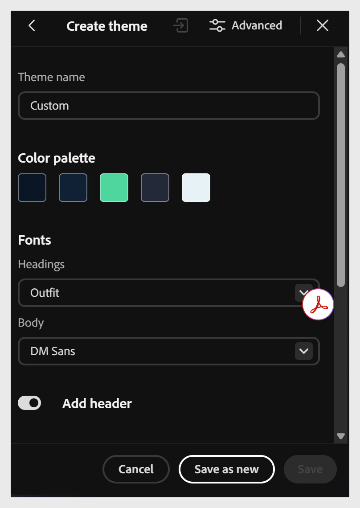

# 建立主題

建立自訂主題有兩種方法，兩者都會將結果加入你的 **自訂** 主題清單：

- **從**&#x200B;工具列的建立&#x200B;**選項從零**&#x200B;開始建立——設定色彩調色盤、字型和其他屬性，然後&#x200B;**另存為新。**

- **匯入自訂的 JSON 檔案** ——先匯出現有主題 JSON，然後用文字或程式碼編輯器編輯，再匯入回去。

**需要更多控制嗎？**

關於每個元素的排版（課程名稱、主題名稱、區塊標題、說明文字）、色彩標記層級的自訂，以及完整的 JSON 架構存取——這正是平台或品牌團隊通常需要的控制，請參見 [進階主題自訂](advanced-theme-customization.md)。

## 從零開始創作主題

1. 從工具列選擇 **「建立** 」以開啟 **課程主題** 面板。
   

2. 根據需要配置主題的色彩調色盤、字型及其他屬性。
   

3. 選擇 **「另存為新」** 以將主題加入你的 **自訂** 主題清單。
   

## 透過匯入 JSON 建立主題

1. 從工具列選擇 **主題** 以開啟 **課程主題** 面板。

2. 將滑鼠移到你想用作基礎的主題上，選擇 **匯出** 以下載為 JSON 檔案。

3. 在文字或程式碼編輯器中開啟 JSON 檔案，更新其屬性，如半徑、間距、色彩調色盤或字型。

4. 儲存 JSON 檔案。

5. 在內容撰寫器中，從課程主題面板選擇&#x200B;**匯入****。**

6. 從你的電腦中選擇更新後的 JSON 檔案。

7. 選擇 **「另存為新」** 以將主題加入你的 **自訂** 主題清單。
