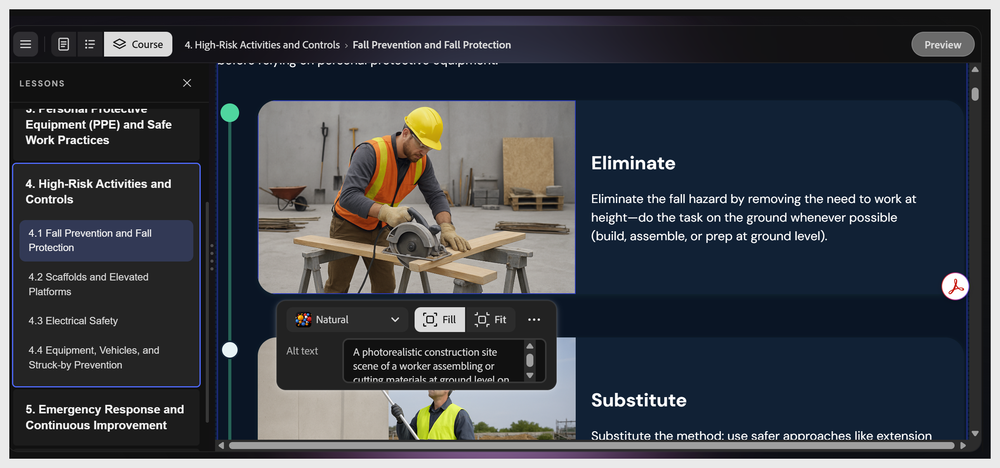

# 編輯或新增圖片

選擇任意圖片以開啟圖片工具列。 控制措施包括：

- **填滿**、 **貼合：** 影像在框架內的大小

- **替代文字** 欄位：顯示圖片描述。 
  **注意**：此文字不可修改。 它會根據圖片自動更新。

- **更多選項** 圖示： **調整** 圖片的亮度、飽和度和透明度。

要替換圖片，請選擇 **圖片** 圖示以更改圖片。 你可以選擇上傳自己的檔案、搜尋 Adobe 股票，或用 AI 生成檔案。
