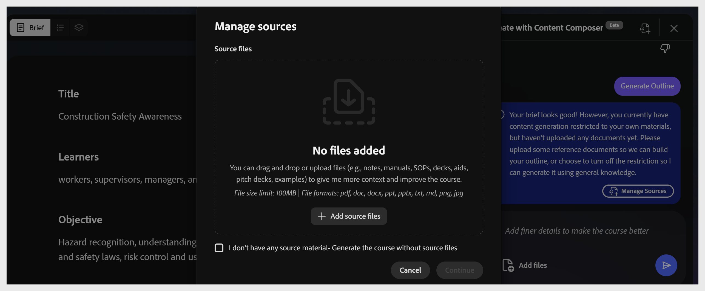
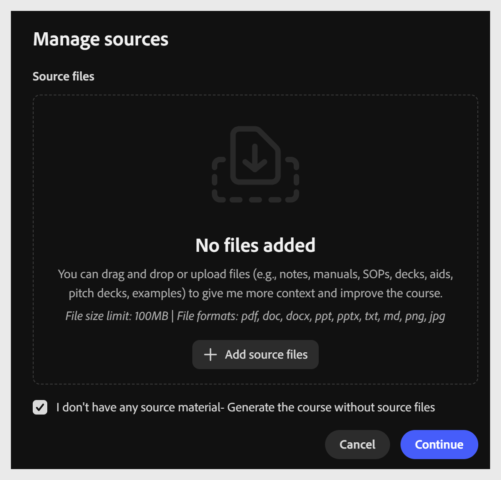

# 管理原始碼檔案

**管理來源** 讓你能控制內容撰寫者用來生成課程的內容。 把你自己的文件加入課程，然後選擇是限制 AI 只使用該內容，還是讓它用自己的知識補充你的內容。 如果你沒有新增任何文件，Content Composer 會利用 AI 模型現有的知識來生成課程。

## 使用原始資料生成課程

1. 在聊天面板或工具列中選擇 **「管理來源** 」或 **「新增檔案** 」。
   

2. 將檔案拖曳到對話框中，或選擇 **+ 新增原始檔案** 以瀏覽。 你可以新增多個原始檔案。
   

3. 選擇 **限制輸出為檔案**中的內容。 這讓內容撰寫者能僅使用原始內容來生成課程。 若未勾選此選項，Content Composer 也會使用網頁來建立課程。
   

支援的格式：

| **節目形式** | **最大尺寸** |
|-------------------------|--------------|
| PDF | 100 MB |
| Markdown （.md） | 100 MB |
| PowerPoint（.ppt/.pptx） | 100 MB |
| MS Word（.doc/.docx） | 100 MB |
| 文字檔（.txt） | 100 MB |

選擇 **「繼續** 」以產生課程大綱。

### 無來源素材生成

當你沒有原始檔案作為參考文件時，請依照以下步驟產生課程大綱。

1. 選擇 **「管理來源**」。 **「管理來源**」對話框會打開。

2. 選擇 **「我沒有任何原始資料」——生成課程時沒有原始檔案** ，讓 AI 能從其一般知識中產生內容。 當未選擇此選項且檔案上傳時，AI 會限制生成內容僅限於你上傳的文件。

3. 選擇 **「繼續** 」以產生課程大綱。

### 當原始資料變更時，請更新課程

原始文件在課程生成後可能會過時——政策被修訂、SOP有新版本，或簡報文件更新。 利用這個工作流程讓課程重新符合現有內容。

1. 從聊天面板或工具列選擇 **「管理來源** 」以重新開啟對話框。

2. 新增或修訂後的檔案，使用 **+ 新增原始檔案**。

3. 移除或替換任何過時檔案，使來源清單僅反映當前資料。

4. 選擇繼續以儲存更新後的原始碼清單。

5. 在 Content Composer 中重新生成受影響的課程，檢視變更後，再重新發布課程。 重新發布會將更新傳送到 Adobe Learning Manager，作為新模組版本——詳見 ALM 中的模組版本管理。

### 確認檔案上傳

    ![](../資產/9_manage_sources_file_ingested_confirmation_updated.png）

檔案附加後，工具列中的檔案圖示會顯示徽章數量。 助理會確認上傳，並提供 **生成大綱** 捷徑。 選擇它，或在上方工具列選擇 **「產生大綱** 」。
