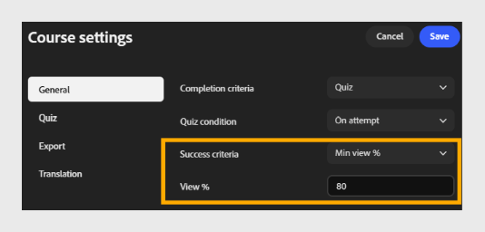

# 設定完成與成功標準

## 完成標準

**完成標準**：選擇下拉選單，選擇課程完成時間。

- **啟動：** 學習者一打開課程，無論觀看多少，都會標記課程完成。
  

- **最小瀏覽百分比：** 當學習者看到課程內容的指定百分比時，標記課程已完成。
  

- **測驗：根據學習者的測驗活動，標示課程完成。 選擇測驗條件：**

  - **嘗試時：** 學習者一嘗試測驗即完成，無論結果如何。

  - **通過時：** 只有通過測驗時才算完成。

  - **通過或達到限制：** 當學習者通過或達到最大嘗試次數（以先到者為準）時，成績即完成。
    

## 成功標準

**成功標準** 決定學員在修完課程後是否被評為通過或不及格。 與完成標準不同，成功標準是以分數為基礎。

>[!NOTE]
>
>可用的選項取決於匯出設定&#x200B;**中**&#x200B;選擇的 SCORM 版本。若選擇 **SCORM 1.2**，完成與成功標準將合併為單一設定。 若選擇 **SCORM 2004**，完成與成功標準會分別顯示為獨立設定，如下所述。*

- **成功標準**：選擇下拉選單，選擇課程如何衡量成功。

- **啟動：** 僅透過啟動課程即可標記學習者通過。
  

- **最小瀏覽率**：當學習者看到指定百分比的內容時，標記該學生通過。 例如，輸入 80 即可要求學習者觀看至少 80% 的課程內容。
  

- **測驗：** 根據測驗分數是否達到及格門檻，判定學習者通過或不及格。 選擇測驗條件：

  - **嘗試時：學習者一嘗試測驗即被標記為成功。**

  - **通過時：只有當學習者通過測驗時才算成功。**

  - **通過或達到限制時：當學習者通過或達到允許的最大嘗試量時，標記為成功。**

  

>[!NOTE]
>
>例如，學習者完成課程但仍然不及格，例如完成所有內容但測驗分數不夠高。 完成與成功標準是獨立的;請根據你希望學習者進度與表現的追蹤方式，謹慎設定兩者。 當你選擇「測驗」來選擇任一標準時，請在測驗設定&#x200B;**標籤中**&#x200B;設定測驗重試和通過分數。

## 為什麼完成與成功標準對報告很重要

- 完成標準控制學習者的狀態何時在 ALM 成績單、完成儀表板，以及從 LMS 匯出的合規或稽核資料中變化為「完成」——它們衡量的是進度，而非績效。

- 成功標準控制與完成狀態一同記錄的通過/不通過數值——這是大多數合規與認證報告所依賴的數值。

- 若同一模組的完成與成功標準也在 **Adobe Learning Manager** 內容庫中設定，則這些設定優先於內容撰寫器中設定的。 及早決定哪個產品應該擁有這些規則，並避免在兩地設定衝突的價值觀。

- 將標準與你需要證明的事項相符：啟動或最小瀏覽率足以證明內容的認知度，而基於測驗的標準則能提供學習者展現知識的合理證據——而不只是他們開課。
