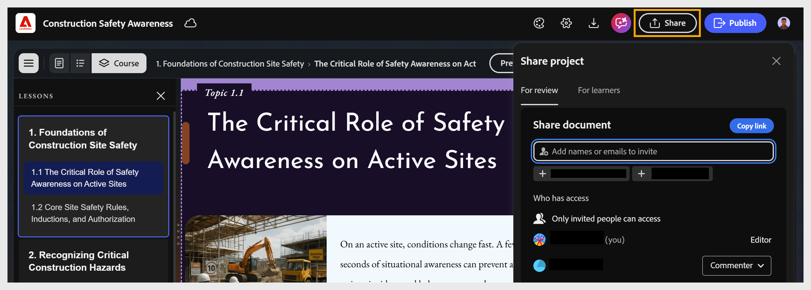

# 分享並合作內容撰寫課程

>[!AVAILABILITY]
>
>敬請期待！

在發表前，你可以把課程寄給評審，徵求回饋。 評審可在瀏覽器中開啟共享連結，對任何課程組成部分發表評論，並嘗試測驗以預覽完整的學習體驗。 作者可控制存取權、收集回饋並更新課程，且不更改評論網址。 你可以針對回饋進行回應、更新課程，並根據需要啟動額外的複習週期。

<!--
Content Composer lets you distribute your course to reviewers and learners, and collaborate with your team throughout the authoring process, all without leaving the app.  

Before publishing, you can send your course to reviewers for feedback. Reviewers open the shared link in a browser, add comments on any course component, and attempt the quiz to preview the full learner experience. Authors control access, collect feedback, and update the course without changing the review URL. You can address the feedback, update the course, and initiate additional review cycles as needed.  

Once the course is ready, you can make it available to learners directly or publish it to Adobe Learning Manager for enrollment, tracking, and reporting.  

Throughout the process, comments and mentions help keep everyone aligned. Collaborators can use @mentions to tag teammates, ask questions, and discuss specific parts of the course, ensuring that feedback remains contextual, visible, and actionable.

Adobe Learning Manager Content Composer has two sharing modes, accessed from the **Share** button in the top toolbar.

In Content Composer, select **Share** in the toolbar. The **Share project** panel opens with two tabs:

* **For review**: Send the project by email invite or share a link.

* **For learners**: Provide them with a link to the project -- no need of LMS connection.

Both these options give you control and flexibility in sharing your courses.

-->
