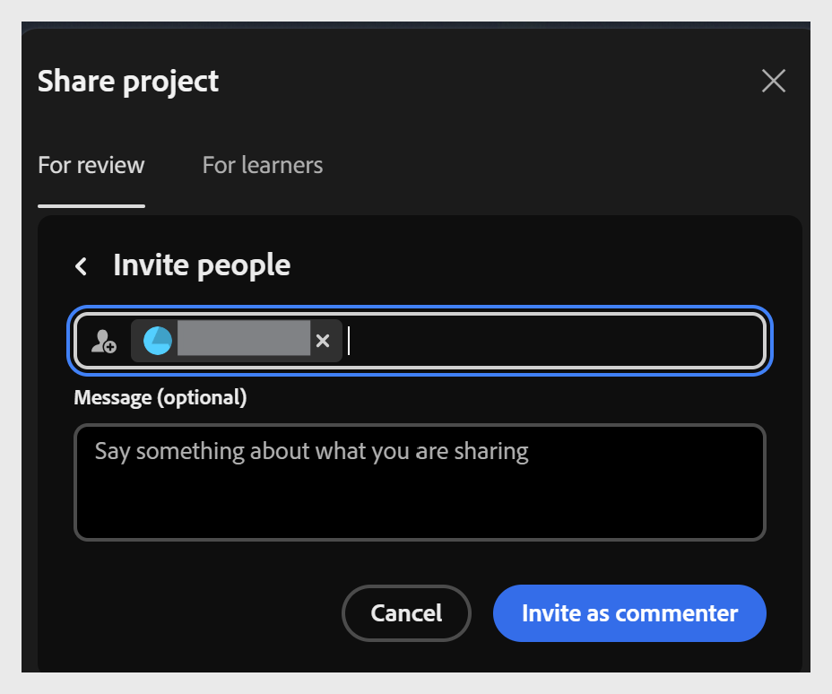

# 分享專案以供審查

Content Composer 讓你能與審稿人或學習者分享專案，無需他們安裝應用程式，提供快速且有結構的方式收集回饋並在發佈前取得批准。

作為作者，你可以以姓名或電子郵件邀請審稿人，精確控制誰有權限，並隨時撤銷該權限。 評審可以開啟共享連結，直接對任何課程部分發表評論，甚至嘗試最終測驗而不影響成績，藉此預覽完整的學習體驗。

評論保持有條理且可執行：審稿人與擁有者可在同一面板回覆、解決、篩選並提及彼此，無論是外部審查或專案內部工作。 一旦你處理了回饋並更新專案，

分享一個專案供評測：

1. 選擇 **以進行審查**。

   

2. 請在 **邀請人員** 欄位輸入審稿人的姓名或電子郵件地址。

   
3. 檢視誰有權限，確認只有受邀者才能進入專案。

4. 選擇 **邀請為留言者** ，可依姓名或電子郵件新增評論者。 你可以新增任意數量的審稿人。 或者選擇 **複製** 連結，複製評論網址，並直接分享給已有權限的審核者。 這是兩種不同的分享方式。

   

## 移除審查者的存取權限

你可以從有權限存取專案的人名單中移除審查者。 如果那位審稿人試圖用之前分享的連結重新開啟專案，

你可以選擇移除被選中的留言者。 當留言者被從有權存取該文件的名單中移除時，

要移除存取權限：

* 選擇審查者姓名，並從顯示的選項中選擇「移除」。

* 如果審閱者試圖存取先前共享連結的文件， 顯示「存取被拒」訊息。

  

## 請求存取權限

如果你嘗試開啟已無法存取的共享專案，必須先申請存取權限才能查看。 例如，如果擁有者移除你，或是你用不同的 Adobe ID 開啟連結，這種情況就可能發生。 不管哪種情況，你都會看到「存取被拒絕」的畫面。

* 選擇 **「請求存取權** 」以請求擁有者同意審查專案並新增評論。

  

* 專案負責人會收到通知，並告知申請存取權的審查者姓名。