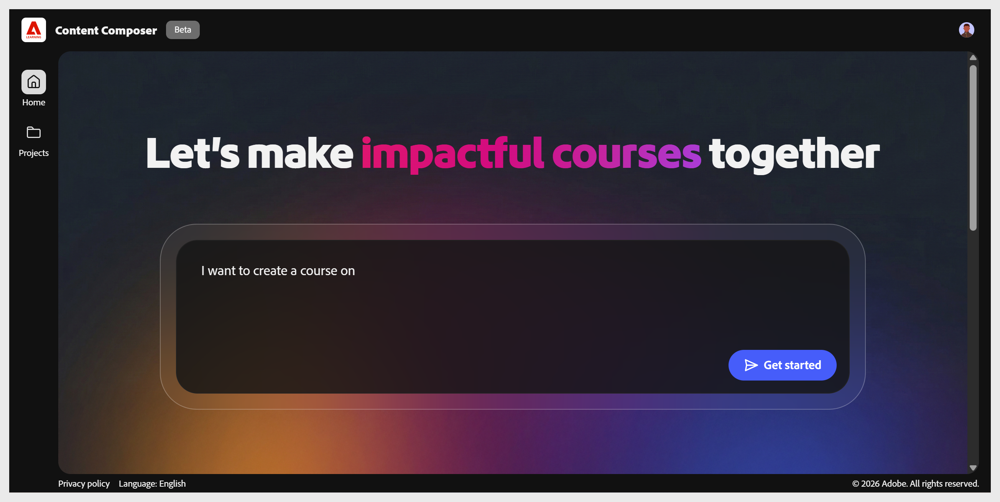

# 寫一個提示

在內容撰寫者主畫面，輸入你想建立的課程描述。 用簡單的語言寫作——一兩句話說明主題、目標和目標。

**範例提示：**

- 我想開設一門關於資訊安全意識的課程，包括釣魚模擬、密碼衛生及其他防護方法。

- 我想為新進客服人員建立一個入職模組，涵蓋如何登錄工單、升級問題，以及在我們的客服台系統中關閉案件。

- 我想為倉庫員工設計一門手動操作程序的複訓課程，例如正確的起重技術、何時使用設備，以及如何報告近距離事故。

選擇 **開始**。 內容撰寫者會 **打開簡報** 階段，閱讀你的提示開始填寫課程細節。

**小提示**：你的提示不必完美。 助理會在每個步驟提出後續問題，以精煉標題、學習者資料及目標，然後再產生任何內容。

## 撰寫有效的提示

在內容撰寫器中撰寫能產生準確課程簡報、更佳大綱及更強AI生成內容的提示。

提示是你給內容撰寫者的第一個輸入，也是最重要的。 清晰且具體的提示意味著 AI 能更準確地預先填寫簡報，產生符合你意圖的大綱，並產出較少需要編輯的課程內容。

### 什麼樣的提示詞才會奏效？

Content Composer 會閱讀你的提示，並用它預先填入三個簡短欄位：課程名稱、學習者檔案和學習目標。 你的提示越能反映這三個面向，案情所需的修正就越少，而更準確的案情摘要則能產生更相關的大綱。

一個提示「建立安全課程」幾乎給 AI 任何可用的資源。 一個能命名受眾、指定主題並標示範圍的提示，能讓 AI 產生一份你只需最小修改就能接受的簡報。

簡短欄位也會放大提示中的內容。 如果你的提示很模糊，AI 會產生一個模糊的簡報。 模糊的簡報會產生一個通用的大綱。

更多資訊請參見 [「寫作有效提示](write-effective-prompts.md) 」。
