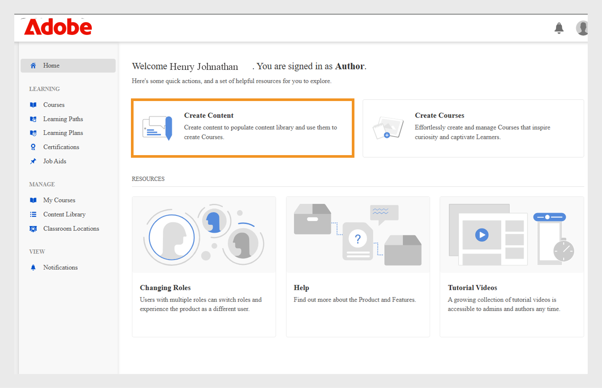
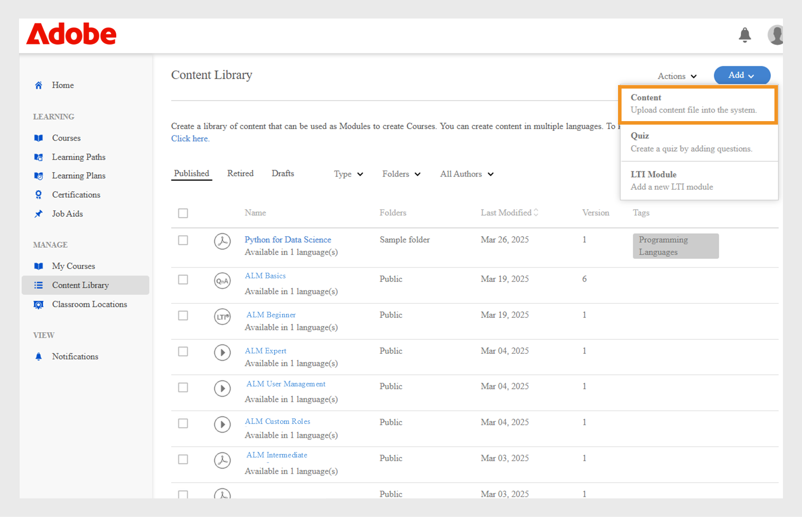
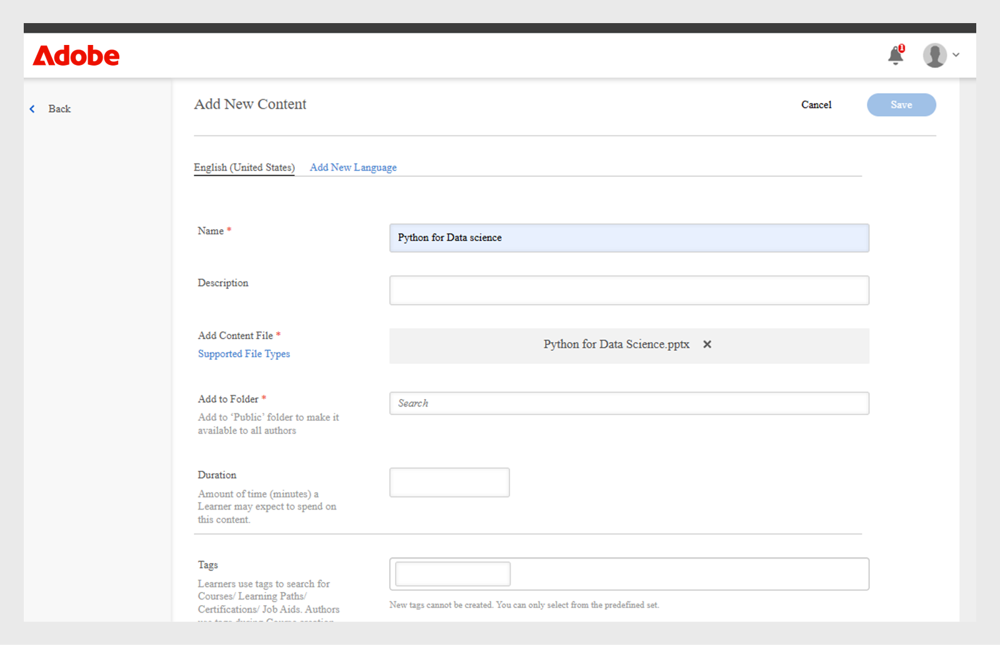
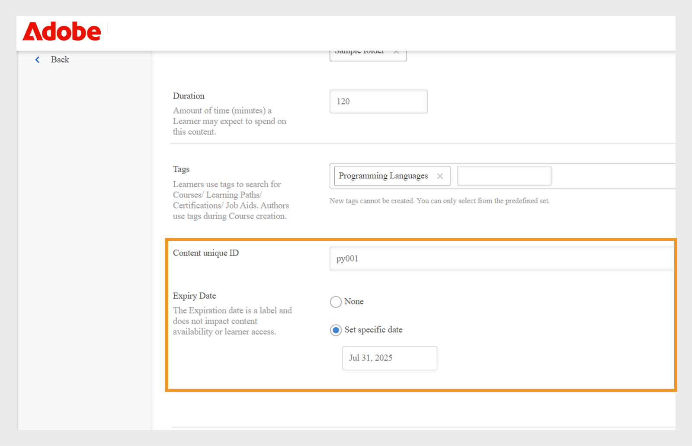
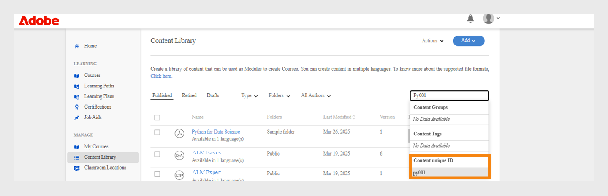
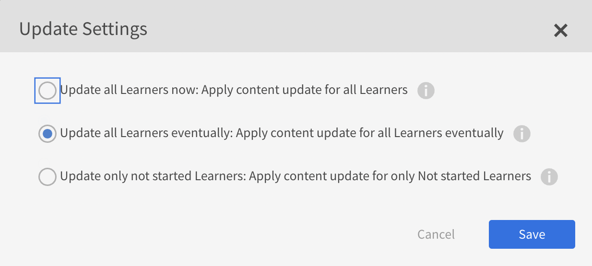

# 內容庫

瞭解如何建立內容，以配合課程成為自訂進度內容。

## 內容庫 {#contentlibrary}

內容是課程的建置組塊。 作者會建立內容資料庫，以與課程對應，作為自訂進度內容。 只有作者才能存取此內容庫。

## 支援的內容型別 {#supported}

您可以在程式庫中上傳互動式和靜態內容。

下表顯示您可以上傳至程式庫的互動式和靜態檔案型別。

<table>
 <tbody>
  <tr>
   <td>
    
<b>互動式內容</b>
</td>
   <td>
    
<b>內容型別</b>
</td>
   <td>
    
<b>擴充功能</b>
</td>
  </tr>
  <tr>
   <td>
    
 
</td>
   <td>
    

    <ul>
     <li>SCORM 1.2</li>
     <li>SCORM 2004</li>
     <li>AICC</li>
     <li>TinCan</li>
    </ul>
    

</td>
   <td>
    
zip
</td>
  </tr>
  <tr>
   <td>
    
<b>靜態內容</b>
</td>
   <td>
    
<b>內容型別</b>
</td>
   <td>
    
<b>擴充功能</b>
</td>
  </tr>
  <tr>
   <td>
    
 
</td>
   <td>
    
影片
</td>
   <td>
    
mp4， wmv， 3gp， 3g2， 3gp2， asf， avi， f4v h264， mpe， mpeg， mpg， mpg2， m4v， mov， wmv
</td>
  </tr>
  <tr>
   <td>
    
 
</td>
   <td>
    
音訊
</td>
   <td>
    
mp3， wav， aac， m4a， wma， vorbis， pcm， eac3， amr， ac3
</td>
  </tr>
  <tr>
   <td>
    
 
</td>
   <td>
    
PDF
</td>
   <td>
    
pdf
</td>
  </tr>
  <tr>
   <td>
    
 
</td>
   <td>
    
MS PowerPoint
</td>
   <td>
    
pptx， ppt
</td>
  </tr>
  <tr>
   <td>
    
 
</td>
   <td>
    
MS Word
</td>
   <td>
    
docx， doc
</td>
  </tr>
  <tr>
   <td>
    
 
</td>
   <td>
    
MS Excel
</td>
   <td>
    
xlsx， xls
</td>
  </tr>
  <tr>
   <td>
    
 
</td>
   <td>
    
HTML
</td>
   <td>
    
zip檔案
</td>
  </tr>
 </tbody>
</table>

## 在程式庫中新增內容 {#addnewcontentinthelibrary}

**作者**&#x200B;可以在ALM中新增內容。 ALM中有兩種型別的內容： **[!UICONTROL Content]**&#x200B;和&#x200B;**[!UICONTROL Quiz]**。 若要瞭解如何新增內容，請參閱[新增靜態內容](content-library.md#addstaticcontent)和[建立測驗](content-library.md##createaquiz)。

## 新增靜態內容 {#addstaticcontent}

1. 以&#x200B;**作者**&#x200B;身分登入後，在左窗格中選取&#x200B;**[!UICONTROL Content Library]**，然後選取&#x200B;**[!UICONTROL Add]**。

   或者，您也可以從&#x200B;**[!UICONTROL Getting Started]**&#x200B;頁面選取&#x200B;**[!UICONTROL Create Content]**。

1. 在&#x200B;**[!UICONTROL Name]**&#x200B;欄位中，輸入您要上傳之內容的名稱。
1. 在&#x200B;**[!UICONTROL Description]**&#x200B;欄位中，輸入內容的說明。 請確定您要輸入的說明有意義。 字元限製為400個字元。
1. 若要新增內容，請選取&#x200B;**[!UICONTROL Add Content File]**，然後上傳您的資源檔案。 當您新增多種語言的內容時，您無法將靜態和互動式內容結合在單一群組中。 您所有地區設定的所有內容都應是靜態的，或者所有內容都應是互動的。

   如果要取代內容，您可以使用不同的靜態內容來取代靜態內容。 這同樣適用於互動式內容。

1. 在&#x200B;**[!UICONTROL Duration]**&#x200B;欄位中，您可以選擇輸入學習者在此模組中所花費的預期時間。 持續時間以分鐘為單位。

   如果學習者將課程標示為完成，我們會根據指定的持續時間計算學習時間。 如果學習者取用播放器中的內容，則播放器逗留的時間會新增至學習時間。 如果實際內容時間小於指定的持續時間，播放器會顯示內容時間。 在此情況下不會進行任何變更。

1. 在&#x200B;**[!UICONTROL Tags]**&#x200B;欄位中，輸入已上傳內容的標籤，以便您的內容變成可探索。

   作者將內容新增至課程時，可以使用這些標籤來搜尋內容。

### 在內容庫中新增HTML5檔案型別

作者可將HTML5內容以.zip檔案的形式新增至自訂進度內容中。 .zip資料夾應包含名為`index.html`的HTML檔案。 如果有多個HTML檔案，則應全部連結，且主檔案名為`index.html`。 學習者可以在流體播放器中檢視HTML5內容。 作者可以將此HTML5內容新增至課程的自學課程模組，並設定完成條件。 作者可使用下列兩種方式之一設定完成HTML課程的條件：

* 學習者可將其標示為完成。
* 他們啟動課程後，即會被標示為完成。

若要將HTML檔案型別(.zip)新增至內容庫，請按照下列步驟操作。

1. 在作者應用程式中，選取首頁上的&#x200B;**[!UICONTROL Create Content]**。
1. 在&#x200B;**[!UICONTROL Content Library]**&#x200B;畫面中，選取&#x200B;**[!UICONTROL Add]** > **[!UICONTROL Content]**。
1. 輸入內容的名稱和說明。
1. 選取&#x200B;**[!UICONTROL Add Content File]**&#x200B;選項，然後瀏覽並選取HTML檔案（壓縮為資料夾）。
1. 新增內容後，您可以在&#x200B;**[!UICONTROL Content Library]**&#x200B;區段上檢視內容。
1. 選取HTML內容，然後選取&#x200B;**[!UICONTROL Edit]**。
1. 從&#x200B;**[!UICONTROL Completion Criteria]**&#x200B;選項中選取下列任一選項。
   * **[!UICONTROL On Launching content]**：當學習者啟動課程時，該課程會自動標示為完成。
   * **[!UICONTROL Learner marks complete]**：學習者可選擇在流體播放器中將課程標示為完成。

   
   _完成條件_

1. 選取&#x200B;**[!UICONTROL Save]**。
1. 新增此內容以建立課程。  如需詳細資訊，請檢視[建立、修改和發佈課程](/help/migrated/authors/feature-summary/courses.md)。

在學習者應用程式中，如果作者選取選取條件為&#x200B;**[!UICONTROL On Launching content]**，則課程會在學習者啟動時標示為完成。 當作者選擇&#x200B;**[!UICONTROL Learner marks complete]**&#x200B;時，學習者可以選擇將課程標示為完成。

_學習者標籤完成_

### 版本設定 {#versioning}

內容庫也會維護您上傳內容的版本設定。 如果您對內容進行任何變更（例如PowerPoint簡報），並在程式庫中重新上傳PPT，則版本號碼會增加一。 這可協助您追蹤內容中的變更。

## 新增互動式內容 {#addinteractivecontent}

1. 以&#x200B;**作者**&#x200B;身分登入後，在左窗格中選取&#x200B;**[!UICONTROL Content Library]**，然後選取&#x200B;**[!UICONTROL Add]**。

   或者，您也可以從&#x200B;**[!UICONTROL Getting Started]**&#x200B;頁面選取&#x200B;**[!UICONTROL Create Content]**。

1. 在&#x200B;**[!UICONTROL Name]**&#x200B;欄位中，輸入您要上傳之內容的名稱。
1. 在&#x200B;**[!UICONTROL Description]**&#x200B;欄位中，輸入內容的說明。

   >[!NOTE]
   >
   >請確定您要輸入的說明有意義。 字元限製為245個字元。

1. 若要新增內容，請選取&#x200B;**[!UICONTROL Add Content File]**，然後上傳您的資源檔案。 當您新增多種語言的內容時，您無法將靜態和互動式內容結合在單一群組中。 您所有地區設定的所有內容都應是靜態的，或者所有內容都應是互動的。

* [支援的檔案類型](content-library.md#supported)

  互動式內容可以是SCORM、AICC或Captivate發佈的專案。 檔案必須是zip檔案。

  您也可以新增從Captivate、簡報者或簡報者Video Express產生的HTML內容。

1. Adobe Learning Manager支援在Adobe Learning Manager中上傳之視訊內容的字幕。 現在，作者可以上傳包含註解的檔案以及視訊檔案。

   然後，學習者便可以在視訊模組播放期間檢視註解。

   支援的格式為[網頁視訊文字追蹤(webVTT)](https://www.w3.org/TR/webvtt1/)。

   註解支援適用於在Adobe Learning Manager內容庫中上傳的視訊內容。

   身為作者，當您上傳視訊或音訊內容時，也可以上傳包含註解的VTT檔案。

   然後，字幕會出現在Fluid Player中。 註解也符合[WCAG2.0標準](https://www.w3.org/TR/WCAG20/)。

   將視訊內容新增至媒體櫃時，您也可以新增VTT檔案，其中&#x200B;**必須**&#x200B;為有效檔案。

   

   *新增webvtt檔案*

   上傳的VTT檔案會對應至內容的現有版本。 因此，上傳的webVTT檔案不會連結至較舊版本的內容。

   如果您使用不同的語言建立內容，可以針對每種語言上傳不同的webVTT檔案。 學習者將能夠檢視與播放期間選取的語言對應的註解。

   >[!NOTE]
   >
   >   一個VTT檔案支援一種語言。 若要支援多種語言，請針對每種內容語言上傳多個視訊檔案，然後針對每個視訊檔案上傳其各自的VTT檔案。

   身為作者，每次您變更內容、視訊或音訊時，Adobe Learning Manager都會提示您輸入新的vtt檔案。

   將此內容新增到課程後，若您以學習者身分預覽課程，即可看到影片上的註解。

   在播放器上，切換Fluidic播放器上的「抄送」按鈕以顯示或隱藏註解。

   **學習者應用程式**&#x200B;以及&#x200B;**預覽**&#x200B;中都存在相同的檢視。

   當您&#x200B;**新增、更新或刪除** vtt檔案時，您會收到通知。
WebVTT支援不適用於：

   1. 視訊公告。
   1. 在數位學習內容中播放的影片。 這是由內容所驅動。
   1. 在社交學習中上傳的影片。
   1. 在Adobe Learning Manager案頭應用程式中建立的影片。
   1. 使用移轉程式建立的視訊內容。
   1. 以離線模式在行動應用程式中播放視訊。

1. 在&#x200B;**[!UICONTROL Duration]**&#x200B;欄位中，您可以選擇輸入學習者在此模組中所花費的預期時間。 持續時間以分鐘為單位。
1. 在&#x200B;**[!UICONTROL Tags]**&#x200B;欄位中，輸入已上傳內容的標籤，以便您的內容變成可探索。

### 支援共用目錄

如果賣家帳戶共用包含課程的目錄，且課程包含模組、音訊或影片與字幕，則課程在購買者帳戶中的行為必須相同。

從賣家到購買者帳戶的模組傳播應該會正常運作。 這可能包括 — 編輯/刪除/在模組中新增vtt檔案。

上傳內容後，按一下頁面右上角的鈴鐺圖示即可看到通知。 每次修改內容並重新上傳時，您都會收到通知。 若您進行變更，則只會收到通知，不會收到其他作者。

## 建立測驗 {#createaquiz}

使用「內容資料庫」頁面上的新測驗建立工具，在Adobe Learning Manager中建立測驗。 建立的評估會成為內容庫的一部分，並可新增到「公用」資料夾以進行課程重複使用。

1. 在左側面板中選取「內容資料庫」。
1. 在熒幕的右上角，選取&#x200B;**新增>測驗**。
1. 在「建立測驗」頁面中，輸入測驗名稱和說明。
1. 在「測驗內容」區段中，選取&#x200B;**新增測驗問題**。
1. 在「測驗問題」對話方塊中，選取問題型別。 有三種型別的問題：
   * 多選問題
   * True或false
   * 填入空白
1. 輸入問題並選取正確答案。
1. 設定測驗的點。
1. 如果您想要正確回答問題以通過測驗，請選取核取方塊&#x200B;**強制正確回答以通過測驗**。
1. 選取&#x200B;**儲存並關閉**。
1. 在&#x200B;**通過條件**&#x200B;欄位中輸入要通過測驗的點。
1. 如果您希望學習者檢視正確答案，請啟用切換功能，在測驗後向學習者顯示&#x200B;**正確答案**。
1. 如果您希望問題和答案隨機顯示，請啟用切換：
   * 隨機化問題順序
   * 隨機化答案選項順序
1. 指定資料夾以新增測驗，讓測驗可供所有作者使用。
1. 在&#x200B;**持續時間**&#x200B;欄位中，指定學習者必須花在測驗上的時間。
1. 從已建立標籤的清單中指定標籤。
1. 在測驗中新增標誌和背景。
1. 在頁面的右上角，選取&#x200B;**發佈**。

若要以不同語言新增測驗，請遵循以下步驟：

1. 若要新增不同語言的測驗，請選取&#x200B;**新增語言**&#x200B;索引標籤，然後選擇所需的語言。 使用此方法，您可以為內容新增多語言支援。

   

   *為內容新增語言*

1. 針對新語言重複內容上傳程式。
1. 如果要移除語言，請選取&#x200B;**[!UICONTROL Add New Language]**&#x200B;標籤，然後清除選取專案。

   完成變更後，請按一下&#x200B;**[!UICONTROL Save]**。 在程式庫中，新內容現在可供使用。

測驗已新增至&#x200B;**[!UICONTROL Content Library]**。 和「內容庫」中的任何內容一樣，您可以淘汰測驗，然後刪除測驗。

## 新增至資料夾 {#add-folder}

管理員建立內容資料夾後，身為作者的您就可以將內容上傳至內容資料夾，因此只有您或帳戶中選取的作者群組可以看見內容。 您也可以將內容設為公開，並讓帳戶中的所有作者皆可看見。

**範例使用方式**

例如，代理商希望保持對內容的完全控制，而忽略內容的人必須擁有所有內容的存取權。 同時，代理商中的內容建立者必須只能存取他們自己的內容，並且在某些情況下可以存取其他人的內容。

具有現有內容的內容庫（亦即設定內容資料夾之前上傳的內容）會定義為&#x200B;**公用資料夾**。 無法淘汰或刪除此資料夾。 屬於公用資料夾的內容可供所有型別的作者存取。 設定內容資料夾後，標準作者和自訂作者在上傳新內容時，應選取應放置內容的資料夾。

>[!NOTE]
>
>公用資料夾和專用資料夾互斥。 這表示內容&#x200B;**不能同時與公用資料夾和私用資料夾相關聯**。 它可以與公用資料夾相關聯，**或**&#x200B;它可以隨時與一個或多個私人資料夾相關聯。

新增內容時，您可以選擇內容所在的資料夾。

*新增內容至資料夾*

如果您選擇&#x200B;**公用**，則所有作者都可以看到內容。 根據預設，帳戶中不屬於任何資料夾的所有內容都會位於公用資料夾中。

請注意，內容資料夾只是連結內容的虛擬區間。 如果一個內容放在兩個資料夾中，這表示內容檔案永遠是單一檔案，但連結到多個資料夾。 因此，如果custom-author-1擁有對custom-folder-1的存取權，而更新了內容，同樣的內容也會反映在custom-author-2存取的custom-folder-2中。

在「內容資料庫」中，有兩個選項可管理內容資料夾：

**所有資料夾**

此清單會顯示帳戶中建立的所有資料夾。

*檢視所有資料夾*

**所有作者**

此清單會顯示已建立內容並將其上傳至資料庫的作者。

*檢視所有作者*

管理員建立新資料夾時，**只有**&#x200B;可用。

## 將內容移至資料夾 {#movecontenttofolder}

若要將公用資料夾內容移至任何私人資料夾，

1. 從&#x200B;**所有資料夾**&#x200B;下拉式清單中選取&#x200B;**公用**&#x200B;資料夾。

   

   *檢視所有上傳的內容*

1. 選擇您要移動至資料夾的內容。 然後按一下&#x200B;**[!UICONTROL Actions]** > **[!UICONTROL Organize Content]** > **[!UICONTROL Move Content to Folder]**。

   

   *將選取的內容移至資料夾*

1. 選擇要將內容移動到的資料夾。 按一下&#x200B;**[!UICONTROL Move]**。

## 將內容複製到資料夾 {#copycontenttofolder}

複製資料夾表示您會將標籤新增至資料夾。 復製作業不會建立內容的復本，只會新增與指定資料夾的關聯。

*複製資料夾*

## 取消連結資料夾 {#unlinkfolder}

取消連結表示從選取的資料夾移除內容。

唯有&#x200B;**如果內容也與其他資料夾關聯，才能從指定的資料夾**&#x200B;取消連結。 如果取消連結的內容只與一個資料夾相關聯，建議您改用「移動」作業。

>[!NOTE]
>
>「動作」底下的「組織」功能表一開始是停用的。 若要使用它，您必須先在資料夾下拉式清單中選取資料夾。

*取消連結資料夾*

## 新增不同語言的內容 {#addcontentfordifferentlanguages}

1. 若要新增不同語言的內容，請按一下&#x200B;**新增語言**&#x200B;索引標籤，然後選擇所需的語言。 使用此方法，您可以為內容新增多語言支援。

   

   *為內容新增語言*

1. 針對新語言重複內容上傳程式。
1. 如果要移除語言，請按一下「新增語言」標籤，然後清除選取的專案。

   完成變更後，按一下「儲存」 。 在程式庫中，新內容現在可供使用。

## 設定完成條件 {#setcompletioncriteria}

<table>
 <tbody>
  <tr>
   <td>
    
<b>靜態內容</b>
</td>
   <td>
    
<b>互動式內容</b>
</td>
  </tr>
  <tr>
   <td>
    
您只能為下列選項的內容設定<b>完成</b>條件：

    <ul>
     <li>啟動內容時</li>
     <li>根據所需的最小百分比</li>
    </ul></td>
   <td>
    
您可以為下列選項的內容設定<b>完成</b>和<b>成功</b>條件：

    <ul>
     <li>啟動內容時</li>
     <li>根據所需的最小百分比</li>
     <li>通過或嘗試的測驗選項</li>
    </ul>
    
<b>注意：</b>只能編輯來自Captivate、Presenter Video Express或Presenter的HTML內容。
</td>
  </tr>
 </tbody>
</table>

新增內容後，您可以修改內容的完成條件。

在Adobe Learning Manager中，會根據成功和完成來授予徽章和技能。 如果學習者已完成課程但未成功，則學習者不會收到與學習對象相對應的徽章和技能。

例如，如果您之前使用Adobe Captivate建立課程並在「偏好設定」對話方塊中設定學習引數，則完成條件選項中的相同設定會移轉至Adobe Learning Manager。

在「完成條件」區段中，您可以設定下列選項：

**啟動內容時：**&#x200B;如果啟用此選項，您會在學習者開啟內容時，定義內容的完成條件。

**根據所需的最小百分比：**&#x200B;將值設定為學習者的最小消耗百分比。 例如，如果您將百分比設為50，則學習者可以取用50%的內容，且仍符合完成條件。

**測驗：**&#x200B;選擇下列其中一個條件：

* **通過的測驗：**&#x200B;只有當學習者通過測驗時，才會將狀態報告為「完成」。
* **嘗試的測驗：**&#x200B;如果學習者嘗試測驗（無論測驗是否通過），則狀態會報告為「完成」。
* **通過測驗或達到限制：**&#x200B;如果學習者通過測驗或進行了所有嘗試，則會將狀態報告為「完成」。 例如，如果課程中設定的嘗試次數為兩次，並且：

   * 如果學習者進行第一次嘗試並通過，則會將狀態報告為「完成」和「通過」。
   * 如果學習者進行第一次嘗試但失敗，則會將狀態報告為「未完成」和「失敗」，因為仍未達到嘗試限制。
   * 如果學習者重新參加測驗並失敗，則狀態會報告為「完成」和「失敗」。
   * 如果學習者再次嘗試測驗並通過，則狀態會報告為「完成」和「通過」。

## 設定成功標準 {#setsuccesscriteria}

同樣地，您可以定義課程的成功標準。 成功標準會指出學習者的績效為通過或失敗。 如果您已在Captivate中建立課程，您可以在偏好設定對話方塊中設定課程的成功標準，如下所示：

例如，您上傳了一個有測驗的模組。 現在，您已將該模組的「完成條件」設定為「啟動內容時」，且「成功條件」設為「通過測驗」。

如果學習者已啟動課程且測驗失敗，則課程將標籤為「已完成」，但僅當學習者通過測驗時才會符合「成功標準」。

## 內容篩選器選項 {#contentfilteroptions}

### 根據日期排序 {#sortaccordingtodate}

根據上次修改內容的時間排列內容。 您可以依遞增或遞減順序來排序內容。

*依日期排序內容*

### 根據使用情況排序 {#sortaccordingtousage}

根據內容是否用於任何課程來安排內容。 在「型別」下拉式清單中，選擇「使用中」或「未使用」。

*依使用狀況排序內容*

## 新增內容唯一ID和到期日

### 什麼是內容唯一識別碼

內容唯一ID是指定給Adobe Learning Manager中每個內容專案的唯一代碼。 它可協助管理員和作者輕鬆找到和管理內容，尤其是在系統之間更新或移動內容時。 此內容唯一ID對於整合內容與其他工具（例如HR或法規遵循系統）也很實用。 所有語言版本都會使用相同的內容唯一ID，因此學習者的一切都會保持一致。

* 所有內容中的內容唯一ID必須是唯一的。
* 內容唯一ID不可包含空格或特殊字元。
* 如果輸入重複的內容唯一ID，建立期間會出現錯誤。

### 到期日期為何

到期日會標籤可能已過期或不再需要的內容。 即使在到期日之後，內容仍可使用，但會提醒作者和管理員視需要檢查並更新。 根據設定，可以從新註冊中移除或封存過期的內容。 就像內容唯一ID一樣，到期日對於所有語言版本的運作方式都相同，有助於讓每個人的內容保持乾淨和最新。

* 內容在過期後仍可使用。
* 如果選取過去日期，系統會顯示警告。
* 到期欄位接受介於1990到2037之間的任何日期。

這有助於組織保持內容關聯性，而不會意外移除已發佈的專案。

內容唯一ID和到期日適用於內容群組的所有語言版本，確保所有使用者無論使用何種語言，都可獲得一致的體驗。 作者可使用內容唯一ID快速搜尋及尋找特定內容，讓您更輕鬆地管理和更新訓練教材。

**[!UICONTROL Training report]**&#x200B;現在包含兩個新欄： **[!UICONTROL Content Expiry Date (UTC TimeZone)]**&#x200B;和&#x200B;**[!UICONTROL Content Unique ID]**，以追蹤內容唯一ID和到期日。 這些欄位可透過UI或移轉新增，管理員可透過培訓報表集中追蹤這些欄位。

### 新增內容唯一ID和到期日

作者可在建立內容時新增內容唯一ID並設定到期日。

若要新增內容唯一ID和到期日：

1. 以作者身分登入。
2. 在左側面板中選取&#x200B;**[!UICONTROL Create Content]**&#x200B;或選取&#x200B;**[!UICONTROL Content Library]**。

   
   _選取在首頁建立內容_

3. 選取&#x200B;**[!UICONTROL Add]**，然後在作者首頁中選取&#x200B;**[!UICONTROL Content]**。

   
   _選取在內容庫中新增內容_

4. 輸入&#x200B;**[!UICONTROL Name]**&#x200B;和&#x200B;**[!UICONTROL Description]**

5. 從&#x200B;**[!UICONTROL Add Content File]**&#x200B;選項中選取內容
6. 從&#x200B;**[!UICONTROL Add to Folder]**&#x200B;選項中選取資料夾，以將內容新增至資料夾。

   
   _新增內容_

7. 在&#x200B;**[!UICONTROL Content unique ID]**&#x200B;欄位中輸入已上傳內容的識別碼。 ID必須是唯一的，並且遵循正確的命名准則。 ID不可包含非ASCII字元或空格。 如果您輸入重複的ID，則會顯示錯誤訊息。

   
   _輸入唯一英數字元內容識別碼的欄位_

8. 選取內容的「到期日」。 此日期不會影響內容可用性或學習者存取權。 您可以選擇1990年至2037年之間的任何日期。 如果選取過去日期，會顯示警告，但內容仍可發佈。
9. 選取&#x200B;**[!UICONTROL Save]**。
上傳的內容現在會出現在**[!UICONTROL Content Library]**&#x200B;中。

### 設定語言的內容唯一ID和到期日

「內容唯一ID」和「到期日」在內容群組層級定義，這表示它們設定一次，並自動套用至內容的所有語言版本。

1. 選取&#x200B;**[!UICONTROL Content Library]**&#x200B;中的內容。
2. 選取&#x200B;**[!UICONTROL Edit]**。
3. 選取&#x200B;**[!UICONTROL Add New Language]**。
4. 從清單中選取任何語言。
5. 選取&#x200B;**[!UICONTROL Save]**。
內容唯一ID和到期日現在會顯示在內容的語言特定版本上，例如此範例中的德文。

### 使用內容唯一ID進行搜尋

您可以使用內容唯一ID來搜尋所有語言版本的內容，更輕鬆地找到和管理特定專案。 此外，內容唯一ID和到期日都包含在培訓報表中，以便提供一致的追蹤和報告。

1. 啟動&#x200B;**[!UICONTROL Content Library]**。
2. 在搜尋列中輸入&#x200B;**[!UICONTROL Content unique ID]**。

   
   _使用內容唯一識別碼搜尋內容_
3. 選取要檢視或編輯的內容。

### 內容移轉支援

移轉內容時，您可以在module_version.csv檔案中包含&#x200B;**expiryDate**&#x200B;和&#x200B;**uniqueContentId**。 這可確保在系統之間移動內容時中繼資料的連續性。

### 報告變更

培訓報表現在提供內容唯一ID和內容到期日兩個新欄。 這些欄位可協助管理員更有效地監控內容到期日。

## 淘汰內容 {#retirecontent}

發佈內容後，便無法刪除內容。 您必須先淘汰內容。 當您將內容標示為已淘汰時，學習者將無法再看到該內容。 內容也會移至&#x200B;**[!UICONTROL Retired]**&#x200B;區段。

若要淘汰內容，請執行下列步驟：

* 在&#x200B;**[!UICONTROL Content library]**&#x200B;中，選取您要淘汰的內容。
* 選取&#x200B;**[!UICONTROL Action]**，然後選取&#x200B;**[!UICONTROL Retire]**。

任何學習物件中使用的任何內容都不會受到影響。 學習者仍可繼續存取內容。

>[!NOTE]
>
>您也可以從&#x200B;**[!UICONTROL Retired]**&#x200B;區段新增內容，導覽至&#x200B;**[!UICONTROL Content Library]**，然後選取&#x200B;**[!UICONTROL Retired]**。 選取&#x200B;**[!UICONTROL Add Content]**。 如需詳細資訊，請參閱[新增靜態內容](content-library.md#addstaticcontent)。

## 搜尋內容 {#searchforcontent}

在「內容資料庫」中，您可以選擇內容名稱或與該內容相關聯的標籤來搜尋內容。

在搜尋列上，輸入課程或標籤的名稱，您就能看到建議。

<!---->

## 重新發佈已淘汰的內容 {#republishretiredcontent}

淘汰內容後，您可以重新發佈內容，並讓內容出現在「已發佈」清單中。 例如，如果您已淘汰內容的第1版，並想用第2版取代該版本，您可以將第1.pptx版移至「已發佈」清單，再用2.pptx版更新檔案。 新檔案將可供各種課程使用。

若要重新發佈已淘汰的內容，

1. 導覽至「**已淘汰**」標籤，並選取您要重新發佈的內容。
1. 選取&#x200B;**動作** > **重新發佈**。

內容現在會顯示在「已發佈」清單中。

## 更新內容

作者可更新已發佈課程的內容。 這可協助學習者取得最新版本的內容。 如需詳細資訊，請參閱此[部落格](https://elearning.adobe.com/2024/06/how-to-update-the-content-in-the-course/)。

### 完成課程的學習者適用的內容版本控制

Adobe Learning Manager讓作者在更新內容時，擁有更清楚的版本控制選項。 作者現在會在內容版本更新期間看到三個定義良好的選項：

| 學習者狀態 | 立即更新 | 最終更新 | 更新未開始 |
|---|---|---|---|
| 未註冊 | V2 | V2 | V2 |
| 尚未開始 | V2 | V2 | V2 |
| 進行中 | V2 * | V1→V2 * | V1 |
| 已完成 | V2 * | V2 * | V1 （保留） |

(*)表示模組將在版本更新時重設。

在&#x200B;**[!UICONTROL Update Not Started]**&#x200B;中，完成的學習者會繼續看見現有的內容版本(V1)，解決未預期的白熒幕問題。

* **[!UICONTROL Update Now]**：對所有學習者套用內容更新（未開始、進行中及完成的學習者將立即移至新內容版本）
* **[!UICONTROL Update Eventually]**：最終對所有學習者套用內容更新（未開始、完成的學習者將立即移至新內容版本；進行中的學習者將於完成之後移動）
* **[!UICONTROL Update Not started]**：僅套用未開始學習者的內容更新（進行中及完成的學習者將保留現有內容版本）

#### 使用者介面變更

| 舊標籤 | 新選項 |
|---|---|
| 將內容更新套用至所有學習者 | 立即更新所有學習者：為所有學習者套用內容更新 |
| 將更新套用至尚未開始的學習者 | 僅更新未啟動學習者：僅對未啟動學習者套用內容更新 |
| 進行中的學習者完成之後會收到更新 | 最終更新所有學習者：最終為所有學習者套用內容更新 |

## 刪除內容 {#deletecontent}

淘汰內容後，即可將其刪除。

* 切換作業選項至「已淘汰」頁標，並選取您要刪除的內容。
* 選取「動作>刪除」。

請注意，使用內容且已從內容資料庫刪除的現有課程仍會繼續使用該內容。

## 常見問題 {#frequentlyaskedquestions}

+++ 如何在Adobe Learning Manager中上傳SCORM內容？

在任何工具(例如Adobe Captivate)中建立與SCORM相容的電子教學課程，並將內容發佈為zip檔。 然後在Adobe Learning Manager中，上傳目錄中的zip檔案，並設定完成和成功標準。
+++

+++如何將相同內容的新版本上傳至Adobe Learning Manager？

在Adobe Learning Manager中，內容庫也會維護您上傳內容的版本。 如果您對內容進行任何變更（例如PowerPoint簡報），並在資料庫中重新上傳簡報，則版本編號會增加1。 這可協助您追蹤內容中的變更。 新版本的內容可同時套用至所有學習物件，或者您可套用每個課程的個別更新。
+++

+++如何編輯其他語言課程的詳細資訊？
新增語言/語言後（如先前章節所述），按一下每個語言標籤，然後新增/編輯課程資訊。

&lt;！——>
+++
