# 內容資料庫

了解如何創建內容以自定進度內容與課程保持一致。

## 內容資料庫 {#contentlibrary}

內容是課程的基石。 作者創建了一個內容資料庫，可以作為自定進度內容與課程保持一致。 只有作者可存取此內容 資料庫。

## 支援的內容類型 {#supported}

您可以在資料庫中上傳交互式和静態內容。

下表顯示了可以上傳到資料庫的互動式和靜態文件類型的類型。

<table>
 <tbody>
  <tr>
   <td>
    
<b>互動式 內容</b>
</td>
   <td>
    
<b>內容類型</b>
</td>
   <td>
    
<b>擴展</b>
</td>
  </tr>
  <tr>
   <td>
    
 
</td>
   <td>
    

    <ul>
     <li>SCORM 1.2</li>
     <li>SCORM 2004</li>
     <li>AICC</li>
     <li>錫康</li>
    </ul>
    

</td>
   <td>
    
郵遞區號
</td>
  </tr>
  <tr>
   <td>
    
<b>静態內容</b>
</td>
   <td>
    
<b>內容類型</b>
</td>
   <td>
    
<b>擴展</b>
</td>
  </tr>
  <tr>
   <td>
    
 
</td>
   <td>
    
影片
</td>
   <td>
    
mp4、wmv、3gp、3g2、3gp2、asf、avi、f4v h264、mpe、mpeg、mpg、mpg2、m4v、mov、wmv
</td>
  </tr>
  <tr>
   <td>
    
 
</td>
   <td>
    
音訊
</td>
   <td>
    
mp3、wav、aac、m4a、wma、vorbis、pcm、eac3、amr、ac3
</td>
  </tr>
  <tr>
   <td>
    
 
</td>
   <td>
    
PDF
</td>
   <td>
    
pdf
</td>
  </tr>
  <tr>
   <td>
    
 
</td>
   <td>
    
MS PowerPoint
</td>
   <td>
    
pptx， ppt
</td>
  </tr>
  <tr>
   <td>
    
 
</td>
   <td>
    
MS Word
</td>
   <td>
    
docx， doc
</td>
  </tr>
  <tr>
   <td>
    
 
</td>
   <td>
    
MS Excel
</td>
   <td>
    
xlsx、xls
</td>
  </tr>
  <tr>
   <td>
    
 
</td>
   <td>
    
HTML
</td>
   <td>
    
HTML 或 htm
</td>
  </tr>
 </tbody>
</table>

## 在資料庫中新增內容 {#addnewcontentinthelibrary}

**作者** 可以在 ALM 中添加內容。 ALM 中有兩種類型的內容： **[!UICONTROL Content]** 和 **[!UICONTROL Quiz]**。 若要了解如何添加內容，請參閱 [添加靜態內容](content-library.md#addstaticcontent) 和 [建立測驗](content-library.md##createaquiz)。

## 新增静態內容 {#addstaticcontent}

1. 以作者身分&#x200B;**登入后，在左側窗格中選取&#x200B;**[!UICONTROL Content Library]**，然後選擇&#x200B;**[!UICONTROL Add]**。**

   或者，您可以從頁面中進行選擇&#x200B;**[!UICONTROL Create Content]****[!UICONTROL Getting Started]**。

1. 在 **[!UICONTROL Name]** 欄位中，鍵入要上傳內容的名稱。
1. **[!UICONTROL Description]**&#x200B;在欄位中，鍵入內容的說明。確保要輸入的說明有意義。 字元限制為 400 個字元。
1. 若要添加內容，請選擇 ，然後 **[!UICONTROL Add Content File]**&#x200B;上傳資源文件。 為多種語言添加內容時，無法在單個群組中合併靜態和互動式內容。 所有區域設置中的所有內容都應該是靜態的，或者所有內容都應該是交互式的。

   如果要替換內容，可以將靜態內容替換為其他靜態內容。 這同樣適用於交互式內容。

1. **[!UICONTROL Duration]**&#x200B;在欄位中，您可以選擇鍵入學習者在此模組中花費的預期時間。持續時間以分鐘為單位。

   如果學習者將課程標記為完成，我們會根據指定的持續時間計算學習時間。 如果學習者消耗了播放機中的內容，則在播放機中花費的時間將添加到學習所花費的時間中。 如果實際內容時間小於指定的持續時間，播放機將按原樣顯示內容時間。 在此情況下不會進行任何更改。

1. 在 **[!UICONTROL Tags]** 欄位中，鍵入已上傳內容的標記，以便可發現內容。

   作者可以使用這些標籤為內容搜尋，同時將內容添加到課程。

### 在內容 資料庫中新增 HTML5 文件類型

作者可以將 HTML5 內容以.zip檔案的形式新增至自定進度的內容。 .zip資料夾應包含一個名為 `index.html`的 HTML 檔。 如果有多個 HTML 檔，則應將它們全部連結，主檔名為 `index.html`。 學習者可以在流暢的播放器中視圖HTML5內容。 作者可以將此 HTML5 內容添加到課程的自定進度模組並設置完成標準。 作者可以通過以下兩種方式之一設置完成 HTML 課程的標準：

* 學習者可以自己將其標記為完成。
* 一旦他們啟動課程，它將被標記為完成。

若要將 HTML 文件類型 （.zip） 添加到內容 資料庫，追隨以下步驟。

1. 在創作應用程式中，選擇 **[!UICONTROL Create Content]** 首頁。
1. 在螢幕中 **[!UICONTROL Content Library]** ，選擇 **[!UICONTROL Add]** > **[!UICONTROL Content]**。
1. 輸入內容的名稱和說明。
1. 選擇該 **[!UICONTROL Add Content File]** 選項，然後瀏覽並選取 HTML 檔案（壓縮為資料夾）。
1. 新增內容后，您可以視圖該区段的 **[!UICONTROL Content Library]** 內容。
1. 選擇 HTML 內容，然後選擇 **[!UICONTROL Edit]**。
1. 從選項中選擇 **[!UICONTROL Completion Criteria]** 以下任一選項。
   * **[!UICONTROL On Launching content]**：學習者啟動課程時，課程將自動標記為完成。
   * **[!UICONTROL Learner marks complete]**：學習者可以選擇在流體播放機中將課程標記為完成。

   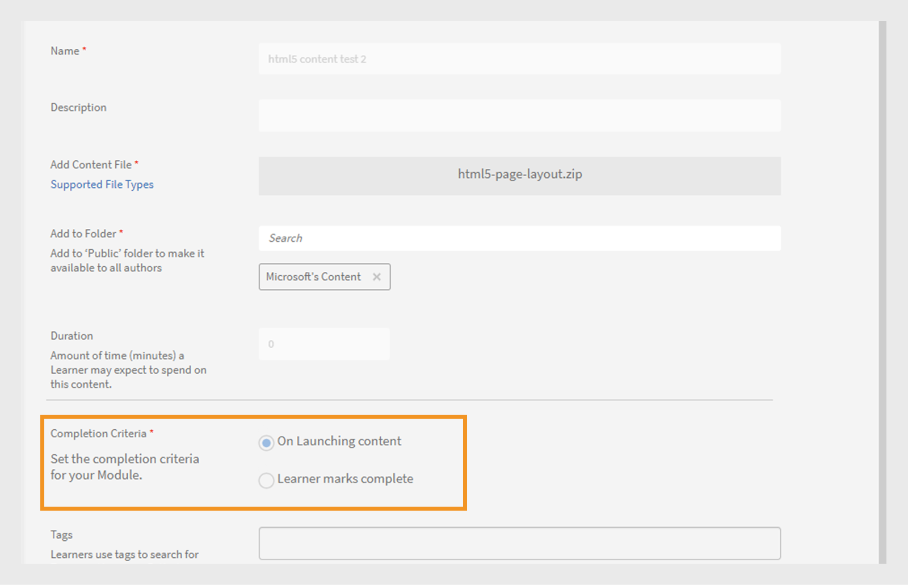
   _完成標準_

1. 選擇 **[!UICONTROL Save]**。
1. 通過添加此內容來建立課程。  有關詳細信息，視圖 [創建、修改和發佈課程](/help/migrated/authors/feature-summary/courses.md)。

在學習者應用程式中，如果作者選擇選擇條件 **[!UICONTROL On Launching content]**&#x200B;為 ，則在學習者啟動課程時，課程將標記為完成。 當作者選擇 **[!UICONTROL Learner marks complete]**&#x200B;時，學習者可以選擇將課程標記為完成。

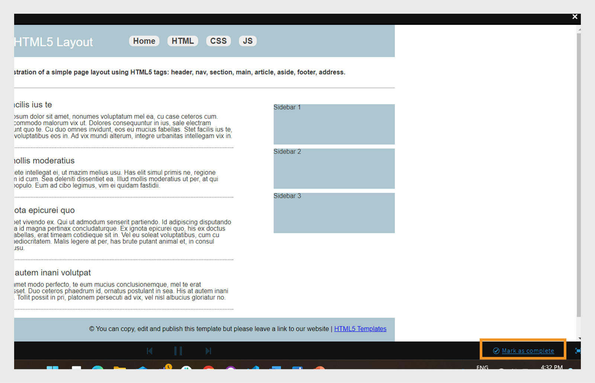

_學習者標記完成_

### 版本設定 {#versioning}

該內容 資料庫還會維護您上傳内容的版本設定。 如果在內容中進行任何更改（例如 PowerPoint 演示文稿），並在資料庫中重新上傳 PPT，則版本號將增加 1。 這有助於您跟踪內容中的更改。

## 新增交互式內容 {#addinteractivecontent}

1. 以作者身分&#x200B;**登入后，在左側窗格中選取&#x200B;**[!UICONTROL Content Library]**，然後選擇&#x200B;**[!UICONTROL Add]**。**

   或者，您可以從頁面中進行選擇&#x200B;**[!UICONTROL Create Content]****[!UICONTROL Getting Started]**。

1. 在 **[!UICONTROL Name]** 欄位中，鍵入要上傳內容的名稱。
1. **[!UICONTROL Description]**&#x200B;在欄位中，鍵入內容的說明。

   >[!NOTE]
   >
   >確保要輸入的說明有意義。 字元限制為 245 個字元。

1. 若要添加內容，請選擇 ，然後 **[!UICONTROL Add Content File]**&#x200B;上傳資源文件。 為多種語言添加內容時，無法在單個群組中合併靜態和互動式內容。 所有區域設置中的所有內容都應該是靜態的，或者所有內容都應該是交互式的。

* [支援的檔案類型](content-library.md#supported)

  交互式內容可以是 SCORM、AICC 或 Captivate 發佈的專案。 該文件必須是 zip 檔。

  您也可以新增從 Captivate、Presenter 或 Presenter 影片 Express 產生的 HTML 內容。

1. 學習管理器支持在學習管理器中上傳視訊內容字幕。 現在，作者可以上傳包含字幕的檔案與視訊檔案。

   然後，學習者可以在播放視頻模組期間視圖字幕。

   支援的格式是 [Web 影片文字軌道 （webVTT）。](https://www.w3.org/TR/webvtt1/)

   註解支持適用於在學習管理器的內容資料庫中上傳的視訊內容。

   作為作者，當您上傳視頻或音訊 內容時，還可以上傳包含字幕的 VTT 文件。

   然後字幕出現在流體播放器中。 字幕也符合 [WCAG2.0 標準](https://www.w3.org/TR/WCAG20/)。

   向資料庫添加視訊內容時，還可以添加 VTT 文件，該文件 **必須是** 有效文件。

   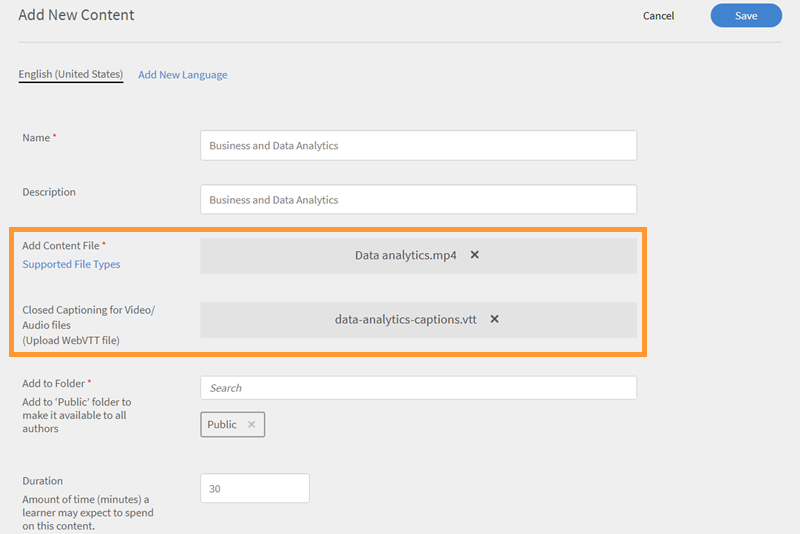

   *新增 webvtt 檔案*

   上傳的 VTT 文件對應於內容的現有版本。 因此上傳的 webVTT 文件不會連結到舊版本的 內容。

   如果您使用不同的語言創建內容，則可以為每種語言上傳不同的 webVTT 文件。 學習者將能夠看到與播放過程中選擇的語言相對應的字幕。

   >[!NOTE]
   >
   >   一個 VTT 檔支援一種語言。 若要支持多種語言，請為每種內容語言上傳多個視頻文件，然後為每個視頻文件上傳其各自的 VTT 文件。

   作為作者，每次更改內容、視頻或音訊時，學習管理器都會提示您輸入新的 vtt 文件。

   將此內容添加到課程后，當您以學習者身份預覽課程時，您可以在視頻中看到字幕。

   在播放機上，切換流體播放器上的 CC 按鈕以顯示或隱藏字幕。

   學習者應用程式&#x200B;****&#x200B;以及預覽&#x200B;**學習者中**&#x200B;都存在相同的視圖。

   當您 **新增、更新或刪除** vtt 檔案時，您會收到通知。WebVTT 支援不適用於：

   1. 影片公告。
   1. 影片在線學習內容中播放。 這是由內容驅動的。
   1. 影片上傳至 Social Learning」。
   1. 影片在學習管理器桌面應用中創建。
   1. 影片 內容透過移轉程序建立。
   1. 影片離線模式在行動應用程式中播放。

1. **[!UICONTROL Duration]**&#x200B;在欄位中，您可以選擇輸入學習者在此模組中花費的預期時間。持續時間以分鐘為單位。
1. 在 **[!UICONTROL Tags]** 欄位中，輸入已上傳內容的標記，以便可發現您的內容。

### 支援共享目錄

如果賣家帳戶共享包含課程的目錄，並且課程包含帶有字幕的模組、音訊或視頻，則課程在購買者 帳戶中的行為必須相同。

模組傳播應該在賣方到買方帳戶正常工作。 這可能包括 - 在模組中編輯/刪除/添加 vtt 檔。

上傳內容后，您可以通過按兩下頁面右上角的鈴鐺圖示來查看通知。 每次修改內容並重新上傳它時，都會得到一個通知。 如果您進行了更改，則只有您獲得通知，而不是其他作者。

## 建立測驗 {#createaquiz}

使用内容庫頁面上的新測驗創建工具Adobe Systems學習管理器中建立評估。 創建的評估將成為內容庫的一部分，可以添加到「公共」資料夾以實現課程可重用性。

1. 在左側面板中選擇內容庫。
1. 在螢幕右上角，選擇「 **添加>測驗**」。
1. 在「建立測驗」頁面中，鍵入測驗的名稱和說明。
1. 在「測驗內容」部分中，選擇「 **添加測驗問題**」。
1. 在「測驗問題」對話框中，選擇問題類型。 有三種類型的問題：
   * 選擇題
   * true 或 false
   * 填空
1. 輸入問題並選擇正確答案。
1. 設置測驗的分數。
1. 如果您希望正確回答問題以通過測驗，請選中「強制正確回答」複選框 **以通過測驗**。
1. 選擇儲存 **並關閉**。
1. 在 **通過條件** 欄位中輸入通過測驗的分數。
1. 如果您希望學習者視圖正確答案，請在測驗后為 **學習者啟用切換顯示正確答案** 。
1. 如果您希望問題和答案隨機顯示，請啟用切換：
   * 隨機排列問題順序
   * 隨機化答案選項順序
1. 指定用於添加測驗的資料夾，以使測驗可供所有作者使用。
1. 在「 **持續時間」** 欄位中，指定學習者必須在測驗上花費的時間。
1. 從已建立的標記的清單中指定一個標記。
1. 向測驗添加徽標和背景。
1. 在頁面的右上角，選擇“ **Publish**”。

要添加不同語言的測驗，請追隨以下步驟：

1. 若要添加不同語言的測驗，請選擇“ **添加新 語言** ”標籤，然後選擇所需的語言。 使用此方法，您可以為內容添加多語言支持。

   

   *新增內容語言*

1. 對新語言重複內容 上傳過程。
1. 如果要刪除語言，請選擇 **[!UICONTROL Add New Language]** 標籤，然後清除您的選擇。

   變更後，按下 **[!UICONTROL Save]**。 在資料庫中，新內容現在可供使用。

測驗被新增到 **[!UICONTROL Content Library]**. 與內容庫中的任何內容一樣，您可以停用測驗，然後將其刪除。

## 新增至資料夾 {#add-folder}

管理員創建內容資料夾后，您（作者）可以將內容上傳到內容資料夾，以便內容僅對您或帳戶中選擇的群組作者可見。 您也可以將內容設為公開，並使其對帳戶中的所有作者可見。

**用法示例**

例如，各機構希望保持對內容的完全控制，而俯瞰內容的人必須有權訪問所有內容。 同時，代理商中的內容創作者必須只能訪問自己的內容，在某些情況下，還可以訪問其他人的內容。

使用現有內容的內容資料庫（即在配置內容資料夾之前上傳的內容內容）被定義為 **公用資料夾**。 無法停用或刪除此資料夾。 所有類型的作者都可以訪問屬於公用資料夾的內容。 配置內容資料夾后，標準作者和自定義作者應在上載新內容時選擇應放置內容的資料夾。

>[!NOTE]
>
>公用資料夾和專用資料夾互斥。 這意味著內容 **不能** 同時與公用資料夾和專用資料夾關聯。 它可以關聯到公用資料夾， **也可以在** 任何時間點與一個或多個專用資料夾關聯。

添加內容時，可以選擇內容將駐留的資料夾。

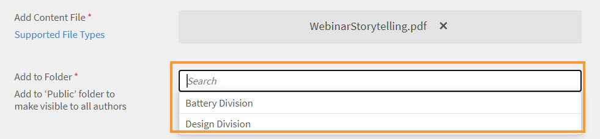

*將內容新增至資料夾*

如果選擇 **“公開”**，則內容將對所有作者可見。 默認情況下，帳戶中存在不屬於任何資料夾的所有內容都將位於公用資料夾中。

請注意，內容資料夾只是用于連結內容的虛擬隔間。 如果一個內容放在兩個資料夾中，則意味著內容文件始終是一個文件，但連結到多個資料夾。 因此，如果內容由有權訪問 custom-folder-1 的 custom-author-1 更新，則相同的更新內容也將反映在 custom-author-2 訪問的 custom-folder-2 中。

在內容庫中，有兩個選項可用於管理 內容資料夾：

**所有資料夾**

這是一個清單，显示為帳戶中創建的所有資料夾。

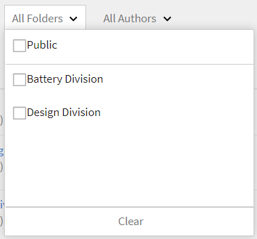

*檢視所有資料夾*

**所有作者**

此清單显示建立內容並將其上傳至資料庫的作者。

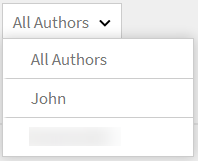

*檢視所有作者*

僅當管理員創建新資料夾時，此選項才&#x200B;**可用**。

## 將內容移至資料夾 {#movecontenttofolder}

若要將公用資料夾內容移動到任何專用資料夾，

1. **從“所有資料夾**”下拉清單中選擇&#x200B;**“公用**&#x200B;資料夾”。

   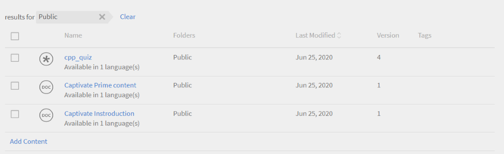

   *檢視所有上傳的內容*

1. 選擇要將其移動到資料夾按讚內容。 **[!UICONTROL Actions]** 然後按下 > **[!UICONTROL Organize Content]** > **[!UICONTROL Move Content to Folder]**。

   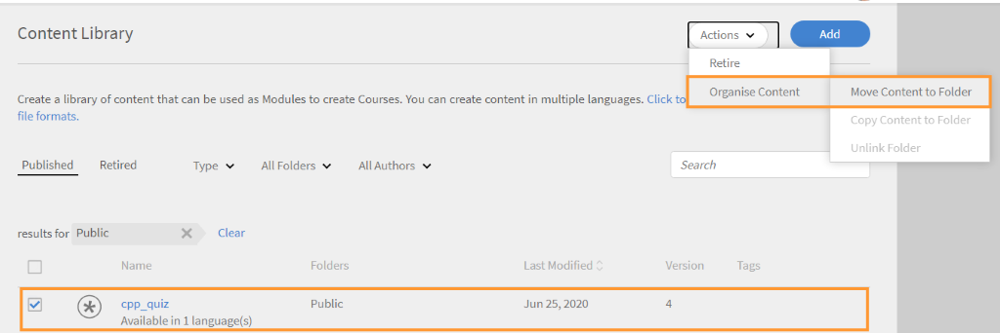

   *將選取的內容移至資料夾*

1. 選擇要將內容移至的資料夾。 按兩下 **[!UICONTROL Move]**。

## 將內容複製到資料夾 {#copycontenttofolder}

複製資料夾意味著您將向該資料夾添加標記。 複製操作不會創建 內容 的副本，而只會添加與指定資料夾的關聯。

*複製檔案夾*

## 取消連結資料夾 {#unlinkfolder}

取消鏈接意味著從所選資料夾中刪除內容。

只有當內容也與其他資料夾相關聯時，才能&#x200B;**從指定的資料夾**&#x200B;取消連結內容。如果內容取消連結，僅與一個資料夾相關聯，則建議改用MOVE操作。

>[!NOTE]
>
>操作“下的”組織“功能表最初處於禁用狀態。 要使用它，您必須首先在資料夾下拉清單中選擇一個資料夾。

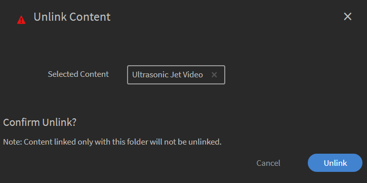

*取消連結資料夾*

## 新增不同語言的內容 {#addcontentfordifferentlanguages}

1. 要添加不同語言的內容，請按下添加 **新 語言** 標籤，然後選擇所需的語言。 使用此方法，您可以為內容添加多語言支持。

   

   *新增內容語言*

1. 對新語言重複內容 上傳過程。
1. 如果要刪除語言，請按兩下“添加”新 語言 標籤，然後清除您的選擇。

   進行更改后，按兩下儲存。 在資料庫中，新內容現在可供使用。

## 設定完成條件 {#setcompletioncriteria}

<table>
 <tbody>
  <tr>
   <td>
    
<b>静態內容</b>
</td>
   <td>
    
<b>互動式 內容</b>
</td>
  </tr>
  <tr>
   <td>
    
您只能為 <b>以下選項設置內容的完成</b> 標準：

    <ul>
     <li>關於啟動內容</li>
     <li>根據所需的最小百分比</li>
    </ul></td>
   <td>
    
您可以 <b>為以下選項的內容設定完成</b> 和 <b>成功</b> 條件：

    <ul>
     <li>關於啟動內容</li>
     <li>根據所需的最小百分比</li>
     <li>測驗通過或嘗試的選項</li>
    </ul>
    
<b>注意：</b> 只能编辑來自 Captivate、Presenter 影片 Express 或 Presenter 的 HTML 內容。
</td>
  </tr>
 </tbody>
</table>

添加內容后，可以修改內容的完成條件。

在學習管理器中，徽章和技能是根據成功和完成授予的。 如果學習者已完成課程但沒有成功，則學習者不會收到與LO相對應的徽章和技能。

例如，如果您已使用 Adobe Captivate 創建課程並在「偏好設定」對話框中設置學習參數，則相同的設置將遷移到「完成條件」選項中的學習管理器。

在「完成條件」部分中，可以設置下面提到的選項：

**啟動內容時：** 如果啟用此選項，則在學習者打開內容時定義內容的完成條件。

**基於所需的最低百分比：** 將一個值設置為學習者的最小消費百分比。 例如，如果將百分比設置為 50，則學習者可以消耗 50% 的內容，但仍符合完成條件。

**測驗：** 選擇以下條件之一：

* **測驗通過：** 僅當學習者通過測驗時，狀態才會報告為完整應用程式。
* **已嘗試測驗：** 如果學習者嘗試測驗，無論他們是否通過測驗，狀態都會報告為完整應用程式。
* **測驗通過或已達到限制：** 如果學習者通過測驗或已進行所有嘗試，則狀態將報告為完整應用程式。 例如，如果課程中設置的嘗試次數為 2，並且：

   * 如果學習者進行第一次嘗試並通過，則狀態報告為“完整應用程式”和“通過”。
   * 如果學習者進行第一次嘗試並失敗，則狀態將報告為“未完成”和“失敗”，因為仍未達到嘗試限制。
   * 如果學習者重新參加測驗並失敗，則狀態將報告為完整應用程式和失敗。
   * 如果學習者再次嘗試測驗並通過，則狀態將報告為“完整應用程式”和“通過”。

## 設定成功條件 {#setsuccesscriteria}

同樣，您可以定義課程的成功標準。 成功標準指示學習者的表現為通過或失敗。 如果您在 Captivate 中創建了課程，則可以在偏好設定對話框中設置課程的成功標準，如下所示：

例如，您上傳了一個包含測驗的模組。 現在，您已將該模組的“完成條件”設置為“啟動時內容”，並將“成功條件”設置為“測驗通過”。

如果學習者已啟動課程但測驗失敗，則該課程將被標記為已完成，但是僅當學習者通過測驗時，才滿足成功標準。

## 內容篩選器選項 {#contentfilteroptions}

### 根據日期排序 {#sortaccordingtodate}

根據上次修改內容的時間排列內容。 您可以依照遞增或遞減順序來排序內容。

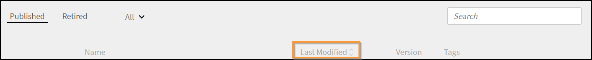

*按日期排序內容*

### 根據使用方式排序 {#sortaccordingtousage}

根據內容是否在任何課程中使用來排列內容。 在「類型」下拉清單中，選擇“使用中”或“未使用”。

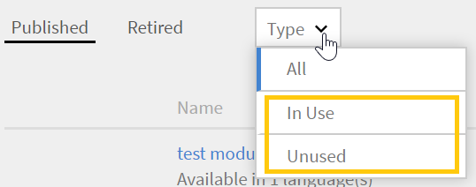

*依使用狀況排序內容*

## 內容的Search {#searchforcontent}

在内容庫中，您可以通過選擇內容的名稱或與內容關聯的標記來搜尋內容。

在Search欄上，輸入課程或標記的名稱，您可以看到建議。

<!--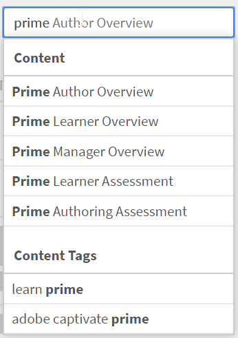-->

## 停用內容 {#retirecontent}

一旦發佈內容，就無法刪除內容。 您必須先停用內容。 當您將內容標記為“已停用”時，學習者將不再看到該內容。 內容也會移至「已停用」區段。 您也可以稍後將內容移至已發佈狀態。

若要停用內容，追隨以下步驟：

* 在“内容資料庫”中，選擇要停用內容。
* 選擇操作>停用。

任何學習物件中使用的任何內容都不會受到影響。 學習者仍然可以繼續訪問內容。

>[!NOTE]
>
>您還可以從該 **[!UICONTROL Retired]** 部分添加內容，導航到 **[!UICONTROL Content Library]** > **[!UICONTROL Retired]** 並選擇 **[!UICONTROL Add Content]**。 有關更多詳細信息，請参閱 [添加靜態內容](content-library.md#addstaticcontent)。

## 重新發佈已停用的內容 {#republishretiredcontent}

停用內容后，可以重新發佈內容並使內容显示在“已發佈”清單中。 例如，如果已停用內容的版本 1，並希望將其替換為版本 2，則可以將version1.pptx（例如）移動到“已發佈”清單，並使用 version2.pptx 更新文件。 新檔可供各種課程使用。

若要重新發佈已停用的內容，

1. 導航到“已停用&#x200B;**”**&#x200B;標籤，然後選擇要重新發佈的內容。
1. 選取 **動作** > **重新發佈**。

內容現在會显示在「已發佈」清單中。

## 刪除 內容 {#deletecontent}

停用內容后，您可以將其刪除。

* 導航到“已停用”標籤，然後選擇要刪除的內容。
* 選擇操作> 刪除。

請注意，使用該內容的現有課程（已從內容 資料庫中刪除）將繼續使用該內容。

## 常見問題 {#frequentlyaskedquestions}

+++ 如何在Adobe Systems學習管理器中上傳 SCORM 內容？

在任何工具（例如Adobe Captivate）中建立符合 SCORM 的電子學習課程，並將內容發佈為 zip 文件。 然後在學習管理器中，上傳目錄中的 zip 檔，並設置完成和成功條件。
+++

+++如何將同一內容的新版本上傳到學習管理器？

在學習管理器中，內容 資料庫還會維護上傳內容的版本。 如果在內容中進行任何更改（例如，PowerPoint 演示文稿），並在資料庫中重新上傳演示文稿，則版本號將增加一。 這有助於您跟踪內容中的更改。 新版本的內容可以同時應用於所有學習物件，也可以為每個課程應用單獨的更新。
+++

+++如何用不同的語言編輯課程的詳細資訊？添加一個或多個語言後，如前面部分所述，按下每個語言標籤，然後添加/編輯課程資訊。

&lt;!--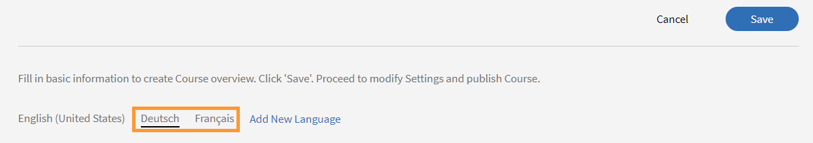--->
+++
