# 內容庫

學習如何創作與課程對齊的內容，作為自學進度的內容。

## 內容庫 {#contentlibrary}

內容是課程的基石。 作者建立一個可依課程自學內容的資料庫。 只有作者才能使用此內容庫。

## 支援的內容類型 {#supported}

你可以在資料庫中上傳互動式和靜態內容。

下表顯示您可以上傳到函式庫的互動式與靜態檔案類型。

<table>
 <tbody>
  <tr>
   <td>
    
<b>互動內容</b>
</td>
   <td>
    
<b>內容類型</b>
</td>
   <td>
    
<b>延伸</b>
</td>
  </tr>
  <tr>
   <td>
    
 
</td>
   <td>
    

    <ul>
     <li>SCORM 1.2</li>
     <li>SCORM 2004</li>
     <li>AICC</li>
     <li>鐵罐</li>
    </ul>
    

</td>
   <td>
    
零
</td>
  </tr>
  <tr>
   <td>
    
<b>靜態內容</b>
</td>
   <td>
    
<b>內容類型</b>
</td>
   <td>
    
<b>延伸</b>
</td>
  </tr>
  <tr>
   <td>
    
 
</td>
   <td>
    
影片
</td>
   <td>
    
MP4、WMV、3GP、3G2、3GP2、ASF、AVI、F4V H264、MPE、MPEG、MPG、MPG、MPG2、M4V、MOV、WMV
</td>
  </tr>
  <tr>
   <td>
    
 
</td>
   <td>
    
音效
</td>
   <td>
    
MP3、WAV、AAC、M4A、WMA、Vorbis、PCM、EAC3、AMR、AC3
</td>
  </tr>
  <tr>
   <td>
    
 
</td>
   <td>
    
PDF
</td>
   <td>
    
PDF
</td>
  </tr>
  <tr>
   <td>
    
 
</td>
   <td>
    
微軟 PowerPoint
</td>
   <td>
    
PPTX、PPT
</td>
  </tr>
  <tr>
   <td>
    
 
</td>
   <td>
    
MS Word
</td>
   <td>
    
醫生，醫生
</td>
  </tr>
  <tr>
   <td>
    
 
</td>
   <td>
    
微軟Excel（微軟Excel）
</td>
   <td>
    
XLX、XLS
</td>
  </tr>
  <tr>
   <td>
    
 
</td>
   <td>
    
HTML
</td>
   <td>
    
zip 檔案
</td>
  </tr>
 </tbody>
</table>

## 在函式庫中新增內容 {#addnewcontentinthelibrary}

**作者** 可以在 ALM 中新增內容。 ALM 中有兩種類型的內容： **[!UICONTROL Content]** 和 **[!UICONTROL Quiz]**。 想了解如何新增內容，請參考 [「新增靜態內容](content-library.md#addstaticcontent) 」和 [「建立測驗](content-library.md##createaquiz)」。

## 新增靜態內容 {#addstaticcontent}

1. 登入後以作者&#x200B;**身份在左側窗格選擇&#x200B;**[!UICONTROL Content Library]**，然後選擇&#x200B;**[!UICONTROL Add]**。**

   或者，你也可以從&#x200B;**[!UICONTROL Getting Started]**&#x200B;頁面中選擇&#x200B;**[!UICONTROL Create Content]**。

1. 在欄位 **[!UICONTROL Name]** 輸入你想上傳的內容名稱。
1. 在欄位 **[!UICONTROL Description]** 中，輸入內容描述。 確保你想輸入的描述具有意義。 字元限制為400字元。
1. 要新增內容，選擇 **[!UICONTROL Add Content File]**，並上傳你的資源檔案。 當你新增多語言內容時，無法將靜態與互動內容合併在同一群組中。 要嘛所有地區的內容都應該是靜態的，要嘛所有內容都應該是互動式的。

   如果你想替換內容，可以用不同的靜態內容替換靜態內容。 互動內容也是如此。

1. 在實地 **[!UICONTROL Duration]** ，你可以選擇性地輸入學習者預期在這個模組中花費的時間。 持續時間以分鐘為單位。

   若學習者標記課程為完成，我們會根據指定時長計算學習時間。 如果學習者在播放器中消費內容，那麼在播放器中花費的時間會加到學習時間中。 若實際內容時間少於指定時間，播放器會依原樣顯示內容時間。 此案中未作任何更改。

1. 在欄位 **[!UICONTROL Tags]** 輸入已上傳內容的標籤，讓你的內容變得可被發現。

   作者可以在將內容加入課程時，使用這些標籤來搜尋內容。

### 在內容庫中新增 HTML5 檔案類型

作者可以將 HTML5 內容作為 .zip 檔案加入自我進度內容。 .zip資料夾應該包含一個名為 `index.html`. 如果有多個 HTML 檔案，它們應該都會連結起來，主檔案名稱為 `index.html`。 學習者可以在流體播放器中查看 HTML5 內容。 作者可以將這些HTML5內容加入課程的自學模組，並設定完成標準。 作者可透過以下兩種方式設定完成 HTML 課程的標準：

* 學習者可以自行標記為完整。
* 課程一開，就會被標記為已完成。

要將 HTML 檔案類型（.zip）加入內容庫，請依照以下步驟操作。

1. 在作者應用程式中，選擇 **[!UICONTROL Create Content]** 首頁。
1. 在畫面中 **[!UICONTROL Content Library]** ，選擇 **[!UICONTROL Add]** > **[!UICONTROL Content]**。
1. 請輸入內容名稱與描述。
1. 選擇選項 **[!UICONTROL Add Content File]** ，然後瀏覽並選擇 HTML 檔案（壓縮成資料夾）。
1. 新增內容後，您可以查看該 **[!UICONTROL Content Library]** 區塊的內容。
1. 選擇 HTML 內容，然後選擇 **[!UICONTROL Edit]**。
1. 請從選項中 **[!UICONTROL Completion Criteria]** 選擇以下任一選項。
   * **[!UICONTROL On Launching content]**：當學習者啟動課程時，課程將自動標記為完成。
   * **[!UICONTROL Learner marks complete]**&#x200B;學習者可選擇在流體玩家中標記該賽道為完成。

   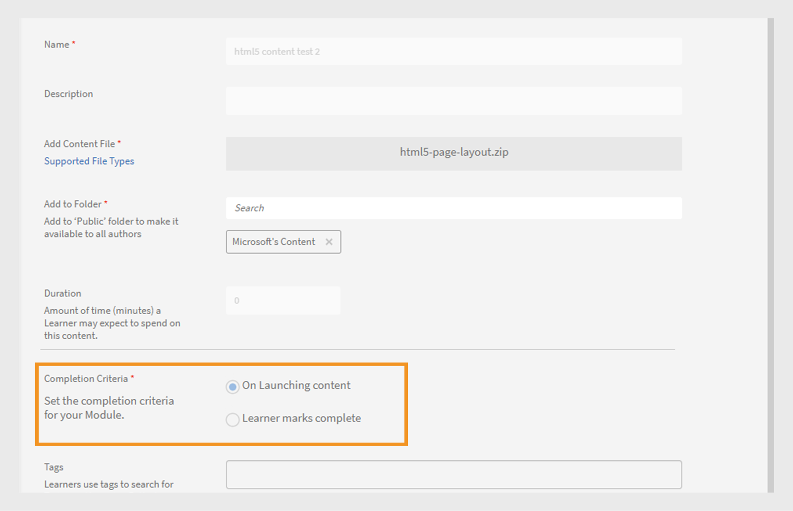
   _完成標準_

1. 選擇 **[!UICONTROL Save]**。
1. 透過新增這些內容來建立課程。  欲了解更多資訊，請參閱 [「創建、修改及發布課程](/help/migrated/authors/feature-summary/courses.md)」。

在學習者應用程式中，如果作者選擇選擇條件為 **[!UICONTROL On Launching content]**，則課程在學習者啟動時將被標記為完成。 當作者選擇 **[!UICONTROL Learner marks complete]**&#x200B;時，學習者將可選擇將課程標記為已完成。

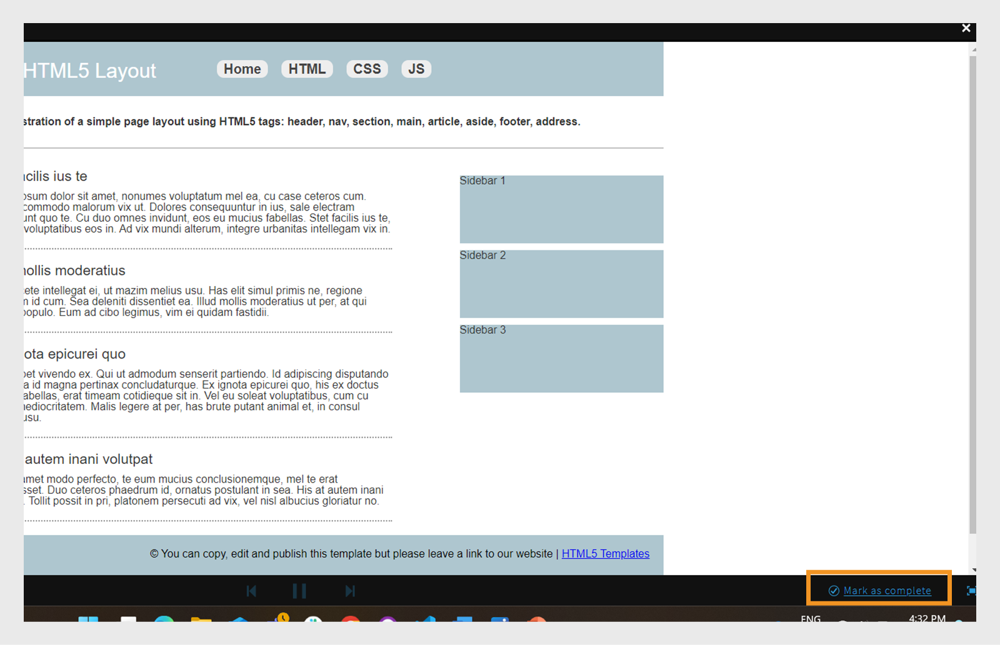

_學習者成績完成_

### 版本控制 {#versioning}

內容庫也會維護你上傳內容的版本控制。 如果你對內容做了任何更改，例如PowerPoint簡報，並重新上傳PPT到函式庫，版本號會增加一。 這有助於你追蹤內容的變化。

## 新增互動內容 {#addinteractivecontent}

1. 登入後以作者&#x200B;**身份在左側窗格選擇&#x200B;**[!UICONTROL Content Library]**，然後選擇&#x200B;**[!UICONTROL Add]**。**

   或者，你也可以從&#x200B;**[!UICONTROL Getting Started]**&#x200B;頁面中選擇&#x200B;**[!UICONTROL Create Content]**。

1. 在欄位 **[!UICONTROL Name]** 輸入你想上傳的內容名稱。
1. 在欄位 **[!UICONTROL Description]** 中，輸入內容描述。

   >[!NOTE]
   >
   >確保你想輸入的描述具有意義。 字元限制為 245 個字元。

1. 要新增內容，選擇 **[!UICONTROL Add Content File]**，並上傳你的資源檔案。 當你新增多語言內容時，無法將靜態與互動內容合併在同一群組中。 要嘛所有地區的內容都應該是靜態的，要嘛所有內容都應該是互動式的。

* [支援的檔案類型](content-library.md#supported)

  互動內容可以是 SCORM、AICC 或 Captivate 出版的專案。 檔案必須是壓縮檔。

  你也可以新增來自 Captivate、Presenter 或 Presenter Video Express 產生的 HTML 內容。

1. Adobe Learning Manager 支援上傳於 Adobe Learning Manager 的影片內容字幕。 現在，作者可以上傳包含說明文字的檔案，以及影片檔案。

   接著，學習者可以在影片模組播放時查看字幕。

   支援的格式為[網頁影片文字軌（Web Video Text Tracks，簡稱 webVTT）。](https://www.w3.org/TR/webvtt1/)

   Adobe Learning Manager 內容庫中上傳的影片內容提供字幕支援。

   作為作者，當你上傳影片或音訊內容時，也可以上傳包含字幕的 VTT 檔案。

   字幕隨後會出現在流體播放器中。 字幕也符合 [WCAG2.0 標準](https://www.w3.org/TR/WCAG20/)。

   當你將影片內容加入資料庫時，也可以加入 VTT 檔案，該 **檔案必須** 是有效的。

   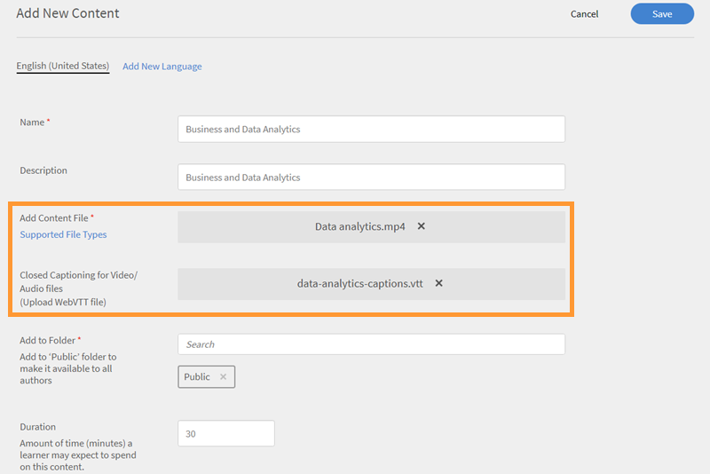

   *新增一個 webvtt 檔案*

   上傳的 VTT 檔案對應於現有內容的版本。 因此，上傳的 webVTT 檔案不會連結到舊版本的內容。

   如果你用不同語言創作內容，可以為每種語言上傳不同的 webVTT 檔案。 學習者在播放時可以看到對應語言的字幕。

   >[!NOTE]
   >
   >   一個 VTT 檔案支援一種語言。 為了支援多種語言，請為每種內容語言上傳多個影片檔案，然後為每個影片檔案上傳相應的 VTT 檔案。

   作為作者，每次你更改內容（不論是影片或音訊），Adobe Learning Manager 都會提示你新增 vtt 檔案。

   當你將這些內容加入課程，並以學習者身份預覽課程時，可以看到影片上的說明文字。

   在播放器上，切換流體播放器的CC按鈕來顯示或隱藏字幕。

   同樣的視圖也存在於&#x200B;**學習器應用程式****及預覽**&#x200B;學習器中。

   當你新增、更新或刪除&#x200B;**VTT 檔案時**，你會收到通知。
WebVTT 支援不支援以下模式：

   1. 影片公告。
   1. 電子學習內容中播放的影片。 這一切都是由內容所驅動的。
   1. 影片上傳於社會學習。
   1. 影片由 Adobe Learning Manager 桌面應用程式製作。
   1. 透過遷移過程製作的影片內容。
   1. 手機應用程式中的影片播放，且為離線模式。

1. 在實地 **[!UICONTROL Duration]** 工作中，你可以選擇輸入學習者預期在該模組中花費的時間。 持續時間以分鐘為單位。
1. 在欄位 **[!UICONTROL Tags]** 輸入已上傳內容的標籤，讓你的內容變得可被發現。

### 支援共享目錄

如果賣家帳號共用包含課程的目錄，且課程包含模組、音頻或影片及字幕，則這些課程在購買者帳號中的行為必須相同。

模組傳播應該能從賣家到買方帳戶正常運作。 這可能包括：編輯/刪除/新增模組中的 vtt 檔案。

上傳內容後，點擊頁面右上角的鈴聲圖示即可看到通知。 每次你修改內容並重新上傳時，都會收到通知。 如果你做了修改，只有你自己會收到通知，其他作者不會收到。

## 建立一個測驗 {#createaquiz}

在 Adobe Learning Manager 中，使用內容庫頁面的新測驗製作工具建立評量。 所建立的評量會成為內容庫的一部分，並可加入「公開」資料夾以方便課程重用。

1. 在左側面板選擇「內容庫」。
1. 在螢幕右上角，選擇 **新增>測驗**。
1. 在「建立測驗」頁面，輸入測驗名稱和說明。
1. 在測驗內容區塊，選擇 **新增測驗題目**。
1. 在測驗題目對話框中，選擇題型。 問題分為三種類型：
   * 選擇題
   * 真或假
   * 填空
1. 輸入問題並選擇正確答案。
1. 設定測驗分數。
1. 如果你希望問題能正確回答以通過測驗，請選擇「強制答對」勾選 **選項，才能通過測驗**。
1. 選擇 **儲存並關閉**。
1. 在通過標準&#x200B;**欄位輸入通過測驗的**&#x200B;分數。
1. 如果你想讓學習者看到正確答案，請啟用「在測驗後向學習者顯示正確答案&#x200B;**」的切換**&#x200B;功能。
1. 如果你想讓問題和答案隨機出現，請啟用以下切換功能：
   * 隨機化問題順序
   * 隨機化答案選項順序
1. 指定一個資料夾來新增測驗，讓所有作者都能使用。
1. 在 **「持續時間** 」欄位中，指定學習者必須花多少時間完成測驗。
1. 從已建立的標籤清單中指定一個標籤。
1. 在測驗中加入標誌和背景。
1. 在頁面右上角，選擇 **發佈**。

若要新增不同語言的測驗，請遵循以下步驟：

1. 若要新增不同語言的測驗，請選擇 **「新增語言** 」標籤，並選擇所需的語言。 透過這種方式，你可以為內容加入多語言支援。

   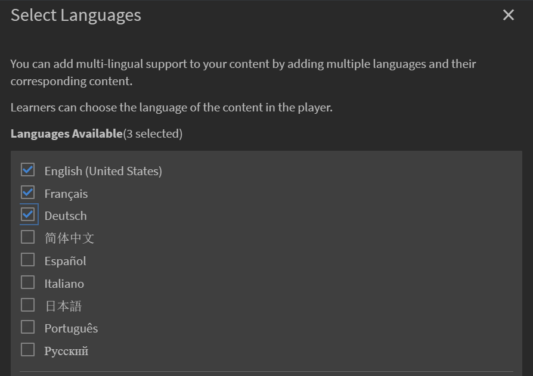

   *新增內容語言*

1. 為新語言重複內容上傳流程。
1. 如果你想移除某一種語言，請選擇分 **[!UICONTROL Add New Language]** 頁並清除你的選擇。

   完成變更後，點擊 **[!UICONTROL Save]**。 在圖書館裡，現在的新內容可以開放閱讀。

測驗會被加到 **[!UICONTROL Content Library]**。 就像內容庫中的任何內容一樣，你可以退休測驗然後刪除它。

## 加入資料夾 {#add-folder}

管理員建立內容資料夾後，你作為作者可以將內容上傳到內容資料夾，這樣內容就只會對你或帳號中的特定作者群體看到。 你也可以將內容公開，並讓帳號內的所有作者都能看到。

**範例用法**

例如，代理商希望保持對內容的完全控制，而審查內容的人必須能取得所有內容。 同時，代理商的內容創作者必須只能存取自己的內容，有時甚至能取得他人的內容。

包含現有內容的內容庫（即在設定內容資料夾前上傳的內容）會被定義為 **Public 資料夾**。 此資料夾無法退休或刪除。 屬於 Public 資料夾的內容對所有類型的作者開放。 內容資料夾設定完成後，標準作者與自訂作者應選擇內容放置的資料夾，同時上傳新內容。

>[!NOTE]
>
>公共資料夾和私人資料夾是互斥的。 這表示內容 **不能** 同時與公共資料夾和私人資料夾關聯。 它可以與 Public 資料夾 **綁定，或** 在任何時間點與一個或多個私人資料夾綁定。

新增內容時，你可以選擇內容要放置的資料夾。

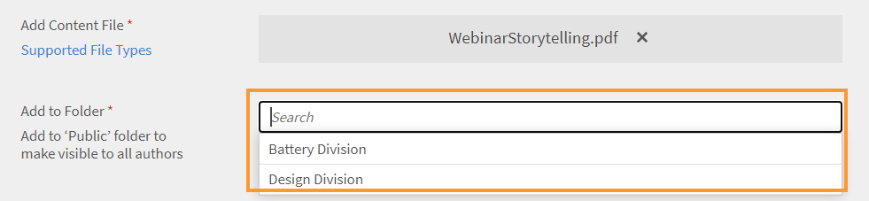

*將內容加入資料夾*

如果你選擇 **公開，**&#x200B;內容將對所有作者開放。 帳號中所有不屬於任何資料夾的內容預設都會放在公開資料夾。

請注意，內容資料夾只是用來連結內容的虛擬區隔。 如果一個內容被放在兩個資料夾裡，代表該內容檔案永遠是一個單一檔案，但會連結到多個資料夾。 因此，若內容由擁有自訂資料夾1存取權的自訂作者1更新，則同樣更新的內容也會反映在由自訂作者2存取的自訂資料夾2中。

在內容庫中，有兩種管理內容資料夾的選項：

**所有資料夾**

它是一個清單，會顯示帳號中所有建立的資料夾。

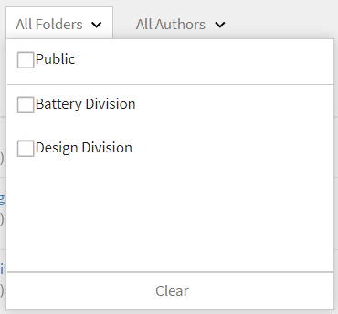

*查看所有資料夾*

**所有作者**

這是一個列出已創作內容並上傳到資料庫的作者名單。

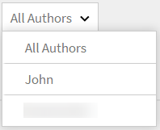

*查看所有作者*

此服務僅&#x200B;**在管理員建立新資料夾時啟用**。

## 將內容移至資料夾 {#movecontenttofolder}

要將公開資料夾內容移到任意私人資料夾，

1. 從&#x200B;**「所有資料夾」**&#x200B;下拉選單中選擇&#x200B;**「公共**&#x200B;資料夾」。

   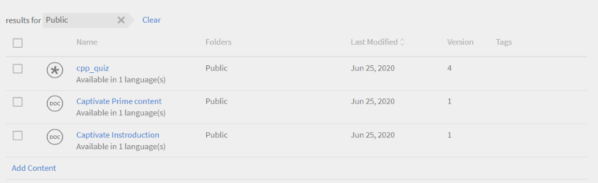

   *查看所有上傳的內容*

1. 選擇你想移到資料夾的內容。 然後點擊 **[!UICONTROL Actions]** > **[!UICONTROL Organize Content]** > **[!UICONTROL Move Content to Folder]**。

   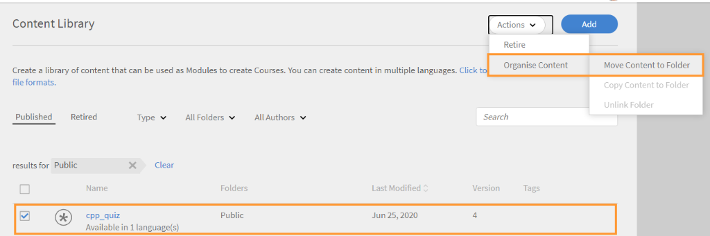

   *將選取的內容移到資料夾*

1. 選擇你想把內容移到的資料夾。 點擊 **[!UICONTROL Move]**。

## 將內容複製到資料夾 {#copycontenttofolder}

複製資料夾意味著你會在資料夾裡加上標籤。 複製操作不會建立內容的副本，只會與指定的資料夾建立關聯。

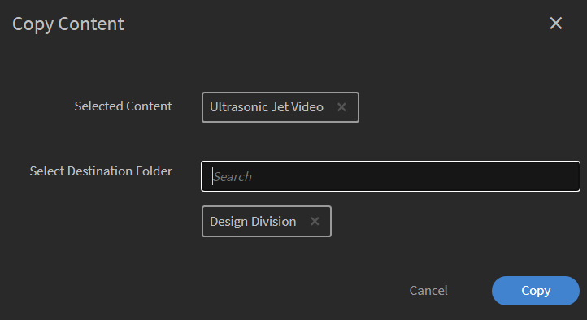

*複製一個資料夾*

## 解除連結資料夾 {#unlinkfolder}

解除連結是指從選取的資料夾中移除內容。

只有&#x200B;**當該資料夾同時與其他資料夾相關聯時，內容才能從指定資料夾**&#x200B;中解除連結。如果解除連結的內容只與一個資料夾相關聯，建議改用 MOVE 操作。

>[!NOTE]
>
>組織選單在「動作」下方，一開始是被關閉的。 要使用這個方法，你必須先在資料夾下拉選單中選擇一個資料夾。

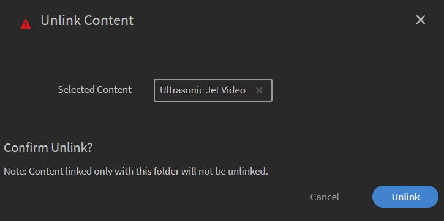

*解除連結資料夾*

## 新增不同語言內容 {#addcontentfordifferentlanguages}

1. 若要新增不同語言的內容，請點擊 **「新增語言** 」標籤，並選擇所需的語言。 透過這種方式，你可以為內容加入多語言支援。

   

   *新增內容語言*

1. 為新語言重複內容上傳流程。
1. 如果你想移除某種語言，請點擊「新增語言」標籤，並清除你的選擇。

   完成變更後，點擊儲存。 在圖書館裡，現在的新內容可以開放閱讀。

## 設定完成標準 {#setcompletioncriteria}

<table>
 <tbody>
  <tr>
   <td>
    
<b>靜態內容</b>
</td>
   <td>
    
<b>互動內容</b>
</td>
  </tr>
  <tr>
   <td>
    
你只能為以下選項設定 <b>內容的完成</b> 標準：

    <ul>
     <li>關於內容的啟動</li>
     <li>根據最低要求百分比</li>
    </ul></td>
   <td>
    
你可以為以下選項設定 <b>內容的完成</b> 度與 <b>成功</b> 度標準：

    <ul>
     <li>關於內容的啟動</li>
     <li>根據最低要求百分比</li>
     <li>測驗通過或嘗試選項</li>
    </ul>
    
<b>注意：</b> 僅能編輯來自 Captivate、Presenter Video Express 或 Presenter 的 HTML 內容。
</td>
  </tr>
 </tbody>
</table>

新增內容後，你可以修改內容的完成標準。

在 Adobe Learning Manager 中，徽章與技能是根據成功與完成度來授予的。 若學員已完成課程但未成功，則不會獲得與 LO 對應的徽章與技能。

例如，如果你使用 Adobe Captivate 建立課程並在偏好設定對話框中設定學習參數，相同的設定會轉移到 Adobe Learning Manager 的完成條件選項中。

在完成標準部分，您可以設定以下選項：

**關於啟動內容：** 如果你啟用此選項，學習者開啟內容時，你就能定義內容的完成標準。

**根據最低需求百分比：** 設定學習者消費的最低百分比值。 例如，如果你將百分比設定為50，學習者可以消費50%的內容，仍能達到完成標準。

**測驗：** 請選擇以下標準之一：

* **測驗通過：** 只有當學習者通過測驗時，狀態才會被報告為完成。
* **測驗嘗試次數：** 若學習者無論通過或未通過，測驗狀態都會被報告為完成。
* **測驗通過或達到限制：** 若學習者通過測驗或完成所有嘗試，狀態將被報告為完成。 例如，若賽道中設定的嘗試次數為兩次，且：

   * 若學習者首次嘗試通過，狀態會被報告為完成並通過。
   * 若學習者第一次嘗試未通過，則狀態會被報告為未完成且未達嘗試限制。
   * 若學習者重考未通過，狀態會被報告為完成且未通過。
   * 若學習者再次嘗試測驗並通過，狀態會顯示為完成並通過。

## 設定成功標準 {#setsuccesscriteria}

同樣地，你也可以定義課程的成功標準。 成功標準表示學習者的表現為通過或不及格。 如果你在 Captivate 建立了課程，可以在偏好設定對話框中設定課程的成功標準，如下所示：

舉例來說，你上傳了一個模組，裡面有小測驗。 現在，你已經將該模組的完成標準設為「關於內容啟動」，並將成功標準設為「測驗通過」。

若學習者已啟動課程但測驗未通過，則課程將被標記為已完成，但只有在測驗通過後才會達到成功標準。

## 內容篩選選項 {#contentfilteroptions}

### 依日期排序 {#sortaccordingtodate}

依照內容最後修改的時間來排序。 你可以選擇內容的順序是升序或降序。

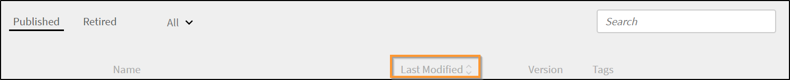

*依日期排序內容*

### 依使用情況排序 {#sortaccordingtousage}

根據是否使用該內容來安排內容。 在類型下拉選單中，選擇「正在使用中」或「未使用」。

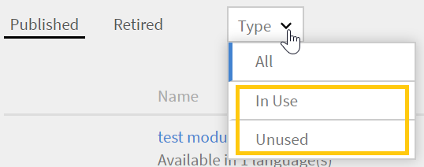

*依使用情況排序內容*

## 新增內容、唯一 ID 與有效期限

### 什麼是內容唯一識別碼

內容唯一 ID 是 Adobe Learning Manager 中每個內容項目所賦予的獨特代碼。 它幫助管理員和作者輕鬆找到和管理內容，尤其是在更新或跨系統移動時。 此內容唯一識別碼也有助於將內容整合至人力資源或合規系統等其他工具。 所有語言版本都使用相同的內容唯一 ID，讓學習者保持一致。

* 內容唯一 ID 必須在所有內容中保持唯一。
* 內容唯一識別碼不得包含空格或特殊字元。
* 若輸入重複的內容唯一 ID，建立時會出現錯誤。

### 什麼是到期日

到期日標示內容可能已過時或不再需要。 即使過了期限，內容仍可取得，但會提醒作者和管理員檢查並更新。 根據設定，過期內容可從新登記中移除或存檔。 與內容唯一識別碼相同，到期日對所有語言版本運作相同，有助於保持內容乾淨且最新。

* 內容即使過期後仍可保留。
* 若選擇過去日期，則會顯示警告。
* 到期欄位接受1990年至2037年之間的任意日期。

這有助於組織保持內容相關性，同時避免意外移除已發表的內容。

內容唯一識別碼與到期日適用於所有語言版本的內容群組，確保所有使用者無論語言皆有一致的體驗。 作者可利用內容唯一識別碼快速搜尋與尋找特定內容，方便管理與更新訓練教材。

現在新增 **[!UICONTROL Training report]** 了兩個欄位： **[!UICONTROL Content Expiry Date (UTC TimeZone)]** 以及 **[!UICONTROL Content Unique ID]**，用來追蹤內容唯一ID和到期日。 這些欄位可以透過使用者介面或遷移方式新增，管理員也能透過訓練報告集中追蹤。

### 新增內容、唯一 ID 與到期日

作者可以在創作內容時新增內容唯一 ID，並設定到期日。

要新增內容唯一 ID 和到期日：

1. 以作者身份登入。
2. 選擇 **[!UICONTROL Create Content]** 或在左側面板中選擇 **[!UICONTROL Content Library]** 。

   
   _在首頁選擇建立內容_

3. 選擇 **[!UICONTROL Add]** 後再在作者首頁選擇 **[!UICONTROL Content]** 。

   
   _選擇在內容庫中新增內容_

4. 輸入 和&#x200B;**[!UICONTROL Name]****[!UICONTROL Description]**

5. 從選項 **[!UICONTROL Add Content File]** 中選擇內容
6. 從選項中選擇資料夾， **[!UICONTROL Add to Folder]** 即可將內容加入資料夾。

   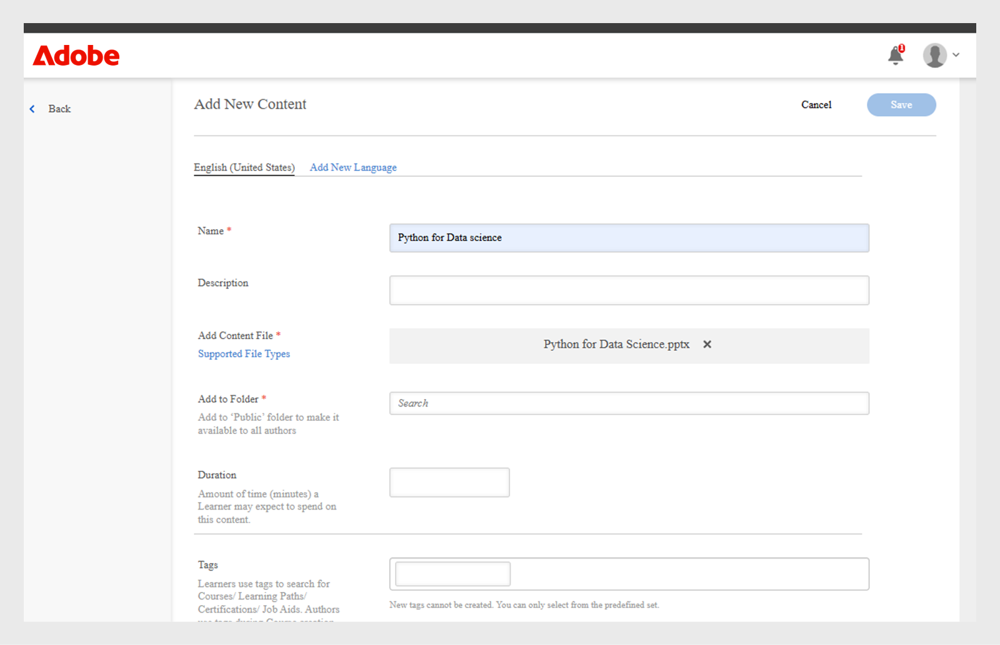
   _新增內容_

7. 在欄位 **[!UICONTROL Content unique ID]** 輸入已上傳內容的 ID。 ID必須是唯一的，並遵循正確的命名規範。 ID 不得包含非 ASCII 字元或空格。 如果你輸入重複的 ID，會顯示錯誤訊息。

   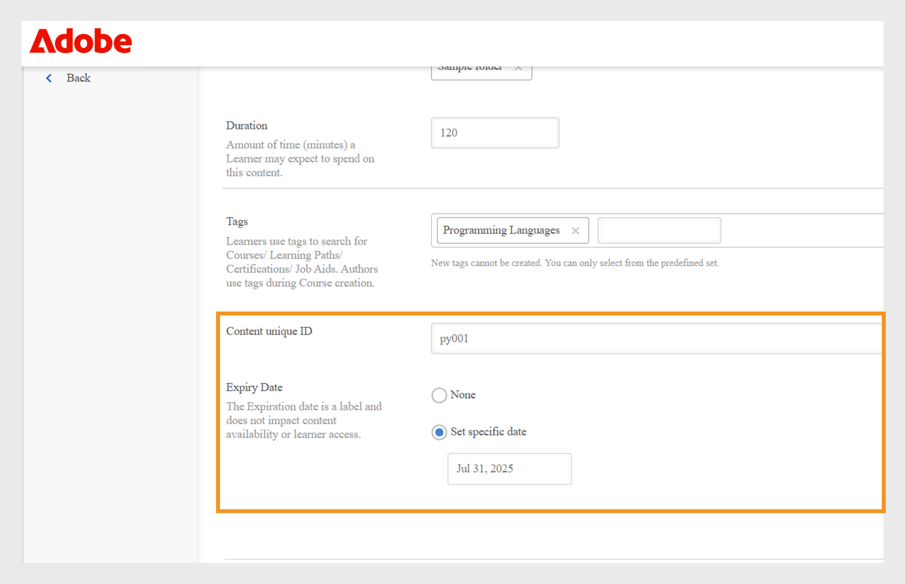
   _輸入唯一字母數字內容識別碼的欄位_

8. 請選擇內容的到期日。 此日期不影響內容可用性或學習者取得。 你可以選擇1990年至2037年之間的任何日期。 若選擇過去日期，會顯示警告，但內容仍可發布。
9. 選擇 **[!UICONTROL Save]**。
已上傳的內容現在會出現在 **[!UICONTROL Content Library]**.

### 為語言設定內容唯一 ID 與到期日

內容唯一 ID 與到期日是在內容群組層級定義的，意即設定一次，並自動套用於所有語言版本的內容。

1. 選擇內容。**[!UICONTROL Content Library]**
2. 選擇 **[!UICONTROL Edit]**。
3. 選擇 **[!UICONTROL Add New Language]**。
4. 從列表中選擇任一語言。
5. 選擇 **[!UICONTROL Save]**。
內容唯一 ID 與到期日現在會顯示在特定語言版本的內容上，例如此例中的德語版本。

### 使用內容唯一識別碼進行搜尋

你可以使用內容獨特識別碼（Content Unique ID）搜尋所有語言版本的內容，方便尋找和管理特定項目。 此外，內容唯一識別碼與到期日都會納入訓練報告，以保持一致的追蹤與報告。

1. 啟動 **[!UICONTROL Content Library]**.
2. 在搜尋欄輸入&#x200B;**[!UICONTROL Content unique ID]**

   
   _使用內容獨特識別碼搜尋內容_
3. 選擇內容以查看或編輯。

### 內容遷移支援

在遷移內容時，你可以在module_version.csv檔案中加入 **expiryDate** 和 **uniqueContentId** 。 這確保了在系統間傳輸內容時，元資料的連續性。

### 報告變更

訓練報告中新增兩個欄位，內容獨特識別碼與內容到期日。 這些欄位幫助管理員更有效地監控內容過期日期。

## 退休內容 {#retirecontent}

一旦你發佈了內容，就無法刪除該內容。 你必須先退休這些內容。 當你將內容標記為退休時，該內容將不再對學習者可見。 內容也會移至該 **[!UICONTROL Retired]** 區塊。

要退休內容，請遵循以下步驟：

* 在 **[!UICONTROL Content library]**&#x200B;中，選擇你想要退休的內容。
* 選擇 **[!UICONTROL Action]** ，然後選擇 **[!UICONTROL Retire]**。

任何用於學習物件的內容都不會受到影響。 學習者仍可繼續存取內容。

>[!NOTE]
>
>你也可以從該 **[!UICONTROL Retired]** 區塊新增內容，然後導覽到 **[!UICONTROL Content Library]** ，然後選擇 **[!UICONTROL Retired]**。 選擇 **[!UICONTROL Add Content]**。 更多細節請參見 [「新增靜態內容](content-library.md#addstaticcontent)」。

## 搜尋內容 {#searchforcontent}

在內容庫中，您可以選擇內容名稱或相關標籤來搜尋內容。

在搜尋欄輸入課程名稱或標籤，你就能看到推薦內容。

<!--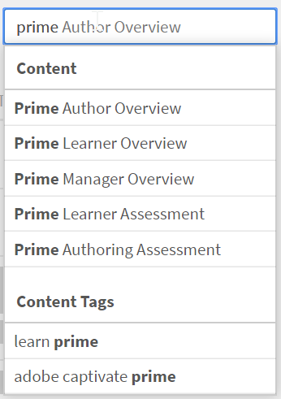-->

## 重新發布已退休內容 {#republishretiredcontent}

一旦你退休了內容，就可以重新發布該內容，並讓它出現在已發佈清單中。 例如，如果你有已退休的版本 1，想用版本 2 取代它，你可以將version1.pptx移到 Published 清單，並更新檔案 version2.pptx。 新檔案會在各種課程中開放使用。

若要重新發布已退休的內容，

1. 請前往 **「已退休** 」標籤，選擇你想重新發布的內容。
1. 選擇 **行動** > **重新發布**。

該內容現已出現在已發表清單中。

## 更新內容

作者可以更新已出版課程的內容。
更新內容：

1. 以作者身份登入。
2. 選擇 **[!UICONTROL Content Library]**。
3. 搜尋內容並選擇 **[!UICONTROL Edit]**。
4. 移除舊內容，上傳新檔案並發佈。

這將幫助學習者獲得最新版本的內容。

想了解更多資訊，請參考這個 [部落格](https://elearning.adobe.com/2024/06/how-to-update-the-content-in-the-course/) 。

### 完成課程後的學習者內容版本控制

Adobe Learning Manager 現在為作者提供更清晰的內容更新管理選項。 作者可以更新課程中已有的內容。 新增版本時，版本號會顯示在內容旁。

當管理員造訪內容更新的課程時，他們會在新版本旁看到一個更新按鈕。 管理員也會看到清晰的更新選項，以選擇新內容版本如何套用給學習者。

| 學習者狀態 | 現在更新 | 更新 最終 | 更新尚未開始 |
|---|---|---|---|
| 未註冊 | V2 | V2 | V2 |
| 尚未開始 | V2 | V2 | V2 |
| 進行中 | V2 * | V1 → V2 * | V1 |
| 完成 | V2 * | V2 * | V1（保存） |

(*)表示模組在版本更新時會被重置。

在「更新未開始」時，已完成課程的學習者仍可繼續看到原始內容版本（V1）。 這避免了意外的回放問題，並確保學習者重溫已完成課程時能有一致的體驗。

### 內容更新選項

當管理員點擊 **[!UICONTROL Update]**&#x200B;時，他們可以從以下選項中選擇：

* **[!UICONTROL Update all Learners now]**：立即將內容更新套用於所有學習者。 未開始、進行中及已完成的學習者會立即切換到新版本。
* **[!UICONTROL Update all Learners eventually]**：將更新分階段應用給所有學習者。 未開始與完成的學習者現在會收到新版本。 進行中學習者完成當前版本後會收到更新。
* **[!UICONTROL Update only not started Learners]**：僅將更新應用於尚未開始課程的學習者。 進行中及已完成的學習者仍保留原始版本。

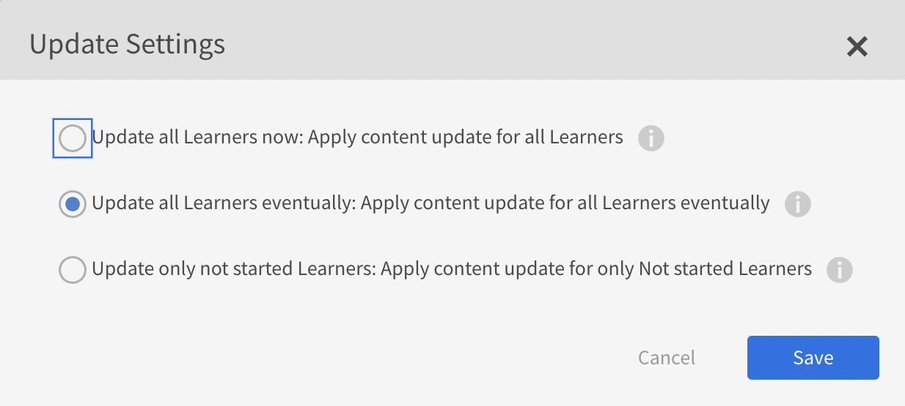
_更新設定中有內容更新選項_

## 刪除內容 {#deletecontent}

在你退休內容後，你可以刪除它。

* 前往「已退休」標籤，選擇你想刪除的內容。
* 選擇動作>刪除。

請注意，已從內容庫刪除的現有課程將繼續使用該內容。

## 常見問題 {#frequentlyaskedquestions}

+++ 如何在 Adobe Learning Manager 中上傳 SCORM 內容？

使用任何工具（如 Adobe Captivate）建立符合 SCORM 標準的電子學習課程，並將內容以壓縮檔形式發佈。 接著在 Adobe Learning Manager 裡，將壓縮檔上傳到目錄中，並設定完成與成功標準。
+++

+++我該如何將相同內容的新版本上傳到 Adobe Learning Manager？

在 Adobe Learning Manager 中，內容庫也會維護你上傳內容的版本。 如果你對內容做了任何更改，例如PowerPoint簡報，並在資料庫重新上傳簡報，版本號會增加一。 這有助於你追蹤內容的變化。 新版本的內容可以同時套用到所有學習物件，或是針對每門課程分別進行個別更新。
+++

+++如何編輯課程的細節，並用另一種語言？
新增語言後，如前述段落所述，點選每個語言分頁，然後新增或編輯課程資訊。

<!--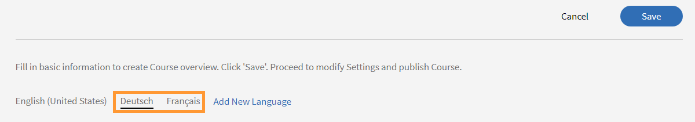-->
+++
